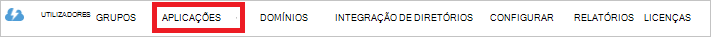

<properties
   pageTitle="Autenticar com arquivo Lake de dados de utilização do Active Directory | Microsoft Azure"
   description="Saiba como autenticar com arquivo Lake de dados de utilização do Active Directory"
   services="data-lake-store"
   documentationCenter=""
   authors="nitinme"
   manager="jhubbard"
   editor="cgronlun"/>

<tags
   ms.service="data-lake-store"
   ms.devlang="na"
   ms.topic="article"
   ms.tgt_pltfrm="na"
   ms.workload="big-data"
   ms.date="10/17/2016"
   ms.author="nitinme"/>

# Autenticação de serviço para o serviço com o arquivo de dados de Lake utilizando o Azure Active Directory

> [AZURE.SELECTOR]
- [Serviço de serviço de autenticação](data-lake-store-authenticate-using-active-directory.md)
- [Autenticação de utilizador final](data-lake-store-end-user-authenticate-using-active-directory.md)

Azure dados Lake loja utiliza Azure Active Directory para autenticação. Antes de criação de uma aplicação que funciona com o arquivo de Lake de dados do Azure ou Azure dados Lake Analytics, tem primeiro de decidir como autenticar a sua aplicação com o Azure Active Directory (Azure AD). As duas opções principais disponíveis são:

* Autenticação de utilizador final, e 
* Serviço de serviço de autenticação. 

Ambas as opções destes resultam na sua aplicação que está a ser fornecida com um token de OAuth 2.0, que obtém anexado a cada pedido efetuado ao arquivo de Lake de dados do Azure ou Azure dados Lake Analytics.

Falam este artigo sobre como cria uma aplicação web do Azure AD para autenticação de serviço de serviço. Para obter instruções sobre a configuração da aplicação Azure AD para autenticação de utilizador final consulte [autenticação de utilizador final com o arquivo de dados de Lake utilizando o Azure Active Directory](data-lake-store-end-user-authenticate-using-active-directory.md).

## Pré-requisitos

* Uma subscrição do Azure. Consulte o artigo [obter Azure versão de avaliação gratuita](https://azure.microsoft.com/pricing/free-trial/).
* A ID da subscrição. Pode recuperá-la a partir do Portal do Azure. Por exemplo, está disponível a partir do pá de conta do arquivo de Lake de dados.

    

* O nome de domínio do Azure AD. Pode recuperá-la ao pairar o cursor do rato no canto superior direito do Portal do Azure. A captura de ecrã abaixo, o nome do domínio é **contoso.microsoft.com**e o GUID dentro de parênteses é o ID do inquilino. 

    

## Serviço de serviço de autenticação

Este é a abordagem recomendada, se pretender que a sua aplicação para autenticar automaticamente com o Azure AD, sem necessidade de um utilizador final fornecer as respetivas credenciais. A aplicação poderão para se autenticar para desde que as suas credenciais são válidas, que pode ser personalizado para ser pela ordem dos anos.

### O que preciso utilizar esta abordagem?

* Nome de domínio do Azure AD. Já está listada no pré-requisito deste artigo.

* Azure AD a **aplicação web**.

* ID de cliente para a aplicação web do Azure AD.

* Secreta do cliente para a aplicação web do Azure AD.

* Ponto final token para a aplicação web do Azure AD.

* Ativar o acesso para a aplicação web do Azure AD no a ficheiro/pasta de arquivo de Lake dados ou a conta de análise de Lake de dados que pretende trabalhar com.

Para obter instruções sobre como criar uma aplicação web do Azure AD e configure-o para satisfazer as necessidades listadas acima, consulte a secção abaixo a [criar uma aplicação do Active Directory](#create-an-active-directory-application) .

>[AZURE.NOTE] Por predefinição, a aplicação do Azure AD está configurada para utilizar o segredo de cliente, que pode obter a partir da aplicação do Azure AD. No entanto, se pretender que a aplicação do Azure AD para utilizar um certificado em vez disso, tem de criar a aplicação web do Azure AD através do Azure PowerShell, tal como descrito em [criar um serviço principal com certificado](../resource-group-authenticate-service-principal.md#create-service-principal-with-certificate).

## Criar uma aplicação do Active Directory

Nesta secção podemos Saiba mais sobre como criar e configurar uma aplicação web do Azure AD para autenticação de serviço de serviço com o arquivo de Lake Azure dados utilizando o Azure Active Directory. 

### Passo 1: Criar uma aplicação do Azure Active Directory

>[AZURE.NOTE] Os passos abaixo utilizam o Portal do Azure. Também pode criar uma aplicação do Azure AD utilizando o [PowerShell do Azure](../resource-group-authenticate-service-principal.md) ou [Clip de Azure](../resource-group-authenticate-service-principal-cli.md).

1. Inicie sessão na sua conta do Azure através do [portal clássica](https://manage.windowsazure.com/).

2. Selecione **Do Active Directory** a partir do painel esquerdo.

     
     
3. Selecione o Active Directory que pretende utilizar para criar a nova aplicação. Se tiver mais de um Active Directory, normalmente pretende criar a aplicação no diretório onde reside a sua subscrição. Só pode conceder acesso ao recurso na sua subscrição para as aplicações no mesmo directório como a sua subscrição.  

     
    
    
3. Para ver as aplicações no seu diretório, clique em **aplicações**.

     

4. Se não tiver criado uma aplicação nesse directório antes de deverá ver algo semelhante à imagem seguinte. Clique em **Adicionar uma aplicação**

     

     Em alternativa, clique em **Adicionar** no painel inferior.

     

6. Forneça um nome para a aplicação e selecione o tipo de aplicação que pretende criar. Para este tutorial, crie uma **E/ou de aplicações WEB WEB API** e clique no botão seguinte.

     

7. Preencha as propriedades para a sua aplicação. Para o **Início de sessão no URL**, fornece o URI a um web site que descreva a sua aplicação. Não é validada a existência do web site. Para **URI de ID da aplicação**, fornece o URI que identifica sua aplicação.

     

    Clique na marca de verificação para concluir o assistente e criar a aplicação.

### Passo 2: Obter id de cliente, o segredo cliente e o ponto final token

Quando através de programação início de sessão, é necessário o id de para a sua aplicação. Se a aplicação é executada nas suas próprias as credenciais, também terá uma chave de autenticação.

1. Clique no separador **Configurar** para configurar a palavra-passe do seu pedido.

     

2. Copie o **código do cliente**.
  
     

3. Se a aplicação será executada nas suas próprias as credenciais, desloque para baixo para a secção **chaves** e selecione quanto tempo que pretende utilizar a sua palavra-passe seja válido.

     

4. Selecione **Guardar** para criar a sua chave.

    

    A chave guardada é apresentada e pode copiá-lo. Não conseguir obter a chave mais tarde para tem copiá-lo agora.

    

5. Obtenha o ponto final do token ao selecionar **os pontos finais de vista** em parte inferior do ecrã e obter o valor do campo de **Ponto final Token de OAuth 2.0** , conforme apresentado abaixo.  

    

### Passo 3: Atribuir a aplicação do Azure AD para o ficheiro de conta Azure dados Lake arquivo ou pasta (apenas para o serviço de serviço de autenticação)

1. Inicie sessão novo [Portal do Azure](https://portal.azure.com) e abra a conta de arquivo de Lake Azure dados que pretende associar à aplicação do Azure Active Directory que criou anteriormente.

1. No seu pá de conta do arquivo de Lake de dados, clique em **Explorador de dados**.

    ![Criar directórios na conta do arquivo de dados de Lake] (./media/data-lake-store-authenticate-using-active-directory/adl.start.data.explorer.png "Criar directórios na conta Lake de dados")

2. Na pá **Explorador de dados** , clique no ficheiro ou pasta para a qual pretende fornecer acesso à aplicação do Azure AD e, em seguida, clique em **Access**. Para configurar o acesso a um ficheiro, tem de clicar **Access** a partir do pá a **Pré-visualização do ficheiro** .

    ![Definir ACL no sistema de ficheiros de dados Lake] (./media/data-lake-store-authenticate-using-active-directory/adl.acl.1.png "Definir ACL no sistema de ficheiros de dados Lake")

3. O **Access** pá lista os acesso padrão e acesso personalizados que já esteja atribuído na raiz. Clique no ícone **Adicionar** para adicionar ACL de nível personalizado.

    ![Lista padrão e acesso personalizado] (./media/data-lake-store-authenticate-using-active-directory/adl.acl.2.png "Lista padrão e acesso personalizado")

4. Clique no ícone **Adicionar** para abrir o pá **Adicionar Access personalizada** . Neste pá, clique em **Seleccionar utilizador ou grupo**e, em seguida, na pá **Seleccionar utilizador ou grupo** , procure o grupo de segurança que criou anteriormente no Azure Active Directory. Se tiver muitas grupos para procurar a partir de, utilize a caixa de texto na parte superior para filtrar o nome do grupo. Clique no grupo que pretende adicionar e, em seguida, clique em **Selecionar**.

    ![Adicionar um grupo] (./media/data-lake-store-authenticate-using-active-directory/adl.acl.3.png "Adicionar um grupo")

5. Clique em **Selecionar permissões**, selecione as permissões e se pretende atribuir as permissões como predefinição ACL, aceder ACL ou ambas. Clique em **OK**.

    ![Atribuir permissões a grupo] (./media/data-lake-store-authenticate-using-active-directory/adl.acl.4.png "Atribuir permissões a grupo")

    Para mais informações sobre as permissões no arquivo de dados de Lake e ACL predefinição de acesso, consulte o [Controlo de acesso no arquivo de dados de Lake](data-lake-store-access-control.md).

6. Na pá **Adicionar Access personalizada** , clique em **OK**. O grupo recentemente adicionado, com as permissões associadas, será agora listado no pá **Access** .

    ![Atribuir permissões a grupo] (./media/data-lake-store-authenticate-using-active-directory/adl.acl.5.png "Atribuir permissões a grupo") 

## Próximos passos

Neste artigo criou uma aplicação web do Azure AD e reuniu as informações que necessárias nas suas aplicações de cliente que autor de utilizar o .NET SDK, Java SDK, etc. Agora pode avançar para os seguintes artigos falar sobre como utilizar a aplicação web do Azure AD para autenticar pela primeira vez com o arquivo de dados de Lake e, em seguida, executar outras operações no arquivo de.

- [Introdução ao Azure dados Lake loja utilizando .NET SDK](data-lake-store-get-started-net-sdk.md)
- [Introdução ao Azure dados Lake loja utilizando Java SDK](data-lake-store-get-started-java-sdk.md)
