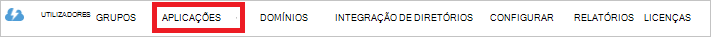

<properties
   pageTitle="Autenticar com arquivo Lake de dados de utilização do Active Directory | Microsoft Azure"
   description="Saiba como autenticar com arquivo Lake de dados de utilização do Active Directory"
   services="data-lake-store"
   documentationCenter=""
   authors="nitinme"
   manager="jhubbard"
   editor="cgronlun"/>

<tags
   ms.service="data-lake-store"
   ms.devlang="na"
   ms.topic="article"
   ms.tgt_pltfrm="na"
   ms.workload="big-data"
   ms.date="10/17/2016"
   ms.author="nitinme"/>

# Autenticação de utilizador final com o arquivo de dados de Lake utilizando o Azure Active Directory

> [AZURE.SELECTOR]
- [Serviço de serviço de autenticação](data-lake-store-authenticate-using-active-directory.md)
- [Autenticação de utilizador final](data-lake-store-end-user-authenticate-using-active-directory.md)

Azure dados Lake loja utiliza Azure Active Directory para autenticação. Antes de criação de uma aplicação que funciona com o arquivo de Lake de dados do Azure ou Azure dados Lake Analytics, tem primeiro de decidir como autenticar a sua aplicação com o Azure Active Directory (Azure AD). As duas opções principais disponíveis são:

* Autenticação de utilizador final, e 
* Serviço de serviço de autenticação. 

Ambas as opções destes resultam na sua aplicação que está a ser fornecida com um token de OAuth 2.0, que obtém anexado a cada pedido efetuado ao arquivo de Lake de dados do Azure ou Azure dados Lake Analytics.

Falam este artigo sobre como cria uma aplicação web do Azure AD para autenticação de utilizador final. Para obter instruções sobre a configuração da aplicação Azure AD para a autenticação do serviço a serviço consulte [serviço de serviço de autenticação com o arquivo de dados de Lake utilizar Azure Active Directory](data-lake-store-authenticate-using-active-directory.md).

## Pré-requisitos

* Uma subscrição do Azure. Consulte o artigo [obter Azure versão de avaliação gratuita](https://azure.microsoft.com/pricing/free-trial/).
* A ID da subscrição. Pode recuperá-la a partir do Portal do Azure. Por exemplo, está disponível a partir do pá de conta do arquivo de Lake de dados.

    

* O nome de domínio do Azure AD. Pode recuperá-la ao pairar o cursor do rato no canto superior direito do Portal do Azure. A captura de ecrã abaixo, o nome do domínio é **contoso.microsoft.com**e o GUID dentro de parênteses é o ID do inquilino. 

    

## Autenticação de utilizador final

Este é a abordagem recomendada, se pretender que um utilizador final para iniciar sessão na sua aplicação através do Azure AD. A aplicação poderão aceder a recursos Azure com o mesmo nível de acesso como o utilizador final que tem sessão iniciada. O utilizador final será necessário fornecer as respetivas credenciais periodicamente por ordem para a sua aplicação manter o access.

O resultado de ter o utilizador final iniciar sessão no é que a aplicação é dado um token de acesso e um token de atualização. O token de acesso obtém anexado a cada pedido efetuado ao arquivo de dados de Lake ou Lake a análise de dados e é válido para uma hora por predefinição. O token de atualização pode ser utilizado para obter um novo token de acesso e é válido para cerca de duas semanas por predefinição, se for utilizado regularmente. Pode utilizar duas abordagens diferentes início de sessão do utilizador final.

### Utilizar pop-up OAuth 2.0

A aplicação pode acionar um OAuth 2.0 autorização de pop-up, na qual o utilizador final pode introduzir as suas credenciais. Este pop-up também funciona com o processo de autenticação do Azure AD fator duplo (2FA), se necessário. 

>[AZURE.NOTE] Este método ainda não é suportado na biblioteca de autenticação do Azure AD (ADAL) para Python ou Java.

### Prisma diretamente nas credenciais de utilizador

A aplicação diretamente pode fornecer as credenciais de utilizador para Azure AD. Este método apenas funciona com contas de utilizador de ID organizacionais; Não é compatível com pessoal / contas de utilizador "live ID", incluindo aqueles que termine em @outlook.com ou @live.com. Além disso, este método não é compatível com contas de utilizador que precisam de autenticação do Azure AD fator duplo (2FA).

### O que preciso utilizar esta abordagem?

* Nome de domínio do Azure AD. Já está listada no pré-requisito deste artigo.

* Azure AD **aplicação web**

* ID do cliente para a aplicação web do Azure AD

* Resposta URI para a aplicação web do Azure AD

* Definir delegada permissões

Para obter instruções sobre como criar uma aplicação web do Azure AD e configure-o para satisfazer as necessidades listadas acima, consulte a secção abaixo a [criar uma aplicação do Active Directory](#create-an-active-directory-application) . 

## Criar uma aplicação do Active Directory

Nesta secção podemos Saiba mais sobre como criar e configurar uma aplicação web do Azure AD para autenticação de utilizador final com o arquivo de Lake Azure dados utilizando o Azure Active Directory.

### Passo 1: Criar uma aplicação do Azure Active Directory

>[AZURE.NOTE] Os passos abaixo utilizam o Portal do Azure. Também pode criar uma aplicação do Azure AD utilizando o [PowerShell do Azure](../resource-group-authenticate-service-principal.md) ou [Clip de Azure](../resource-group-authenticate-service-principal-cli.md).

1. Inicie sessão na sua conta do Azure através do [portal clássica](https://manage.windowsazure.com/).

2. Selecione **Do Active Directory** a partir do painel esquerdo.

     
     
3. Selecione o Active Directory que pretende utilizar para criar a nova aplicação. Se tiver mais de um Active Directory, normalmente pretende criar a aplicação no diretório onde reside a sua subscrição. Só pode conceder acesso ao recurso na sua subscrição para as aplicações no mesmo directório como a sua subscrição.  

     
    
    
3. Para ver as aplicações no seu diretório, clique em **aplicações**.

     

4. Se não tiver criado uma aplicação nesse directório antes de deverá ver algo semelhante à imagem seguinte. Clique em **Adicionar uma aplicação**

     

     Em alternativa, clique em **Adicionar** no painel inferior.

     

6. Forneça um nome para a aplicação e selecione o tipo de aplicação que pretende criar. Para este tutorial, crie uma **E/ou de aplicações WEB WEB API** e clique no botão seguinte.

     

7. Preencha as propriedades para a sua aplicação. Para o **Início de sessão no URL**, fornece o URI a um web site que descreva a sua aplicação. Não é validada a existência do web site. Para **URI de ID da aplicação**, fornece o URI que identifica sua aplicação.

     

    Clique na marca de verificação para concluir o assistente e criar a aplicação.

### Passo 2: Obter id de cliente, responder URI e definir permissões de delegado

1. Clique no separador **Configurar** para configurar a palavra-passe do seu pedido.

     

2. Copie o **código do cliente**.
  
     

3. Na secção **serviço Single sign-on** , copie o **URI de resposta**.

    

4. Em **permissões para outras aplicações**, clique em **Adicionar aplicação**

    

5. No Assistente de **permissões para outras aplicações** , selecione **Lake de dados do Azure** e do **Windows** **Azure API de gestão do serviço**e clique na marca de verificação.

6. Por predefinição, as **Permissões de delegado** para os serviços recentemente adicionados é definido como zero. Clique em **Permissões do delegado** pendente para Lake de dados do Azure e serviço de gestão do Windows Azure e selecione as caixas de verificação disponíveis para definir os valores como 1. O resultado deve ter este aspeto.

     

7. Clique em **Guardar**.

## Próximos passos

Neste artigo criou uma aplicação web do Azure AD e reuniu as informações que necessárias nas suas aplicações de cliente que autor de utilizar o .NET SDK, Java SDK, etc. Agora pode avançar para os seguintes artigos falar sobre como utilizar a aplicação web do Azure AD para autenticar pela primeira vez com o arquivo de dados de Lake e, em seguida, executar outras operações no arquivo de.

- [Introdução ao Azure dados Lake loja utilizando .NET SDK](data-lake-store-get-started-net-sdk.md)
- [Introdução ao Azure dados Lake loja utilizando Java SDK](data-lake-store-get-started-java-sdk.md)
