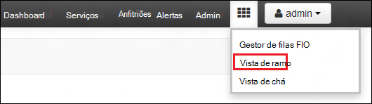
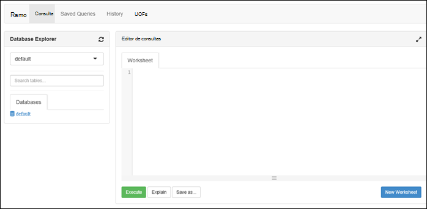

<properties
   pageTitle="Criar HDInsight clusters com o arquivo de Lake Azure dados através do portal | Azure"
   description="Utilizar o Portal do Azure para criar e utilizar HDInsight clusters com o arquivo de Lake de dados do Azure"
   services="data-lake-store,hdinsight" 
   documentationCenter=""
   authors="nitinme"
   manager="jhubbard"
   editor="cgronlun"/>

<tags
   ms.service="data-lake-store"
   ms.devlang="na"
   ms.topic="article"
   ms.tgt_pltfrm="na"
   ms.workload="big-data"
   ms.date="10/21/2016"
   ms.author="nitinme"/>

# Criar um cluster de HDInsight com o arquivo de dados de Lake através do Portal do Azure

> [AZURE.SELECTOR]
- [Através do Portal](data-lake-store-hdinsight-hadoop-use-portal.md)
- [Utilizar o PowerShell](data-lake-store-hdinsight-hadoop-use-powershell.md)
- [Utilizar o Gestor de recursos](data-lake-store-hdinsight-hadoop-use-resource-manager-template.md)

Saiba como utilizar o Portal do Azure para criar um cluster de HDInsight (Hadoop, HBase, motores ou tempestade) com acesso ao Azure dados Lake arquivo. Algumas considerações importantes nesta versão:

* Só pode ser utilizado **para motores clusters (Linux) e clusters Hadoop (Windows e Linux)**, o arquivo de Lake dados como uma conta de armazenamento adicional. A conta de armazenamento predefinida para essas clusters continuarão Azure armazenamento de Blobs (WASB).

* **Para tempestade clusters (Windows e Linux)**, o arquivo de Lake dados podem ser utilizados para escrever os dados a partir de uma topologia de tempestade. Arquivo de dados de Lake podem também ser utilizado para armazenar dados de referência que, em seguida, podem ser lido por uma topologia de tempestade. Para mais informações, consulte o artigo [Utilizar dados Lake loja numa topologia tempestade](#use-data-lake-store-in-a-storm-topology).

* **Para HBase clusters (Windows e Linux)**, o arquivo de Lake dados podem ser utilizados como um armazenamento predefinido, bem como armazenamento adicional. Para mais informações, consulte o artigo [Utilizar dados Lake loja com HBase clusters](#use-data-lake-store-with-hbase-clusters).

> [AZURE.NOTE] Alguns pontos importantes a nota. 
> 
> * Opção para criar HDInsight clusters com acesso ao arquivo de dados de Lake só está disponível para versões de HDInsight 3,2 e 3.4 (para clusters Hadoop, HBase e tempestade no Windows, bem como Linux). Para clusters de motores no Linux, esta opção só está disponível em clusters HDInsight 3.4.
>
> * Tal como mencionado acima, arquivo de dados de Lake está disponível como o armazenamento de predefinido para alguns tipos de cluster (HBase) e armazenamento adicional para outros tipos de cluster (Hadoop, motores, tempestade). Utilizar o arquivo de dados de Lake como uma conta de armazenamento adicional não causam impacto na desempenho ou a capacidade de leitura/escrita ao armazenamento do cluster. Num cenário de onde o arquivo de dados de Lake é utilizado como armazenamento adicional, relacionado com o cluster ficheiros (como registos, etc.) são escritos ao armazenamento de predefinido (Blobs do Azure), enquanto os dados que pretende processar podem ser armazenados numa conta dados Lake loja.

## Pré-requisitos

Antes de começar este tutorial, tem de ter o seguinte procedimento:

- **Azure uma subscrição**. Consulte o artigo [obter Azure versão de avaliação gratuita](https://azure.microsoft.com/pricing/free-trial/).

- **Conta azure dados Lake loja**. Siga as instruções no [artigo Introdução ao arquivo de Lake Azure dados utilizando o Portal do Azure](data-lake-store-get-started-portal.md). 

- **Carregar alguns dados de exemplo para a sua conta Azure dados Lake loja**. Depois de ter criado a conta, efetue as seguintes tarefas para carregar alguns dados de exemplo. Terá destes dados mais tarde no tutorial para executar tarefas a partir de um cluster de HDInsight aceder aos dados do arquivo de dados Lake.

    * [Criar uma pasta no seu Lake arquivo de dados](data-lake-store-get-started-portal.md#createfolder).
    * [Carregar um ficheiro para o arquivo de dados de Lake](data-lake-store-get-started-portal.md#uploaddata). Se está a procurar alguns dados de exemplo carregar, pode obter a pasta **Ambulância dados** a partir do [Azure dados Lake Git repositório](https://github.com/Azure/usql/tree/master/Examples/Samples/Data/AmbulanceData).

- **Principais de serviço de diretório do azure Active**. Os passos neste tutorial fornecem instruções sobre como criar um principal de serviço no Azure AD. No entanto, tem de ser um administrador do Azure AD para poder criar um principal de serviço. Se for um administrador do Azure AD, pode ignorar este pré-requisito e continuar com o tutorial.
    
    **Se estiver não um administrador do Azure AD**, não conseguir executar os passos necessários para criar um principal de serviço. Neste caso, o administrador do Azure AD tem primeiro de criar um principal de serviço antes de poder criar um cluster de HDInsight com dados Lake arquivo. Além disso, o capital de serviço deve ser criado utilizando um certificado, tal como descrito em [criar um serviço principal com certificado](../resource-group-authenticate-service-principal.md#create-service-principal-with-certificate).

## Aprender mais rapidamente com a opção vídeos?

Veja os seguintes vídeos para compreender como pode aprovisionar clusters HDInsight com acesso ao arquivo de dados de Lake.

* [Criar um cluster de HDInsight com acesso ao arquivo de dados de Lake](https://mix.office.com/watch/l93xri2yhtp2)
* Quando o cluster estiver configurado, [dados do Access no arquivo de Lake dados de utilização de scripts ramo e porco](https://mix.office.com/watch/1n9g5w0fiqv1q)

## Criar um cluster de HDInsight com acesso ao Azure dados Lake arquivo

Nesta secção, crie um cluster de HDInsight Hadoop que utiliza o arquivo de Lake dados como um armazenamento adicional. Neste lançamento, para um cluster de Hadoop, arquivo de dados de Lake só pode ser utilizado como um armazenamento adicional para o cluster. O armazenamento de predefinido continuarão as blobs do Azure armazenamento (WASB). Assim sendo, vamos pela primeira vez criar a conta de armazenamento e contentores de armazenamento necessários para o cluster.

1. Inicie sessão novo [Azure Portal](https://portal.azure.com).

2. Siga os passos na [clusters de criar Hadoop HDInsight](../hdinsight/hdinsight-provision-clusters.md#create-using-the-preview-portal) para iniciar o aprovisionamento um cluster de HDInsight.

3. No pá **Configuração opcional** , clique em **Origem de dados**. No pá **Origem de dados** , especifique os detalhes para a conta de armazenamento e o contentor de armazenamento, especifique a **localização** como **Leste dos EUA 2**e, em seguida, clique em **Cluster AAD identidade**.

    ![Adicionar serviço principal para HDInsight cluster] (./media/data-lake-store-hdinsight-hadoop-use-portal/hdi.adl.1.png "Adicionar serviço principal para HDInsight cluster")

4. No pá **Cluster AAD identidade** , pode escolher selecionar um capital de serviço existente ou crie um novo.

    * **Criar um novo Principal de serviço**

        * No pá **Cluster AAD identidade** , clique em **Criar novo**, clique em **Principal do serviço**e, em seguida, no pá **criar um Principal de serviço** , forneça valores para criar um novo principal de serviço. Como parte do que, um certificado e uma aplicação do Azure Active Directory também é criado. Clique em **Criar**.

            ![Adicionar serviço principal para HDInsight cluster] (./media/data-lake-store-hdinsight-hadoop-use-portal/hdi.adl.2.png "Adicionar serviço principal para HDInsight cluster")

        * No pá **Cluster AAD identidade** , clique em **Gerir o acesso de ADLS**. O painel mostra as contas de arquivo de Lake dados associadas à subscrição. No entanto, pode definir as permissões apenas para a conta que criou. Selecione permissões de leitura/escrita/executar para a conta que pretende associar ao cluster HDInsight e, em seguida, clique em **Guardar permissões**.

            ![Adicionar serviço principal para HDInsight cluster] (./media/data-lake-store-hdinsight-hadoop-use-portal/hdi.adl.3.png "Adicionar serviço principal para HDInsight cluster")

        * No pá **Cluster AAD identidade** , clique em **Transferir o certificado** para transferir o certificado associado ao serviço principal que criou. Isto é útil se pretender utilizar o mesmo capital de serviço no futuro, enquanto cria adicionais clusters de HDInsight. Clique em **Selecionar**.

            ![Adicionar serviço principal para HDInsight cluster] (./media/data-lake-store-hdinsight-hadoop-use-portal/hdi.adl.4.png "Adicionar serviço principal para HDInsight cluster")

    * **Escolher um capital de serviço existente**

        * No pá **Cluster AAD identidade** , clique em **utilizar existente**, clique em **Principal do serviço**e, em seguida, no pá **selecionar um Principal de serviço** , procure um capital de serviço existente. Clique num nome principal de serviço e, em seguida, clique em **Selecionar**.

            ![Adicionar serviço principal para HDInsight cluster] (./media/data-lake-store-hdinsight-hadoop-use-portal/hdi.adl.5.png "Adicionar serviço principal para HDInsight cluster")

        * No pá **Cluster AAD identidade** , carregar o certificado (. pfx) associado o capital de serviço que selecionou e, em seguida, forneça a palavra-passe de certificado.

5. Clique em **Gerir o acesso de ADLS** e, em seguida, clique em **Selecionar permissões de ficheiro**. 

    ![Adicionar serviço principal para HDInsight cluster] (./media/data-lake-store-hdinsight-hadoop-use-portal/hdi.adl.5.existing.save.png "Adicionar serviço principal para HDInsight cluster")

6. No pá **Selecione permissões do ficheiro** , a partir do menu pendente **conta** , selecione a conta de arquivo de Lake de dados que pretende associado ao cluster HDInsight. O pá lista os ficheiros e pastas disponíveis na conta de arquivo de Lake de dados selecionada. 
 
    ![Fornecer acesso ao arquivo de dados de Lake] (./media/data-lake-store-hdinsight-hadoop-use-portal/hdi-adl-permission-1.png "Fornecer acesso ao arquivo de dados de Lake")

    Após esta ação, determinar as permissões para ser fornecido para a selecionado ficheiros e pastas. Pastas, também especifique se as permissões aplicam-se para a pasta apenas ou para a pasta e todos os itens subordinados na pasta. Pode fazer esta seleção ao selecionar o valor adequado a partir de **Aplicar a** seta de lista pendente. Para remover uma permissão, clique no ícone **Eliminar**

    ![Fornecer acesso ao arquivo de dados de Lake] (./media/data-lake-store-hdinsight-hadoop-use-portal/hdi-adl-permission-2.png "Fornecer acesso ao arquivo de dados de Lake")

    Repita estes passos para ficheiros e pastas associados de outras contas de arquivo de Lake dados também. Quando tiver concluído a atribuir as permissões, clique em **Selecionar** na parte inferior da pá.

7. No pá **atribuir permissões selecionadas** , reveja as permissões que forneceu e, em seguida, clique em **Executar** para conceder as permissões.

    ![Fornecer acesso ao arquivo de dados de Lake] (./media/data-lake-store-hdinsight-hadoop-use-portal/hdi-adl-permission-3.png "Fornecer acesso ao arquivo de dados de Lake")

    A coluna de estado apresenta o progresso. Assim que todas as permissões atribuídas com êxito, clique em **concluído**. 

6. Clique em **Seleccionar** nas lâminas **Cluster AAD identidade** e de **Origem de dados** e, em seguida, continue com criações cluster, tal como descrito em [clusters de criar Hadoop HDInsight](../hdinsight/hdinsight-hadoop-create-linux-clusters-portal.md).

7. Assim que o cluster está aprovisionado, pode verificar que está associado ao cluster HDInsight com o capital de serviço. Para fazê-lo, a partir do pá cluster, clique em **Cluster AAD identidade** para ver o capital de serviço associado.

    ![Adicionar serviço principal para HDInsight cluster] (./media/data-lake-store-hdinsight-hadoop-use-portal/hdi.adl.6.png "Adicionar serviço principal para HDInsight cluster")

## Executar tarefas de teste no cluster para utilizar o arquivo de Lake de dados do Azure HDInsight

Depois de ter configurado um cluster de HDInsight, pode executar tarefas de teste num cluster para testar a que o cluster HDInsight pode aceder aos dados no Azure dados Lake arquivo. Para fazê-lo, podemos será executada algumas consultas ramo esse destino de arquivo de Lake de dados.

### Para um cluster de Linux

1. Abra o pá cluster para o cluster que acabou de aprovisionar e, em seguida, clique em **Dashboard**. Esta ação abre Ambari para o cluster Linux. Ao aceder ao Ambari, ser-lhe-á pedido para autenticar para o site. O administrador (predefinição admin), introduza o nome de conta e palavra-passe que utilizou quando criar o cluster.

    ![Dashboard de cluster de iniciação] (./media/data-lake-store-hdinsight-hadoop-use-portal/hdiadlcluster1.png "Dashboard de cluster de iniciação")

    Também pode navegar diretamente para Ambari acedendo a https://CLUSTERNAME.azurehdinsight.net num browser (onde o **nome de cluster** é o nome do seu cluster HDInsight).

2. Abra a vista de ramo. Selecione o conjunto de quadrados a partir do menu de página (junto a ligação de **administrador** e o botão à direita da página,) para vistas disponíveis de lista. Selecione a vista **ramo de registo** .

    

3. Deverá visualizar uma página semelhante ao seguinte:

    

4. Na secção da página **Editor de consultas** , cole a seguinte instrução HiveQL na folha de cálculo:

        CREATE EXTERNAL TABLE vehicles (str string) LOCATION 'adl://mydatalakestore.azuredatalakestore.net:443/mynewfolder'

5. Clique no botão **Executar** na parte inferior do **Editor de consultas** para iniciar a consulta. Uma secção de **Resultados da consulta processo** deverá apresentadas sob o **Editor de consultas** e apresentar informações sobre a tarefa.

6. Quando tiver terminado a consulta, a secção **Resultados do processo de consulta** irá apresentar os resultados da operação de. No separador **resultados** deve conter as seguintes informações:

7. Execute a consulta para verificar que foi criada a tabela seguinte.

        SHOW TABLES;

    No separador **resultados** deve mostrar o seguinte:

        hivesampletable
        vehicles

    **veículos** é a tabela que criou anteriormente. **hivesampletable** é uma tabela de exemplo disponível em todos os HDInsight clusters por predefinição.

8. Também pode executar uma consulta para obter dados a partir da tabela **veículos** .

        SELECT * FROM vehicles LIMIT 5;

### Para um cluster do Windows

1. Abra o pá cluster para o cluster que acabou de aprovisionar e, em seguida, clique em **Dashboard**.

    ![Dashboard de cluster de iniciação] (./media/data-lake-store-hdinsight-hadoop-use-portal/hdiadlcluster1.png "Dashboard de cluster de iniciação")

    Quando lhe for pedido, introduza as credenciais de administrador para o cluster.

2. Esta ação abre a consola de consulta do Microsoft Azure HDInsight. Clique em **Editor de secção**.

    ![Editor de Hive aberta] (./media/data-lake-store-hdinsight-hadoop-use-portal/hdiadlcluster2.png "Editor de Hive aberta")

3. No Editor de ramificação, introduza a seguinte consulta e, em seguida, clique em **Submeter**.

        CREATE EXTERNAL TABLE vehicles (str string) LOCATION 'adl://mydatalakestore.azuredatalakestore.net:443/mynewfolder'

    Nesta consulta ramo, podemos criar uma tabela a partir de dados armazenados no arquivo de dados de Lake na `adl://mydatalakestore.azuredatalakestore.net:443/mynewfolder`. Esta localização tem um ficheiro de dados de exemplo que deve carregou anteriormente.

    A tabela de **Sessão de tarefas** na parte inferior mostra o estado da tarefa alterar a partir de **a inicializar**, para **a executar**, como **concluído**. Também pode clicar em **Ver detalhes** para ver mais informações sobre a tarefa de concluída.

    ![Criar tabela] (./media/data-lake-store-hdinsight-hadoop-use-portal/hdiadlcluster3.png "Criar tabela")

4. Execute a consulta para verificar que foi criada a tabela seguinte.

        SHOW TABLES;

    Clique em **Ver detalhes** correspondentes a esta consulta e o resultado devem mostrar o seguinte:

        hivesampletable
        vehicles

    **veículos** é a tabela que criou anteriormente. **hivesampletable** é uma tabela de exemplo disponível em todos os HDInsight clusters por predefinição.

5. Também pode executar uma consulta para obter dados a partir da tabela **veículos** .

        SELECT * FROM vehicles LIMIT 5;

## Arquivo de Lake dados do Access utilizando os comandos HDFS

Depois de ter configurado o cluster de HDInsight para utilizar o arquivo de dados de Lake, pode utilizar os comandos de shell HDFS para aceder ao arquivo.

### Para um cluster de Linux

Nesta secção serão SSH para cluster e execute os comandos HDFS. Windows não fornece um cliente SSH incorporado. Recomendamos que utilize **betumes**, que podem ser transferidos das [http://www.chiark.greenend.org.uk/~sgtatham/putty/download.html](http://www.chiark.greenend.org.uk/~sgtatham/putty/download.html).

Para mais informações sobre como utilizar betumes, consulte o artigo [Utilizar SSH com baseado em Linux Hadoop no HDInsight a partir do Windows](../hdinsight/hdinsight-hadoop-linux-use-ssh-windows.md).

Quando estabelecida, utilize o seguinte comando do sistema de ficheiros HDFS para listar os ficheiros do arquivo de dados Lake.

    hdfs dfs -ls adl://<Data Lake Store account name>.azuredatalakestore.net:443/

Isto deve listar o ficheiro que carregou anteriormente para o arquivo de Lake de dados.

    15/09/17 21:41:15 INFO web.CaboWebHdfsFileSystem: Replacing original urlConnectionFactory with org.apache.hadoop.hdfs.web.URLConnectionFactory@21a728d6
    Found 1 items
    -rwxrwxrwx   0 NotSupportYet NotSupportYet     671388 2015-09-16 22:16 adl://mydatalakestore.azuredatalakestore.net:443/mynewfolder

Também pode utilizar o `hdfs dfs -put` comando para carregar alguns ficheiros para a loja de Lake de dados e, em seguida, utilize `hdfs dfs -ls` para verificar se os ficheiros foram enviados com êxito.

### Para um cluster do Windows

1. Inicie sessão novo [Azure Portal](https://portal.azure.com).

2. Clique em **Procurar**, clique em **HDInsight clusters**e, em seguida, clique no cluster de HDInsight que criou.

3. Na pá cluster, clique em **Ambiente de trabalho remoto**e, em seguida, na pá **Ambiente de trabalho remoto** , clique em **Ligar**.

    ![Remoto num cluster HDI] (./media/data-lake-store-hdinsight-hadoop-use-portal/ADL.HDI.PS.Remote.Desktop.png "Criar um grupo de recursos do Azure")

    Quando lhe for pedido, introduza as credenciais fornecidas para o utilizador de ambiente de trabalho remoto.

4. Na sessão remota, inicie o Windows PowerShell e utilize os comandos de sistema de ficheiros HDFS para listar os ficheiros do Azure arquivo de dados Lake.

        hdfs dfs -ls adl://<Data Lake Store account name>.azuredatalakestore.net:443/

    Isto deve listar o ficheiro que carregou anteriormente para o arquivo de Lake de dados.

        15/09/17 21:41:15 INFO web.CaboWebHdfsFileSystem: Replacing original urlConnectionFactory with org.apache.hadoop.hdfs.web.URLConnectionFactory@21a728d6
        Found 1 items
        -rwxrwxrwx   0 NotSupportYet NotSupportYet     671388 2015-09-16 22:16 adl://mydatalakestore.azuredatalakestore.net:443/mynewfolder

    Também pode utilizar o `hdfs dfs -put` comando para carregar alguns ficheiros para a loja de Lake de dados e, em seguida, utilize `hdfs dfs -ls` para verificar se os ficheiros foram enviados com êxito.

## Utilizar dados Lake loja com cluster de motores

Nesta secção, utilize Jupyter bloco de notas disponível com os motores de HDInsight clusters para executar uma tarefa que lê dados a partir de uma conta de arquivo de Lake dados associados a um cluster de motores de HDInsight, em vez da conta Azure armazenamento Blob do predefinida.

1. Copie através de alguns dados de exemplo da conta de armazenamento predefinida (WASB) associada ao cluster de motores à conta Azure dados Lake loja associado ao cluster. Pode utilizar a [ferramenta de ADLCopy](http://aka.ms/downloadadlcopy) para fazê-lo. Transfira e instale a ferramenta da partir da hiperligação.

2. Abra uma linha de comandos e navegue para o diretório onde AdlCopy está instalado, normalmente `%HOMEPATH%\Documents\adlcopy`.

3. Execute o seguinte comando para copiar um blob específico do contentor de origem para um arquivo de Lake dados:

        AdlCopy /source https://<source_account>.blob.core.windows.net/<source_container>/<blob name> /dest swebhdfs://<dest_adls_account>.azuredatalakestore.net/<dest_folder>/ /sourcekey <storage_account_key_for_storage_container>

    Para obter neste tutorial, copie o ficheiro de dados de exemplo **HVAC.csv** na **/HdiSamples/HdiSamples/SensorSampleData/AVAC/** à conta Azure dados Lake loja. O fragmento de código deve aspeto:

        AdlCopy /Source https://mydatastore.blob.core.windows.net/mysparkcluster/HdiSamples/HdiSamples/SensorSampleData/hvac/HVAC.csv /dest swebhdfs://mydatalakestore.azuredatalakestore.net/hvac/ /sourcekey uJUfvD6cEvhfLoBae2yyQf8t9/BpbWZ4XoYj4kAS5Jf40pZaMNf0q6a8yqTxktwVgRED4vPHeh/50iS9atS5LQ==

    >[AZURE.WARNING] Certifique-se de que os nomes de ficheiro e o caminho são com inicial maiúscula.

4. Vai ser-lhe para introduzir as credenciais para a subscrição Azure em qual tiver a sua conta do arquivo de Lake de dados. Irá ver um resultado semelhante ao seguinte:

        Initializing Copy.
        Copy Started.
        100% data copied.
        Copy Completed. 1 file copied.

    O ficheiro de dados (**HVAC.csv**) será copiado numa pasta **/hvac** na conta de arquivo de Lake de dados.

4. A partir do [Portal do Azure](https://portal.azure.com/), a partir do startboard, clique no mosaico do seu cluster de motores (se afixados-lo para a startboard). Também pode navegar para o seu cluster em **Procurar tudo** > **HDInsight Clusters**.   

2. Pá de cluster motores, clique em **Ligações rápidas**e, em seguida, a partir de pá **Cluster de Dashboard** , clique em **Jupyter bloco de notas**. Se lhe for pedido, introduza as credenciais de administrador para o cluster.

    > [AZURE.NOTE] Também pode atingir o bloco de notas Jupyter para o seu cluster abrindo o seguinte URL no seu browser. Substitua o __nome de cluster__ com o nome do seu cluster:
    >
    > `https://CLUSTERNAME.azurehdinsight.net/jupyter`

2. Crie um novo bloco de notas. Clique em **Novo**e, em seguida, clique em **PySpark**.

    ![Criar um novo bloco de notas Jupyter] (./media/data-lake-store-hdinsight-hadoop-use-portal/hdispark.note.jupyter.createnotebook.png "Criar um novo bloco de notas Jupyter")

3. Um novo bloco de notas é criado e aberto com o nome **Untitled.pynb**. 

4. Uma vez que criou um bloco de notas utilizando o kernel PySpark, não necessita de criar qualquer contextos explicitamente. Os contextos motores e ramo serão criados automaticamente para si quando executa a primeira célula de código. Pode começar por importar os tipos de necessários para este cenário. Para fazê-lo, cole o seguinte fragmento de código numa célula e prima **SHIFT + ENTER**.

        from pyspark.sql.types import *
        
    Sempre que executar uma tarefa no Jupyter, o título de janela de browser web irá mostrar um estado **(ocupado)** juntamente com o título do bloco de notas. Também irá ver um círculo sólido ao lado do texto **PySpark** no canto superior direito. Depois da tarefa está concluída, isto irá alterar para um círculo.

     ![Estado de uma tarefa de bloco de notas Jupyter] (./media/data-lake-store-hdinsight-hadoop-use-portal/hdispark.jupyter.job.status.png "Estado de uma tarefa de bloco de notas Jupyter")

4. Carregar os dados de exemplo para uma tabela temporária utilizando o ficheiro de **HVAC.csv** que copiou para a conta de arquivo de Lake de dados. Pode aceder aos dados na conta de arquivo de Lake dados utilizando o padrão de URL seguinte.

        adl://<data_lake_store_name>.azuredatalakestore.net/<path_to_file>

    Numa célula vazia, cole o seguinte exemplo de código, substituir **MYDATALAKESTORE** com o seu nome de conta do arquivo de Lake de dados e prima **SHIFT + ENTER**. Este exemplo de código regista os dados numa tabela temporário denominado **AVAC**.

        # Load the data
        hvacText = sc.textFile("adl://MYDATALAKESTORE.azuredatalakestore.net/hvac/HVAC.csv")
        
        # Create the schema
        hvacSchema = StructType([StructField("date", StringType(), False),StructField("time", StringType(), False),StructField("targettemp", IntegerType(), False),StructField("actualtemp", IntegerType(), False),StructField("buildingID", StringType(), False)])
        
        # Parse the data in hvacText
        hvac = hvacText.map(lambda s: s.split(",")).filter(lambda s: s[0] != "Date").map(lambda s:(str(s[0]), str(s[1]), int(s[2]), int(s[3]), str(s[6]) ))
        
        # Create a data frame
        hvacdf = sqlContext.createDataFrame(hvac,hvacSchema)
        
        # Register the data fram as a table to run queries against
        hvacdf.registerTempTable("hvac")

5. Uma vez que estiver a utilizar um kernel PySpark, agora, pode diretamente executar uma consulta SQL na tabela temporária **AVAC** que acabou de criar utilizando o `%%sql` mágico. Para mais informações sobre o `%%sql` mágico, bem como outras magics disponíveis com PySpark kernel, consulte o artigo [Kernels disponíveis no Jupyter blocos de notas com clusters de motores HDInsight](hdinsight-apache-spark-jupyter-notebook-kernels.md#why-should-i-use-the-new-kernels).
        
        %%sql
        SELECT buildingID, (targettemp - actualtemp) AS temp_diff, date FROM hvac WHERE date = \"6/1/13\"

5. Assim que a tarefa é concluída com êxito, o resultado da tabela seguinte é apresentado por predefinição.

    ![Resultado da tabela de resultado da consulta] (./media/data-lake-store-hdinsight-hadoop-use-portal/tabular.output.png "Resultado da tabela de resultado da consulta")

    Também pode ver os resultados na também outras visualizações. Por exemplo, um gráfico de área para o mesmo resultado terá um aspeto semelhante ao seguinte.

    ![Gráfico de área de resultado da consulta] (./media/data-lake-store-hdinsight-hadoop-use-portal/area.output.png "Gráfico de área de resultado da consulta")

6. Depois de terminar a execução da aplicação, deverá encerramento o bloco de notas para libertar recursos. Para fazê-lo, a partir do menu **ficheiro** no bloco de notas, clique em **Fechar e parar**. Este irá encerramento e feche o bloco de notas.

## Utilizar dados Lake loja numa topologia tempestade

Pode utilizar o arquivo de dados de Lake para escrever os dados a partir de uma topologia de tempestade. Para obter instruções sobre como alcançar neste cenário, consulte o artigo [Utilizar Azure dados Lake arquivo com Apache tempestade com HDInsight](../hdinsight/hdinsight-storm-write-data-lake-store.md).

## Utilizar dados Lake loja com HBase clusters

Com clusters de HBase, pode utilizar o arquivo de dados de Lake como um armazenamento predefinido, bem como armazenamento adicional. Para fazê-lo:

1.  Na pá **Origem de dados** , para a **Localização da HBase de dados**, selecione **Arquivo de dados de Lake** .
2.  Selecione o nome do arquivo de Lake de dados que pretende utilizar ou crie um novo.
3.  Por fim, especifique a **Pasta de raiz HBase** no arquivo de Lake de dados. Se a conta de arquivo de Lake dados não tiver uma pasta de raiz, crie um novo.

    ![HBase com o arquivo de dados de Lake] (./media/data-lake-store-hdinsight-hadoop-use-portal/hbase-data-lake-store.png "Criar um grupo de recursos do Azure")

### Considerações a ter quando utilizar o arquivo de dados de Lake como armazenamento predefinido para HBase clusters

* Pode utilizar a mesma conta de arquivo de Lake de dados para mais do que um cluster de HBase. No entanto, a **Pasta de raiz HBase** fornecidas para o cluster (passo # 4 na captura de ecrã acima) tem de ser exclusivo. **Não tem** de utilizar a mesma pasta de raiz através de dois clusters HBase diferentes.
* Apesar de utilizar a conta do arquivo de Lake de dados como armazenamento predefinido, os ficheiros de registo de cluster HBase ainda são armazenados no Azure armazenamento de Blobs (WASB) associados ao cluster. Isto é realçado na caixa azul na captura de ecrã acima.

## Consulte também

* [PowerShell: Criar um cluster de HDInsight para utilizar o arquivo de dados de Lake](data-lake-store-hdinsight-hadoop-use-powershell.md)

[makecert]: https://msdn.microsoft.com/library/windows/desktop/ff548309(v=vs.85).aspx
[pvk2pfx]: https://msdn.microsoft.com/library/windows/desktop/ff550672(v=vs.85).aspx
