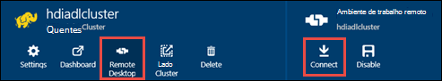

<properties
   pageTitle="Criar HDInsight clusters com o arquivo de Lake Azure dados utilizando o Gestor de recursos modelos | Microsoft Azure"
   description="Utilize o Gestor de recursos do Azure modelos para criar e utilizar HDInsight clusters com Azure dados Lake arquivo"
   services="data-lake-store,hdinsight"
   documentationCenter=""
   authors="nitinme"
   manager="jhubbard"
   editor="cgronlun"/>

<tags
   ms.service="data-lake-store"
   ms.devlang="na"
   ms.topic="article"
   ms.tgt_pltfrm="na"
   ms.workload="big-data"
   ms.date="10/21/2016"
   ms.author="nitinme"/>

# <a name="create-an-hdinsight-cluster-with-data-lake-store-using-azure-resource-manager-template"></a>Criar um cluster de HDInsight com o arquivo de dados de Lake utilizando o modelo de Gestor de recursos do Azure

> [AZURE.SELECTOR] - [Através do Portal](data-lake-store-hdinsight-hadoop-use-portal.md) - [através do PowerShell](data-lake-store-hdinsight-hadoop-use-powershell.md) - [utilizando o Gestor de recursos](data-lake-store-hdinsight-hadoop-use-resource-manager-template.md)

Saiba como utilizar um modelo de Azure o Gestor de recursos para configurar um cluster de HDInsight com acesso ao Azure dados Lake arquivo. Algumas considerações importantes nesta versão:

-   Só pode ser utilizado **para motores clusters (Linux) e Hadoop/tempestade clusters (Windows e Linux)**, o arquivo de Lake dados como uma conta de armazenamento adicional. A conta de armazenamento predefinida para essas clusters continuarão Azure armazenamento de Blobs (WASB).

-   Pode ser utilizado **para HBase clusters (Windows e Linux)**, o arquivo de Lake dados como uma armazenamento predefinido ou armazenamento adicional.

> [AZURE.NOTE] Alguns pontos importantes a nota.
>
> - Opção para criar HDInsight clusters com acesso ao arquivo de dados de Lake só está disponível para versões de HDInsight 3,2 e 3.4 (para clusters Hadoop, HBase e tempestade no Windows, bem como Linux). Para clusters de motores no Linux, esta opção só está disponível em clusters HDInsight 3.4.
>
> - Tal como mencionado acima, arquivo de dados de Lake está disponível como o armazenamento de predefinido para alguns tipos de cluster (HBase) e armazenamento adicional para outros tipos de cluster (Hadoop, motores, tempestade). Utilizar o arquivo de dados de Lake como uma conta de armazenamento adicional não causam impacto na desempenho ou a capacidade de leitura/escrita ao armazenamento do cluster. Num cenário de onde o arquivo de dados de Lake é utilizado como armazenamento adicional, relacionado com o cluster ficheiros (como registos, etc.) são escritos ao armazenamento de predefinido (Blobs do Azure), enquanto os dados que pretende processar podem ser armazenados numa conta dados Lake loja.
>

Neste artigo, iremos aprovisionar um cluster de Hadoop com o arquivo de dados de Lake como armazenamento adicional.

## <a name="prerequisites"></a>Pré-requisitos

Antes de começar este tutorial, tem de ter o seguinte procedimento:

-   **Azure uma subscrição**. Consulte o artigo [obter Azure versão de avaliação gratuita](https://azure.microsoft.com/pricing/free-trial/).

-   **Azure PowerShell 1.0 ou superior**. Veja [como instalar e configurar o Azure PowerShell](../powershell-install-configure.md).

- **Principais de serviço de diretório do azure Active**. Os passos neste tutorial fornecem instruções sobre como criar um principal de serviço no Azure AD. No entanto, tem de ser um administrador do Azure AD para poder criar um principal de serviço. Se for um administrador do Azure AD, pode ignorar este pré-requisito e continuar com o tutorial.
    
    **Se estiver não um administrador do Azure AD**, não conseguir executar os passos necessários para criar um principal de serviço. Neste caso, o administrador do Azure AD tem primeiro de criar um principal de serviço antes de poder criar um cluster de HDInsight com dados Lake arquivo. Além disso, o capital de serviço deve ser criado utilizando um certificado, tal como descrito em [criar um serviço principal com certificado](../resource-group-authenticate-service-principal.md#create-service-principal-with-certificate).

## <a name="create-an-hdinsight-cluster-with-azure-data-lake-store"></a>Criar um cluster de HDInsight com o arquivo de Lake de dados do Azure

Modelo de Gestor de recursos e as pré-requisitos para utilizar o modelo, estão disponíveis no GitHub na [Implementar um cluster de HDInsight Linux com nova loja Lake de dados](https://github.com/Azure/azure-quickstart-templates/tree/master/201-hdinsight-datalake-store-azure-storage). Siga as instruções fornecidas nesta hiperligação para criar um cluster de HDInsight com Azure dados Lake arquivo, como o armazenamento adicional.

As instruções a ligação mencionados acima necessitam do PowerShell. Antes de começar com essas instruções, certifique-se de que inicie sessão na sua conta Azure. A partir do seu ambiente de trabalho, abrir uma nova janela do PowerShell do Azure e introduza os seguintes fragmentos. Quando lhe for pedido para iniciar sessão, certifique-se de que iniciar sessão como um dos admininistrators/proprietário da subscrição:

```
# Log in to your Azure account
Login-AzureRmAccount

# List all the subscriptions associated to your account
Get-AzureRmSubscription

# Select a subscription
Set-AzureRmContext -SubscriptionId <subscription ID>
```

## <a name="upload-sample-data-to-the-azure-data-lake-store"></a>Carregar dados de exemplo para a loja de Lake de dados do Azure

O modelo de Gestor de recursos cria uma nova conta do arquivo de Lake de dados e associa-lo com o cluster HDInsight. Tem agora carregar alguns dados de exemplo para o arquivo de Lake de dados. Terá destes dados mais tarde no tutorial para executar tarefas a partir de um cluster de HDInsight aceder aos dados do arquivo de dados Lake. Para obter instruções sobre como carregar dados, consulte [carregar um ficheiro para o arquivo de dados de Lake](data-lake-store-get-started-portal.md#uploaddata). Se está a procurar alguns dados de exemplo carregar, pode obter a pasta **Ambulância dados** a partir do [Azure dados Lake Git repositório](https://github.com/Azure/usql/tree/master/Examples/Samples/Data/AmbulanceData).

## <a name="set-relevant-acls-on-the-sample-data"></a>Defina ACL relevantes nos dados de exemplo

Para se certificar de que carregar os dados de exemplo estão acessíveis a partir do cluster HDInsight, tem de garantir que a aplicação do Azure AD que é utilizada para estabelecer identidade entre o HDInsight cluster e o arquivo de dados de Lake tem acesso ao ficheiro/pasta que está a tentar aceder. Para fazer isto, execute os passos seguintes.

1.  Localize o nome da aplicação Azure AD que está associado HDInsight cluster e o arquivo de Lake de dados. Uma forma para procurar o nome é abrir o pá cluster HDInsight criado utilizando o modelo de Gestor de recursos, clique no separador **Cluster AAD identidade** e procure o valor de **Nome a apresentar Principal de serviço**.

2.  Agora, fornece acesso a esta aplicação do Azure AD no ficheiro/pasta à qual pretende aceder a partir do cluster HDInsight. Para definir as ACL direita no ficheiro/pasta arquivo de dados Lake, consulte [proteger dados arquivo de dados de Lake](data-lake-store-secure-data.md#assign-users-or-security-group-as-acls-to-the-azure-data-lake-store-file-system).

## <a name="run-test-jobs-on-the-hdinsight-cluster-to-use-the-data-lake-store"></a>Executar tarefas de teste no cluster HDInsight para utilizar o arquivo de Lake de dados

Depois de ter configurado um cluster de HDInsight, pode executar tarefas de teste num cluster para testar a que o cluster HDInsight pode aceder a dados Lake loja. Para fazê-lo, podemos será executar uma tarefa de ramo de exemplo que cria uma tabela utilizando os dados de exemplo que carregou anteriormente para o arquivo de dados de Lake.

### <a name="for-a-linux-cluster"></a>Para um cluster de Linux

Nesta secção irá SSH para cluster e executar a consulta de ramo de exemplo. Windows não fornece um cliente SSH incorporado. Recomendamos que utilize **betumes**, que podem ser transferidos das [http://www.chiark.greenend.org.uk/~sgtatham/putty/download.html](http://www.chiark.greenend.org.uk/~sgtatham/putty/download.html).

Para mais informações sobre como utilizar betumes, consulte o artigo [Utilizar SSH com baseado em Linux Hadoop no HDInsight a partir do Windows ](../hdinsight/hdinsight-hadoop-linux-use-ssh-windows.md).

1.  Quando estiver ligado, inicie o clip Hive utilizando o seguinte comando:

    ```
    hive
    ```

2.  Utilizar o clip, introduza as seguintes instruções para criar uma nova tabela denominada **veículos** utilizando os dados de exemplo do arquivo de dados Lake:

    ```
    DROP TABLE vehicles;
    CREATE EXTERNAL TABLE vehicles (str string) LOCATION 'adl://<mydatalakestore>.azuredatalakestore.net:443/';
    SELECT * FROM vehicles LIMIT 10;
    ```

    Deverá visualizar um resultado semelhante ao seguinte:

    ```
    1,1,2014-09-14 00:00:03,46.81006,-92.08174,51,S,1
    1,2,2014-09-14 00:00:06,46.81006,-92.08174,13,NE,1
    1,3,2014-09-14 00:00:09,46.81006,-92.08174,48,NE,1
    1,4,2014-09-14 00:00:12,46.81006,-92.08174,30,W,1
    1,5,2014-09-14 00:00:15,46.81006,-92.08174,47,S,1
    1,6,2014-09-14 00:00:18,46.81006,-92.08174,9,S,1
    1,7,2014-09-14 00:00:21,46.81006,-92.08174,53,N,1
    1,8,2014-09-14 00:00:24,46.81006,-92.08174,63,SW,1
    1,9,2014-09-14 00:00:27,46.81006,-92.08174,4,NE,1
    1,10,2014-09-14 00:00:30,46.81006,-92.08174,31,N,1
    ```

### <a name="for-a-windows-cluster"></a>Para um cluster do Windows

Utilize os seguintes cmdlets para executar a consulta ramo. Nesta consulta criar uma tabela a partir de dados do arquivo de dados Lake e, em seguida, executar uma consulta selecionar na tabela criada.

```
$queryString = "DROP TABLE vehicles;" + "CREATE EXTERNAL TABLE vehicles (str string) LOCATION 'adl://$dataLakeStoreName.azuredatalakestore.net:443/';" + "SELECT * FROM vehicles LIMIT 10;"

$hiveJobDefinition = New-AzureRmHDInsightHiveJobDefinition -Query $queryString

$hiveJob = Start-AzureRmHDInsightJob -ResourceGroupName $resourceGroupName -ClusterName $clusterName -JobDefinition $hiveJobDefinition -ClusterCredential $httpCredentials

Wait-AzureRmHDInsightJob -ResourceGroupName $resourceGroupName -ClusterName $clusterName -JobId $hiveJob.JobId -ClusterCredential $httpCredentials
```

Isto vai ter o seguinte resultado. **ExitValue** de 0 na saída sugere a tarefa foi concluída com êxito.

```
Cluster         : hdiadlcluster.
HttpEndpoint    : hdiadlcluster.azurehdinsight.net
State           : SUCCEEDED
JobId           : job_1445386885331_0012
ParentId        :
PercentComplete :
ExitValue       : 0
User            : admin
Callback        :
Completed       : done
```

Obter o resultado da tarefa utilizando o cmdlet seguinte:

```
Get-AzureRmHDInsightJobOutput -ClusterName $clusterName -JobId $hiveJob.JobId -DefaultContainer $containerName -DefaultStorageAccountName $storageAccountName -DefaultStorageAccountKey $storageAccountKey -ClusterCredential $httpCredentials
```

O resultado da tarefa é semelhante ao seguinte:

```
1,1,2014-09-14 00:00:03,46.81006,-92.08174,51,S,1
1,2,2014-09-14 00:00:06,46.81006,-92.08174,13,NE,1
1,3,2014-09-14 00:00:09,46.81006,-92.08174,48,NE,1
1,4,2014-09-14 00:00:12,46.81006,-92.08174,30,W,1
1,5,2014-09-14 00:00:15,46.81006,-92.08174,47,S,1
1,6,2014-09-14 00:00:18,46.81006,-92.08174,9,S,1
1,7,2014-09-14 00:00:21,46.81006,-92.08174,53,N,1
1,8,2014-09-14 00:00:24,46.81006,-92.08174,63,SW,1
1,9,2014-09-14 00:00:27,46.81006,-92.08174,4,NE,1
1,10,2014-09-14 00:00:30,46.81006,-92.08174,31,N,1
```

## <a name="access-data-lake-store-using-hdfs-commands"></a>Arquivo de Lake dados do Access utilizando os comandos HDFS

Depois de ter configurado o cluster de HDInsight para utilizar o arquivo de dados de Lake, pode utilizar os comandos de shell HDFS para aceder ao arquivo.

### <a name="for-a-linux-cluster"></a>Para um cluster de Linux

Nesta secção serão SSH para cluster e execute os comandos HDFS. Windows não fornece um cliente SSH incorporado. Recomendamos que utilize **betumes**, que podem ser transferidos das [http://www.chiark.greenend.org.uk/~sgtatham/putty/download.html](http://www.chiark.greenend.org.uk/~sgtatham/putty/download.html).

Para mais informações sobre como utilizar betumes, consulte o artigo [Utilizar SSH com baseado em Linux Hadoop no HDInsight a partir do Windows ](../hdinsight/hdinsight-hadoop-linux-use-ssh-windows.md).

Quando estabelecida, utilize o seguinte comando do sistema de ficheiros HDFS para listar os ficheiros do arquivo de dados Lake.

```
hdfs dfs -ls adl://<Data Lake Store account name>.azuredatalakestore.net:443/
```

Isto deve listar o ficheiro que carregou anteriormente para o arquivo de Lake de dados.

```
15/09/17 21:41:15 INFO web.CaboWebHdfsFileSystem: Replacing original urlConnectionFactory with org.apache.hadoop.hdfs.web.URLConnectionFactory@21a728d6
Found 1 items
-rwxrwxrwx   0 NotSupportYet NotSupportYet     671388 2015-09-16 22:16 adl://mydatalakestore.azuredatalakestore.net:443/mynewfolder
```

Também pode utilizar o `hdfs dfs -put` comando para carregar alguns ficheiros para a loja de Lake de dados e, em seguida, utilize `hdfs dfs -ls` para verificar se os ficheiros foram enviados com êxito.

### <a name="for-a-windows-cluster"></a>Para um cluster do Windows

1.  Inicie sessão novo [Azure Portal](https://portal.azure.com).

2.  Clique em **Procurar**, clique em **HDInsight clusters**e, em seguida, clique no cluster de HDInsight que criou.

3.  Na pá cluster, clique em **Ambiente de trabalho remoto**e, em seguida, na pá **Ambiente de trabalho remoto** , clique em **Ligar**.

    

    Quando lhe for pedido, introduza as credenciais fornecidas para o utilizador de ambiente de trabalho remoto.

4.  Na sessão remota, inicie o Windows PowerShell e utilize os comandos de sistema de ficheiros HDFS para listar os ficheiros do Azure arquivo de dados Lake.

    ```
    hdfs dfs -ls adl://<Data Lake Store account name>.azuredatalakestore.net:443/
    ```

    Isto deve listar o ficheiro que carregou anteriormente para o arquivo de Lake de dados.

    ```
    15/09/17 21:41:15 INFO web.CaboWebHdfsFileSystem: Replacing original urlConnectionFactory with org.apache.hadoop.hdfs.web.URLConnectionFactory@21a728d6
    Found 1 items
    -rwxrwxrwx   0 NotSupportYet NotSupportYet     671388 2015-09-16 22:16 adl://mydatalakestore.azuredatalakestore.net:443/vehicle1_09142014.csv
    ```

    Também pode utilizar o `hdfs dfs -put` comando para carregar alguns ficheiros para a loja de Lake de dados e, em seguida, utilize `hdfs dfs -ls` para verificar se os ficheiros com êxito foram carregados.

## <a name="next-steps"></a>Próximos passos

-   [Copiar dados a partir do Azure armazenamento de Blobs ao arquivo de dados de Lake](data-lake-store-copy-data-wasb-distcp.md)
