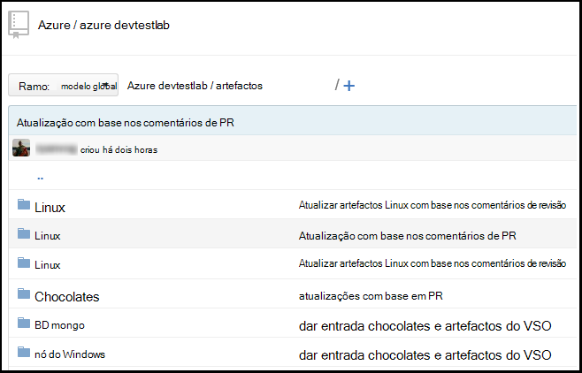
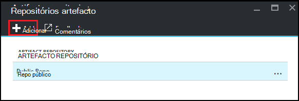
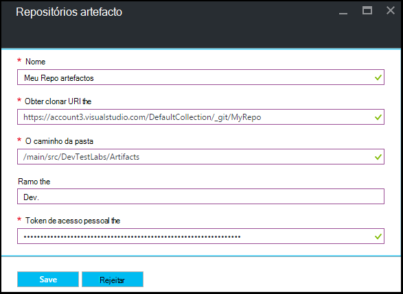

<properties
    pageTitle="Adicionar um repositório de artefacto Git a um laboratório em Azure DevTest laboratório | Microsoft Azure"
    description="Adicionar um repositório GitHub ou Git de serviços de equipa do Visual Studio para a sua origem artefactos personalizado em laboratório de DevTest do Azure"
    services="devtest-lab,virtual-machines,visual-studio-online"
    documentationCenter="na"
    authors="tomarcher"
    manager="douge"
    editor=""/>

<tags
    ms.service="devtest-lab"
    ms.workload="na"
    ms.tgt_pltfrm="na"
    ms.devlang="na"
    ms.topic="article"
    ms.date="09/06/2016"
    ms.author="tarcher"/>

# Adicionar um repositório de artefacto Git a um laboratório em laboratório de DevTest do Azure

> [AZURE.VIDEO how-to-add-your-private-artifacts-repository-in-a-devtest-lab]

Em Azure DevTest laboratório, artefactos são *ações* - como instalar o software ou executar scripts e comandos - quando é criada uma VM. Por predefinição, um laboratório inclui artefactos do repositório de artefacto Azure DevTest Labs oficial. Pode adicionar um repositório de artefacto Git para o laboratório para incluir os erros que cria a sua equipa. O repositório pode ser alojado em [GitHub](https://github.com) ou em [Serviços de equipa do Visual Studio (VSTS)](https://visualstudio.com).

- Para saber como criar um repositório de GitHub, consulte o artigo [BootCamp GitHub sobre](https://help.github.com/categories/bootcamp/).
- Para saber como criar um projeto de serviços de equipa com um repositório de Git, consulte o artigo [ligar aos serviços de equipa do Visual Studio](https://www.visualstudio.com/get-started/setup/connect-to-visual-studio-online).

Captura de ecrã seguinte apresenta um exemplo de como um repositório de artefactos poderá procurar na GitHub:  

## Obter as informações de repositório e as credenciais

Para adicionar um repositório de artefacto ao seu laboratório, terá de obter determinadas informações a partir do seu repositório. As secções seguintes orientá-lo através de introdução estas informações para repositórios artefacto alojado no GitHub e serviços de equipa do Visual Studio.

### Obter o GitHub repositório clonar URL e acesso pessoal token

Para obter o clonar repositório GitHub URL e token de acesso pessoal, siga estes passos:

1. Navegue para a home page do repositório GitHub que contém as definições de artefacto.

1. Selecione **clonar ou transferir**.

1. Selecione o botão para copiar o **url de clonar HTTPS** para a área de transferência e guardar o URL para utilizar posteriormente.

1. Selecione a imagem de perfil no canto superior direito da GitHub e selecione **Definições**.

1. No menu **definições pessoais** à esquerda, selecione **tokens de acesso pessoal**.

1. Selecione **novo token de gerar**.

1. Na página **novo token de acesso pessoal** , introduza uma **Descrição do Token**, aceite itens predefinido **Selecione âmbitos de**e, em seguida, selecione **Token gerar**.

1. Guarde o token gerado que precisar mais tarde.

1. Pode fechar GitHub agora.   

1. Continue para secção [ligar o laboratório de para o repositório artefacto](#connect-your-lab-to-the-artifact-repository) .

### Obter o URL do Visual Studio Team Services repositório clonar e acesso pessoal token

Para obter o URL do Visual Studio Team Services repositório clonar e token de acesso pessoal, siga estes passos:

1. Abra a home page da sua coleção de equipa (por exemplo, `https://contoso-web-team.visualstudio.com`) e, em seguida, selecione o projeto artefacto.

1. Na home page do project, selecione o **código**.

1. Para ver o URL de clonar, na página de **código** do projeto, selecione **clonar**.

1. Guarde o URL que precisar mais tarde neste tutorial.

1. Para criar um pessoal Token de acesso, selecione **o meu perfil** a partir do menu pendente de conta de utilizador.

1. Na página de informações de perfil, selecione **segurança**.

1. No separador **segurança** , selecione **Adicionar**.

1. Na página **criar um token de acesso pessoal** :

    - Introduza uma **Descrição** para o token.
    - Selecione **180 dias** a partir da lista **Expira em** .
    - Selecione **todas as contas acessíveis** a partir da lista de **contas** .
    - Selecione a opção de **todos os âmbitos** .
    - Selecione **Criar Token**.

1. Quando tiver terminado, o novo token de aparece na lista **Pessoal Tokens de acesso** . Selecione **Token de copiar**e, em seguida, guarde o valor token para utilizar posteriormente.

1. Continue para secção [ligar o laboratório de para o repositório artefacto](#connect-your-lab-to-the-artifact-repository) .

##Ligar o laboratório para o repositório artefacto

1. Inicie sessão no [portal do Azure](http://go.microsoft.com/fwlink/p/?LinkID=525040).

1. Selecione **Mais serviços**e, em seguida, selecione **DevTest Labs** a partir da lista.

1. Na lista de labs, selecione o laboratório desejado.   

1. No pá o laboratório, selecione **a configuração**.

1. No pá de **configuração** de ambiente de teste, selecione **Artefactos repositórios**.

1. No pá **Repositórios artefactos de** , selecione **+ Adicionar**.

    
 
1. Na segunda pá de **Artefactos repositórios** , especifique o seguinte:

    - **Nome** - introduza um nome para o repositório.
    - **Url de clonar Git** - introduza o URL de clonar Git HTTPS que copiou anteriormente do GitHub ou Visual Studio Team Services. 
    - **Caminho da pasta** - introduza o caminho da pasta em relação o URL de clonar que contém as suas definições de artefacto.
    - **Ramo** - introduza ramo para obter as suas definições de artefacto.
    - **Token de acesso pessoal** - introduza o token de acesso pessoal obteve anteriormente GitHub ou Visual Studio Team Services. 
     
    

1. Selecione **Guardar**.

[AZURE.INCLUDE [devtest-lab-try-it-out](../../includes/devtest-lab-try-it-out.md)]

## Mensagens no blogue relacionados
- [Como resolver problemas com a falhar artefactos no AzureDevTestLabs](http://www.visualstudiogeeks.com/blog/DevOps/How-to-troubleshoot-failing-artifacts-in-AzureDevTestLabs)
- [Associar uma VM ao domínio AD existente utilizando o modelo de processador laboratório de teste do Azure Dev Center](http://www.visualstudiogeeks.com/blog/DevOps/Join-a-VM-to-existing-AD-domain-using-ARM-template-AzureDevTestLabs)