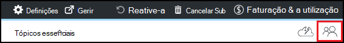

<properties
    pageTitle="Adicionar os proprietários e utilizadores em Azure DevTest laboratório | Microsoft Azure"
    description="Adicionar os proprietários e utilizadores em laboratório de DevTest Azure utilizando o Azure portal ou PowerShell"
    services="devtest-lab,virtual-machines"
    documentationCenter="na"
    authors="tomarcher"
    manager="douge"
    editor=""/>

<tags
    ms.service="devtest-lab"
    ms.workload="na"
    ms.tgt_pltfrm="na"
    ms.devlang="na"
    ms.topic="article"
    ms.date="09/12/2016"
    ms.author="tarcher"/>

# Adicionar os proprietários e utilizadores em laboratório de DevTest do Azure

> [AZURE.VIDEO how-to-set-security-in-your-devtest-lab]

Acesso em Azure DevTest laboratório é controlado pelo [Azure Role-Based acesso controlo RBCA ()](../active-directory/role-based-access-control-what-is.md). Utilizar RBAC, pode segregar direitos dentro da sua equipa para *funções de* onde está a conceder apenas a quantidade de acesso necessário aos utilizadores a realização de tarefas. Três destas funções RBAC são *proprietário*, *DevTest Labs utilizador*e *Contribuinte*. Este artigo Saiba quais as acções que podem ser executadas em cada uma das três funções RBAC principais. A partir daí, saiba como adicionar utilizadores a um laboratório - através do portal e através de um script PowerShell e como adicionar utilizadores ao nível da subscrição.

## Ações que podem ser executadas em cada função

Existem três funções principais que pode atribuir um utilizador:

- Proprietário
- DevTest Labs utilizador
- Contribuinte

A tabela seguinte ilustra as ações que podem ser realizadas pelos utilizadores em cada uma das seguintes funções:

| **Os utilizadores ações desta função podem executar** | **DevTest Labs utilizador**            | **Proprietário** | **Contribuinte** |
|---|---|---|---|
| **Tarefas de laboratório**                          |                              |       |             |
| Adicionar utilizadores a um laboratório de                     | N                           | Sim   | N          |
| Atualizar as definições de custo                   | N                           | Sim   | Sim         |
| **Tarefas de base VM**                      |                              |       |             |
| Adicionar e remover imagens personalizadas           | N                           | Sim   | Sim         |
| Adicionar, atualizar e eliminar fórmulas       | Sim                          | Sim   | Sim         |
| Imagens de lista branca Azure Marketplace     | N                           | Sim   | Sim         |
| **Tarefas VM**                           |                              |       |             |
| Criar VMs                             | Sim                          | Sim   | Sim         |
| Iniciar, parar e eliminar VMs            | Apenas VMs criados pelo utilizador | Sim   | Sim         |
| Actualizar VM políticas                     | N                           | Sim   | Sim         |
| Adicionar/remover discos de dados para a VMs      | Apenas VMs criados pelo utilizador | Sim   | Sim         |
| **Tarefas de artefacto**                     |                              |       |             |
| Adicionar e remover repositórios artefacto   | N                           | Sim   | Sim         |
| Aplicar artefactos                        | Sim                          | Sim   | Sim         |

> [AZURE.NOTE] Quando um utilizador cria uma VM, esse utilizador é automaticamente atribuído à função de **proprietário** da VM criado.

## Adicionar um utilizador ou proprietário ao nível do laboratório

Os proprietários e os utilizadores podem ser adicionados ao nível do laboratório através do portal do Azure. Isto inclui os utilizadores externos com uma [conta Microsoft (MSA)](devtest-lab-faq.md#what-is-a-microsoft-account)de válida.
Os passos seguintes orientá-lo durante o processo de adicionar um utilizador ou proprietário a um laboratório em Azure DevTest laboratório:

1. Inicie sessão no [portal do Azure](http://go.microsoft.com/fwlink/p/?LinkID=525040).

1. Selecione **mais serviços**e, em seguida, selecione **DevTest Labs** a partir da lista.

1. Na lista de labs, selecione o laboratório desejado.

1. No pá o laboratório, selecione **a configuração**. 

1. No pá **configuração** , selecione **utilizadores**.

1. No pá **utilizadores** , selecione **+ Adicionar**.

    

1. No pá **selecionar uma função** , selecione a função pretendida. A secção [ações que podem ser executadas em cada função](#actions-that-can-be-performed-in-each-role) lista as várias ações que podem ser realizadas pelos utilizadores no proprietário, utilizador DevTest e funções de contribuinte.

1. No pá **Adicionar utilizadores** , introduza o endereço de e-mail ou o nome do utilizador ao que qual pretende adicionar na função que especificou. Se o utilizador não é possível localizar, uma mensagem de erro explica o problema. Se o utilizador for encontrado, esse utilizador é listado e selecionado. 

1. Selecione **Selecionar**.

1. Selecione **OK** para fechar a pá **adicionar acesso** .

1. Quando regressar à pá a **utilizadores** , o utilizador foi adicionado.  

## Adicionar um utilizador externo para um laboratório através do PowerShell

Para além de adicionar utilizadores no portal do Azure, pode adicionar um utilizador externo para o laboratório utilizando um script PowerShell. No exemplo seguinte, basta modifique os valores de parâmetros sob o comentário de **valores para alterar** .
Pode obter a `subscriptionId`, `labResourceGroup`, e `labName` valores a partir de pá laboratório no portal do Azure.

> [AZURE.NOTE]
> Exemplo de script assume que o utilizador especificado foi adicionado como convidado no Active Directory e falhará se não for o caso. Para adicionar um utilizador não no Active Directory para um laboratório, utilize o portal do Azure para atribuir ao utilizador para uma função, conforme ilustrado na secção, [Adicionar um proprietário ou utilizador ao nível do laboratório](#add-an-owner-or-user-at-the-lab-level).   

    # Add an external user in DevTest Labs user role to a lab
    # Ensure that guest users can be added to the Azure Active directory:
    # https://azure.microsoft.com/en-us/documentation/articles/active-directory-create-users/#set-guest-user-access-policies

    # Values to change
    $subscriptionId = "<Enter Azure subscription ID here>"
    $labResourceGroup = "<Enter lab's resource name here>"
    $labName = "<Enter lab name here>"
    $userDisplayName = "<Enter user's display name here>"

    # Log into your Azure account
    Login-AzureRmAccount
    
    # Select the Azure subscription that contains the lab. 
    # This step is optional if you have only one subscription.
    Select-AzureRmSubscription -SubscriptionId $subscriptionId
    
    # Retrieve the user object
    $adObject = Get-AzureRmADUser -SearchString $userDisplayName
    
    # Create the role assignment. 
    $labId = ('subscriptions/' + $subscriptionId + '/resourceGroups/' + $labResourceGroup + '/providers/Microsoft.DevTestLab/labs/' + $labName)
    New-AzureRmRoleAssignment -ObjectId $adObject.Id -RoleDefinitionName 'DevTest Labs User' -Scope $labId

## Adicionar um utilizador ou proprietário ao nível da subscrição

Permissões Azure são propagadas a partir do âmbito principal para o âmbito de subordinados no Azure. Por isso, os proprietários de uma subscrição do Azure que contém labs são automaticamente os proprietários desses labs. Também proprietário as VMs e outros recursos criados por utilizadores o laboratório e o serviço do Azure DevTest Labs. 

Pode adicionar os proprietários de adicionais para um laboratório através do pá o laboratório no [portal do Azure](http://go.microsoft.com/fwlink/p/?LinkID=525040). No entanto, âmbito o proprietário adicionados de administração é mais estreito que um âmbito o proprietário da subscrição. Por exemplo, os proprietários adicionados não possui acesso total a alguns dos recursos que são criados na subscrição pelo serviço DevTest Labs. 

Para adicionar um proprietário a uma subscrição do Azure, siga estes passos:

1. Inicie sessão no [portal do Azure](http://go.microsoft.com/fwlink/p/?LinkID=525040).

1. Selecione **Mais serviços**e, em seguida, selecione **subscrições** a partir da lista.

1. Selecione a subscrição pretendida.

1. Selecione o ícone do **Access** . 

    

1. No pá **utilizadores** , selecione **Adicionar**.

    

1. No pá **selecionar uma função** , selecione o **proprietário**.

1. No pá **Adicionar utilizadores** , introduza o endereço de e-mail ou o nome do utilizador ao que qual pretende adicionar como um proprietário. Se o utilizador não é possível localizar, obtém uma mensagem de erro explicar o problema. Se o utilizador for encontrado, esse utilizador está listado em caixa de texto de **utilizador** .

1. Selecione o nome de utilizador localizado.

1. Selecione **Selecionar**.

1. Selecione **OK** para fechar a pá **adicionar acesso** .

1. Quando regressar à pá a **utilizadores** , o utilizador foi adicionado como um proprietário. Este utilizador está agora um proprietário do qualquer labs criado nesta subscrição e, por conseguinte, poderá efetuar tarefas de proprietário. 

[AZURE.INCLUDE [devtest-lab-try-it-out](../../includes/devtest-lab-try-it-out.md)]
