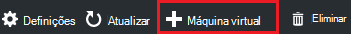
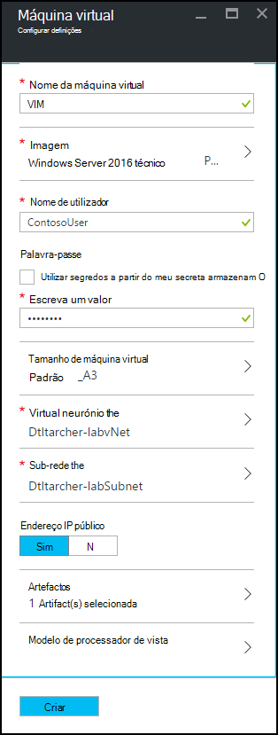
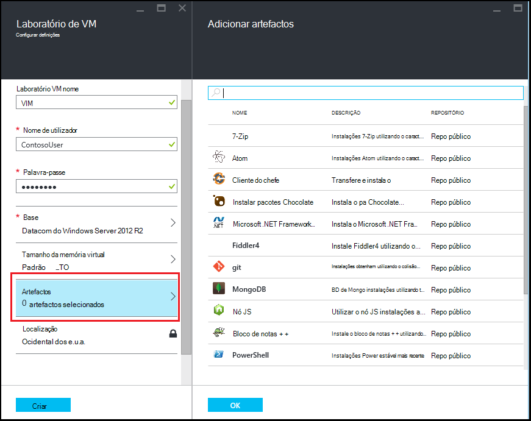
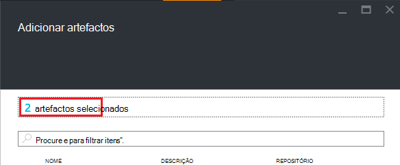

<properties
    pageTitle="Adicionar uma VM com artefactos a um laboratório em Azure DevTest laboratório | Microsoft Azure"
    description="Saiba como adicionar uma VM com artefactos em laboratório de DevTest do Azure"
    services="devtest-lab,virtual-machines"
    documentationCenter="na"
    authors="tomarcher"
    manager="douge"
    editor=""/>

<tags
    ms.service="devtest-lab"
    ms.workload="na"
    ms.tgt_pltfrm="na"
    ms.devlang="na"
    ms.topic="article"
    ms.date="08/30/2016"
    ms.author="tarcher"/>

# Adicionar uma VM com artefactos a um laboratório em laboratório de DevTest do Azure

> [AZURE.VIDEO how-to-create-vms-with-artifacts-in-a-devtest-lab]

Criar uma VM num laboratório a partir de uma *base* que é uma [imagem personalizada](./devtest-lab-create-template.md), [fórmula](./devtest-lab-manage-formulas.md)ou [imagem Marketplace](./devtest-lab-configure-marketplace-images.md).

DevTest Labs *artefactos* permitem-lhe especificar *ações* que são executadas quando a VM é criada. 

Ações de artefacto podem executar procedimentos como executar scripts do Windows PowerShell, executar festa comandos e instalar o software. 

Artefacto *parâmetros* permitem-lhe personalizar artefacto para o seu cenário em particular.

Este artigo mostra-lhe como criar uma VM no seu laboratório com artefactos.

## Adicionar uma VM com artefactos

1. Inicie sessão no [portal do Azure](http://go.microsoft.com/fwlink/p/?LinkID=525040).

1. Selecione **Mais serviços**e, em seguida, selecione **DevTest Labs** a partir da lista.

1. Na lista de labs, selecione o laboratório na qual pretende criar a VM.  

1. No pá de **Descrição geral** do laboratório, selecione **+ Máquina Virtual**.  
    

1. No pá **Escolher uma base** , selecione uma base para a VM.

1. No pá **Máquina Virtual** , introduza um nome para a nova máquina virtual na caixa de texto **nome de Máquina Virtual** .

    

1. Introduza um **Nome de utilizador** que será concedido privilégios de administrador no computador virtual.  

1. Se pretender utilizar uma palavra-passe armazenada no seu *arquivo secreto*, selecione **utilizar segredos a partir do meu arquivo secreto**e especificar um valor de chave que corresponde à sua palavra-passe (palavra-passe). Caso contrário, introduza simplesmente uma palavra-passe no campo de texto com o nome **Escreva um valor**.
 
1. Selecione o **tamanho de Máquina Virtual** e selecione um dos itens predefinidos que especificam os tarolos processador, tamanho de RAM e o tamanho de unidade de disco rígido da VM para criar.

1. Selecione **Rede Virtual** e selecione a rede virtual pretendida.

1. Selecione **sub-rede** e selecione sub-rede.

1. Se a política de laboratório estiver definida para permitir que os endereços IP públicos para sub-rede seleccionada, especifique se pretende que o endereço IP seja público selecionando em **Sim** ou **não**. Caso contrário, esta opção está desativada e seleccionada como **não**. 

1. Selecione **artefactos** - na lista de artefactos -, selecione e configurar erros ao qual pretende adicionar à imagem base. 
**Nota:** Se estiver habituado a DevTest Labs ou configurar artefactos, avance para a secção de [Adicionar um artifício existente para uma VM](#add-an-existing-artifact-to-a-vm) e, em seguida, regresse a esta página quando tiver terminado.

1. Se pretender ver ou copiar o modelo de Gestor de recursos do Azure, avance para a secção de [Gestor de recursos do Azure guardar modelo](#save-arm-template) e regresse a esta página quando tiver terminado.

1. Selecione **Criar** para adicionar a VM especificada para o laboratório.

1. O pá laboratório apresenta o estado da criação da VM; em primeiro lugar como **Criar**, em seguida, como **a executar o** após a VM foi iniciado.

1. Aceda à secção [Passos seguintes](#next-steps) . 

## Adicionar um artifício existente a uma VM

Ao criar uma VM, pode adicionar artefactos existentes. Cada laboratório inclui artefactos a partir do repositório de artefacto de Labs DevTest público, bem como artefactos que tenha criado e adicionada para o seu próprio repositório artefacto.
Para descobrir como criar artefactos, consulte o artigo, [Aprenda a suas própria artefactos para utilização com DevTest Labs do autor](devtest-lab-artifact-author.md).

1. No pá **Máquina Virtual** , selecione **artefactos**. 

1. No pá **artefactos de adicionar** , selecione o artefacto pretendido.  

    

1. Introduza os valores de parâmetro obrigatório e quaisquer parâmetros opcionais que necessita.  

1. Selecione **Adicionar** para adicionar o artefacto e voltar para a **Adicionar artefactos** pá.

1. Continue a adicionar artefactos conforme necessário para sua VM.

1. Depois de adicionar os artefactos, pode [alterar a ordem pela qual erros são executados](#change-the-order-in-which-artifacts-are-run). Também pode aceder novamente para [Ver ou modificar um artifício](#view-or-modify-an-artifact).

## Alterar a ordem pela qual artefactos são executados

Por predefinição, as ações dos erros são executadas pela ordem na qual são adicionados para a VM. Os passos seguintes ilustram como alterar a ordem pela qual erros são executados.

1. Na parte superior da pá a **Adicionar artefactos** , selecione a ligação que indica o número de artefactos que foram adicionados à VM.

    

1. Para especificar a ordem pela qual são executados erros, arraste e largue erros na ordem pretendida. **Nota:** Se tiver problemas com a arrastar o artefacto, certifique-se de que está a arrastar a partir do lado esquerdo do artefacto. 

1. Selecione **OK** quando terminar.  

## Ver ou modificar um artifício

Os passos seguintes ilustram como ver ou modificar os parâmetros de um artifício:

1. Na parte superior da pá a **Adicionar artefactos** , selecione a ligação que indica o número de artefactos que foram adicionados à VM.

    

1. No pá **Artefactos selecionada** , selecione o artefacto que pretende ver ou editar.  

1. No pá **Artefacto adicionar** , faça as alterações necessárias e selecione **OK** para fechar a pá **Artefacto adicionar** .

1. Selecione **OK** para fechar a pá **Artefactos selecionada** .

## Guardar modelo de Gestor de recursos do Azure

Um modelo de Gestor de recursos do Azure fornece uma forma declarativa para definir uma implementação de forma repetida. Os passos seguintes explicam como guardar o modelo de Gestor de recursos do Azure para a VM a ser criada.
Assim que é guardado, pode utilizar o modelo de Gestor de recursos do Azure para [Implementar o novos VMs com PowerShell do Azure](../azure-resource-manager/resource-group-overview.md#template-deployment).

1. No pá **Máquina Virtual** , selecione o **Modelo de processador de vista**.

1. Na **vista Azure Gestor de recursos do modelo pá**, selecione o texto de modelo.

1. Copie o texto selecionado para a área de transferência.

1. Selecione **OK** para fechar a **vista Azure Gestor de recursos do modelo pá**.

1. Abra um editor de texto.

1. Cole o texto de modelo da área de transferência.

1. Guarde o ficheiro para utilizar posteriormente.

[AZURE.INCLUDE [devtest-lab-try-it-out](../../includes/devtest-lab-try-it-out.md)]

## Próximos passos

- Assim que a VM ter sido criada, pode ligar-se para a VM selecionando **Ligar** no pá a VM.
- Saiba como [Criar artefactos personalizados para o seu VM de Labs DevTest](devtest-lab-artifact-author.md).
- Explorar a [Galeria de modelos de guia de introdução do DevTest Labs processador](https://github.com/Azure/azure-devtestlab/tree/master/ARMTemplates)