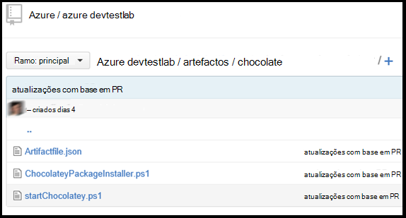

<properties 
    pageTitle="Criar artefactos personalizados para o seu VM de Labs DevTest | Microsoft Azure"
    description="Aprenda a suas própria artefactos para utilização com DevTest Labs do autor"
    services="devtest-lab,virtual-machines"
    documentationCenter="na"
    authors="tomarcher"
    manager="douge"
    editor=""/>

<tags
    ms.service="devtest-lab"
    ms.workload="na"
    ms.tgt_pltfrm="na"
    ms.devlang="na"
    ms.topic="article"
    ms.date="08/25/2016"
    ms.author="tarcher"/>

#Criar artefactos personalizados para o seu VM de Labs DevTest

> [AZURE.VIDEO how-to-author-custom-artifacts] 

## Descrição geral
**Artefactos** são utilizadas para implementar e configurar a aplicação após uma VM está aprovisionada. Um artifício é composta por um ficheiro de definição de artefacto e outros ficheiros de script que estão armazenados numa pasta num repositório de git. Ficheiros de definição de artefacto de consistir em JSON e expressões que pode utilizar para especificar o que pretende instalar numa VM. Por exemplo, pode definir o nome do artefacto, comando para executar e parâmetros que ficam disponíveis quando o comando é executado. Pode referir-se para outros ficheiros de script dentro do ficheiro de definição de artefacto pelo nome.

##Formato de ficheiro de definição de artefacto
O exemplo seguinte mostra as secções que compõem a estrutura básica de um ficheiro de definição.

    {
      "$schema": "https://raw.githubusercontent.com/Azure/azure-devtestlab/master/schemas/2015-01-01/dtlArtifacts.json",
      "title": "",
      "description": "",
      "iconUri": "",
      "targetOsType": "",
      "parameters": {
        "<parameterName>": {
          "type": "",
          "displayName": "",
          "description": ""
        }
      },
      "runCommand": {
        "commandToExecute": ""
      }
    }

| Nome do elemento | Obrigatório? | Descrição
| ------------ | --------- | -----------
| $schema      | N        | Localização do ficheiro de esquema JSON que ajuda a testar a validade de ficheiro de definição do.
| título        | Sim       | Nome da artefacto apresentado no laboratório.
| Descrição  | Sim       | Descrição do artefacto apresentado no laboratório.
| iconUri      | N        | URI do ícone de apresentado no laboratório.
| targetOsType | Sim       | Sistema operativo da VM onde artefacto será instalado. Opções suportadas são: Windows e Linux.
| parâmetros   | N        | Valores que são fornecidos quando o comando de instalação artefacto é executado num computador. Isto ajuda a personalizar o seu artefacto.
| ExecutarComando   | Sim       | Artefacto instalar o comando que é executado numa VM.

###Parâmetros de artefacto

Na secção parâmetros do ficheiro de definições, especificar quais os valores de um utilizador pode introduzir ao instalar um artifício. Pode referir-se a estes valores no comando artefacto instalar.

Definir parâmetros será a seguinte estrutura.

    "parameters": {
        "<parameterName>": {
          "type": "<type-of-parameter-value>",
          "displayName": "<display-name-of-parameter>",
          "description": "<description-of-parameter>"
        }
      }

| Nome do elemento | Obrigatório? | Descrição
| ------------ | --------- | -----------
| tipo         | Sim       | Tipo de valor do parâmetro. Ver a lista abaixo para os tipos de permitidos:
| displayName Sim       | Nome do parâmetro que é apresentado a um utilizador no ambiente de teste.
| Descrição  | Sim       | Descrição do parâmetro que é apresentado no laboratório.

Os tipos de permitidos são:

- cadeia – qualquer cadeia JSON válida
- Int – qualquer número inteiro JSON válido
- Booleano – qualquer válido JSON booleana
- matriz – qualquer matriz JSON válida

##Artefacto expressões e funções

Pode utilizar expressão e funções para construir o artefacto instale comando.
Expressões estão entre com Parênteses Retos ([e]) e são avaliados quando o artefacto está instalado. Expressões podem aparecer em qualquer parte de um valor de cadeia JSON e sempre outra JSON valor devolvido. Se tem de utilizar uma cadeia literal que começa com um parêntese Reto [, tem de utilizar dois parênteses [[.
Normalmente, pode utilizar expressões com funções para construir um valor. Tal como faria em JavaScript, chamadas de função são formatadas como functionName(arg1,arg2,arg3)

A lista seguinte mostra funções comuns.

- Parameters(parameterName) - devolve um valor de parâmetro é fornecido quando o comando artefacto é executado.
- concat (arg1, arg2, arg3,...) - combina vários valores de cadeia. Esta função pode demorar algum número de argumentos.

O exemplo seguinte mostra como utilizar funções e expressão para construir um valor.

    runCommand": {
         "commandToExecute": "[concat('powershell.exe -File startChocolatey.ps1'
    , ' -RawPackagesList ', parameters('packages')
    , ' -Username ', parameters('installUsername')
    , ' -Password ', parameters('installPassword'))]"
    }

##Criar um artefacto personalizado

Crie o seu artefacto personalizado ao seguir os passos abaixo:

1. Instalar um editor de JSON - terá um editor de JSON para trabalhar com ficheiros de definição de artefacto. Recomendamos que utilize o [Código do Visual Studio](https://code.visualstudio.com/), que se encontra disponível para Windows, Linux e OS X.

1. Obter um exemplo artifactfile.json - dar saída erros criada pela equipa de Azure DevTest Labs no nosso [GitHub repositório](https://github.com/Azure/azure-devtestlab) onde Criámos uma biblioteca avançada de artefactos que irá ajudá-lo criar o seus próprio artefactos. Transferir um ficheiro de definição de artefacto e efetuar alterações ao mesmo para criar o seus próprio artefactos.

1. Certifique-se de utilização das IntelliSense - aproveitar o IntelliSense para ver elementos válidos que podem ser utilizados para construir um ficheiro de definição de artefacto. Também pode ver as diferentes opções para valores de um elemento. Por exemplo, IntelliSense mostrar-lhe duas opções do Windows ou Linux quando edita o elemento **targetOsType** .

1. Armazenar o artefacto num repositório git
    1. Crie um diretório separado para cada artefacto onde o nome do directório é o mesmo que o nome de artefacto.
    1. Armazene o ficheiro de definição de artefacto (artifactfile.json) no diretório que criou.
    1. Armazene os scripts que são referenciados a partir do comando artefacto instalar.

    Eis um exemplo de como uma pasta de artefacto pode apresentar aspeto:

    

1. Adicionar o repositório de artefactos para o laboratório - consulte o artigo, [Adicionar um repositório de artefacto Git para um laboratório de](devtest-lab-add-artifact-repo.md).

[AZURE.INCLUDE [devtest-lab-try-it-out](../../includes/devtest-lab-try-it-out.md)]

## Mensagens no blogue relacionados
- [Como resolver problemas com a falhar artefactos no AzureDevTestLabs](http://www.visualstudiogeeks.com/blog/DevOps/How-to-troubleshoot-failing-artifacts-in-AzureDevTestLabs)
- [Associar uma VM ao domínio AD existente utilizando o modelo de processador laboratório de teste do Azure Dev Center](http://www.visualstudiogeeks.com/blog/DevOps/Join-a-VM-to-existing-AD-domain-using-ARM-template-AzureDevTestLabs)

## Próximos passos

- Saiba como [Adicionar um repositório de artefacto Git para um laboratório de](devtest-lab-add-artifact-repo.md).
