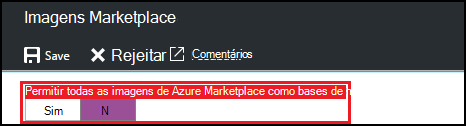
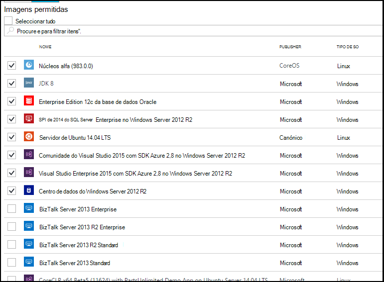

<properties
    pageTitle="Configurar definições de imagem do Azure Marketplace em Azure DevTest laboratório | Microsoft Azure"
    description="Configurar as imagens Azure Marketplace podem ser utilizadas quando criar uma VM em laboratório de DevTest do Azure"
    services="devtest-lab,virtual-machines"
    documentationCenter="na"
    authors="tomarcher"
    manager="douge"
    editor=""/>

<tags
    ms.service="devtest-lab"
    ms.workload="na"
    ms.tgt_pltfrm="na"
    ms.devlang="na"
    ms.topic="article"
    ms.date="09/06/2016"
    ms.author="tarcher"/>

# Configurar definições de imagem do Azure Marketplace em laboratório de DevTest do Azure

DevTest Labs suporta a criação VMs com base em imagens Azure Marketplace, dependendo de como tiver configurado imagens Azure Marketplace para ser utilizado no seu laboratório. Este artigo mostra-lhe como especificar que, se existirem, imagens do Azure Marketplace podem ser utilizadas quando criar VMs num laboratório de.

## Selecione as imagens Azure Marketplace são permitidas quando criar uma VM

1. Inicie sessão no [portal do Azure](http://go.microsoft.com/fwlink/p/?LinkID=525040).

1. Selecione **Mais serviços**e, em seguida, selecione **DevTest Labs** a partir da lista.

1. Na lista de labs, selecione o laboratório desejado. 

1. No pá o laboratório, selecione **a configuração**.
    
1. No pá de **configuração** do laboratório, selecione **imagens Marketplace**

1. Especifique se pretende que todas as imagens de Azure Marketplace qualificadas esteja disponível para ser utilizado como uma base de uma nova VM. Se selecionar **Sim**, todas as imagens de Azure Marketplace cumpram os seguintes critérios são permitidas em laboratório:

    - A imagem cria uma única VM **e**
    - A imagem utiliza o Gestor de recursos do Azure para aprovisionar VMs **e**
    - A imagem não necessita de comprar um plano do licenciamento extra
    
    Se pretende sem imagens de autorização ou que pretende especificar as imagens podem ser utilizadas, selecione **não**.
 
    
 
1. Se **não** selecionar para o passo anterior, a caixa de verificação **Permitidos imagens/seleccionar tudo** está ativada. Pode utilizar esta opção juntamente com a caixa de pesquisa para selecionar ou desmarcar todos os itens apresentados na lista rapidamente.
Também pode selecionar as imagens de Azure Marketplace que pretende permitir a criação de VM individualmente ao selecionar a caixa de verificação correspondentes de cada imagem.
Selecione nada a partir da lista se não quiser permitir que as imagens qualquer Azure Marketplace ser utilizado no laboratório.

    

[AZURE.INCLUDE [devtest-lab-try-it-out](../../includes/devtest-lab-try-it-out.md)]

## Próximos passos

Depois de ter configurado como imagens Azure Marketplace são permitidas quando criar uma VM, o passo seguinte é para [Adicionar uma VM para o laboratório](./devtest-lab-add-vm-with-artifacts.md).