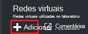
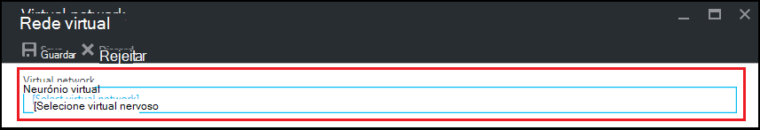
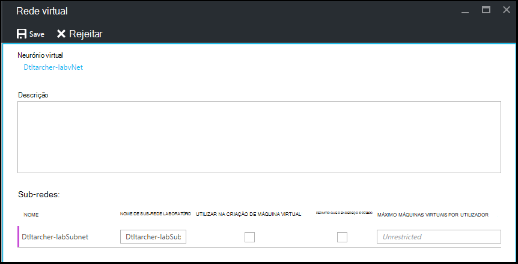

<properties
    pageTitle="Configurar uma rede virtual em Azure DevTest laboratório | Microsoft Azure"
    description="Saiba como configurar um rede virtual existente e sub-rede e utilizá-los numa VM com Azure DevTest Labs"
    services="devtest-lab,virtual-machines"
    documentationCenter="na"
    authors="tomarcher"
    manager="douge"
    editor=""/>

<tags
    ms.service="devtest-lab"
    ms.workload="na"
    ms.tgt_pltfrm="na"
    ms.devlang="na"
    ms.topic="article"
    ms.date="09/06/2016"
    ms.author="tarcher"/>

# Configurar uma rede virtual em laboratório de DevTest do Azure

Como é explicado no artigo, [Adicionar uma VM com artefactos para um laboratório](devtest-lab-add-vm-with-artifacts.md), quando cria uma VM num laboratório, pode especificar uma rede virtual configurada. Um cenário para este procedimento é se terá de aceder aos seus recursos corpnet a partir do seu VMs utilizando a rede virtual que foi configurada com ExpressRoute ou VPN do site para o site. As secções seguintes ilustram como adicionar a sua rede virtual existente para as definições de rede Virtual um laboratório para que seja disponível para escolha quando criar VMs.

## Configurar uma rede virtual para um laboratório através do portal Azure
Os passos seguintes ajudá-lo através da adição de uma rede virtual existente (e sub-rede) para um laboratório para que possa ser utilizado quando criar uma VM no mesmo laboratório. 

1. Inicie sessão no [portal do Azure](http://go.microsoft.com/fwlink/p/?LinkID=525040).

1. Selecione **Mais serviços**e, em seguida, selecione **DevTest Labs** a partir da lista.

1. Na lista de labs, selecione o laboratório desejado. 

1. No pá o laboratório, selecione **a configuração**.

1. No pá de **configuração** de ambiente de teste, selecione **redes virtuais**.

1. No pá **redes virtuais** , verá uma lista de redes virtuais configurado para o laboratório atual, bem como a rede virtual predefinido que é criada para o laboratório. 

1. Selecione **+ Adicionar**.

    
    
1. No pá **da rede Virtual** , selecione **[Seleccionar rede virtual]**.

    
    
1. No pá **rede virtual escolher** , selecione a rede virtual pretendida. O pá mostra todas as redes virtuais que estão contidas a região do mesmo a subscrição como o laboratório.  

1. Após selecionar uma rede virtual, são devolvidos para a **Rede Virtual** pá e vários campos estão ativados.  

    

1. Especifique uma descrição para a sua rede virtual / combinação laboratório.

1. Para permitir que uma sub-rede a ser utilizado em laboratório de criação de VM, selecione **Utilizar a criação de máquina VIRTUAL IN**.

1. Para permitir que os endereços IP públicos numa sub-rede, selecione **Permitir IP público**.

1. No campo **Máximo máquinas virtuais por utilizador** , especifique os máximos VMs por utilizador para cada sub-rede. Se pretender um número ilimitado de VMs, deixe este campo em branco.

1. Selecione **Guardar**.

1. Agora que a rede virtual está configurada, podem ser selecionado ao criar uma VM. Para ver como criar uma VM e especificar uma rede virtual, consulte o artigo [Adicionar uma VM com artefactos para um laboratório de](devtest-lab-add-vm-with-artifacts.md). 

[AZURE.INCLUDE [devtest-lab-try-it-out](../../includes/devtest-lab-try-it-out.md)]

## Próximos passos

Assim que tiver adicionado à rede virtual pretendida para o laboratório, o passo seguinte é para [Adicionar uma VM para o laboratório](devtest-lab-add-vm-with-artifacts.md).