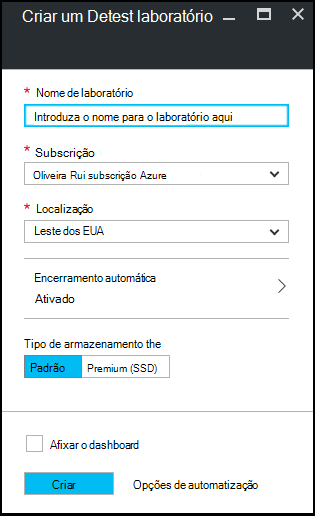

<properties
    pageTitle="Criar um laboratório em Azure DevTest laboratório | Microsoft Azure"
    description="Criar um laboratório em Azure DevTest laboratório para máquinas virtuais"
    services="devtest-lab,virtual-machines"
    documentationCenter="na"
    authors="tomarcher"
    manager="douge"
    editor=""/>

<tags
    ms.service="devtest-lab"
    ms.workload="na"
    ms.tgt_pltfrm="na"
    ms.devlang="na"
    ms.topic="get-started-article"
    ms.date="09/12/2016"
    ms.author="tarcher"/>

# Criar um laboratório em laboratório de DevTest do Azure

## Pré-requisitos

Para criar um laboratório, precisa de:

- Uma subscrição do Azure. Para saber mais sobre as opções de compra Azure, consulte o artigo [como comprar Azure](https://azure.microsoft.com/pricing/purchase-options/) ou a [versão de avaliação gratuita um mês](https://azure.microsoft.com/pricing/free-trial/). Tem de ser o proprietário da subscrição para o laboratório de criar.

## Passos para criar um laboratório em laboratório de DevTest do Azure

Os passos seguintes ilustram como utilizar o portal do Azure para criar um laboratório em Azure DevTest laboratório. 

1. Inicie sessão no [portal do Azure](http://go.microsoft.com/fwlink/p/?LinkID=525040).

1. Selecione **mais serviços**e, em seguida, selecione **DevTest Labs** a partir da lista.

1. No pá **DevTest Labs** , selecione **Adicionar**.

    

1. No pá **criar um laboratório de DevTest** :

    1. Introduza um **Nome de laboratório** para o laboratório de novo.
    
    1. Selecione a **subscrição** para associar o laboratório.
    
    1. Selecione uma **localização** na qual pretende armazenar o laboratório.
    
    1. Selecione **encerramento automática** para especificar se pretende ativar - e definir parâmetros para - o automática encerrar de ambiente de teste estiverem VMs.
    
    1. Selecione o **tipo de armazenamento** para indicar o tipo de disco de armazenamento para VMs o laboratório. 
    
    1. Selecione **Criar**.

    

[AZURE.INCLUDE [devtest-lab-try-it-out](../../includes/devtest-lab-try-it-out.md)]

## Próximos passos

Depois de criar o laboratório, aqui estão alguns passos a ter em conta:

- [Proteger o acesso a um laboratório de](devtest-lab-add-devtest-user.md).

- [Definir políticas de laboratório](devtest-lab-set-lab-policy.md).

- [Criar um modelo de laboratório](devtest-lab-create-template.md).

- [Criar artefactos personalizados para o seu VMs](devtest-lab-artifact-author.md).

- [Adicionar uma VM com artefactos para um laboratório de](devtest-lab-add-vm-with-artifacts.md).