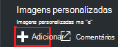
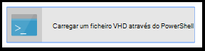
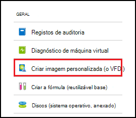
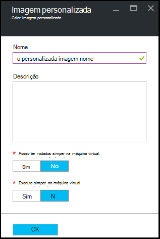

<properties
    pageTitle="Gerir imagens personalizadas do Azure DevTest Labs para criar VMs | Microsoft Azure"
    description="Saiba como criar uma imagem personalizada a partir de um ficheiro VHD, ou de um VM existente em laboratório de DevTest do Azure"
    services="devtest-lab,virtual-machines"
    documentationCenter="na"
    authors="tomarcher"
    manager="douge"
    editor=""/>

<tags
    ms.service="devtest-lab"
    ms.workload="na"
    ms.tgt_pltfrm="na"
    ms.devlang="na"
    ms.topic="article"
    ms.date="09/07/2016"
    ms.author="tarcher"/>

# Gerir imagens personalizadas do Azure DevTest Labs para criar VMs

Em Azure DevTest laboratório, as imagens personalizadas permitem-lhe criar rapidamente VMs sem aguardar todo o software necessário ser instalado no computador de destino. Imagens personalizadas permitem-lhe instalar previamente todo o software que precisa de um ficheiro VHD e, em seguida, utilizam o ficheiro VHD para criar uma VM. Porque o software já está instalado, a hora de criação de VM é muito mais rápida. Além disso, as imagens personalizadas são utilizadas para clonar VMs através da criação de uma imagem personalizada a partir de uma VM e, em seguida, criar VMs dessa imagem personalizada.

Neste artigo, saiba como:

- [Criar uma imagem personalizada a partir de um ficheiro VHD](#create-a-custom-image-from-a-vhd-file) para que, em seguida, pode criar uma VM dessa imagem personalizada. 
- [Criar uma imagem personalizada a partir de uma VM](#create-a-custom-image-from-a-vm) para rápida VM clonar.

## Criar uma imagem personalizada a partir de um ficheiro VHD

Nesta secção, consulte como criar uma imagem personalizada a partir de um ficheiro VHD.
Precisa de aceder a um ficheiro VHD válido para realizar todos os passos nesta secção.   

1. Inicie sessão no [portal do Azure](http://go.microsoft.com/fwlink/p/?LinkID=525040).

1. Selecione **mais serviços**e, em seguida, selecione **DevTest Labs** a partir da lista.

1. Na lista de labs, selecione o laboratório desejado.  

1. No pá o laboratório, selecione **a configuração**. 

1. No pá de **configuração** laboratório, selecione **imagens personalizadas**.

1. No pá **imagens personalizadas** , selecione **+ imagem personalizada**.

    

1. Introduza o nome da imagem personalizada. Este nome é apresentado na lista de imagens de base quando criar uma VM.

1. Introduza a descrição da imagem personalizada. Esta descrição é apresentada na lista de imagens de base quando criar uma VM.

1. Selecione o **ficheiro VHD**.

1. Se tiver acesso a um ficheiro VHD não estiver listado, adicioná-lo ao seguir as instruções na secção de [carregar um ficheiro VHD](#upload-a-vhd-file) e regresse a esta página quando tiver terminado.

1. Selecione o ficheiro VHD pretendido.

1. Selecione **OK** para fechar o **Ficheiro VHD** pá.

1. Selecione **a configuração do sistema operativo**.

1. No separador **Configuração do SO** , selecione **Windows** ou **Linux**.

1. Se o **Windows** está selecionada, especificar através da caixa de verificação se tenha sido executado *Sysprep* no computador.

1. Selecione **OK** para fechar a **Configuração do SO** pá.

1. Selecione **OK** para criar a imagem personalizada.

1. Aceda à secção [Passos seguintes](#next-steps) .

###Carregar um ficheiro VHD

Para adicionar uma imagem personalizada, é necessário ter acesso a um ficheiro VHD.

1. No pá **Ficheiro VHD** , selecione **carregar um ficheiro VHD através do PowerShell**.

    

1. A seguinte pá irá apresentar instruções para modificar e executar um script do PowerShell os carregamentos pendentes à sua subscrição do Azure um ficheiro VHD. 
**Nota:** Este processo pode ser demorado dependendo do tamanho do ficheiro VHD e a velocidade de ligação.

## Criar uma imagem personalizada a partir de uma VM
Se tiver uma VM que já está configurada, pode criar uma imagem personalizada a partir desse VM e posteriormente utilizar essa imagem personalizada para criar outras VMs idênticos. Os seguintes passos mostram como criar uma imagem personalizada a partir de uma VM:

1. Inicie sessão no [portal do Azure](http://go.microsoft.com/fwlink/p/?LinkID=525040).

1. Selecione **mais serviços**e, em seguida, selecione **DevTest Labs** a partir da lista.

1. Na lista de labs, selecione o laboratório desejado.  

1. No pá o laboratório, selecione o **meu máquinas virtuais**.
 
1. No pá **meu máquinas virtuais** , selecione a VM a partir do qual pretende criar a imagem personalizada.

1. No pá a VM, selecione **Criar imagem personalizada (VHD)**.

    

1. No pá **Criar imagem** , introduza um nome e descrição para a imagem personalizada. Estas informações são apresentadas na lista de bases de quando cria uma VM.

    

1. Selecione se sysprep foi executado na VM. Se não tiver sido executado o sysprep na VM, especifique se pretende que o sysprep executar quando uma VM é criada a partir deste imagem personalizada.

1. Selecione **OK** quando terminar de criar a imagem personalizada.

[AZURE.INCLUDE [devtest-lab-try-it-out](../../includes/devtest-lab-try-it-out.md)]

## Mensagens no blogue relacionados

- [Imagens personalizadas ou fórmulas?](https://blogs.msdn.microsoft.com/devtestlab/2016/04/06/custom-images-or-formulas/)
- [Copiar imagens personalizadas entre Labs Azure DevTest](http://www.visualstudiogeeks.com/blog/DevOps/How-To-Move-CustomImages-VHD-Between-AzureDevTestLabs#copying-custom-images-between-azure-devtest-labs)

##Próximos passos

Assim que tiver adicionado uma imagem personalizada para utilizar ao criar uma VM, o passo seguinte é para [Adicionar uma VM para o laboratório](./devtest-lab-add-vm-with-artifacts.md).