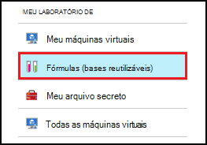
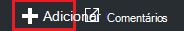
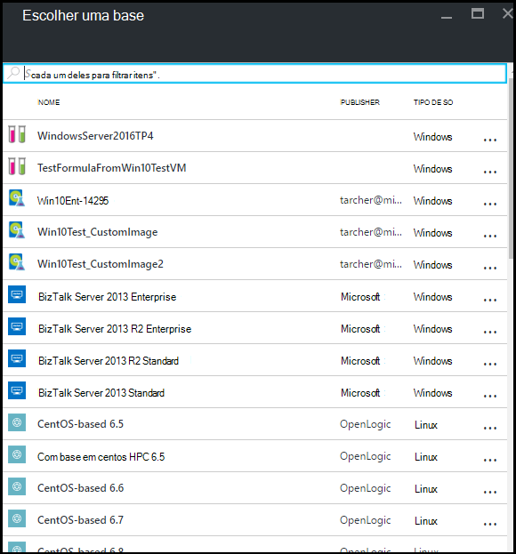
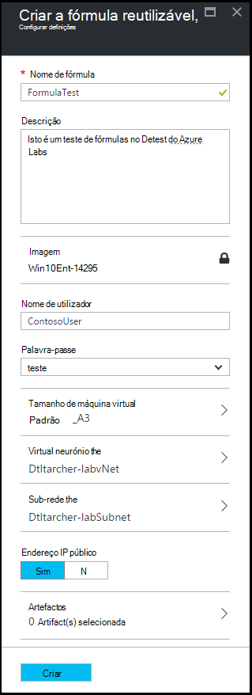
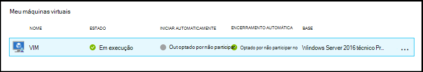
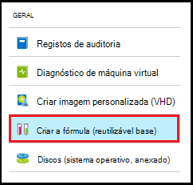
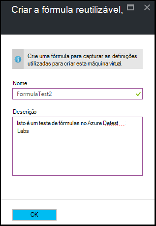
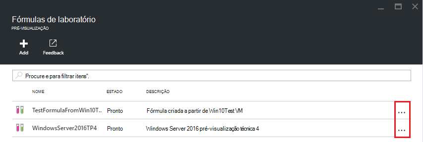
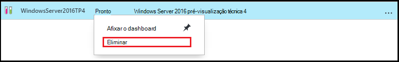

<properties
    pageTitle="Gerir as fórmulas em Azure DevTest laboratório para criar VMs | Microsoft Azure"
    description="Saiba como criar, atualizar e remova Azure DevTest Labs fórmulas e utilizá-los para criar novos VMs."
    services="devtest-lab,virtual-machines"
    documentationCenter="na"
    authors="tomarcher"
    manager="douge"
    editor=""/>

<tags
    ms.service="devtest-lab"
    ms.workload="na"
    ms.tgt_pltfrm="na"
    ms.devlang="na"
    ms.topic="article"
    ms.date="08/30/2016"
    ms.author="tarcher"/>

# Gerir fórmulas DevTest Labs para criar VMs

Uma fórmula em Azure DevTest laboratório é uma lista de valores de propriedade predefinidos utilizados para criar uma máquina de virtual (VM). Ao criar uma VM a partir de uma fórmula, os valores predefinidos podem ser utilizados como-for ou modificado. Como [imagens personalizadas](./devtest-lab-create-template.md) e [imagens de Marketplace](./devtest-lab-configure-marketplace-images.md), fórmulas fornecem um mecanismo para aprovisionar de VM rápida.  

Este artigo vai aprender a efetuar as seguintes tarefas:

- [Criar uma fórmula](#create-a-formula)
- [Utilizar uma fórmula para Aprovisionar uma VM](#use-a-formula-to-provision-a-vm)
- [Modificar uma fórmula](#modify-a-formula)
- [Eliminar uma fórmula](#delete-a-formula)

> [AZURE.NOTE] Fórmulas - como [imagens personalizadas](./devtest-lab-create-template.md) - permitem-lhe criar uma imagem base a partir de um ficheiro VHD. Imagem de base, em seguida, pode ser utilizada para Aprovisionar uma nova VM. Para ajudar a decidir qual é ideal para o seu ambiente específico, consulte o artigo, [imagens personalizadas comparar e fórmulas em DevTest laboratório](./devtest-lab-comparing-vm-base-image-types.md).

## Criar uma fórmula
Qualquer pessoa com permissões de DevTest Labs *utilizadores* é possível criar VMs utilizando uma fórmula como uma base. Existem duas formas de criar fórmulas: 

- A partir de uma base - utilize quando pretende definir todas as características da fórmula.
- A partir de um existente laboratório de VM - utilizar quando pretender criar uma fórmula com base nas definições de uma VM existente.

### Criar uma fórmula a partir de uma base
Os passos seguintes orientá-lo durante o processo de criar uma fórmula a partir de uma imagem personalizada, Marketplace uma imagem ou outra fórmula.

1. Inicie sessão no [portal do Azure](http://go.microsoft.com/fwlink/p/?LinkID=525040).

1. Selecione **Mais serviços**e, em seguida, selecione **DevTest Labs** a partir da lista.

1. Na lista de labs, selecione o laboratório desejado.  

1. No pá o laboratório, selecione **fórmulas (bases reutilizáveis)**.

    

1. No pá **fórmulas laboratório** , selecione **+ Adicionar**.

    

1. No pá **Escolher uma base** , selecione a base (imagem personalizada, Marketplace uma imagem ou fórmula) a partir do qual pretende criar a fórmula.

    

1. No pá **Criar fórmula** , especifique os seguintes valores:

    - **Nome fórmula** - introduza um nome para a sua fórmula. Quando cria uma VM este valor será apresentado na lista de imagens de base. O nome é validado à medida que escrevê-lo e, se não é válido, uma mensagem irá indicar os requisitos para um nome válido.
    - **Descrição** - introduza uma descrição relevante para a sua fórmula. Este valor está disponível a partir do menu de contexto a fórmula quando cria uma VM.
    - **Nome de utilizador** - introduza um nome de utilizador que será concedido privilégios de administrador.
    - **Palavra-passe** - introduza - ou selecione na lista pendente - um valor que está associado a palavra-passe (palavra-passe) que pretende utilizar para o utilizador especificado.  
    - **Imagem** - este campo apresenta o nome da imagem base que selecionou na pá anterior. 
    - **Tamanho de Máquina Virtual** - Selecione uma das itens predefinidos que especifique os tarolos processador, tamanho de RAM e o tamanho de unidade de disco rígido da VM para criar.
    - **Rede Virtual** - especificar a rede virtual pretendida.
    - **Sub-rede** - especificar a sub-rede pretendida.
    - **Endereço IP público** - se a política de laboratório estiver definida para permitir que os endereços IP públicos para sub-rede seleccionada, especifique se pretende que o endereço IP seja público selecionando **Sim** ou **não**. Caso contrário, esta opção está desativada e seleccionada como **não**.
    - **Artefactos** - seleccionar e configurar erros ao qual pretende adicionar à imagem base. Seguro cadeia de valores não são guardados com a fórmula. Por conseguinte, não são apresentados parâmetros artefacto que são cadeias seguras. 

        

1. Selecione **Criar** para criar a fórmula.

### Criar uma fórmula a partir de uma VM
Os passos seguintes orientá-lo durante o processo de criação de uma fórmula com base numa VM existente. 

> [AZURE.NOTE] Para criar uma fórmula a partir de uma VM, a VM tem de ter sido criada após 30 de Março de 2016. 

1. Inicie sessão no [portal do Azure](http://go.microsoft.com/fwlink/p/?LinkID=525040).

1. Selecione **Mais serviços**e, em seguida, selecione **DevTest Labs** a partir da lista.

1. Na lista de labs, selecione o laboratório desejado.  

1. No pá de **Descrição geral** do laboratório, selecione a VM a partir do qual pretende criar a fórmula.

    

1. No pá a VM, selecione **criar a fórmula (reutilizável base)**.

    

1. No pá **Criar fórmula** , introduza um **nome** e uma **Descrição** para a sua nova fórmula.

    

1. Selecione **OK** para criar a fórmula.

## Utilizar uma fórmula para Aprovisionar uma VM
Depois de criar uma fórmula, pode criar uma VM com base nessa fórmula. A secção [Adicionar uma VM com artefactos](devtest-lab-add-vm-with-artifacts.md#add-a-vm-with-artifacts) orienta-o processo.

## Modificar uma fórmula
Para modificar uma fórmula, siga estes passos:

1. Inicie sessão no [portal do Azure](http://go.microsoft.com/fwlink/p/?LinkID=525040).

1. Selecione **Mais serviços**e, em seguida, selecione **DevTest Labs** a partir da lista.

1. Na lista de labs, selecione o laboratório desejado.  

1. No pá o laboratório, selecione **fórmulas (bases reutilizáveis)**.

    

1. No pá **fórmulas laboratório** , selecione a fórmula que pretende modificar.

1. No pá **Actualizar fórmula** , efetue as edições pretendidas e selecione **Atualizar**.

## Eliminar uma fórmula 
Para eliminar uma fórmula, siga estes passos:

1. Inicie sessão no [portal do Azure](http://go.microsoft.com/fwlink/p/?LinkID=525040).

1. Selecione **Mais serviços**e, em seguida, selecione **DevTest Labs** a partir da lista.

1. Na lista de labs, selecione o laboratório desejado.  

1. No pá de **Definições** laboratório, selecione **as fórmulas**.

    

1. No pá **fórmulas laboratório** , selecione as reticências para a direita da fórmula que pretende eliminar.

    

1. No menu de contexto a fórmula, selecione **Eliminar**.

    

1. Selecione **Sim** para a caixa de diálogo de confirmação de eliminação.

[AZURE.INCLUDE [devtest-lab-try-it-out](../../includes/devtest-lab-try-it-out.md)]

## Mensagens no blogue relacionados

- [Imagens personalizadas ou fórmulas?](https://blogs.msdn.microsoft.com/devtestlab/2016/04/06/custom-images-or-formulas/)

## Próximos passos
Depois de ter criado uma fórmula para utilizar ao criar uma VM, o passo seguinte é para [Adicionar uma VM para o laboratório](./devtest-lab-add-vm-with-artifacts.md).