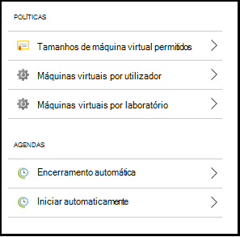
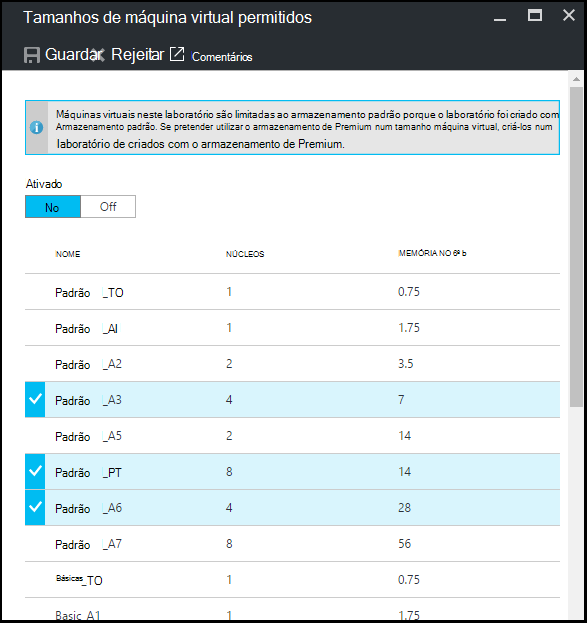
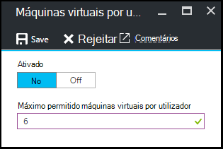
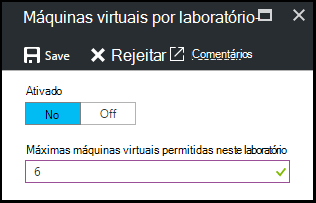
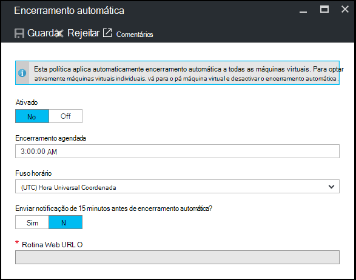
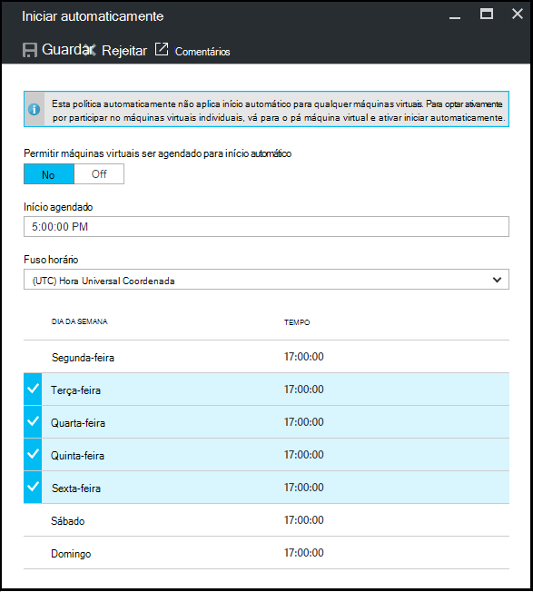

<properties
    pageTitle="Definir políticas de laboratório em Azure DevTest laboratório | Microsoft Azure"
    description="Saiba como definir políticas de laboratório como tamanhos VM, máximos VMs por utilizador e automatização encerramento."
    services="devtest-lab,virtual-machines"
    documentationCenter="na"
    authors="tomarcher"
    manager="douge"
    editor=""/>

<tags
    ms.service="devtest-lab"
    ms.workload="na"
    ms.tgt_pltfrm="na"
    ms.devlang="na"
    ms.topic="article"
    ms.date="09/12/2016"
    ms.author="tarcher"/>

# Definir políticas de laboratório em laboratório de DevTest do Azure

> [AZURE.VIDEO how-to-set-vm-policies-in-a-devtest-lab]

Azure DevTest Labs permite-lhe especificar políticas de chave que ajudá-lo para controlar o custo e minimizar resíduos em seu laboratório. Estas políticas laboratório incluem o número máximo de VMs criados por utilizador e por laboratório e várias opções encerramento automática e início automático. 

## Aceder a políticas de um laboratório em laboratório de DevTest do Azure

Os passos seguintes orientá-lo através da configuração políticas para um laboratório em Azure DevTest laboratório:

Para ver (e alterar) as políticas para um laboratório de, siga estes passos:

1. Inicie sessão no [portal do Azure](http://go.microsoft.com/fwlink/p/?LinkID=525040).

1. Selecione **mais serviços**e, em seguida, selecione **DevTest Labs** a partir da lista.

1. Na lista de labs, selecione o laboratório desejado.   

1. Selecione **as definições de política**.

1. A **definições de política** pá contém um menu de definições que pode especificar: 

    

    Para saber mais sobre como definir uma política, selecione-a partir da lista seguinte:

    - [Tamanhos de máquina virtual permitidos](#set-allowed-virtual-machine-sizes) , selecione a lista de tamanhos VM permitida no laboratório. Um utilizador pode criar VMs apenas a partir desta lista.

    - [Máquinas virtuais por utilizador](#set-virtual-machines-per-user) - especificar o número máximo de VMs que podem ser criados por um utilizador. 

    - [Máquinas virtuais por laboratório](#set-virtual-machines-per-lab) - especificar o número máximo de VMs que podem ser criadas para um laboratório de. 

    - [Automática encerramento](#set-auto-shutdown) - especificar o tempo quando o laboratório atual do VMs encerrados automaticamente.

    - [Iniciar automaticamente](#set-auto-start) - especificar o tempo quando VMs o laboratório atual iniciar automaticamente o para cima.

## Conjunto permitido tamanhos de máquina virtual

Ajuda a política para definir os tamanhos VM permitidos para minimizar o laboratório resíduos, permitindo-lhe especificar quais tamanhos VM são permitidos em laboratório. Se esta política estiver ativada, tamanhos de VM apenas a partir desta lista podem ser utilizados para criar VMs.

1. No pá do ambiente de teste **as definições de política** , selecione **permitidos máquinas virtuais tamanhos**.

    
 
1. Selecione **** para esta política de ativar e **desativar** para desativá-lo.

1. Se ativar esta política, selecione um ou mais tamanhos VM que podem ser criados no seu laboratório.

1. Selecione **Guardar**.

## Conjunto virtual máquinas por utilizador

A política para **máquinas virtuais por utilizador** permite-lhe especificar o número máximo de VMs que podem ser criados por um utilizador individual. Se um utilizador tenta criar uma VM quando o limite de utilizador tenha sido respeitado, uma mensagem de erro indica que a VM não pode ser criada. 

1. No pá do ambiente de teste **as definições de política** , selecione **máquinas virtuais por utilizador**.

    

1. Selecione **** para esta política de ativar e **desativar** para desativá-lo.

1. Se ativar esta política, introduza um valor numérico que indica o número máximo de VMs que podem ser criados por um utilizador. Se introduzir um número que não é válido, a IU apresenta o número máximo permitido para este campo.

1. Selecione **Guardar**.

## Conjunto virtual máquinas por laboratório

A política para **máquinas virtuais por laboratório** permite-lhe especificar o número máximo de VMs que podem ser criados para o laboratório atual. Se um utilizador tenta criar uma VM quando o limite de laboratório foi satisfeito, uma mensagem de erro indica que a VM não pode ser criada. 

1. No pá do ambiente de teste **as definições de política** , selecione **máquinas virtuais por laboratório**.

    

1. Selecione **** para esta política de ativar e **desativar** para desativá-lo.

1. Se ativar esta política, introduza um valor numérico que indica o número máximo de VMs que podem ser criados para o laboratório atual. Se introduzir um número que não é válido, a IU apresenta o número máximo permitido para este campo.

1. Selecione **Guardar**.

## Conjunto automática-encerramento

A política automática encerramento ajuda para minimizar o laboratório resíduos, permitindo-lhe especificar o tempo que VMs este laboratório encerrar.

1. No pá do ambiente de teste **as definições de política** , selecione **encerramento automática**.

    

1. Selecione **** para esta política de ativar e **desativar** para desativá-lo.

1. Se ativar esta política, especifique a hora local para encerrar todos os VMs no laboratório atual.

1. Selecione **Guardar**.

1. Por predefinição, uma vez activada, esta política aplica-se para todos os VMs no laboratório atual. Para remover esta definição de uma VM específica, abra pá a VM e altere a definição de **encerramento automática** 

## Início do conjunto automático

A política de início automático permite-lhe especificar quando devem ser iniciados VMs no laboratório atual.  

1. No pá do ambiente de teste **as definições de política** , selecione **Iniciar automaticamente**.

    

1. Selecione **** para esta política de ativar e **desativar** para desativá-lo.

1. Se ativar esta política, especificar o local agendado hora de início e os dias da semana para os quais se aplica a hora. 

1. Selecione **Guardar**.

1. Quando ativada, esta política não é aplicada automaticamente para qualquer VMs no laboratório atual. Para aplicar esta definição para uma VM específica, abra pá a VM e alterar a definição de **Iniciar automaticamente** 

[AZURE.INCLUDE [devtest-lab-try-it-out](../../includes/devtest-lab-try-it-out.md)]

## Próximos passos

Assim que definidos e aplicar as definições de política VM vários para o laboratório, eis algumas coisas para experimentar o seguinte:

- [Configurar gestão de custo](./devtest-lab-configure-cost-management.md) - ilustra como utilizar o gráfico de **Tendências de custo estimada mensal**  
para visualizar o mês atual do estimada custo até à data e o custo previsto do fim do mês.
- [Criar imagem personalizada](./devtest-lab-create-template.md) - quando cria uma VM, especificar uma base, que pode ser uma imagem personalizada ou uma imagem Marketplace. Este artigo ilustra como criar uma imagem personalizada a partir de um ficheiro VHD.
- [Configurar Marketplace imagens](./devtest-lab-configure-marketplace-images.md) - Azure DevTest Labs suporta a criação de VMs com base em imagens Azure Marketplace. Este artigo explica como especificar que, se existirem, imagens do Azure Marketplace podem ser utilizadas quando criar VMs num laboratório de.
- [Criar uma VM num laboratório de](./devtest-lab-add-vm-with-artifacts.md) - ilustra como criar uma VM a partir de uma imagem base (quer personalizada ou mercado de aplicações) e como trabalhar com artefactos na sua VM.
