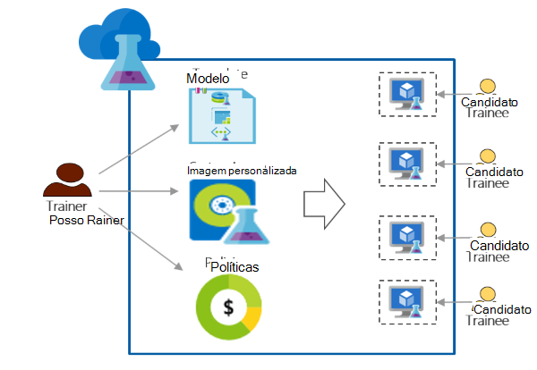

<properties
    pageTitle="Utilizar o Azure DevTest Labs de cursos de formação | Microsoft Azure"
    description="Saiba como utilizar o Azure DevTest Labs para cenários de formação."
    services="devtest-lab,virtual-machines"
    documentationCenter="na"
    authors="steved0x"
    manager="douge"
    editor=""/>

<tags
    ms.service="devtest-lab"
    ms.workload="na"
    ms.tgt_pltfrm="na"
    ms.devlang="na"
    ms.topic="article"
    ms.date="09/12/2016"
    ms.author="sdanie"/>

# Utilizar o Azure DevTest Labs de cursos de formação

Azure DevTest Labs podem ser utilizados para implementar muitos alguns dos cenários principais para além de Dev Center/testar. Uma desses cenários é configurar um laboratório de cursos de formação. Azure DevTest Labs permite-lhe criar um laboratório onde pode fornecer modelos personalizados que cada candidato pode utilizar para criar ambientes idênticos e isoladas de cursos de formação. Pode garantir que os ambientes de formação só estão disponíveis para cada candidato quando que necessitam-los e contêm suficiente recursos - como máquinas virtuais - necessários para o formação. Por fim, pode partilhar facilmente o laboratório com pessoas em formação, que podem obter acesso de um só clique.   

Azure DevTest Labs cumpre os seguintes requisitos necessários para realizar formação em qualquer ambiente virtual: 

-   Pessoas em formação não consigo ver VMs criadas por outras pessoas em formação
-   Cada máquina de formação deve ser idêntica
-   Pessoas em formação rapidamente podem aprovisionar o seus ambientes de formação
-   Controlo de custos, certificando-se que pessoas em formação não é possível obter VMs mais do que precisam de formação e também encerramento VMs quando não estão a utilizá-los
-   Partilhar facilmente o laboratório de formação com cada candidato
-   Reutilizar repetidamente o laboratório de formação

Neste artigo, saiba várias funcionalidades Azure DevTest Labs que podem ser utilizadas para cumprir os requisitos de formação descrito anteriormente e obter passos detalhados que pode seguir para configurar um laboratório de cursos de formação.  

## Formação execução com Azure DevTest Labs

1. **Criar o laboratório** 

    Labs são o ponto de partida em Azure DevTest laboratório. Depois de criar um laboratório, pode efetuar tarefas tal como adicionar utilizadores (pessoas em formação) para o laboratório definido políticas para controlar os custos, definir imagens VM que podem criar rapidamente e muito mais.   

    Saiba mais ao clicar nas hiperligações na seguinte tabela:

  	| Tarefa                                                            | O que aprendeu                                                    |
|-----------------------------------------------------------------|----------------------------------------------------------------------|
| [Criar um laboratório em laboratório de DevTest do Azure](devtest-lab-create-lab.md) | Saiba como criar um laboratório em Azure DevTest laboratório no portal do Azure. |

2. **Criar VMs formação em minutos utilizar imagens prontas a utilizar marketplace e imagens personalizadas** 
    
    Pode escolher imagens prontas a utilizar a partir de uma grande variedade de imagens no Azure Marketplace e disponibilizá-los para as pessoas em formação no laboratório. Se as imagens prontas a utilizar não corresponderem às suas necessidades, pode criar uma imagem personalizada através da criação de um laboratório VM utilizando uma imagem prontos a utilizar a partir do Azure Marketplace, instalar o software que precisa para a formação e para guardar a VM como uma imagem personalizada no laboratório. 

    Saiba mais ao clicar nas hiperligações na seguinte tabela:

  	| Tarefa                                                                              | O que aprendeu                                                                                                                                  |
|-----------------------------------------------------------------------------------|-------------------------------------------------------------------------------------------------------------------------------------------------|
| [Configurar imagens Azure Marketplace](devtest-lab-configure-marketplace-images.md) | Saiba como pode inserir imagens do Azure Marketplace lista branca; tornar disponível para seleção apenas as imagens que pretende para a formação.                 |
| [Criar uma imagem personalizada](devtest-lab-create-template.md)                           | Crie uma imagem personalizada pela previamente instalar o software que necessário para o formação para que as pessoas em formação podem criar rapidamente uma VM utilizando uma imagem personalizada. |

3. **Criar modelos reutilizáveis para máquinas de formação** 

    Uma fórmula em Azure DevTest laboratório é uma lista de valores de propriedade predefinidos utilizados para criar uma VM. Pode criar uma fórmula no laboratório ao selecionar uma imagem, um tamanho da memória virtual (uma combinação de RAM e CPU) e uma rede virtual. Cada candidato pode ver a fórmula no laboratório e utilizá-la para criar uma VM. 

    Saiba mais ao clicar nas hiperligações na seguinte tabela:

  	| Tarefa                                                                         | O que aprendeu                                                                                                          |
|------------------------------------------------------------------------------|-------------------------------------------------------------------------------------------------------------------------|
| [Gerir fórmulas DevTest Labs para criar VMs](devtest-lab-manage-formulas.md) | Saiba como pode criar uma fórmula ao selecionar o uma imagem, o tamanho da memória virtual (combinação de RAM e CPU) e uma rede virtual. |

4. **Controlo de custos**

    Azure DevTest Labs permite-lhe definir uma política do laboratório para especificar o número máximo de VMs que podem ser criados por um candidato no laboratório. 

    Se estiver a realizar formação de vários dia e pretende parar de todos os as VMs num momento específico do dia e, em seguida, reiniciar automaticamente-los no dia seguinte, pode facilmente realizar que definindo encerramento automática e início automático políticas no laboratório. 

    Por fim, quando estiver concluída formação pode eliminar todos os as VMs ao mesmo tempo ao executar um script PowerShell único. 

    Saiba mais ao clicar nas hiperligações na seguinte tabela:

  	| Tarefa                                                                                                                                    | O que aprendeu                                                      |
|-----------------------------------------------------------------------------------------------------------------------------------------|---------------------------------------------------------------------|
| [Definir políticas de laboratório](devtest-lab-set-lab-policy.md)                                                                                    | Controlar os custos ao definir políticas no laboratório.                       |
| [Eliminar todos os laboratório VMs utilizando um script PowerShell](devtest-lab-faq.md#how-can-i-automate-the-process-of-deleting-all-the-vms-in-my-lab) | Elimine todos os labs numa operação quando o formação estiver concluído. |

5. **Partilhar o laboratório com cada candidato**

    Labs podem ser acedidos de diretamente a utilizar uma ligação que partilha com as pessoas em formação. As pessoas em formação ainda não tem de ter uma conta Azure, desde que tenham uma [conta Microsoft](devtest-lab-faq.md#what-is-a-microsoft-account). Pessoas em formação não consigo ver VMs criadas por outras pessoas em formação.  

    Saiba mais ao clicar nas hiperligações na seguinte tabela:

  	| Tarefa                                                                                                                                | O que aprendeu                                                   |
|-------------------------------------------------------------------------------------------------------------------------------------|------------------------------------------------------------------|
| [Adicionar um candidato a um laboratório em laboratório de DevTest do Azure](devtest-lab-add-devtest-user.md)                                                     | Utilize o portal do Azure para adicionar pessoas em formação para o laboratório de formação.       |
| [Adicionar pessoas em formação para o laboratório utilizando um script PowerShell](devtest-lab-add-devtest-user.md#add-an-external-user-to-a-lab-using-powershell) | Utilizar o PowerShell para automatizar a adicionar pessoas em formação para o laboratório de formação. |
| [Obter uma ligação para o laboratório](devtest-lab-faq.md#how-do-i-share-a-direct-link-to-my-lab)                                                  | Saiba como um laboratório pode ser diretamente acedido através de uma hiperligação.        |

6. **Reutilizar repetidamente o laboratório** 

    Pode automatizar a criação de laboratório, incluindo as definições personalizadas, através da criação de um modelo de Gestor de recursos e utilizá-lo para criar labs idênticos repetidamente. 

    Saiba mais ao clicar nas hiperligações na seguinte tabela:

  	| Tarefa                                                                                                                               | O que aprendeu                                                      |
|------------------------------------------------------------------------------------------------------------------------------------|---------------------------------------------------------------------|
| [Criar um laboratório de através de um modelo de Gestor de recursos](devtest-lab-faq.md#how-do-i-create-a-lab-from-an-azure-resource-manager-template) | Crie labs em Azure DevTest laboratório utilizar modelos de Gestor de recursos. |

[AZURE.INCLUDE [devtest-lab-try-it-out](../../includes/devtest-lab-try-it-out.md)]  

