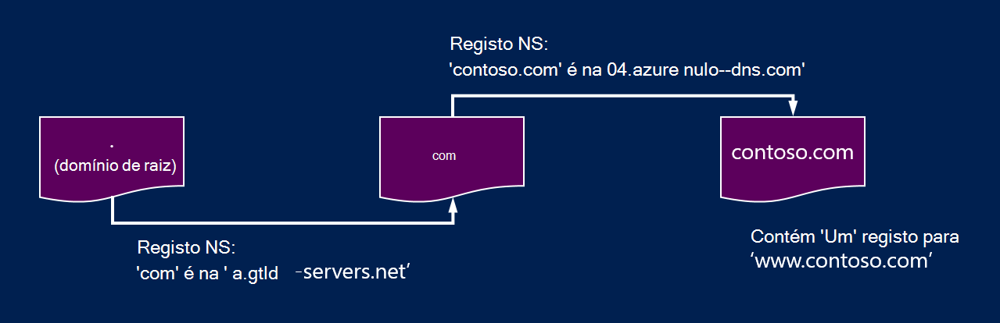
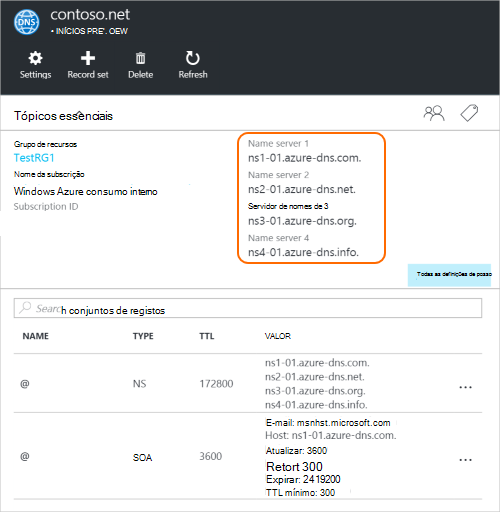

<properties
   pageTitle="Delegar o seu domínio ao Azure DNS | Microsoft Azure"
   description="Compreenda como alterar a delegação de domínio e utilizar os servidores de nomes Azure DNS para fornecer o alojamento do domínio."
   services="dns"
   documentationCenter="na"
   authors="sdwheeler"
   manager="carmonm"
   editor=""/>

<tags
   ms.service="dns"
   ms.devlang="na"
   ms.topic="get-started-article"
   ms.tgt_pltfrm="na"
   ms.workload="infrastructure-services"
   ms.date="06/30/2016"
   ms.author="sewhee"/>

# Delegar um domínio ao Azure DNS

Azure DNS permite-lhe alojar uma zona de DNS e gerir os registos DNS para um domínio no Azure. Ordem consultas de DNS para um domínio alcançar Azure DNS, o domínio tem de ser delegado ao Azure DNS do domínio principal. Tenha em atenção Azure DNS não está a entidade de registo de domínio. Este artigo explica como funciona a delegação de domínio e como delegado domínios para o Azure DNS.

## Como funciona a delegação de DNS

### Domínios e zonas

O sistema de nomes de domínio é uma hierarquia de domínios. A hierarquia começa a partir do domínio 'raiz', cujo nome é simplesmente**.**.  Por baixo desta vir domínios de nível superior, tal como 'com», «líquido», «organograma», 'uk' ou 'jp'.  Abaixo estes são os domínios de segundo nível, tais como 'org.uk' ou 'co.jp'.  E assim sucessivamente. Os domínios na hierarquia de DNS estão alojados utilizar zonas DNS em separado. Estas zonas globalmente são distribuídas, alojado pelos servidores de nomes DNS em todo o mundo.

**Zona de DNS**

Um domínio é um nome exclusivo no sistema de nome de domínio, por exemplo, 'contoso.com'. Uma zona de DNS é utilizada para os registos DNS para um domínio específico do anfitrião. Por exemplo, o domínio 'contoso.com' poderá conter um número de registos DNS como mail.contoso.com (para um servidor de correio) e www.contoso.com (para um Web site).

**Entidade de registo**

Uma entidade de registo é uma empresa quem pode fornecer nomes de domínio da Internet. Estes vai verificar se o domínio da Internet que pretende utilizar está disponível e permite-lhe comprá-lo. Uma vez que o nome de domínio está registado, será o proprietário legal para o nome de domínio. Se já tiver um domínio da Internet, irá utilizar a entidade de registo atual ao delegado ao Azure DNS.

>[AZURE.NOTE] Para saber mais informações sobre quem é o proprietário um nome de domínio determinado ou para obter informações sobre como comprar um domínio, consulte [Gestão de domínios de Internet no Azure AD](https://msdn.microsoft.com/library/azure/hh969248.aspx).

### Resolução e delegação

Existem dois tipos de servidores DNS:

- Um servidor DNS _autoritativo_ aloja zonas de DNS. Consultas de DNS-respostas para registos apenas nessas zonas.
- Um servidor de DNS _recursiva_ não anfitrião de DNS zones. -Responde a todas as consultas DNS ao contactar o suporte autoritativos servidores DNS para recolher dados necessita.

>[AZURE.NOTE] Azure DNS fornece um serviço DNS autoritativos.  Não fornece um serviço DNS recursiva.

> Serviços em nuvem e VMs no Azure automaticamente estão configurados para utilizar uma serviços DNS recursiva que é fornecida separadamente como parte de infraestrutura do Azure.  Para obter informações sobre como alterar estas definições de DNS, consulte o artigo [Resolução de nomes no Azure](../virtual-network/virtual-networks-name-resolution-for-vms-and-role-instances.md#name-resolution-using-your-own-dns-server).

Clientes DNS em PCs ou dispositivos móveis, normalmente, ligue para um servidor de DNS recursiva para efetuar quaisquer consultas DNS que precisam das aplicações de cliente.

Quando um servidor de DNS recursiva recebe uma consulta para um registo DNS como 'www.contoso.com', primeiro necessita localizar o servidor de nomes que aloja a zona para o domínio 'contoso.com'. Para fazer isto, começa em servidores de nomes de raiz e a partir desse local localiza os servidores de nomes que aloja a zona de 'com'. -Lo, em seguida, consultas os servidores de nomes para encontrar os servidores de nomes que aloja a zona de 'contoso.com' 'com'.  Por fim, é possível estes servidores de nomes para 'www.contoso.com' da consulta.

Esta opção é denominada resolução do nome DNS. Estritamente geral, resolução DNS inclui passos adicionais, tal como CNAMEs seguintes, mas que não é importante para compreender como funciona a delegação de DNS.

Como é que uma zona principal 'apontar' para os servidores de nomes para uma zona subordinada? Que faz isto utilizando um tipo especial de registo DNS chamado registo NS (bicicleta NS para servidor de nomes). Por exemplo, a zona de raiz contém os registos NS para 'com' e mostra os servidores de nomes para a zona de 'com'. Por sua vez, a zona de 'com' contém os registos NS para 'contoso.com', que mostra os servidores de nomes para a zona de 'contoso.com'. Configurar os registos NS de uma zona subordinada numa zona principal chama-se a delegar o domínio.

Cada delegação possui dois cópias dos registos NS; um na zona principal apontar para a criança e outro na zona subordinado própria. A zona de 'contoso.com' contém os registos NS do contoso.com (para além dos registos NS no 'com'). Estes são os chamados os registos NS autoritativos e estes sentar no vértice da zona subordinada.

## Delegação de um domínio ao Azure DNS

Depois de criar o seu DNS zone no Azure DNS, tem de configurar os registos NS na zona principal para tornar a origem autoritativas para resolução de nomes para o horário de Azure DNS. Para comprado a partir de uma entidade de registo de domínios, a sua entidade de registo oferecerá a opção para configurar estes registos NS.

>[AZURE.NOTE] Não possui proprietário de um domínio para poder criar uma zona DNS com esse nome de domínio no Azure DNS. No entanto, tem de ser proprietário do domínio para configurar a delegação Azure DNS com a entidade de registo.

Por exemplo, suponha que compra o domínio 'contoso.com' e cria uma zona com o nome 'contoso.com' no Azure DNS. Como o proprietário do domínio, a entidade de registo oferecerá a opção para configurar os endereços de servidor de nome (ou seja, os registos NS) para o seu domínio. A entidade de registo de poderá guardar estes registos NS do domínio principal, neste caso '.com'. Os clientes em todo o mundo, em seguida, serão direcionados para o seu domínio no Azure DNS zone quando tentar resolver registos DNS no 'contoso.com'.

### Localizar os nomes dos servidores de nome

Antes de pode delegar o horário DNS para o Azure DNS, tem primeiro de conhecer os nomes dos servidores de nome para o seu horário. Azure DNS atribui os servidores de nomes a partir de um conjunto de dados sempre que é criada uma zona.

A forma mais fácil para ver os servidores de nomes atribuídos ao seu horário é através do portal do Azure.  Neste exemplo, a zona 'contoso.net' foi atribuída os servidores de nomes ' por ns1-01.azure-dns.com', 'ns2-01.azure-dns .net', ' ns3-01.azure-dns.org', e ' ns4-01.azure-dns.info':

 

Azure DNS cria automaticamente os registos NS autoritativos no seu horário que contém os servidores de nomes atribuídas.  Para ver os nomes dos servidores de nome através do Azure PowerShell ou clip de Azure, basta tem obter estes registos.

Utilizar o Azure PowerShell, os registos NS autoritativos podem ser recuperados da seguinte forma. Tenha em atenção que o nome do registo “@” é utilizado para fazer referência a registos no vértice da zona.

    PS> $zone = Get-AzureRmDnsZone –Name contoso.net –ResourceGroupName MyResourceGroup
    PS> Get-AzureRmDnsRecordSet –Name “@” –RecordType NS –Zone $zone

    Name              : @
    ZoneName          : contoso.net
    ResourceGroupName : MyResourceGroup
    Ttl               : 3600
    Etag              : 5fe92e48-cc76-4912-a78c-7652d362ca18
    RecordType        : NS
    Records           : {ns1-01.azure-dns.com, ns2-01.azure-dns.net, ns3-01.azure-dns.org,
                        ns4-01.azure-dns.info}
    Tags              : {}

Também pode utilizar o clip de Azure em diferentes plataformas para obter os registos NS autoritativos e, por conseguinte, a descobrir os servidores de nomes atribuídos ao seu horário:

    C:\> azure network dns record-set show MyResourceGroup contoso.net @ NS
    info:    Executing command network dns record-set show
        + Looking up the DNS Record Set "@" of type "NS"
    data:    Id                              : /subscriptions/.../resourceGroups/MyResourceGroup/providers/Microsoft.Network/dnszones/contoso.net/NS/@
    data:    Name                            : @
    data:    Type                            : Microsoft.Network/dnszones/NS
    data:    Location                        : global
    data:    TTL                             : 172800
    data:    NS records
    data:        Name server domain name     : ns1-01.azure-dns.com.
    data:        Name server domain name     : ns2-01.azure-dns.net.
    data:        Name server domain name     : ns3-01.azure-dns.org.
    data:        Name server domain name     : ns4-01.azure-dns.info.
    data:
    info:    network dns record-set show command OK

### Para configurar a delegação

Cada entidade de registo tem os seus próprios ferramentas de gestão de DNS para alterar os registos do servidor de nome de um domínio. Na página de gestão de DNS da entidade de registo, edite os registos NS e substitua os registos NS aqueles que Azure DNS criado.

Quando delegar um domínio ao Azure DNS, tem de utilizar os nomes dos servidores de nome fornecidas pela Azure DNS.  Deve utilizar sempre todos os 4 nome nomes de servidor, independentemente do nome do seu domínio.  Delegação de domínio não requer o nome do servidor de nome para utilizar o mesmo domínio de nível superior como o seu domínio.

Não deve utilizar 'Colar registos' para apontarem para o DNS Azure do servidor de nomes endereços IP, uma vez que estes endereços IP podem ser alteradas no futuro. Delegações utilizando nomes de servidores de nome na sua própria zona, por vezes denominada 'relegado os servidores de nomes', não são atualmente suportadas no Azure DNS.

### Para verificar a resolução do nome está a funcionar

Depois de concluir a delegação, pode verificar se resolução do nome está a funcionar utilizando uma ferramenta como 'nslookup' para consultar o registo SOA do seu horário (que é criado automaticamente quando é criada a zona).

Note que não possui para especificar os servidores de nomes Azure DNS, uma vez que o processo de resolução DNS normal irá encontrar os servidores de nomes automaticamente se a delegação tiver sido configurada corretamente.

    nslookup –type=SOA contoso.com

    Server: ns1-04.azure-dns.com
    Address: 208.76.47.4

    contoso.com
    primary name server = ns1-04.azure-dns.com
    responsible mail addr = msnhst.microsoft.com
    serial = 1
    refresh = 900 (15 mins)
    retry = 300 (5 mins)
    expire = 604800 (7 days)
    default TTL = 300 (5 mins)

## Delegar subdomínios no Azure DNS

Se quiser configurar uma zona subordinada em separado, pode delegar a um domínio subpastas no Azure DNS. Por exemplo, tendo configurar e delegada 'contoso.com' no Azure DNS, imaginemos que pretende configurar uma zona de subordinada separada, 'partners.contoso.com'.

Como configurar um sub-domínio segue um processo semelhante a como uma delegação normal. A única diferença é que no passo 3 que os registos NS tem de ser criados na zona principal contoso.com no Azure DNS, em vez de configurar através de uma entidade de registo de domínio.

1. Crie a zona de subordinada 'partners.contoso.com' no Azure DNS.
2. Procure os registos NS autoritativos na zona subordinado para obter os servidores de nomes que aloja a zona subordinada no Azure DNS.
3. Delegar a zona subordinada ao configurar os registos NS na zona principal apontar para a zona subordinada.

### Delegar um subdomínio

O exemplo seguinte do PowerShell demonstra como isto funciona. Os mesmos passos podem ser executados através do Portal do Azure, ou o clip de Azure em diferentes plataformas.

#### Passo 1. Criar o domínio principal e subordinado zonas

Em primeiro lugar, criamos principais e subordinados zonas. Estes podem ser no mesmo grupo de recursos ou diferentes grupos de recursos.

    $parent = New-AzureRmDnsZone -Name contoso.com -ResourceGroupName RG1
    $child = New-AzureRmDnsZone -Name partners.contoso.com -ResourceGroupName RG1

#### Passo 2. Registos NS recuperar

Em seguida, vamos obter os registos NS autoritativos de zona subordinada, conforme mostrado no seguinte exemplo.  Este contém os servidores de nomes atribuídos à zona de subordinados.

    $child_ns_recordset = Get-AzureRmDnsRecordSet -Zone $child -Name "@" -RecordType NS

#### Passo 3. Delegar a zona subordinada

Registo NS correspondente definido na zona principal para concluir a delegação de criar. Tenha em atenção que o nome do conjunto de registos na zona principal corresponde ao nome de zona subordinado, neste caso "parceiros de".

    $parent_ns_recordset = New-AzureRmDnsRecordSet -Zone $parent -Name "partners" -RecordType NS -Ttl 3600
    $parent_ns_recordset.Records = $child_ns_recordset.Records
    Set-AzureRmDnsRecordSet -RecordSet $parent_ns_recordset

### Para verificar a resolução do nome está a funcionar

Pode verificar que tudo está configurado corretamente ao procurar o registo SOA da zona subordinada.

    nslookup –type=SOA partners.contoso.com

    Server: ns1-08.azure-dns.com
    Address: 208.76.47.8

    partners.contoso.com
        primary name server = ns1-08.azure-dns.com
        responsible mail addr = msnhst.microsoft.com
        serial = 1
        refresh = 900 (15 mins)
        retry = 300 (5 mins)
        expire = 604800 (7 days)
        default TTL = 300 (5 mins)

## Próximos passos

[Gerir zonas de DNS](dns-operations-dnszones.md)

[Gerir os registos DNS](dns-operations-recordsets.md)

