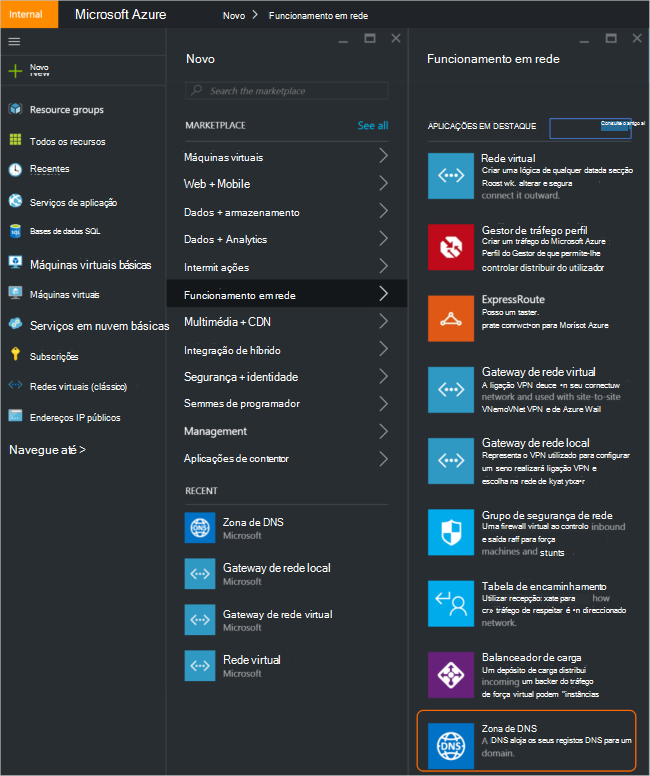
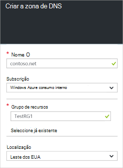
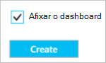
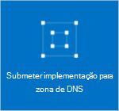
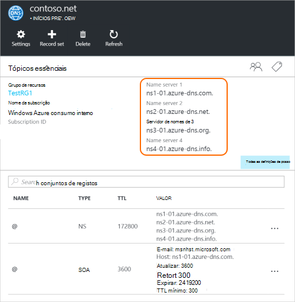
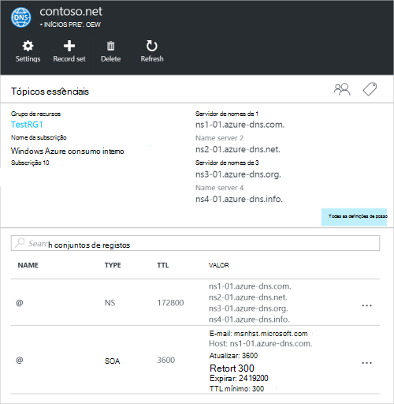

<properties
   pageTitle="Como criar e gerir uma zona DNS no portal do Azure | Microsoft Azure"
   description="Saiba como criar zonas de DNS para o Azure DNS. Este é um guia passo a passo para criar e gerir a sua primeira DNS e iniciar o alojamento do seu domínio DNS através do portal Azure."
   services="dns"
   documentationCenter="na"
   authors="sdwheeler"
   manager="carmonm"
   editor=""
   tags="azure-resource-manager"/>

<tags
   ms.service="dns"
   ms.devlang="na"
   ms.topic="article"
   ms.tgt_pltfrm="na"
   ms.workload="infrastructure-services"
   ms.date="08/16/2016"
   ms.author="sewhee"/>

# Criar uma zona DNS no portal do Azure

> [AZURE.SELECTOR]
- [Portal do Azure](dns-getstarted-create-dnszone-portal.md)
- [PowerShell](dns-getstarted-create-dnszone.md)
- [Clip Azure](dns-getstarted-create-dnszone-cli.md)

Este artigo irá guiá-lo através dos passos para criar uma zona de DNS utilizando o portal do Azure. Também pode criar uma zona DNS utilizando o PowerShell ou clip.

[AZURE.INCLUDE [dns-create-zone-about](../../includes/dns-create-zone-about-include.md)]

### Acerca das etiquetas para Azure DNS

Etiquetas são uma lista de pares valor do nome e são utilizadas pelo Gestor de recursos do Azure para recursos de etiqueta para fins de agrupamento ou de faturaçãohttps. Para mais informações acerca das etiquetas, consulte o artigo [utilizar etiquetas para organizar os recursos do Azure](../resource-group-using-tags.md).

Pode adicionar etiquetas no portal do Azure utilizando o pá **Definições** para a sua zona DNS.

## Criar uma zona DNS

1. Inicie sessão portal do Azure

2. No menu do centro, clique em e clique em **Novo > rede >** e, em seguida, clique em **DNS zone** para abrir o pá de zona DNS.

    

3. No pá **DNS zone** , clique em **Criar** na parte inferior. Isto vai abrir pá a **zona de criar DNS** .

    

4. No pá **Criar DNS zone** , dê um nome a zona DNS. Por exemplo, *contoso.com*. Consulte o artigo [Sobre nomes de zona de DNS](#names) , na secção acima.

5. Em seguida, especifique o grupo de recursos que pretende utilizar. Pode criar um novo grupo de recursos ou selecione uma que já existe.

6. Na lista pendente de **localização** , especifique a localização do grupo de recursos. Note que esta definição refere-se para a localização do grupo de recursos, não a localização da zona de DNS. O recurso de zona DNS real é automaticamente "global" e não algo que pode (ou precisa de) especificar no portal.

7. Pode deixar a caixa de verificação **Afixar ao dashboard** seleccionada se pretender localizar facilmente a sua nova zona no seu dashboard. Em seguida, clique em **Criar**.

    

8. Depois de clicar em criar, verá o horário de novo a ser configurado no dashboard.

    

9. Quando o novo horário ter sido criado, pá para sua nova zona será aberto no dashboard.

## Ver registos

Também cria uma zona DNS cria os registos seguintes:

- O registo de "Início do autoridade" (SOA). O SOA está presente na raiz da cada zona DNS.
- Os registos do servidor (NS) nome autoritativas. Mostram estas servidores de nomes que estiver a alojar a zona. Azure DNS utiliza um conjunto de servidores de nomes e os servidores de nomes tão diferentes podem ter sido eleito para diferentes zonas no Azure DNS. Para mais informações, consulte [delegado um domínio ao Azure DNS](dns-domain-delegation.md) .

Pode ver os registos a partir do portal do Azure

1. A partir do seu pá **DNS zone** , clique em **todas as definições** para abrir a **pá definições** da zona de DNS.

    

2. Na parte inferior do painel de Essentials, pode ver que o registo define da zona de DNS.

    

## Teste

Pode testar o seu DNS zone utilizando ferramentas DNS como nslookup, escavar ou o [cmdlet do PowerShell NomeDNS resolver](https://technet.microsoft.com/library/jj590781.aspx).

Se ainda não ainda delegada o domínio ao utilizar a nova zona no Azure DNS, terá de direcionar a consulta DNS diretamente para um dos servidores de nomes para o seu horário. Os servidores de nomes para o seu horário são dadas nos registos NS, tal como listada pelo `Get-AzureRmDnsRecordSet` acima. Certifique-se a SUBST os valores corretos para o seu horário para o comando abaixo.

    nslookup
    > set type=SOA
    > server ns1-01.azure-dns.com
    > contoso.com

    Server: ns1-01.azure-dns.com
    Address:  208.76.47.1

    contoso.com
            primary name server = ns1-01.azure-dns.com
            responsible mail addr = msnhst.microsoft.com
            serial  = 1
            refresh = 900 (15 mins)
            retry   = 300 (5 mins)
            expire  = 604800 (7 days)
            default TTL = 300 (5 mins)

## Eliminar uma zona DNS

Pode eliminar a zona de DNS diretamente a partir do portal. Antes de eliminar uma zona DNS no Azure DNS, terá de eliminar todos os conjuntos de registos, exceto os registos NS e SOA na raiz da zona que foram criados automaticamente quando a zona foi criada.

1. Localize o pá de **zona de DNS** para o horário que pretende eliminar e, em seguida, clique em **Eliminar** no topo da pá.

2. Será apresentada uma mensagem, permitindo-lhe saber que tem de eliminar todos os conjuntos de registos, exceto os registos NS e SOA que foram criados automaticamente. Se tiver eliminado conjuntos de registos, clique em **Sim**. Tenha em atenção que, ao eliminar uma zona de DNS a partir do portal, o grupo de recursos que está associada a zona de DNS não será eliminado.

## Próximos passos

Depois de criar uma zona de DNS, crie [registos e conjuntos de registo](dns-getstarted-create-recordset-portal.md) para iniciar a resolução de nomes do seu domínio da Internet.
