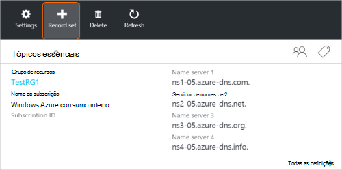
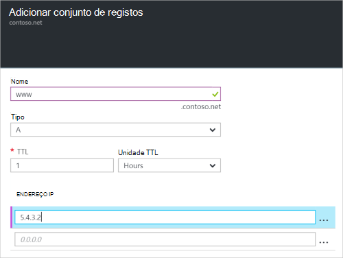

<properties
   pageTitle="Criar um conjunto de registos e registos de uma zona de DNS utilizando o portal do Azure | Microsoft Azure"
   description="Como criar registos do anfitrião de DNS do Azure e criar conjuntos de registos e registos através do portal Azure"
   services="dns"
   documentationCenter="na"
   authors="sdwheeler"
   manager="carmonm"
   editor=""
   tags="azure-resource-manager"/>

<tags
   ms.service="dns"
   ms.devlang="na"
   ms.topic="article"
   ms.tgt_pltfrm="na"
   ms.workload="infrastructure-services"
   ms.date="08/16/2016"
   ms.author="sewhee"/>

# Criar conjuntos de registos de DNS e registos utilizando o portal do Azure

> [AZURE.SELECTOR]
- [Portal do Azure](dns-getstarted-create-recordset-portal.md)
- [PowerShell](dns-getstarted-create-recordset.md)
- [Clip Azure](dns-getstarted-create-recordset-cli.md)

Este artigo explica o processo de criação de registos e conjuntos de registos, utilizando o portal do Azure. Depois de criar o seu DNS zone, adicione os registos DNS para o seu domínio. Para executar esta tarefa, tem primeiro compreender os registos DNS e conjuntos de registos.

[AZURE.INCLUDE [dns-about-records-include](../../includes/dns-about-records-include.md)]

## Criar um conjunto de registos e registo

O exemplo seguinte irá guiar pelo processo de criação de um conjunto de registos e registo utilizando o portal do Azure. Vamos utilizar o tipo de registo DNS "A".

1. Inicie sessão no portal.

2. Vá para o pá **DNS zone** , na qual pretende criar um conjunto de registos.

3. Na parte superior da pá a **zona de DNS** , selecione o **registo definido** para abrir o pá **Definir Add record** .

    

4. No pá **Definir adicionar registo** , nome do seu conjunto de registos. Por exemplo, poderia nome seu conjunto de registos "**www**".

    

5. Selecione o tipo de registo que pretende criar. Por exemplo, selecione **A**.

6. Defina o **TTL**. A hora predefinida para live no portal do é uma hora.

7. Adicione os endereços IP, um endereço IP por linha. Ao utilizar o nome sugerido conjunto de registos e o tipo de registo descrito anteriormente, adicione os endereços IPv4 IP para **o registo a para o conjunto de registos do www** .

8. Depois de terminar de adicionar endereços IP, selecione **OK** na parte inferior da pá. O conjunto de registos DNS será criado.

## Próximos passos

Para gerir o seu conjunto de registos e registos, consulte o artigo [Gerir DNS registos e registo conjuntos utilizando o portal do Azure](dns-operations-recordsets-portal.md).

Para mais informações sobre o Azure DNS, consulte o artigo [Descrição geral do Azure DNS](dns-overview.md).
