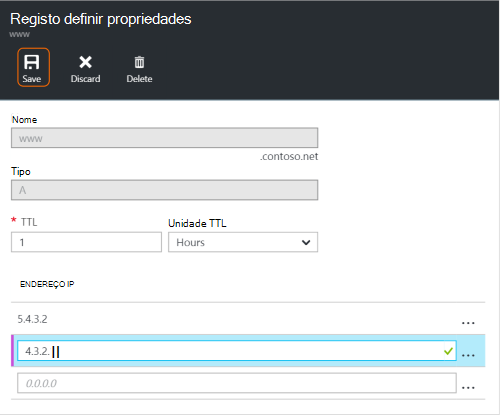
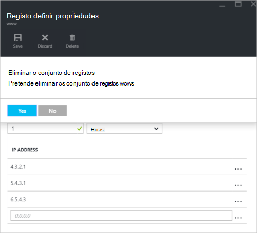

<properties
   pageTitle="Gerir conjuntos de registos de DNS e registos através do portal Azure | Microsoft Azure"
   description="Gerir os DNS registo define e registos de quando o alojamento do seu domínio no Azure DNS."
   services="dns"
   documentationCenter="na"
   authors="sdwheeler"
   manager="carmonm"
   editor=""
   tags="azure-resource-manager"/>

<tags
   ms.service="dns"
   ms.devlang="na"
   ms.topic="article"
   ms.tgt_pltfrm="na"
   ms.workload="infrastructure-services"
   ms.date="08/16/2016"
   ms.author="sewhee"/>

# Gerir os registos DNS e conjuntos de registo utilizando o portal do Azure

> [AZURE.SELECTOR]
- [Portal do Azure](dns-operations-recordsets-portal.md)
- [Clip Azure](dns-operations-recordsets-cli.md)
- [PowerShell](dns-operations-recordsets.md)

Este artigo mostra-lhe como gerir conjuntos de registo e registos para o seu DNS zone utilizando o portal do Azure.

É importante compreender a diferença entre os conjuntos de registos de DNS e os registos DNS individuais. Um conjunto de registo é um conjunto de registos numa zona que têm o mesmo nome e são do mesmo tipo. Para mais informações, consulte o artigo [registos utilizando o portal do Azure e conjuntos de registos DNS de criar](dns-getstarted-create-recordset-portal.md).

## Criar um novo conjunto de registos e registo

Para criar um registo definir no portal do Azure, consulte o artigo [criar registos DNS utilizando o portal do Azure](dns-getstarted-create-recordset-portal.md).

## Ver um conjunto de registos

1. No portal do Azure, aceda a pá a **zona de DNS** .

2. Procure o conjunto de registos e selecioná-la. Abre-se as propriedades do conjunto de registos.

    

## Adicionar um novo registo para um conjunto de registos

Pode adicionar até 20 registos para qualquer conjunto de registos. Um conjunto de registos não pode conter dois registos idênticos. Conjuntos de registos vazios (com os registos do zero) podem ser criados, mas não aparecem nos servidores de nomes Azure DNS. Registos conjuntos de tipo CNAME podem conter no máximo um registo.

1. No pá **registo definir propriedades** para o seu DNS zone, clique no conjunto de registo ao qual pretende adicionar um registo para.

    

2. Especifique o registo definir propriedades, preenchendo este nos campos.

    

2. Clique em **Guardar** no topo da pá para guardar as definições. Em seguida, feche o pá.

3. No canto, irá ver o registo está a guardar.

    

Depois de ter sido guardado o registo, os valores no pá a **zona de DNS** vão refletir as novo registo.

## Atualizar um registo

Quando atualiza um registo de um conjunto de registos existente, os campos que pode atualizar variam consoante o tipo de registo que está a trabalhar com.

1. No pá **registo definir propriedades** para o conjunto de registos, procure o registo.

2. Modificar o registo. Quando modificar um registo, pode alterar as definições disponíveis para o registo. O exemplo seguinte, o campo **endereço IP** está seleccionado e o endereço IP é a modificada.

    

3. Clique em **Guardar** no topo da pá para guardar as definições. No canto superior direito, verá a notificação de que o registo ter sido guardado.

    

Depois de ter sido guardado o registo, os valores para o registo configurar num pá **DNS zone** vão refletir as o registo atualizado.

## Remover um registo a partir de um conjunto de registos

Pode utilizar o portal do Azure para remover registos a partir de um conjunto de registos. Tenha em atenção que remover o último registo de um conjunto de registos não elimina o conjunto de registos.

1. No pá **registo definir propriedades** para o conjunto de registos, procure o registo.

2. Clique no registo que pretende remover. Em seguida, selecione **Remover**.

    

3. Clique em **Guardar** no topo da pá para guardar as definições.

3. Depois de ter sido removido o registo, os valores para o registo no pá a **zona de DNS** vão refletir as a remoção.

## Eliminar um conjunto de registos

1. No **registo definir propriedades** pá para o seu registo configurar, clique em **Eliminar**.

    

2. Aparece uma mensagem a perguntar se pretende eliminar o conjunto de registos.

3. Certifique-se de que o nome corresponde ao conjunto de registos que pretende eliminar e, em seguida, clique em **Sim**.

4. No pá **DNS zone** , verifique se o conjunto de registos já não se encontra visível.

## Trabalhar com registos NS e SOA

Registos NS e SOA que são criados automaticamente são geridos de forma diferente a partir de outros tipos de registo.

### Modificar SOA registos

Não pode adicionar ou remover registos do registo SOA criado automaticamente definido no vértice do zone (nome = "@"). No entanto, pode modificar qualquer um dos parâmetros dentro de registo de SOA (exceto "anfitrião") e o registo definido TTL.

### Modificar os registos NS no vértice do zona

Não pode adicionar, para remover ou modificar os registos no conjunto no vértice do zona de registos NS criado automaticamente (nome = "@"). A única alteração que é permitida é modificar o conjunto de registos TTL.

### Eliminar SOA ou NS conjuntos de registos

Não é possível eliminar a SOA e registo NS define no vértice do zona (nome = "@") que são criados automaticamente quando a zona é criada. São eliminados automaticamente quando eliminar a zona.

## Próximos passos

-   Para mais informações sobre o Azure DNS, consulte o artigo [Descrição geral do Azure DNS](dns-overview.md).
-   Para mais informações sobre como automatizar DNS, consulte o artigo [Criar DNS zones e registo conjuntos utilizando o SDK .NET](dns-sdk.md).
-   Para obter mais informações sobre inversa registos DNS, consulte [como gerir inverso registos DNS para os seus serviços através do PowerShell](dns-reverse-dns-record-operations-ps.md).
