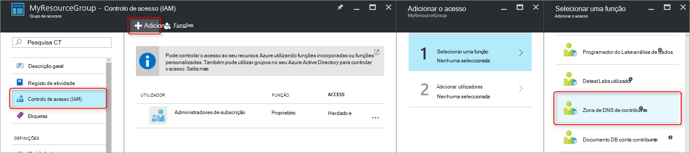
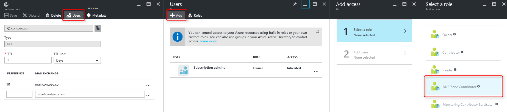

<properties 
   pageTitle="Proteger as zonas de DNS e os registos | Microsoft Azure" 
   description="Como pode proteger zonas de DNS e conjuntos de registos no Microsoft Azure DNS." 
   services="dns" 
   documentationCenter="na" 
   authors="jtuliani" 
   manager="carmonm" 
   editor=""/>

<tags
   ms.service="dns"
   ms.devlang="na"
   ms.topic="article"
   ms.tgt_pltfrm="na"
   ms.workload="infrastructure-services" 
   ms.date="10/20/2016"
   ms.author="jtuliani"/>

# Como pode proteger zonas de DNS e registos

Zonas de DNS e registos são críticos recursos. Eliminar uma zona de DNS ou até mesmo um registo DNS pode resultar numa indisponibilidade do serviço total.  Por conseguinte, é importante que crítico zonas de DNS e registos estão protegidos contra alterações acidentais ou não autorizadas.

Este artigo explica como Azure DNS permite-lhe proteger a sua zonas de DNS e os registos contra essas alterações.  Vamos aplicar dois segurança poderosas funcionalidades fornecidas pelo Gestor de recursos do Azure: [o controlo de acesso baseado em funções](../active-directory/role-based-access-control-what-is.md) e [bloqueios de recursos](../resource-group-lock-resources.md).

## Controlo de acesso baseado em funções

Azure baseado em funções acesso controlo RBCA () permite a gestão de extensivamente acesso de utilizadores Azure, grupos e recursos. Utilizar RBAC, pode conceder com precisão a quantidade de acesso que os utilizadores têm de efetuar as suas tarefas. Para mais informações sobre como RBAC Ajuda-o a gerir o acesso, consulte o artigo [o que é o controlo de acesso baseado em funções](../active-directory/role-based-access-control-what-is.md).

### A função 'DNS Zone Contribuinte'

A função 'DNS Zone Contribuinte' é uma função incorporada fornecida pelo Azure para gerir os recursos DNS.  Atribuir permissões de DNS Zone contribuinte a um utilizador ou grupo permite esse grupo para recursos DNS, mas não os recursos de qualquer outro tipo de gerir.

Por exemplo, suponha que o grupo de recursos 'myzones' contém zonas de cinco para Contoso Corporation. Conceder permissões de 'DNS Zone Contribuinte' para esse grupo de recursos de administrador de DNS, ativa o controlo total sobre essas zonas DNS. Também evita conceder permissões desnecessárias, por exemplo o administrador DNS não é possível criar ou parar máquinas virtuais.

A forma mais simples para atribuir permissões de RBAC é [através do portal do Azure](../active-directory/role-based-access-control-configure.md).  Abra o pá 'Controlo de acesso (IAM)' para o grupo de recursos, em seguida, clique em 'Adicionar', em seguida, selecione a função de 'DNS Zone Contribuinte' e selecione necessários utilizadores ou grupos para conceder permissões.

Permissões também podem ser [concedido através do Azure PowerShell](../active-directory/role-based-access-control-manage-access-powershell.md):

    # Grant 'DNS Zone Contributor' permissions to all zones in a resource group
    New-AzureRmRoleAssignment -SignInName <user email address> -RoleDefinitionName "DNS Zone Contributor" -ResourceGroupName <resource group name>

O comando equivalente também está [disponível através do clip o Azure](../active-directory/role-based-access-control-manage-access-azure-cli.md):

    # Grant 'DNS Zone Contributor' permissions to all zones in a resource group
    azure role assignment create --signInName  <user email address> --roleName "DNS Zone Contributor" --resourceGroup <resource group name>

### Nível de zona RBAC

Regras do Azure RBAC podem ser aplicadas a uma subscrição, um grupo de recursos ou para um recurso individual. No caso de DNS do Azure, esse recurso pode ser uma zona DNS individual ou até mesmo um conjunto de registos individual.

Por exemplo, suponha que contém o grupo de recursos 'myzones' zona 'contoso.com e um subzone 'customers.contoso.com' na qual são criados registos CNAME para cada conta de cliente.  A conta utilizada para a gestão dos registos CNAME seguintes deve ser atribuída permissões para criar registos na zona 'customers.contoso.com' apenas, não deveriam ter acesso às outras zonas.

Podem ser concedidas permissões ao nível de zona RBAC através do portal do Azure.  Abra o pá 'Controlo de acesso (IAM)' para a zona, em seguida, clique em 'Adicionar', em seguida, selecione a função de 'DNS Zone Contribuinte' e selecione necessários utilizadores ou grupos para conceder permissões.

Permissões também podem ser [concedido através do Azure PowerShell](../active-directory/role-based-access-control-manage-access-powershell.md):

    # Grant 'DNS Zone Contributor' permissions to a specific zone
    New-AzureRmRoleAssignment -SignInName <user email address> -RoleDefinitionName "DNS Zone Contributor" -ResourceGroupName <resource group name> -ResourceName <zone name> -ResourceType Microsoft.Network/DNSZones

O comando equivalente também está [disponível através do clip o Azure](../active-directory/role-based-access-control-manage-access-azure-cli.md):

    # Grant 'DNS Zone Contributor' permissions to a specific zone
    azure role assignment create --signInName <user email address> --roleName "DNS Zone Contributor" --resource-name <zone name> --resource-type Microsoft.Network/DNSZones --resource-group <resource group name>

### Registo definir nível RBAC

Vamos pode aceder ainda mais um passo. Considere o administrador de correio da Contoso Corporation, quem precisa de aceder aos registos MX e TXT no vértice da zona 'contoso.com'.  Posteriormente, não precisa de aceder a quaisquer outros registos MX ou TXT ou a quaisquer registos de qualquer outro tipo.  Azure DNS permite-lhe atribuir permissões ao nível do conjunto de registos, para exatamente os registos que o administrador de correio tem acesso ao.  O administrador de correio é concedido com precisão o controlo Ana precisa e não consegue efetuar quaisquer outras alterações.
  
Permissões de RBAC ao nível do conjunto de registos podem ser configuradas através do portal do Azure, com o botão 'Utilizadores' no pá conjunto de registos:

Conjunto de registos as permissões ao nível RBAC também podem ser [concedido através do Azure PowerShell](../active-directory/role-based-access-control-manage-access-powershell.md):

    # Grant permissions to a specific record set
    New-AzureRmRoleAssignment -SignInName <user email address> -RoleDefinitionName "DNS Zone Contributor" -Scope "/subscriptions/<subscription id>/resourceGroups/<resource group name>/providers/Microsoft.Network/dnszones/<zone name>/<record type>/<record name>" 

O comando equivalente também está [disponível através do clip o Azure](../active-directory/role-based-access-control-manage-access-azure-cli.md):

    # Grant permissions to a specific record set
    azure role assignment create --signInName <user email address> --roleName "DNS Zone Contributor" --scope "/subscriptions/<subscription id>/resourceGroups/<resource group name>/providers/Microsoft.Network/dnszones/<zone name>/<record type>/<record name>"

### Funções personalizadas

A função de 'DNS Zone Contribuinte' incorporada permite controlo total através de um recurso DNS. Também é possível criar o seu próprio cliente funções Azure, para proporcionar um controlo ainda melhor com.

Considere novamente o exemplo em que é criado um registo CNAME na zona 'customers.contoso.com' para cada conta de cliente Contoso Corporation.  A conta utilizada para gerir estes CNAMEs deve ser permissão para gerir os registos CNAME apenas.  Em seguida, é não é possível modificar os registos de outros tipos de (tal como a alteração dos registos MX) ou efetuar operações de nível de zona, como eliminar zona.

O exemplo seguinte mostra uma definição de função personalizada para gerir apenas os registos CNAME:

    {
        "Name": "DNS CNAME Contributor",
        "Id": "",
        "IsCustom": true,
        "Description": "Can manage DNS CNAME records only.",
        "Actions": [
            "Microsoft.Network/dnsZones/CNAME/*",
            "Microsoft.Network/dnsZones/read",
            "Microsoft.Authorization/*/read",
            "Microsoft.Insights/alertRules/*",
            "Microsoft.ResourceHealth/availabilityStatuses/read",
            "Microsoft.Resources/deployments/*",
            "Microsoft.Resources/subscriptions/resourceGroups/read",
            "Microsoft.Support/*"
        ],
        "NotActions": [
        ],
        "AssignableScopes": [
            "/subscriptions/ c276fc76-9cd4-44c9-99a7-4fd71546436e"
        ]
    }

A propriedade ações define as seguintes permissões específicas DNS:

- `Microsoft.Network/dnsZones/CNAME/*`concede controlo total sobre registos CNAME
- `Microsoft.Network/dnsZones/read`concede permissão para ler zonas de DNS, mas não para modificá-las, permitindo-lhe ver a zona na qual está a ser criado o CNAME.

As ações restantes são copiadas da [função incorporada DNS Zone contribuinte](../active-directory/role-based-access-built-in-roles.md#dns-zone-contributor).

>[AZURE.NOTE] Utilizar uma função RBAC personalizada para impedir que a eliminação de conjuntos de registos enquanto ainda permitindo-lhes a ser atualizados não é um controlo eficaz. Impede que conjuntos de registo ser eliminada, mas não impede-los seja modificada.  Modificações permitidas incluem adicionar e remover registos a partir do conjunto de registos, incluindo a remoção de todos os registos para sair de um conjunto de registos 'vazio'. Isto tem o mesmo efeito como eliminar o registo de definir a partir de um ponto de vista de resolução DNS.

Definições de funções personalizadas atualmente não podem ser definidas através do portal do Azure. Uma função personalizada com base nesta definição de função pode ser criada através do Azure PowerShell:

    # Create new role definition based on input file
    New-AzureRmRoleDefinition -InputFile <file path>

Também pode ser criada através do clip o Azure:

    # Create new role definition based on input file
    azure role create –inputfile <file path>

A função, em seguida, pode ser atribuída da mesma forma como as funções incorporadas, conforme descrito neste artigo.

Para obter mais informações sobre como criar, gerir e atribuir funções personalizadas, consulte [Funções personalizadas no Azure RBAC](../active-directory/role-based-access-control-custom-roles.md).

## Bloqueios de recursos

Para além de RBAC, Gestor de recursos do Azure suporta outro tipo de controlo de segurança, nomeadamente a capacidade de recursos de 'lock'. Onde regras RBAC permitem-lhe controlar as ações de utilizadores e grupos específicos, bloqueios do recurso são aplicados ao recurso e são eficazes em todos os utilizadores e funções. Para mais informações, consulte o artigo [recursos de bloqueio com o Gestor de recursos do Azure](../resource-group-lock-resources.md).

Existem dois tipos de bloqueio de recurso: **DoNotDelete** e **só de leitura**. Estes podem ser aplicadas a uma zona DNS ou a um conjunto de registos individual.  As secções seguintes descrevem vários cenários comuns e como suportá-las utilizando bloqueios de recursos.

### Proteger contra todas as alterações

Para impedir que as alterações feitas, aplique um cadeado só de leitura à zona.  Isto impede que os novos conjuntos de registos que está a ser criados e existentes conjuntos de registos de que está a ser modificadas ou eliminadas.

Bloqueios de recursos de nível de zona podem ser criados através do portal do Azure.  A partir do pá de zona DNS, clique em 'Bloqueios', em seguida, 'Adicionar':

Nível de zona recurso bloqueios também podem ser criados através do Azure PowerShell:

    # Lock a DNS zone
    New-AzureRmResourceLock -LockLevel <lock level> -LockName <lock name> -ResourceName <zone name> -ResourceType Microsoft.Network/DNSZones -ResourceGroupName <resource group name> 

Configurar bloqueios recurso Azure não é suportada atualmente através do clip o Azure.

### Proteger os registos individuais
Para impedir que um registo DNS existente definir contra modificação, aplique um cadeado só de leitura para o conjunto de registos.

>[AZURE.NOTE] Aplicar um cadeado DoNotDelete a um conjunto de registos não é um controlo eficaz. Impede que o conjunto de ser eliminada de registos, mas não impede-seja modificada.  Modificações permitidas incluem adicionar e remover registos a partir do conjunto de registos, incluindo a remoção de todos os registos para sair de um conjunto de registos 'vazio'. Isto tem o mesmo efeito como eliminar o registo de definir a partir de um ponto de vista de resolução DNS.

Conjunto de registos recurso nível bloqueios atualmente podem apenas ser configuradas através do Azure PowerShell.  Não são suportadas no portal do Azure ou clip de Azure.

    # Lock a DNS record set
    New-AzureRmResourceLock -LockLevel <lock level> -LockName <lock name> -ResourceName <zone name>/<record set name> -ResourceType Microsoft.Network/DNSZones/<record type> -ResourceGroupName <resource group name> 

### Proteger contra eliminação de zona

Quando uma zona é eliminada no Azure DNS, todos os conjuntos de registos na zona são também eliminados.  Esta operação não pode ser anulada.  Eliminar acidentalmente uma zona crítica tem potencial para ter um impacto empresas significativa.  Por conseguinte, é muito importante proteger contra eliminação de zona acidentais.

Aplicar um cadeado DoNotDelete a uma zona de impede a zona de ser eliminada.  No entanto, uma vez que são herdados bloqueios por recursos subordinado, também impede qualquer conjuntos de registos na zona de que está a ser eliminada, que podem ser indesejáveis.  Além disso, tal como descrito na nota acima, também é ineficaz desde registos ainda podem ser removidos da conjuntos de registos existentes.

Como alternativa, considere aplicar um cadeado DoNotDelete a um registo definir na zona, tal como o conjunto de registos SOA.  Uma vez que não pode ser eliminada a zona sem eliminar também os conjuntos de registos, este procedimento protege contra eliminação de zona, permitindo ainda conjuntos de registos dentro da zona de ser alterada livre. Se for feita uma tentativa para eliminar a zona, Gestor de recursos do Azure Deteta Isto também eliminaria o conjunto de registos SOA e bloqueia a chamada porque o SOA está bloqueada.  Sem conjuntos de registos são eliminados.

O comando PowerShell seguinte cria um cadeado DoNotDelete contra o registo SOA da zona determinado:

    # Protect against zone delete with DoNotDelete lock on the record set
    New-AzureRmResourceLock -LockLevel DoNotDelete -LockName <lock name> -ResourceName <zone name>/@ -ResourceType Microsoft.Network/DNSZones/SOA -ResourceGroupName <resource group name> 

Outra forma de impedir a eliminação de zona acidentais é ao utilizar uma função personalizada para garantir que o operador e contas de serviço utilizadas para gerir as zonas não possui zona eliminar permissões. Quando precisar de eliminar uma zona, pode impor a eliminação de dois passos, primeiros concede zona eliminar permissões (no âmbito de zona, para evitar eliminar a zona mal) e segundo para eliminar a zona.

Esta abordagem segunda tem a vantagem que funciona para todas as zonas pode ser consultadas por essas contas, sem ter de se lembrar de criar quaisquer bloqueios. Tem a desvantagem que todas as contas com permissões de eliminação de zona, tal como o proprietário da subscrição, podem eliminar ainda acidentalmente uma zona crítica.

É possível utilizar as duas abordagens - bloqueios de recursos e funções personalizadas - ao mesmo tempo, como uma abordagem de defesa no profundidade para protecção de zona DNS.

## Próximos passos

- Para mais informações sobre como trabalhar com RBAC, consulte o artigo [começar a trabalhar com gestão de acesso no portal do Azure](../active-directory/role-based-access-control-what-is.md). 
- Para mais informações sobre como trabalhar com bloqueios de recursos, consulte o artigo [recursos de bloqueio com o Gestor de recursos do Azure](../resource-group-lock-resources.md).
- Para mais informações sobre como proteger os recursos do Azure, consulte o artigo [Considerações de segurança para o Gestor de recursos do Azure](../best-practices-resource-manager-security.md).
