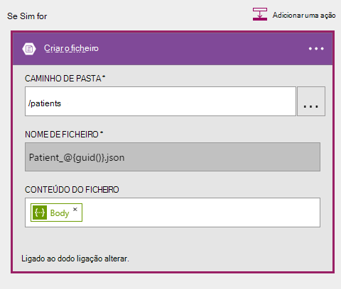

<properties 
    pageTitle="Utilizar aplicações de lógica de notificações de alteração de DocumentDB | Microsoft Azure" 
    description="." 
    keywords="notificação de alteração"
    services="documentdb" 
    authors="hedidin" 
    manager="jhubbard" 
    editor="mimig" 
    documentationCenter=""/>

<tags 
    ms.service="documentdb" 
    ms.workload="data-services" 
    ms.tgt_pltfrm="na" 
    ms.devlang="rest-api" 
    ms.topic="article" 
    ms.date="09/23/2016" 
    ms.author="b-hoedid"/>

# <a name="notifications-for-new-or-changed-documentdb-resources-using-logic-apps"></a>Notificações de novas ou alteradas DocumentDB para recursos de utilizando aplicações de lógica

Este artigo é proveniente uma pergunta que viu publicado um dos fóruns da Comunidade Azure DocumentDB. A pergunta foi **DocumentDB é que suportam notificações para recursos modificados**?

Posso ter trabalhado com BizTalk Server para muitos anos e este é um cenário muito comuns quando utilizar o [WCF LOB adaptador](https://msdn.microsoft.com/library/bb798128.aspx). Por isso, posso decidiu ver se posso poderia duplicar esta funcionalidade no DocumentDB para documentos novos e/ou modificados.

Este artigo fornece uma descrição geral dos componentes da solução de notificação de alteração, que inclui um [acionador](documentdb-programming.md#trigger) e uma [Aplicação de lógica](../app-service-logic/app-service-logic-what-are-logic-apps.md). Importante fragmentos de código são fornecidos inline e a solução inteira está disponível no [GitHub](https://github.com/HEDIDIN/DocDbNotifications).

## <a name="use-case"></a>Caso de utilização

O bloco seguinte é o caso de utilização deste artigo.

DocumentDB é o repositório de documentos do Estado de funcionamento do nível de sete internacional (HL7) rapidamente cuidados de saúde interoperabilidade recursos (FHIR). Imaginemos que a base de dados DocumentDB combinado com a API e a aplicação de lógica constituem um servidor de FHIR HL7.  Uma funcionalidade cuidados de saúde está a armazenar dados pacientes na DocumentDB base de dados "Pacientes". Existem várias coleções de sites dentro da base de dados paciente; Clínica, identificação, etc. Informações pacientes diminui em identificação.  Tem uma coleção de denominada "Paciente".

O departamento de Cardiology está a registar dados de estado de funcionamento e exercício pessoais. Procurar registos pacientes novos ou modificados é demorado. Estes perguntou o departamento de TI se uma forma que poderia recebem uma notificação para registos pacientes novos ou modificados.  

O departamento de TI disse que poderia facilmente fornecem isto. Caso também dizer que eles poderiam de emissão dos documentos ao [Armazenamento de Blobs do Azure](https://azure.microsoft.com/services/storage/) para o departamento de Cardiology pode facilmente aceder aos mesmos.

## <a name="how-the-it-department-solved-the-problem"></a>Como o departamento de TI resolvido o problema

Para criar esta aplicação, o departamento de TI decidido modelá-la pela primeira vez.  Bom sobre como utilizar o Business Process Modeling and Notation (BPMN) é que as pessoas técnicas e não técnicas podem compreender facilmente-lo. Este processo de notificação todo é considerado como um processo empresarial. 

## <a name="high-level-view-of-notification-process"></a>Vista de alto nível do processo de notificação

1. Comece com uma aplicação de lógica que tem um accionador temporizador. Por predefinição, o accionador é executado cada hora.
2. Em seguida o que fazer uma mensagem de HTTP para a aplicação de lógica.
3. A aplicação de lógica faz todo o trabalho.


### <a name="lets-take-a-look-at-what-this-logic-app-does"></a>Vamos dar uma que faz esta aplicação de lógica
Se observe a seguinte figura existem vários passos no fluxo de trabalho LogicApp.


Os passos são da seguinte forma:

1. Que precisa para obter o DateTime UTC atual a partir de uma aplicação de API.  O valor predefinido é uma hora anterior.

2. UTC DateTime é convertido num formato de carimbo de data/hora Unix. Este é o formato predefinido para selos de tempo no DocumentDB.

3. REGISTAR o valor para uma aplicação de API, que é que um DocumentDB consulta. É utilizado o valor numa consulta.

    ```SQL
        SELECT * FROM Patients p WHERE (p._ts >= @unixTimeStamp)
    ```

    > [AZURE.NOTE] O _ts representa os metadados de data/hora para todos os recursos de DocumentDB.

4. Se existirem documentos que se encontram, o corpo da resposta é enviado para o armazenamento de Blobs do Azure.

    > [AZURE.NOTE] Armazenamento de BLOBs requer uma conta de armazenamento do Windows Azure. Tem de aprovisionamento de uma conta de armazenamento de Blobs do Azure e adicionar um novo Blob denominado pacientes. Para mais informações, consulte o artigo [Introdução ao armazenamento de Blobs do Azure](../storage/storage-dotnet-how-to-use-blobs.md)e [contas de armazenamento de sobre Azure](../storage/storage-create-storage-account.md) .

5. Por fim, é enviada uma mensagem de e-mail que notifica o destinatário do número de documentos que se encontram. Se não foram encontrados documentos, o corpo da mensagem de correio electrónico seria "0 documentos encontrado". 

Agora que tem uma ideia de como o que faz o fluxo de trabalho, vamos olhar como implementá-lo.

### <a name="lets-start-with-the-main-logic-app"></a>Vamos começar com a aplicação de lógica principal

Se não estiver familiarizado com as aplicações de lógica, estão disponíveis no [Azure Marketplace](https://portal.azure.com/)e pode saber mais sobre os mesmos no [quais são as aplicações de lógica?](../app-service-logic/app-service-logic-what-are-logic-apps.md)

Quando cria uma nova aplicação de lógica, é-lhe perguntado **como gostaria de começar?**

Quando clica no interior da caixa de texto, tem uma opção de eventos. Para esta aplicação lógica, selecione **Manual - pedido de HTTP an quando for recebida** , conforme apresentado abaixo.


### <a name="design-view-of-your-completed-logic-app"></a>Vista de estrutura da sua aplicação de lógica concluída
Vamos avançar e observe a vista de estrutura concluídas para a aplicação de lógica, qual é o nome de DocDB.


Quando edita as ações no estruturador de aplicação de lógica, tem a opção de selecionar **saídas** a partir do pedido de HTTP ou da acção anterior, conforme mostrado na ação sendMail abaixo.


Antes de cada ação no seu fluxo de trabalho, pode tomar uma decisão; **Adicionar uma ação** ou **Adicionar uma condição** conforme apresentado na figura seguinte.


Se selecionar **Adicionar uma condição**, são apresentadas com um formulário, conforme apresentado na figura seguinte, para introduzir a sua lógica.  Na sua essência, esta é uma regra de negócio.  Se clicar no interior de um campo, tem uma opção de selecção de parâmetros da acção anterior. Também pode introduzir os valores diretamente.


> [AZURE.NOTE] Também tem a funcionalidade para introduzir tudo na vista de código.

Vamos um olhar sobre a aplicação de lógica concluída na vista de código.  

```JSON
   
    "$schema": "https://schema.management.azure.com/providers/Microsoft.Logic/schemas/2015-08-01-preview/workflowdefinition.json#",
    "actions": {
        "Conversion": {
            "conditions": [
                {
                    "dependsOn": "GetUtcDate"
                }
            ],
            "inputs": {
                "method": "post",
                "queries": {
                    "currentdateTime": "@{body('GetUtcDate')}"
                },
                "uri": "https://docdbnotificationapi-debug.azurewebsites.net/api/Conversion"
            },
            "metadata": {
                "apiDefinitionUrl": "https://docdbnotificationapi-debug.azurewebsites.net/swagger/docs/v1",
                "swaggerSource": "custom"
            },
            "type": "Http"
        },
        "Createfile": {
            "conditions": [
                {
                    "expression": "@greater(length(body('GetDocuments')), 0)"
                },
                {
                    "dependsOn": "GetDocuments"
                }
            ],
            "inputs": {
                "body": "@body('GetDocuments')",
                "host": {
                    "api": {
                        "runtimeUrl": "https://logic-apis-westus.azure-apim.net/apim/azureblob"
                    },
                    "connection": {
                        "name": "@parameters('$connections')['azureblob']['connectionId']"
                    }
                },
                "method": "post",
                "path": "/datasets/default/files",
                "queries": {
                    "folderPath": "/patients",
                    "name": "Patient_@{guid()}.json"
                }
            },
            "type": "ApiConnection"
        },
        "GetDocuments": {
            "conditions": [
                {
                    "dependsOn": "Conversion"
                }
            ],
            "inputs": {
                "method": "post",
                "queries": {
                    "unixTimeStamp": "@body('Conversion')"
                },
                "uri": "https://docdbnotificationapi-debug.azurewebsites.net/api/Patient"
            },
            "metadata": {
                "apiDefinitionUrl": "https://docdbnotificationapi-debug.azurewebsites.net/swagger/docs/v1",
                "swaggerSource": "custom"
            },
            "type": "Http"
        },
        "GetUtcDate": {
            "conditions": [],
            "inputs": {
                "method": "get",
                "queries": {
                    "hoursBack": "@{int(triggerBody()['GetUtcDate_HoursBack'])}"
                },
                "uri": "https://docdbnotificationapi-debug.azurewebsites.net/api/Authorization"
            },
            "metadata": {
                "apiDefinitionUrl": "https://docdbnotificationapi-debug.azurewebsites.net/swagger/docs/v1",
                "swaggerSource": "custom"
            },
            "type": "Http"
        },
        "sendMail": {
            "conditions": [
                {
                    "dependsOn": "GetDocuments"
                }
            ],
            "inputs": {
                "body": "api_user=@{triggerBody()['sendgridUsername']}&api_key=@{triggerBody()['sendgridPassword']}&from=@{parameters('fromAddress')}&to=@{triggerBody()['EmailTo']}&subject=@{triggerBody()['Subject']}&text=@{int(length(body('GetDocuments')))} Documents Found",
                "headers": {
                    "Content-type": "application/x-www-form-urlencoded"
                },
                "method": "POST",
                "uri": "https://api.sendgrid.com/api/mail.send.json"
            },
            "type": "Http"
        }
    },
    "contentVersion": "1.0.0.0",
    "outputs": {
        "Results": {
            "type": "String",
            "value": "@{int(length(body('GetDocuments')))} Records Found"
        }
    },
    "parameters": {
        "$connections": {
            "defaultValue": {},
            "type": "Object"
        },
        "fromAddress": {
            "defaultValue": "user@msn.com",
            "type": "String"
        },
        "toAddress": {
            "defaultValue": "XXXXX@XXXXXXX.net",
            "type": "String"
        }
    },
    "triggers": {
        "manual": {
            "inputs": {
                "schema": {
                    "properties": {},
                    "required": [],
                    "type": "object"
                }
            },
            "type": "Manual"
        }
    
```

Se não estiver familiarizado com o que representa as secções diferentes no código, pode ver a documentação de [Linguagem de definição de fluxo de trabalho de aplicação de lógica](http://aka.ms/logicappsdocs) .

Para este fluxo de trabalho está a utilizar um [Acionador de Webhook HTTP](https://sendgrid.com/blog/whats-webhook/). Se observe o código acima, irá ver parâmetros semelhante ao exemplo seguinte.

```C#

    =@{triggerBody()['Subject']}

```

O `triggerBody()` representa os parâmetros que estão incluídos no corpo de uma mensagem de descanso à aplicação lógica REST API. O `()['Subject']` representa o campo. Todos estes parâmetros constituem o JSON formatados corpo. 

> [AZURE.NOTE] Ao utilizar uma rotina Web, pode ter acesso total ao cabeçalho e o corpo do pedido do accionador. Esta aplicação pretende corpo.

Tal como mencionado anteriormente, pode utilizar o estruturador para atribuir parâmetros ou fazê-lo na vista de código.
Se fizer na vista de código, em seguida, pode definir as propriedades que necessitam de um valor, conforme mostrado no seguinte exemplo de código. 

```JSON

    "triggers": {
        "manual": {
            "inputs": {
            "schema": {
                "properties": {
            "Subject": {
                "type" : "String"   

            }
            },
                "required": [
            "Subject"
                 ],
                "type": "object"
            }
            },
            "type": "Manual"
        }
        }
```

O que estão a fazer está a criar um esquema JSON que será passado na partir do corpo da mensagem HTTP.
Seja acionada o accionador, terá de um URL de chamada de retorno.  Vai aprender a gerá-lo mais tarde no tutorial.  

## <a name="actions"></a>Ações
Vamos ver o que faz cada ação no nosso App lógica.

### <a name="getutcdate"></a>GetUTCDate

**Vista do estruturador de**


**Vista de código**

```JSON

    "GetUtcDate": {
            "conditions": [],
            "inputs": {
            "method": "get",
            "queries": {
                "hoursBack": "@{int(triggerBody()['GetUtcDate_HoursBack'])}"
            },
            "uri": "https://docdbnotificationapi-debug.azurewebsites.net/api/Authorization"
            },
            "metadata": {
            "apiDefinitionUrl": "https://docdbnotificationapi-debug.azurewebsites.net/swagger/docs/v1"
            },
            "type": "Http"
        },

```

Esta ação HTTP executa uma operação de obter.  Chama o método de API aplicação GetUtcDate. O Uri utiliza a propriedade de 'GetUtcDate_HoursBack' passada para o corpo de accionador.  O valor de 'GetUtcDate_HoursBack' é definido na aplicação de lógica primeiro. Irá Saiba mais sobre a aplicação de lógica accionador mais tarde no tutorial.

Esta ação chamadas a sua aplicação de API para devolver o valor de cadeia de data UTC.

#### <a name="operations"></a>Operações

**Pedido**

```JSON

    {
        "uri": "https://docdbnotificationapi-debug.azurewebsites.net/api/Authorization",
        "method": "get",
        "queries": {
          "hoursBack": "24"
        }
    }

```

**Resposta**

```JSON

    {
        "statusCode": 200,
        "headers": {
          "pragma": "no-cache",
          "cache-Control": "no-cache",
          "date": "Fri, 26 Feb 2016 15:47:33 GMT",
          "server": "Microsoft-IIS/8.0",
          "x-AspNet-Version": "4.0.30319",
          "x-Powered-By": "ASP.NET"
        },
        "body": "Fri, 15 Jan 2016 23:47:33 GMT"
    }

```

O passo seguinte é converter o valor de data/hora de UTC o carimbo de hora Unix, que é um tipo de duplo .NET.

### <a name="conversion"></a>Conversão

##### <a name="designer-view"></a>Vista do estruturador de


##### <a name="code-view"></a>Vista de código

```JSON

    "Conversion": {
        "conditions": [
        {
            "dependsOn": "GetUtcDate"
        }
        ],
        "inputs": {
        "method": "post",
        "queries": {
            "currentDateTime": "@{body('GetUtcDate')}"
        },
        "uri": "https://docdbnotificationapi-debug.azurewebsites.net/api/Conversion"
        },
        "metadata": {
        "apiDefinitionUrl": "https://docdbnotificationapi-debug.azurewebsites.net/swagger/docs/v1"
        },
        "type": "Http"
    },

```

Neste passo ser efetuada com o valor devolvido a partir de GetUTCDate.  Existe uma condição dependsOn, o que significa que a ação GetUTCDate tem concluída com êxito. Caso contrário, em seguida, é ignorada esta ação. 

Esta ação chamadas a sua aplicação de API para processar a conversão.

#### <a name="operations"></a>Operações

##### <a name="request"></a>Pedido

```JSON

    {
        "uri": "https://docdbnotificationapi-debug.azurewebsites.net/api/Conversion",
        "method": "post",
        "queries": {
        "currentDateTime": "Fri, 15 Jan 2016 23:47:33 GMT"
        }
    }   
```

##### <a name="response"></a>Resposta

```JSON

    {
        "statusCode": 200,
        "headers": {
          "pragma": "no-cache",
          "cache-Control": "no-cache",
          "date": "Fri, 26 Feb 2016 15:47:33 GMT",
          "server": "Microsoft-IIS/8.0",
          "x-AspNet-Version": "4.0.30319",
          "x-Powered-By": "ASP.NET"
        },
        "body": 1452901653
    }
```

A ação seguinte, fará uma operação de mensagem a nossa aplicação API.

### <a name="getdocuments"></a>GetDocuments 

##### <a name="designer-view"></a>Vista do estruturador de


##### <a name="code-view"></a>Vista de código

```JSON

    "GetDocuments": {
        "conditions": [
        {
            "dependsOn": "Conversion"
        }
        ],
        "inputs": {
        "method": "post",
        "queries": {
            "unixTimeStamp": "@{body('Conversion')}"
        },
        "uri": "https://docdbnotificationapi-debug.azurewebsites.net/api/Patient"
        },
        "metadata": {
        "apiDefinitionUrl": "https://docdbnotificationapi-debug.azurewebsites.net/swagger/docs/v1"
        },
        "type": "Http"
    },

```

Para a ação GetDocuments passar para transmitir no corpo da resposta da ação de conversão. Este é um parâmetro no Uri:

 
```C#

    unixTimeStamp=@{body('Conversion')}

```

A ação QueryDocuments faz uma operação de HTTP POST para a aplicação de API. 

O método chamado é **QueryForNewPatientDocuments**.

#### <a name="operations"></a>Operações

##### <a name="request"></a>Pedido

```JSON

    {
        "uri": "https://docdbnotificationapi-debug.azurewebsites.net/api/Patient",
        "method": "post",
        "queries": {
        "unixTimeStamp": "1452901653"
        }
    }
```

##### <a name="response"></a>Resposta

```JSON

    {
        "statusCode": 200,
        "headers": {
        "pragma": "no-cache",
        "cache-Control": "no-cache",
        "date": "Fri, 26 Feb 2016 15:47:35 GMT",
        "server": "Microsoft-IIS/8.0",
        "x-AspNet-Version": "4.0.30319",
        "x-Powered-By": "ASP.NET"
        },
        "body": [
        {
            "id": "xcda",
            "_rid": "vCYLAP2k6gAXAAAAAAAAAA==",
            "_self": "dbs/vCYLAA==/colls/vCYLAP2k6gA=/docs/vCYLAP2k6gAXAAAAAAAAAA==/",
            "_ts": 1454874620,
            "_etag": "\"00007d01-0000-0000-0000-56b79ffc0000\"",
            "resourceType": "Patient",
            "text": {
            "status": "generated",
            "div": "<div>\n      \n      <p>Henry Levin the 7th</p>\n    \n    </div>"
            },
            "identifier": [
            {
                "use": "usual",
                "type": {
                "coding": [
                    {
                    "system": "http://hl7.org/fhir/v2/0203",
                    "code": "MR"
                    }
                ]
                },
                "system": "urn:oid:2.16.840.1.113883.19.5",
                "value": "12345"
            }
            ],
            "active": true,
            "name": [
            {
                    "family": [
                        "Levin"
                    ],
                    "given": [
                        "Henry"
                    ]
                }
            ],
            "gender": "male",
            "birthDate": "1932-09-24",
            "managingOrganization": {
                "reference": "Organization/2.16.840.1.113883.19.5",
                "display": "Good Health Clinic"
            }
        },

```

A ação seguinte é guardar os documentos para o [blogue do Azure armazenamento](https://azure.microsoft.com/services/storage/). 

> [AZURE.NOTE] Armazenamento de BLOBs requer uma conta de armazenamento do Windows Azure. Tem de aprovisionamento de uma conta de armazenamento de Blobs do Azure e adicionar um novo Blob denominado pacientes. Para mais informações, consulte o artigo [Introdução ao armazenamento de Blobs do Azure](../storage/storage-dotnet-how-to-use-blobs.md).

### <a name="create-file"></a>Criar o ficheiro

##### <a name="designer-view"></a>Vista do estruturador de



##### <a name="code-view"></a>Vista de código

```JSON

    {
    "host": {
        "api": {
            "runtimeUrl": "https://logic-apis-westus.azure-apim.net/apim/azureblob"
        },
        "connection": {
            "name": "subscriptions/fxxxxxc079-4e5d-b002-xxxxxxxxxx/resourceGroups/Api-Default-Central-US/providers/Microsoft.Web/connections/azureblob"
        }
    },
    "method": "post",
    "path": "/datasets/default/files",
    "queries": {
        "folderPath": "/patients",
        "name": "Patient_17513174-e61d-4b56-88cb-5cf383db4430.json"
    },
    "body": [
        {
            "id": "xcda",
            "_rid": "vCYLAP2k6gAXAAAAAAAAAA==",
            "_self": "dbs/vCYLAA==/colls/vCYLAP2k6gA=/docs/vCYLAP2k6gAXAAAAAAAAAA==/",
            "_ts": 1454874620,
            "_etag": "\"00007d01-0000-0000-0000-56b79ffc0000\"",
            "resourceType": "Patient",
            "text": {
                "status": "generated",
                "div": "<div>\n      \n      <p>Henry Levin the 7th</p>\n    \n    </div>"
            },
            "identifier": [
                {
                    "use": "usual",
                    "type": {
                        "coding": [
                            {
                                "system": "http://hl7.org/fhir/v2/0203",
                                "code": "MR"
                            }
                        ]
                    },
                    "system": "urn:oid:2.16.840.1.113883.19.5",
                    "value": "12345"
                }
            ],
            "active": true,
            "name": [
                {
                    "family": [
                        "Levin"
                    ],
                    "given": [
                        "Henry"
                    ]
                }
            ],
            "gender": "male",
            "birthDate": "1932-09-24",
            "managingOrganization": {
                "reference": "Organization/2.16.840.1.113883.19.5",
                "display": "Good Health Clinic"
            }
        },

```

O código é gerado a partir de ação no estruturador de. Não tem de modificar o código.

Se não estiver familiarizado com a utilização de API de Blobs do Azure, consulte o artigo [começar a trabalhar com o armazenamento de Blobs do Azure API](../connectors/connectors-create-api-azureblobstorage.md).

#### <a name="operations"></a>Operações

##### <a name="request"></a>Pedido

```JSON

    "host": {
        "api": {
            "runtimeUrl": "https://logic-apis-westus.azure-apim.net/apim/azureblob"
        },
        "connection": {
            "name": "subscriptions/fxxxxxc079-4e5d-b002-xxxxxxxxxx/resourceGroups/Api-Default-Central-US/providers/Microsoft.Web/connections/azureblob"
        }
    },
    "method": "post",
    "path": "/datasets/default/files",
    "queries": {
        "folderPath": "/patients",
        "name": "Patient_17513174-e61d-4b56-88cb-5cf383db4430.json"
    },
    "body": [
        {
            "id": "xcda",
            "_rid": "vCYLAP2k6gAXAAAAAAAAAA==",
            "_self": "dbs/vCYLAA==/colls/vCYLAP2k6gA=/docs/vCYLAP2k6gAXAAAAAAAAAA==/",
            "_ts": 1454874620,
            "_etag": "\"00007d01-0000-0000-0000-56b79ffc0000\"",
            "resourceType": "Patient",
            "text": {
                "status": "generated",
                "div": "<div>\n      \n      <p>Henry Levin the 7th</p>\n    \n    </div>"
            },
            "identifier": [
                {
                    "use": "usual",
                    "type": {
                        "coding": [
                            {
                                "system": "http://hl7.org/fhir/v2/0203",
                                "code": "MR"
                            }
                        ]
                    },
                    "system": "urn:oid:2.16.840.1.113883.19.5",
                    "value": "12345"
                }
            ],
            "active": true,
            "name": [
                {
                    "family": [
                        "Levin"
                    ],
                    "given": [
                        "Henry"
                    ]
                }
            ],
            "gender": "male",
            "birthDate": "1932-09-24",
            "managingOrganization": {
                "reference": "Organization/2.16.840.1.113883.19.5",
                "display": "Good Health Clinic"
            }
        },….


```

##### <a name="response"></a>Resposta

```JSON

    {
        "statusCode": 200,
        "headers": {
        "pragma": "no-cache",
        "x-ms-request-id": "2b2f7c57-2623-4d71-8e53-45c26b30ea9d",
        "cache-Control": "no-cache",
        "date": "Fri, 26 Feb 2016 15:47:36 GMT",
        "set-Cookie": "ARRAffinity=29e552cea7db23196f7ffa644003eaaf39bc8eb6dd555511f669d13ab7424faf;Path=/;Domain=127.0.0.1",
        "server": "Microsoft-HTTPAPI/2.0",
        "x-AspNet-Version": "4.0.30319",
        "x-Powered-By": "ASP.NET"
        },
        "body": {
        "Id": "0B0nBzHyMV-_NRGRDcDNMSFAxWFE",
        "Name": "Patient_47a2a0dc-640d-4f01-be38-c74690d085cb.json",
        "DisplayName": "Patient_47a2a0dc-640d-4f01-be38-c74690d085cb.json",
        "Path": "/Patient/Patient_47a2a0dc-640d-4f01-be38-c74690d085cb.json",
        "LastModified": "2016-02-26T15:47:36.215Z",
        "Size": 65647,
        "MediaType": "application/octet-stream",
        "IsFolder": false,
        "ETag": "\"c-g_a-1OtaH-kNQ4WBoXLp3Zv9s/MTQ1NjUwMTY1NjIxNQ\"",
        "FileLocator": "0B0nBzHyMV-_NRGRDcDNMSFAxWFE"
        }
    }
```

O último passo é enviar uma notificação de e-mail

### <a name="sendemail"></a>EnviarCorreioElectrónico

##### <a name="designer-view"></a>Vista do estruturador de


##### <a name="code-view"></a>Vista de código

```JSON


    "sendMail": {
        "conditions": [
        {
            "dependsOn": "GetDocuments"
        }
        ],
        "inputs": {
        "body": "api_user=@{triggerBody()['sendgridUsername']}&api_key=@{triggerBody()['sendgridPassword']}&from=@{parameters('fromAddress')}&to=@{triggerBody()['EmailTo']}&subject=@{triggerBody()['Subject']}&text=@{int(length(body('GetDocuments')))} Documents Found",
        "headers": {
            "Content-type": "application/x-www-form-urlencoded"
        },
        "method": "POST",
        "uri": "https://api.sendgrid.com/api/mail.send.json"
        },
        "type": "Http"
    }
```

Nesta ação Enviar uma notificação de e-mail.  Está a utilizar [SendGrid](https://sendgrid.com/marketing/sendgrid-services?cvosrc=PPC.Bing.sendgrib&cvo_cid=SendGrid%20-%20US%20-%20Brand%20-%20&mc=Paid%20Search&mcd=BingAds&keyword=sendgrib&network=o&matchtype=e&mobile=&content=&search=1&utm_source=bing&utm_medium=cpc&utm_term=%5Bsendgrib%5D&utm_content=%21acq%21v2%2134335083397-8303227637-1649139544&utm_campaign=SendGrid+-+US+-+Brand+-+%28English%29).   

O código para este foi gerado utilizando um modelo para a aplicação de lógica e SendGrid que está no [101-lógica aplicação sendgrid Github repositório](https://github.com/Azure/azure-quickstart-templates/tree/master/101-logic-app-sendgrid).
 
A operação de HTTP está numa mensagem. 

Os parâmetros de autorização são nas propriedades accionador

```JSON

    },
        "sendgridPassword": {
             "type": "SecureString"
         },
         "sendgridUsername": {
            "type": "String"
         }

        In addition, other parameters are static values set in the Parameters section of the Logic App. These are:
        },
        "toAddress": {
            "defaultValue": "XXXX@XXXX.com",
            "type": "String"
        },
        "fromAddress": {
            "defaultValue": "XXX@msn.com",
            "type": "String"
        },
        "emailBody": {
            "defaultValue": "@{string(concat(int(length(actions('QueryDocuments').outputs.body)) Records Found),'/n', actions('QueryDocuments').outputs.body)}",
            "type": "String"
        },

```

O emailBody é concatenação o número de documentos devolvidos pela consulta, que pode ser mais, juntamente com ou "0", "Registos encontrada". O resto dos parâmetros estão definidas a partir de parâmetros de accionador.

Esta ação depende a ação **GetDocuments** .

#### <a name="operations"></a>Operações

##### <a name="request"></a>Pedido
```JSON

    {
        "uri": "https://api.sendgrid.com/api/mail.send.json",
        "method": "POST",
        "headers": {
        "Content-type": "application/x-www-form-urlencoded"
        },
        "body": "api_user=azureuser@azure.com&api_key=Biz@Talk&from=user@msn.com&to=XXXX@XXXX.com&subject=New Patients&text=37 Documents Found"
    }

```

##### <a name="response"></a>Resposta

```JSON

    {
        "statusCode": 200,
        "headers": {
        "connection": "keep-alive",
        "x-Frame-Options": "DENY,DENY",
        "access-Control-Allow-Origin": "https://sendgrid.com",
        "date": "Fri, 26 Feb 2016 15:47:35 GMT",
        "server": "nginx"
        },
        "body": {
        "message": "success"
        }
    }
```

Por fim que pretende ver os resultados da sua aplicação de lógica no Portal do Azure. Para o fazer, adicionar um parâmetro para a secção resultados de.


```JSON

    "outputs": {
        "Results": {
            "type": "String",
            "value": "@{int(length(actions('QueryDocuments').outputs.body))} Records Found"
        }

```

Isto devolve o mesmo valor que é enviado no corpo da mensagem de correio electrónico. A figura seguinte mostra um exemplo onde "29 registos encontrada".


## <a name="metrics"></a>Métricas
Pode configurar a monitorização para a aplicação de lógica principal no portal. Permite-lhe ver a latência executar e outros eventos, tal como mostrar na figura seguinte.


## <a name="docdb-trigger"></a>DocDb accionador

Esta aplicação lógica é o accionador que inicia o fluxo de trabalho na sua aplicação de lógica principal.

A figura seguinte mostra a vista de Designer.


```JSON

    {
        "$schema": "https://schema.management.azure.com/providers/Microsoft.Logic/schemas/2015-08-01-preview/workflowdefinition.json#",
        "actions": {
        "Http": {
            "conditions": [],
            "inputs": {
            "body": {
                "EmailTo": "XXXXXX@XXXXX.net",
                "GetUtcDate_HoursBack": "24",
                "Subject": "New Patients",
                "sendgridPassword": "********",
                "sendgridUsername": "azureuser@azure.com"
            },
            "method": "POST",
            "uri": "https://prod-01.westus.logic.azure.com:443/workflows/12a1de57e48845bc9ce7a247dfabc887/triggers/manual/run?api-version=2015-08-01-preview&sp=%2Ftriggers%2Fmanual%2Frun&sv=1.0&sig=ObTlihr529ATIuvuG-dhxOgBL4JZjItrvPQ8PV6973c"
            },
            "type": "Http"
        }
        },
        "contentVersion": "1.0.0.0",
        "outputs": {
        "Results": {
            "type": "String",
            "value": "@{body('Http')['status']}"
        }
        },
        "parameters": {},
        "triggers": {
        "recurrence": {
            "recurrence": {
            "frequency": "Hour",
            "interval": 24
            },
            "type": "Recurrence"
        }
        }
    }

```

O accionador está definido para uma periodicidade das horas de vinte e quatro. A ação é uma mensagem de HTTP que utiliza o URL de chamada de retorno para a aplicação de lógica principal. O corpo contiver os parâmetros são especificados no esquema de JSON. 

#### <a name="operations"></a>Operações

##### <a name="request"></a>Pedido

```JSON

    {
        "uri": "https://prod-01.westus.logic.azure.com:443/workflows/12a1de57e48845bc9ce7a247dfabc887/triggers/manual/run?api-version=2015-08-01-preview&sp=%2Ftriggers%2Fmanual%2Frun&sv=1.0&sig=ObTlihr529ATIuvuG-dhxOgBL4JZjItrvPQ8PV6973c",
        "method": "POST",
        "body": {
        "EmailTo": "XXXXXX@XXXXX.net",
        "GetUtcDate_HoursBack": "24",
        "Subject": "New Patients",
        "sendgridPassword": "********",
        "sendgridUsername": "azureuser@azure.com"
        }
    }

```

##### <a name="response"></a>Resposta

```JSON

    {
        "statusCode": 202,
        "headers": {
        "pragma": "no-cache",
        "x-ms-ratelimit-remaining-workflow-writes": "7486",
        "x-ms-ratelimit-burst-remaining-workflow-writes": "1248",
        "x-ms-request-id": "westus:2d440a39-8ba5-4a9c-92a6-f959b8d2357f",
        "cache-Control": "no-cache",
        "date": "Thu, 25 Feb 2016 21:01:06 GMT"
        }
    }
```

Agora vamos ver a aplicação de API.

## <a name="docdbnotificationapi"></a>DocDBNotificationApi

Apesar de existirem várias operações na aplicação, que apenas vai utilizar três.

* GetUtcDate
* ConvertToTimeStamp
* QueryForNewPatientDocuments

### <a name="docdbnotificationapi-operations"></a>Operações de DocDBNotificationApi
Vamos dar uma olhadela a documentação Swagger

> [AZURE.NOTE] Para lhe permitir ligar as operações externamente, tem de adicionar um CORS do valor de origem da permitido "*" (sem as aspas) nas definições da sua aplicação API conforme apresentado na figura seguinte.


#### <a name="getutcdate"></a>GetUtcDate


#### <a name="converttotimestamp"></a>ConvertToTimeStamp


#### <a name="queryfornewpatientdocuments"></a>QueryForNewPatientDocuments


Vamos ver o código por trás esta operação.

#### <a name="getutcdate"></a>GetUtcDate

```C#

    /// <summary>
    /// Gets the current UTC Date value
    /// </summary>
    /// <returns></returns>
    [H ttpGet]
    [Metadata("GetUtcDate", "Gets the current UTC Date value minus the Hours Back")]
    [SwaggerOperation("GetUtcDate")]
    [SwaggerResponse(HttpStatusCode.OK, type: typeof (string))]
    [SwaggerResponse(HttpStatusCode.InternalServerError, "Internal Server Operation Error")]
    public string GetUtcDate(
       [Metadata("Hours Back", "How many hours back from the current Date Time")] int hoursBack)
    {


        return DateTime.UtcNow.AddHours(-hoursBack).ToString("r");
    }
```

Esta operação simplesmente devolve o devolve DateTime UTC atual menos o valor de HoursBack.

#### <a name="converttotimestamp"></a>ConvertToTimeStamp

``` C#

        /// <summary>
        ///     Converts DateTime to double
        /// </summary>
        /// <param name="currentdateTime"></param>
        /// <returns></returns>
        [Metadata("Converts Universal DateTime to number")]
        [SwaggerResponse(HttpStatusCode.OK, null, typeof (double))]
        [SwaggerResponse(HttpStatusCode.BadRequest, "DateTime is invalid")]
        [SwaggerResponse(HttpStatusCode.InternalServerError)]
        [SwaggerOperation(nameof(ConvertToTimestamp))]
        public double ConvertToTimestamp(
            [Metadata("currentdateTime", "DateTime value to convert")] string currentdateTime)
        {
            double result;

            try
            {
                var uncoded = HttpContext.Current.Server.UrlDecode(currentdateTime);

                var newDateTime = DateTime.Parse(uncoded);
                //create Timespan by subtracting the value provided from the Unix Epoch
                var span = newDateTime - new DateTime(1970, 1, 1, 0, 0, 0, 0).ToLocalTime();

                //return the total seconds (which is a UNIX timestamp)
                result = span.TotalSeconds;
            }
            catch (Exception e)
            {
                throw new Exception("unable to convert to Timestamp", e.InnerException);
            }

            return result;
        }

```

Esta operação converte a resposta da operação de GetUtcDate um valor duplo.

#### <a name="queryfornewpatientdocuments"></a>QueryForNewPatientDocuments

```C#

        /// <summary>
        ///     Query for new Patient Documents
        /// </summary>
        /// <param name="unixTimeStamp"></param>
        /// <returns>IList</returns>
        [Metadata("QueryForNewDocuments",
            "Query for new Documents where the Timestamp is greater than or equal to the DateTime value in the query parameters."
            )]
        [SwaggerOperation("QueryForNewDocuments")]
        [SwaggerResponse(HttpStatusCode.OK, type: typeof (Task<IList<Document>>))]
        [SwaggerResponse(HttpStatusCode.BadRequest, "The syntax of the SQL Statement is incorrect")]
        [SwaggerResponse(HttpStatusCode.NotFound, "No Documents were found")]
        [SwaggerResponse(HttpStatusCode.InternalServerError, "Internal Server Operation Error")]
        // ReSharper disable once ConsiderUsingAsyncSuffix
        public IList<Document> QueryForNewPatientDocuments(
            [Metadata("UnixTimeStamp", "The DateTime value used to search from")] double unixTimeStamp)
        {
            var context = new DocumentDbContext();
            var filterQuery = string.Format(InvariantCulture, "SELECT * FROM Patient p WHERE p._ts >=  {0}",
                unixTimeStamp);
            var options = new FeedOptions {MaxItemCount = -1};


            var collectionLink = UriFactory.CreateDocumentCollectionUri(DocumentDbContext.DatabaseId,
                DocumentDbContext.CollectionId);

            var response =
                context.Client.CreateDocumentQuery<Document>(collectionLink, filterQuery, options).AsEnumerable();

            return response.ToList();
    }

```

Esta operação utiliza o [DocumentDB.NET SDK](documentdb-sdk-dotnet.md) para criar uma consulta de documento. 

```C#
     CreateDocumentQuery<Document>(collectionLink, filterQuery, options).AsEnumerable();
```

A resposta da operação de ConvertToTimeStamp (unixTimeStamp) é transmitida no. A operação devolve uma lista de documentos, `IList<Document>`.

Anteriormente falámos sobre o CallbackURL. Para iniciar o fluxo de trabalho na sua aplicação de lógica principal, terá de telefoná-lo utilizando o CallbackURL.

## <a name="callbackurl"></a>CallbackURL

Para começar a, terá do Azure AD Token.  Pode ser difícil obter este token. Posso foi está à procura de um método de fácil e Paula Hollan, que é um Gestor de programa do Azure lógica aplicação, recomendado utilizando o [armclient](http://blog.davidebbo.com/2015/01/azure-resource-manager-client.html) no PowerShell.  Pode instalá-lo seguindo as instruções fornecidas.

As operações que pretende utilizar são início de sessão e API de processador de chamadas.
 
Início de sessão: Utilizar as mesmas credenciais para o início de sessão no Portal do Azure. 

A operação de chamada Api processador é aquele que irá gerar o CallBackURL.

No PowerShell, telefoná-lo da seguinte forma:  

```powershell

    ArmClient.exe post https://management.azure.com/subscriptions/[YOUR SUBSCRIPTION ID/resourcegroups/[YOUR RESOURCE GROUP]/providers/Microsoft.Logic/workflows/[YOUR LOGIC APP NAME/triggers/manual/listcallbackurl?api-version=2015-08-01-preview

```

Ver o resultado deve ter este aspeto:

```powershell

    https://prod-02.westus.logic.azure.com:443/workflows/12a1de57e48845bc9ce7a247dfabc887/triggers/manual/run?api-version=2015-08-01-prevaiew&sp=%2Ftriggers%2Fmanual%2Frun&sv=1.0&sig=XXXXXXXXXXXXXXXXXXX

```

Pode utilizar uma ferramenta como [postman](http://www.getpostman.com/) para testar principal de lógica de aplicação, conforme apresentado na figura seguinte.


A tabela seguinte lista os parâmetros de accionador que compõem o corpo da aplicação DocDB accionador lógica.

Parâmetro | Descrição 
--- | --- 
GetUtcDate_HoursBack | Utilizado para definir o número de horas para a data de início de pesquisa
sendgridUsername | Utilizado para definir o número de horas para a data de início de pesquisa
sendgridPassword | O nome de utilizador para o e-mail de enviar grelha
E-mail para receber | O endereço de e-mail que irão receber a notificação de e-mail
Assunto | O assunto para o e-mail

## <a name="viewing-the-patient-data-in-the-azure-blob-service"></a>Ver os dados pacientes no serviço de Blobs do Azure

Aceda à sua conta de armazenamento do Windows Azure e selecione Blobs em serviços, conforme apresentado na figura seguinte.

 

Será capaz de ver as informações do ficheiro blob paciente conforme apresentado abaixo.


## <a name="summary"></a>Resumo

Neste tutorial, aprendeu o seguinte procedimento:

* É possível lhe implementar notificações no DocumentDB.
* Ao utilizar as aplicações de lógica, pode automatizar o processo.
* Ao utilizar as aplicações de lógica, pode reduzir o tempo necessário para entregar a uma aplicação.
* Ao utilizar HTTP pode de consumir mais facilmente uma aplicação de API dentro de uma aplicação de lógica.
* Pode criar facilmente uma CallBackURL que substitui a escuta HTTP.
* Pode facilmente criar fluxos de trabalho personalizados com o Designer de aplicações lógica.

A tecla é planear com antecedência e do modelo de fluxo de trabalho.

## <a name="next-steps"></a>Próximos passos
Transfira e utilizar o código de lógica aplicação fornecido na [Github](https://github.com/HEDIDIN/DocDbNotifications). Posso convidar para construir sobre a aplicação e submeter alterações a repo. 

Para saber mais sobre DocumentDB, visite o [Caminho de formação](https://azure.microsoft.com/documentation/learning-paths/documentdb/).
