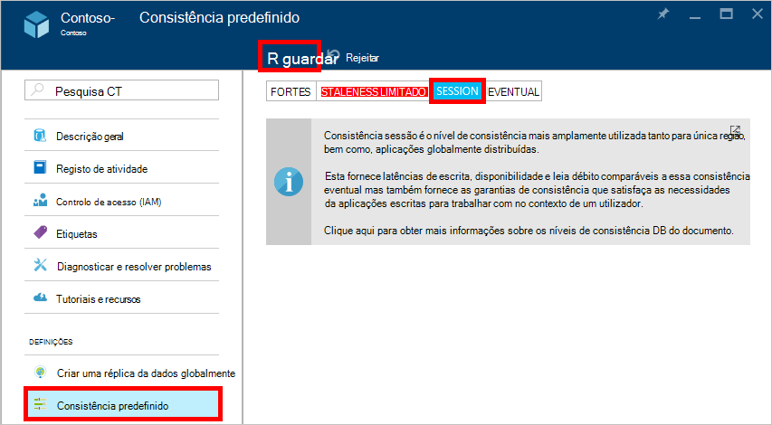

<properties
    pageTitle="Níveis de consistência no DocumentDB | Microsoft Azure"
    description="DocumentDB tem quatro níveis de consistência para o ajudar a consistência eventual saldo, disponibilidade e compromissos latência."
    keywords="consistência eventual, documentdb, azure, Microsoft azure"
    services="documentdb"
    authors="syamkmsft"
    manager="jhubbard"
    editor="cgronlun"
    documentationCenter=""/>

<tags
    ms.service="documentdb"
    ms.workload="data-services"
    ms.tgt_pltfrm="na"
    ms.devlang="na"
    ms.topic="article"
    ms.date="08/24/2016"
    ms.author="syamk"/>

# Níveis de consistência no DocumentDB

Azure DocumentDB destina-se a partir do terreno para cima com distribuição globais deve ter em conta. Destina-se para oferecer previsíveis baixa latência garantias, um SLA de disponibilidade 99,99% e vários modelos de consistência média bem definidos. Atualmente, DocumentDB fornece quatro níveis de consistência: sessão forte, staleness delimitada, e eventuais. Para além de **forte** e a **consistência eventual** modelos frequentemente oferecidos pelo outras bases de dados do NoSQL DocumentDB também oferece duas consistência codificada e cuidadosamente operacionalizada modelos – **delimitada staleness** e **sessão**e tenha validado sua utilidade contra casos de utilização do mundo real. Constituem estes níveis de quatro consistência permitem-lhe tornar bem fundamentados compromissos entre consistência, disponibilidade e latência. 

## Âmbito da consistência

A granularidade da consistência está confinada a um pedido de único utilizador. Um pedido de escrita poderá correspondem a um inserir, substituir, upsert ou eliminar da transação (com ou sem a execução de um acionador de tipo de ficheiro ou mensagem associado). Ou um pedido de escrita pode corresponder à execução de um procedimento de JavaScript armazenado operativo através de vários documentos dentro de uma partição transaccional. Tal como acontece com o escreve uma transação da leitura/consulta também está confinada a um pedido de único utilizador. O utilizador poderá ser necessário paginar através de um grande conjunto de resultados, que abrangem vários partições, mas cada ler transação está confinada a uma única página e servida a partir de dentro de uma única partição.

## Níveis de consistência

Pode configurar um nível de consistência predefinido na sua conta de base de dados que se aplica a todas as coleções de ficheiros (em todas as bases de dados) sob a sua conta de base de dados. Por predefinição, todas as operações de leitura e consultas emitidas relativamente os recursos definidas pelo utilizador utilizará o nível de consistência predefinido especificado na conta de base de dados. No entanto, pode alargar o nível de consistência de um pedido de leitura/consulta específica, especificando o cabeçalho do pedido de [[x ms consistência-nível-]](https://msdn.microsoft.com/library/azure/mt632096.aspx) . Existem quatro tipos de níveis de consistência suportados pelo protocolo de replicação DocumentDB que fornecem uma relação de alternância limpar entre garantias consistência específica e o desempenho, conforme descrito abaixo.

![Bem DocumentDB oferece vários, definidas consistência (média) modelos à escolha][1]

**Forte**: 

- Consistência forte oferece uma garantia [linearizability](https://aphyr.com/posts/313-strong-consistency-models) com o lê garantido a devolução a versão mais recente de um documento. 
- Consistência forte garante que um processo de escrita apenas está visível após está empenhada durável por quórum a maioria das réplicas. Uma operação de escrita está quer modo síncrono empenhada durável pela página principal e quórum de secundários ou é cancelada. Uma operação de leitura é sempre confirmada pela maioria ler quórum, um cliente nunca pode ver uma escrita não consolidada ou parcial e é sempre garante a leitura a escrita reconhecida mais recentes. 
- DocumentDB contas que estão configuradas para utilizarem consistência forte não é possível associar a respetiva conta DocumentDB mais do que uma região Azure. 
- O custo de uma operação de leitura (em termos de [unidades pedido](documentdb-request-units.md) consumidas) com consistência forte é superior a sessão e eventual, mas o mesmo que staleness delimitada.
 

**Bounded staleness**: 

- Delimitada staleness consistência garantias que o lê poderá atraso atrás escritas por no máximo *K* versões ou prefixos de um documento ou *t* intervalo de tempo. 
- Por conseguinte, quando escolher delimitada staleness, "staleness" podem ser configurados de duas maneiras: 
    - Número de versões *K* do documento ao qual o lê atraso atrás o escreve
    - Intervalo de tempo *t* 
- Delimitada staleness ofertas total global da encomenda, exceto dentro da janela"staleness". Tenha em atenção que a leitura monótona garantias existe dentro de uma região no interior e exterior a "staleness janela". 
- Staleness delimitada fornece uma garantia consistência mais forte que sessão ou consistência eventual. Para aplicações globalmente distribuídas, recomendamos que utilize staleness delimitada para cenários onde pretende ter consistência forte, mas também pretende 99,99% de disponibilidade e a latência baixa. 
- DocumentDB contas que estão configuradas com consistência staleness delimitada podem associar a respetiva conta DocumentDB qualquer número de regiões Azure. 
- O custo de uma operação de leitura (em termos RUs consumidas) com staleness delimitada for superior a sessão e consistência eventual, mas o mesmo que consistência forte.

**Sessão**: 

- Ao contrário os modelos de consistência global disponibilizados pelos níveis de consistência staleness forte e é limitado, consistência sessão está confinada a uma sessão de cliente. 
- Consistência sessão é ideal para todos os cenários onde uma sessão de dispositivo ou utilizador está envolvida uma vez que garante a lê monótona, escritas monótona e ler garante a suas própria escritas (RYW). 
- Consistência sessão fornece consistência previsível para uma sessão e máximo lidos débito enquanto a perguntar se a latência escritas mais baixos e lê. 
- DocumentDB contas que estão configuradas com consistência sessão podem associar a respetiva conta DocumentDB qualquer número de regiões Azure. 
- O custo de uma operação de leitura (em termos RUs consumidas) com o nível de consistência da sessão é menor que forte e é limitado staleness, mas consistência eventual mais do que
 

**Eventual**: 

- Consistência eventual garante que na ausência de qualquer escritas suplementares, réplicas dentro do grupo serão eventualmente convergir. 
- Consistência eventual é a forma fracos de consistência onde um cliente poderá obter os valores que são mais antigos do que aqueles tinha viu.
- Consistência eventual fornece a consistência leitura fracos mas oferece a latência mais baixa para operações de leitura e escrita.
- DocumentDB contas que estão configuradas com consistência eventual podem associar a respetiva conta DocumentDB qualquer número de regiões Azure. 
- O custo de uma operação de leitura (em termos RUs consumidas) com a consistência eventual nível é mais baixos de todos os níveis de consistência DocumentDB.

## Garantias de consistência

A tabela seguinte para capturar vários consistência garantias correspondente aos quatro consistência níveis.

| Garantia                                                         |    Fortes                                       |    Staleness delimitada                                                                           |    Sessão                                       |    Eventual                                 |
|----------------------------------------------------------|-------------------------------------------------|------------------------------------------------------------------------------------------------|--------------------------------------------------|--------------------------------------------------|
|    **Total da encomenda global**                                |    Sim                                          |    Sim, fora "janela staleness"                                                      |    Não, ordem parcial "sessão"                   |    N                                            |
|    **Garantia consistentes prefixo**                       |    Sim                                          |    Sim                                                                                         |    Sim                                           |    Sim                                           |
|    **Lê monótona**                                   |    Sim                                          |    Sim, através de regiões fora da janela de staleness e dentro de uma região sempre.     |    Sim, para a sessão determinada                    |    N                                            |
|    **Monótona escritas**                                  |    Sim                                          |    Sim                                                                                         |    Sim                                           |    Sim                                           |
|    **Leia a sua escritas**                                  |    Sim                                          |    Sim                                                                                         |    Sim (na região escrita)                      |    N                                            |

## Configurar o nível de consistência predefinido

1.  No [portal do Azure](https://portal.azure.com/), no Jumpbar, clique em **DocumentDB (NoSQL)**.

2. No pá **DocumentDB (NoSQL)** , selecione a conta de base de dados para modificar.

3. Na pá conta, clique em **predefinição consistência**.

4. Na pá **Consistência predefinido** , selecione o novo nível de consistência e clique em **Guardar**.

    

## Níveis de consistência para consultas

Por predefinição, para os recursos definidas pelo utilizador, o nível de consistência para consultas é o mesmo que o nível de consistência para lê. Por predefinição, o índice é atualizado modo síncrono no cada inserir, substituir ou eliminar de um documento para a coleção. Permite que as consultas satisfazer mesmo nível consistência como que o lê do documento. Enquanto DocumentDB está escrita otimizada e suporta constante volumes de gravações do documento, manutenção de índice remissivo síncrono e servir consultas consistentes, pode configurar determinadas coleções de sites para atualizar o seu índice lazily. Ainda mais a indexação lenta aumenta o desempenho de escrita e é ideal para cenários de ingestão em volume quando uma carga de trabalho é principalmente leitura grossa.  

Modo de indexação|  Lê|  Consultas  
-------------|-------|---------
Consistente (predefinição)|   Selecionar da staleness forte, delimitado, sessão, ou eventual|    Selecionar da staleness forte, delimitado, sessão, ou eventual|
Preguiça|   Selecionar da staleness forte, delimitado, sessão, ou eventual|    Eventual  

Como com pedidos de leitura, pode diminuir o nível de consistência de um pedido de consulta específica, especificando o cabeçalho do pedido de [x ms-consistência nível](https://msdn.microsoft.com/library/azure/mt632096.aspx) .

## Próximos passos

Se quiser fazer ler mais sobre níveis de consistência e concessões, recomendamos que os seguintes recursos:

-   Doug Terry. Consistência dos dados replicada explicados através de basebol (vídeo).   
[https://www.YouTube.com/watch?v=gluIh8zd26I](https://www.youtube.com/watch?v=gluIh8zd26I)
-   Doug Terry. Consistência dos dados replicada explicados através de basebol.   
[http://Research.microsoft.com/pubs/157411/ConsistencyAndBaseballReport.pdf](http://research.microsoft.com/pubs/157411/ConsistencyAndBaseballReport.pdf)
-   Doug Terry. Garantias de sessão para ligeiramente dados replicadas consistentes.   
[http://DL.ACM.org/CITATION.cfm?id=383631](http://dl.acm.org/citation.cfm?id=383631)
-   Diogo Abadi. Consistência responsabilidades no moderna estrutura de sistemas de base de dados são distribuídos normalmente: REMATE é apenas uma parte do bloco ".   
[http://Computer.org/CSDL/mags/co/2012/02/mco2012020037-Abs.HTML](http://computer.org/csdl/mags/co/2012/02/mco2012020037-abs.html)
-   Pedro Bailis, Shivaram Venkataraman, Michael J. continua, Joseph M. Hellerstein, ião Stoica. Probabilística delimitada Staleness (PBS) para práticos quórum parcial.   
[http://VLDB.org/pvldb/vol5/p776_peterbailis_vldb2012.pdf](http://vldb.org/pvldb/vol5/p776_peterbailis_vldb2012.pdf)
-   Werner Vogels. Eventual consistentes - revistas.    
[http://allthingsdistributed.com/2008/12/eventually_consistent.HTML](http://allthingsdistributed.com/2008/12/eventually_consistent.html)

[1]: ./media/documentdb-consistency-levels/consistency-tradeoffs.png
