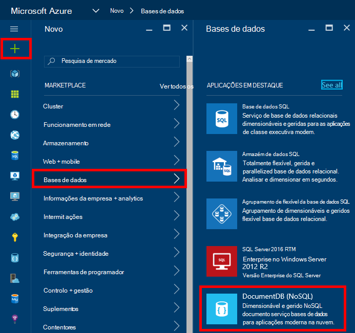
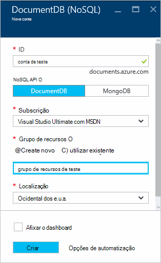
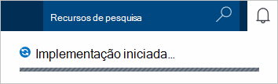
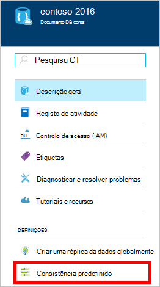
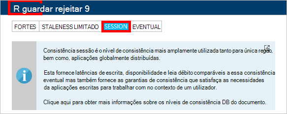

<properties
    pageTitle="Como criar uma conta de DocumentDB | Microsoft Azure"
    description="Crie uma base de dados de NoSQL com Azure DocumentDB. Siga estas instruções para criar uma conta de DocumentDB e começar a construir a sua blazing rápido, escala global NoSQL base de dados." 
    keywords="criar uma base de dados"
    services="documentdb"
    documentationCenter=""
    authors="mimig1"
    manager="jhubbard"
    editor="monicar"/>

<tags
    ms.service="documentdb"
    ms.workload="data-services"
    ms.tgt_pltfrm="na"
    ms.devlang="na"
    ms.topic="get-started-article"
    ms.date="10/17/2016"
    ms.author="mimig"/>

# Como criar uma conta de DocumentDB NoSQL utilizando o portal do Azure

> [AZURE.SELECTOR]
- [Portal do Azure](documentdb-create-account.md)
- [Clip Azure e Gestor de recursos do Azure](documentdb-automation-resource-manager-cli.md)

Para criar uma base de dados com o Microsoft Azure DocumentDB, tem de:

- Tem uma conta Azure. Pode obter uma [conta Azure gratuita](https://azure.microsoft.com/free) se ainda não tiver um. 
- Crie uma conta de DocumentDB.  

Pode criar uma conta de DocumentDB a utilizar o Azure portal, modelos de Gestor de recursos do Azure ou Azure interface de comandos (CLI). Este artigo mostra como criar uma conta de DocumentDB utilizando o portal do Azure. Para criar uma conta utilizando o Gestor de recursos do Azure ou Azure clip, consulte o artigo [DocumentDB automatizar a criação de contas de base de dados](documentdb-automation-resource-manager-cli.md).

Estiver familiarizado com DocumentDB? Veja [Este](https://azure.microsoft.com/documentation/videos/create-documentdb-on-azure/) vídeo de quatro minutos por Scott Hanselman para ver como concluir as tarefas mais comuns no online portal.

1.  Inicie sessão no [portal do Azure](https://portal.azure.com/).
2.  No Jumpbar, clique em **Novo**, clique em **bases de dados**e, em seguida, clique em **DocumentDB (NoSQL)**. 

      

3. Na pá **nova conta** , especifique a configuração da conta DocumentDB pretendida.

    

    - Na caixa **ID** , introduza um nome para identificar a conta DocumentDB.  Quando o **ID** for validado, aparece uma marca de verificação verde na caixa **ID** . O valor de **ID** torna-se o nome do anfitrião URI. O **ID** pode conter apenas minúsculas, números bem como a '-' caráter e tem de estar entre 3 e 50 carateres. Tenha em atenção que *documents.azure.com* é anexado ao nome do ponto final que escolhe, o resultado que torna-se o ponto final de conta de DocumentDB.

    - Na caixa **NoSQL API** , selecione o modelo de programação para utilizar:
        - **DocumentDB**: A API DocumentDB está disponível através do .NET, Java, Node.js, Python e JavaScript [SDK](documentdb-sdk-dotnet.md), bem como HTTP [resto](https://msdn.microsoft.com/library/azure/dn781481.aspx)e oferece um acesso programação para todas as funcionalidades de DocumentDB. 
       
        - **MongoDB**: DocumentDB também oferece [suporte de nível de protocolo](documentdb-protocol-mongodb.md) para **MongoDB** APIs. Quando escolher a opção MongoDB API, pode utilizar o SDK do MongoDB existente e [Ferramentas](documentdb-mongodb-mongochef.md) para falar com DocumentDB. Pode [Mover](documentdb-import-data.md) as aplicações de MongoDB existentes para utilizar DocumentDB, com [sem alterações de código necessário](documentdb-connect-mongodb-account.md)e tirar partido de uma base de dados totalmente gerida como um serviço, com escala ilimitada, replicação global e outras funcionalidades.

    - Para a **subscrição**, selecione a subscrição Azure que pretende utilizar para a conta DocumentDB. Se a sua conta tiver apenas uma subscrição, essa conta está selecionada por predefinição.

    - No **Grupo de recursos**, selecione ou crie um grupo de recursos para a sua conta DocumentDB.  Por predefinição, é criado um novo grupo de recursos. Para mais informações, consulte o artigo [utilizar o portal do Azure para gerir os seus recursos Azure](../articles/azure-portal/resource-group-portal.md).

    - Utilize a **localização** para especificar a localização geográfica em que a sua conta DocumentDB do anfitrião. 

4.  Depois das novas opções de conta DocumentDB estão configuradas, clique em **Criar**. Para verificar o estado da implementação, selecione o concentrador de notificações.  

      

    

5.  Quando a DocumentDB conta estiver criada, está pronto para ser utilizado com as definições predefinidas. A consistência predefinido da conta DocumentDB está definida para **sessão**.  Pode ajustar a consistência predefinido ao clicar em **Consistência predefinido** no menu do recurso. Para saber mais sobre os níveis de consistência oferecidos pelo DocumentDB, consulte o artigo [níveis de consistência no DocumentDB](documentdb-consistency-levels.md).

      

      

[How to: Create a DocumentDB account]: #Howto
[Next steps]: #NextSteps
[documentdb-manage]:../articles/documentdb/documentdb-manage.md

## Próximos passos

Agora que tem uma conta de DocumentDB, o próximo passo é criar uma coleção de DocumentDB e a base de dados. 

Pode criar uma nova coleção de e a base de dados através de um dos seguintes procedimentos:

- O portal Azure, tal como descrito em [criar uma coleção de DocumentDB através do portal Azure](documentdb-create-collection.md).
- Os tutoriais global, que incluem dados de exemplo: [.NET](documentdb-get-started.md), [.NET MVC](documentdb-dotnet-application.md), [Java](documentdb-java-application.md), [Node.js](documentdb-nodejs-application.md)ou [Python](documentdb-python-application.md).
- O [.NET](documentdb-dotnet-samples.md#database-examples), [Node.js](documentdb-nodejs-samples.md#database-examples)ou [Python](documentdb-python-samples.md#database-examples) código de exemplo disponível no GitHub.
- O [.NET](documentdb-sdk-dotnet.md), [Node.js](documentdb-sdk-node.md), [Java](documentdb-sdk-java.md), [Python](documentdb-sdk-python.md)e SDK [restantes](https://msdn.microsoft.com/library/azure/mt489072.aspx) .

Depois de criar a sua base de dados e coleção, tem de [Adicionar documentos](documentdb-view-json-document-explorer.md) para as coleções de ficheiros.

Depois de ter documentos numa coleção, pode utilizar [DocumentDB SQL](documentdb-sql-query.md) para [executar consultas](documentdb-sql-query.md#executing-queries) contra os seus documentos. Pode executar consultas utilizando o [Explorador de consulta](documentdb-query-collections-query-explorer.md) no portal do, a [REST API](https://msdn.microsoft.com/library/azure/dn781481.aspx)ou um do [SDK](documentdb-sdk-dotnet.md).

### Saiba mais

Para saber mais sobre DocumentDB, explore estes recursos:

-   [Caminho de formação para DocumentDB](https://azure.microsoft.com/documentation/learning-paths/documentdb/)
-   [Modelo de Hierárquico Recurso DocumentDB e conceitos](documentdb-resources.md)
