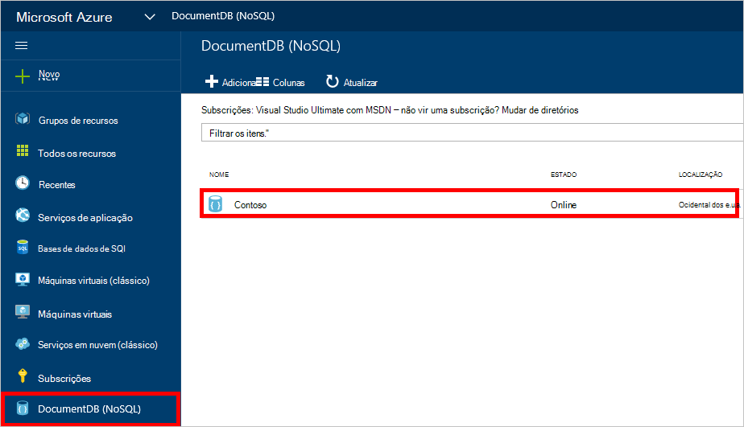
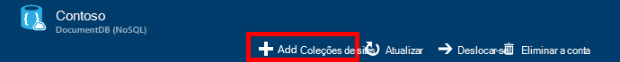
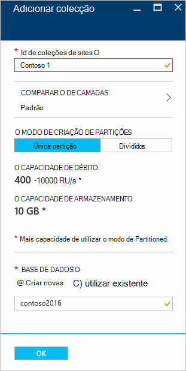
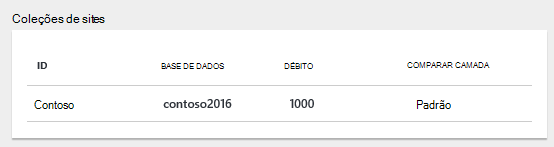
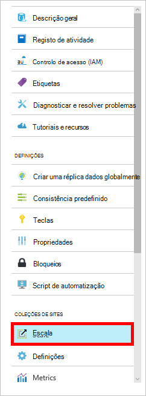

<properties 
    pageTitle="Criar uma base de dados DocumentDB e coleções de sites | Microsoft Azure" 
    description="Saiba como criar NoSQL bases de dados e JSON documento coleções de sites utilizando o portal de serviço online para Azure DocumentDB, base de dados do documento com base num nuvem. Obter uma avaliação gratuita hoje." 
    services="documentdb" 
    authors="mimig1" 
    manager="jhubbard" 
    editor="monicar" 
    documentationCenter=""/>

<tags 
    ms.service="documentdb" 
    ms.workload="data-services" 
    ms.tgt_pltfrm="na" 
    ms.devlang="na" 
    ms.topic="article" 
    ms.date="10/17/2016" 
    ms.author="mimig"/>

# Como criar uma coleção de DocumentDB e a base de dados utilizando o portal do Azure

Para utilizar o Microsoft Azure DocumentDB, tem de ter uma [conta de DocumentDB](documentdb-create-account.md), uma base de dados, uma coleção de e documentos. Este tópico descreve como criar uma coleção de DocumentDB no portal do Azure. 

Não sabe que uma coleção de é? Consulte o artigo [o que é uma coleção de DocumentDB?](#what-is-a-documentdb-collection)

1.  No [portal do Azure](https://portal.azure.com/), no Jumpbar, clique em **DocumentDB (NoSQL)**e, em seguida, no pá **DocumentDB (NoSQL)** , selecione a conta na qual pretende adicionar uma coleção de. Se não tiver todas as contas de listado, terá de [criar uma conta de DocumentDB](documentdb-create-account.md).

    
    
    Se não estiver visível na Jumpbar **DocumentDB (NoSQL)** , clique em **Mais serviços** e, em seguida, clique em **DocumentDB (NoSQL)**. Se não tiver todas as contas de listado, terá de [criar uma conta de DocumentDB](documentdb-create-account.md).

2. Na pá **DocumentDB conta** para a conta selecionada, clique em **Adicionar coleção**.

    

3. Na pá **Adicionar coleção** , na caixa **ID** , introduza o ID de para a nova coleção. Nomes de coleções de sites tem de estar entre 1 e 255 carateres e não pode conter `/ \ # ?` ou um espaço à direita. Quando o nome for validado, aparece uma marca de verificação verde na caixa ID.

    

4. Por predefinição, os **Preços camada** estiver definida como **padrão** para que pode personalizar a débito e armazenamento para a sua coleção. Para mais informações sobre a camada comparar, consulte o artigo [níveis de desempenho no DocumentDB](documentdb-performance-levels.md).  

5. Selecione um **modo de divisão** para a coleção, **Partição única** ou **Partitioned**. 

    Uma **única partição** tem uma capacidade de armazenamento reservadas de 10 GB e pode ter débito níveis de unidades de pedido de 10.000 400/segundo (RU/s). Um RU corresponde ao débito de uma operação de leitura de um documento de 1KB. Para mais informações sobre unidades pedido, consulte o artigo [unidades pedido](documentdb-request-units.md). 

    Uma **coleção de com partições** pode dimensionar para processar uma quantidade ilimitada de armazenamento sobre múltiplas partições e pode ter níveis de débito começando na 10,100 RU/s. No portal do, o armazenamento maior que pode reservar é 250 GB e o débito a maior parte dos que pode reservar é 250.000 RU/s. Para aumentar a quota de um dos, enviar um pedido de conforme descrito no [pedido de aumentado DocumentDB as quotas de conta](documentdb-increase-limits.md). Para obter mais informações acerca de colecções com partições, consulte o artigo [única partição e colecções com partições](documentdb-partition-data.md#single-partition-and-partitioned-collections).

    Por predefinição, o débito para uma nova coleção de única partição está definido para 1000 RU/s com uma capacidade de armazenamento de 10 GB. Para uma coleção de com partições, o débito coleção está definido para 10100 RU/s com uma capacidade de armazenamento de 250 GB. Pode alterar o débito e o armazenamento da coleção de depois da coleção de é criada. 

6. Se estiver a criar uma coleção de com partições, selecione a **Partições chave** para a coleção. Selecionar a chave de partição correctos é importante na criação de uma coleção de performant. Para mais informações sobre como seleccionar uma chave de partição, consulte o artigo [Estruturar para criar partições](documentdb-partition-data.md#designing-for-partitioning).

7. No pá **base de dados** , criar uma nova base de dados ou utilize um já existente. Nomes de base de dados tem de estar entre 1 e 255 carateres e não pode conter `/ \ # ?` ou um espaço à direita. Para validar o nome, clique fora da caixa de texto. Quando o nome for validado, aparece uma marca de verificação verde na caixa.

8. Clique em **OK** na parte inferior do ecrã para criar a nova coleção. 

9. A nova coleção agora aparece na lente de **coleções de sites** , pá a **Descrição geral** .
 
    

10. **Opcional:** Para modificar o débito da coleção de no portal do, clique em **escala** no menu de recursos. 

    

## O que é uma coleção de DocumentDB? 

Uma coleção de é um contentor de documentos JSON e lógica da aplicação de JavaScript associada. Uma coleção de é uma entidade cobrar, onde o [custo](documentdb-performance-levels.md) é determinada pelo débito aprovisionado da coleção de. Coleções de sites podem abranger um ou mais partições/servidores e podem Dimensionar para processar volumes praticamente ilimitados de armazenamento ou débito.

Coleções de sites são automaticamente divididas numa ou mais servidores físicos por DocumentDB. Quando cria uma coleção, pode especificar o débito aprovisionado em termos de unidades pedido por segundo e uma propriedade de chave partição. O valor desta propriedade será utilizado por DocumentDB para distribuir documentos entre a partições e encaminhar os pedidos de como consultas. O valor de chave partição também funciona como o limite da transação para procedimentos armazenados e accionadores. Cada coleção tem uma quantidade reservada de débito específica para essa coleção que não é partilhada com outras coleções de sites na mesma conta. Por isso, é possível dimensionar a aplicação tanto em termos de armazenamento e débito. 

Coleções de sites não são iguais como tabelas em bases de dados relacionais. Coleções de sites não impõem esquema, na verdade DocumentDB não impor quaisquer esquemas, é uma base de dados de esquema de royalties. Por conseguinte, pode armazenar diferentes tipos de documentos com esquemas diversificados na mesma colecção de. Pode optar por utilizar coleções de sites para armazenar os objetos de um único tipo como faria com tabelas. O modelo melhor depende apenas como os dados são apresentados em conjunto em consultas e as transações.

## Outras formas de criar uma coleção de DocumentDB

Não tem de ser criado utilizando o portal coleções de sites, também pode criá-las utilizando o [SDK DocumentDB](documentdb-sdk-dotnet.md) e os REST API. 

- Para uma amostra c# código, consulte as [c# amostras de coleções de sites](documentdb-dotnet-samples.md#collection-examples). 
- Para uma amostra de código Node.js, consulte os [exemplos da coleção de Node.js](documentdb-nodejs-samples.md#collection-examples).
- Para uma amostra de código Python, consulte o artigo [exemplos de coleções de sites Python](documentdb-python-samples.md#collection-examples).
- Para uma amostra de REST API, consulte o artigo [criar uma coleção de](https://msdn.microsoft.com/library/azure/mt489078.aspx).

## Resolução de problemas

Se **Adicionar colecção** estiver desativado no portal do Azure, isso significa que a conta atualmente estiver desactivada, o que normalmente acontece quando todas as créditos de benefícios do mês são utilizados.   

## Próximos passos

Agora que tem uma coleção de, o próximo passo é adicionar documentos ou importar documentos para a coleção. Quando chegar ao adicionar documentos a uma coleção de, tem algumas opções:

- Pode [Adicionar documentos](documentdb-view-json-document-explorer.md) com o Explorador de documentos no portal.
- Pode [importar documentos e dados](documentdb-import-data.md) utilizando a ferramenta de migração do DocumentDB dados, que permite-lhe importar ficheiros JSON e CSV, bem como os dados a partir do SQL Server, MongoDB, armazenamento de tabela do Azure e noutras coleções de DocumentDB. 
- Ou pode adicionar documentos ao utilizar um do [SDK DocumentDB](documentdb-sdk-dotnet.md). DocumentDB tem .NET, Java, Python, Node.js e SDK de API JavaScript. Para c# exemplos de código que mostra como trabalhar com documentos ao utilizar o DocumentDB .NET SDK, consulte os [exemplos de documento c#](documentdb-dotnet-samples.md#document-examples). Para obter exemplos de código Node.js que mostra como trabalhar com documentos utilizando o SDK do Node.js DocumentDB, consulte o artigo as [amostras de documento Node.js](documentdb-nodejs-samples.md#document-examples).

Depois de ter documentos numa coleção, pode utilizar [DocumentDB SQL](documentdb-sql-query.md) para [executar consultas](documentdb-sql-query.md#executing-queries) contra os seus documentos utilizando o [Explorador de consulta](documentdb-query-collections-query-explorer.md) no portal do, a [REST API](https://msdn.microsoft.com/library/azure/dn781481.aspx)ou um do [SDK](documentdb-sdk-dotnet.md). 
