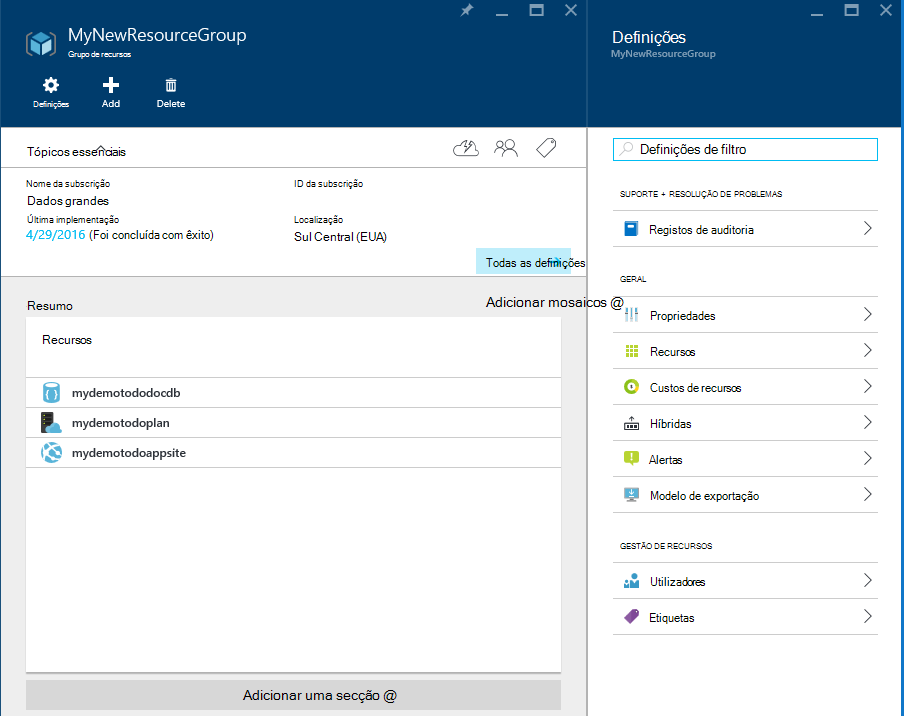

<properties 
    pageTitle="Implementar DocumentDB e Azure aplicação de serviço Web Apps utilizando um modelo de Gestor de recursos do Azure | Microsoft Azure" 
    description="Saiba como implementar uma conta de DocumentDB, Azure aplicação de serviço Web Apps e uma aplicação web de exemplo utilizando um modelo de Gestor de recursos do Azure." 
    services="documentdb, app-service\web" 
    authors="h0n" 
    manager="jhubbard" 
    editor="monicar" 
    documentationCenter=""/>

<tags 
    ms.service="documentdb" 
    ms.workload="data-services" 
    ms.tgt_pltfrm="na" 
    ms.devlang="na" 
    ms.topic="article" 
    ms.date="08/02/2016" 
    ms.author="hawong"/>

# Implementar DocumentDB e Azure aplicação de serviço Web Apps utilizando um modelo de Gestor de recursos do Azure

Este tutorial mostra-lhe como utilizar um modelo de Gestor de recursos do Azure para implementar e integrar [Microsoft Azure DocumentDB](https://azure.microsoft.com/services/documentdb/), uma aplicação web do [Serviço de aplicação do Azure](http://go.microsoft.com/fwlink/?LinkId=529714) e uma aplicação web do exemplo.

Utilizar o Gestor de recursos do Azure modelos, pode facilmente automatizar a implementação e configuração dos seus recursos Azure.  Este tutorial mostra como implementar uma aplicação web e configurar automaticamente informações de ligação de conta DocumentDB.

Depois de concluir este tutorial, irá conseguir responda às seguintes questões:  

-   Como posso utilizar um modelo de Gestor de recursos do Azure para implementar e integrar uma conta de DocumentDB e uma aplicação web na aplicação de serviço de Azure?
-   Como posso utilizar um modelo de Gestor de recursos do Azure para implementar e integrar uma conta de DocumentDB, uma aplicação web na aplicação de serviço Web Apps e uma aplicação Webdeploy?

## Pré-requisitos
> [AZURE.TIP] Enquanto este tutorial não partem do pressuposto de experiência prévia com modelos de Gestor de recursos do Azure ou JSON, deverá que pretende modificar os modelos referenciados ou opções de implementação, em seguida, dados de conhecimento de cada uma das seguintes áreas serão necessários.

Antes de seguir as instruções neste tutorial, certifique-se de que tem o seguinte procedimento:

- Uma subscrição do Azure. Azure é uma plataforma com base em subscrição.  Para mais informações sobre como obter uma subscrição, consulte o artigo [Opções de compra](https://azure.microsoft.com/pricing/purchase-options/), o [Membro oferece](https://azure.microsoft.com/pricing/member-offers/)ou a [Versão de avaliação gratuita](https://azure.microsoft.com/pricing/free-trial/).

##Passo 1: Transferir os ficheiros de modelo ##
Vamos começar por transferir os ficheiros de modelo que utilizamos neste tutorial.

1. Transferir o modelo de [criar uma conta de DocumentDB, aplicações Web e implementar uma amostra da aplicação de demonstração](https://portalcontent.blob.core.windows.net/samples/DocDBWebsiteTodo.json) para uma pasta local (por exemplo, C:\DocumentDBTemplates). Este modelo irá implementar uma conta de DocumentDB, uma aplicação web do serviço de aplicação e uma aplicação web.  Configurará automaticamente a aplicação web para ligar à conta DocumentDB.

2. Transferir o modelo de [criação de uma conta de DocumentDB e aplicações Web do exemplo](https://portalcontent.blob.core.windows.net/samples/DocDBWebSite.json) para uma pasta local (por exemplo, C:\DocumentDBTemplates). Este modelo irá implementar uma conta de DocumentDB, uma aplicação de serviço web app e irá modificar as definições de aplicação do site para a superfície facilmente DocumentDB informações de ligação, mas não inclui uma aplicação web.  

##Passo 2: Implementar a conta DocumentDB, a aplicação de serviço web app e demonstração aplicação exemplo

Agora vamos implementar o nosso primeiro modelo.

> [AZURE.TIP] O modelo não validar que o nome da aplicação web e nome da conta DocumentDB introduzido abaixo são uma) válidos e b) disponíveis.  É vivamente recomendado que verificar a disponibilidade dos nomes de que planear fornecer antes de a submeter a implementação.

1. Inicie sessão no [Portal do Azure](https://portal.azure.com), clique em novo e procurar "Implementação do modelo".
    

2. Selecione o item de implementação do modelo e clique em **Criar**
    

3.  Clique em **Editar modelo**, cole o conteúdo do ficheiro de modelo DocDBWebsiteTodo.json e clique em **Guardar**.
    

4. Clique em **Editar parâmetros**, forneça os valores para cada um dos parâmetros obrigatórios e clique em **OK**.  Os parâmetros são da seguinte forma:

    1. Nome do site: Especifica o nome da aplicação de serviço web app e é utilizado para construir o URL que irá utilizar para aceder à aplicação web (por exemplo, se especificar "mydemodocdbwebapp", em seguida, o URL pelo qual irá aceder a aplicação web será mydemodocdbwebapp.azurewebsites.net).

    2. HOSTINGPLANNAME: Especifica o nome do plano de alojamento de aplicação de serviço para criar.

    3. LOCALIZAÇÃO: Especifica o Azure localização na qual pretende criar a DocumentDB e web recursos da aplicação.

    4. DATABASEACCOUNTNAME: Especifica o nome da conta DocumentDB para criar.   

    

5. Selecione um grupo de recursos existente ou fornecer um nome para tornar um novo grupo de recursos e selecione uma localização para o grupo de recursos.
    
  
6.  Clique em **termos legais rever**, **compras**e, em seguida, clique em **Criar** para começar a implementação.  Selecione **Afixar ao dashboard** para a implementação resultante é facilmente visível na sua home page do portal Azure.
    

7.  Quando termina a implementação, será aberto o pá de grupo de recursos.
      

8.  Para utilizar a aplicação, basta navegue para o URL do web app (no exemplo acima, o URL seria http://mydemodocdbwebapp.azurewebsites.net).  Verá a aplicação web do seguinte:

    

9. Ir para a frente e criar algumas das tarefas no web app e, em seguida, regressar à pá do grupo de recursos no portal do Azure. Clique em recurso DocumentDB conta na lista de recursos e, em seguida, clique em **Explorador da consulta**.
      

10. Executar a consulta predefinida, "SELECT *FROM c" e inspecionar os resultados.  Repare que a consulta tem obtidos a representação de JSON dos itens todo que criou no passo 7 acima.  Esteja à vontade experimentar com consultas; Por exemplo, tente executar SELECIONE* a partir do c onde c.isComplete = true para devolver todos os itens de todo que foram marcados como concluídos.

    

11. Esteja à vontade explorar a experiência de portal DocumentDB ou modificar a aplicação de Todo de exemplo.  Quando estiver pronto, vamos implementar outro modelo.
    
 
## Passo 3: Implementar a amostra de aplicação documento conta e web

Agora vamos implementar os nossos segundo modelo.  Este modelo é útil para mostrar como pode inserir informações de ligação DocumentDB como o ponto final de conta e o modelo global de chave numa aplicação web como as definições da aplicação ou como uma cadeia de ligação personalizado. Por exemplo, talvez tenha a própria aplicação web que pretender para implementar com uma conta de DocumentDB e ter as informações de ligação preenchidas automaticamente durante a implementação.

> [AZURE.TIP] O modelo não validar que o nome da aplicação web e nome da conta DocumentDB introduzido abaixo são uma) válidos e b) disponíveis.  É vivamente recomendado que verificar a disponibilidade dos nomes de que planear fornecer antes de a submeter a implementação.

1. No [Portal do Azure](https://portal.azure.com), clique em novo e procure "Implementação do modelo".
    

2. Selecione o item de implementação do modelo e clique em **Criar**
    

3.  Clique em **Editar modelo**, cole o conteúdo do ficheiro de modelo DocDBWebSite.json e clique em **Guardar**.
    

4. Clique em **Editar parâmetros**, forneça os valores para cada um dos parâmetros obrigatórios e clique em **OK**.  Os parâmetros são da seguinte forma:

    1. Nome do site: Especifica o nome da aplicação de serviço web app e é utilizado para construir o URL que irá utilizar para aceder à aplicação web (por exemplo, se especificar "mydemodocdbwebapp", em seguida, o URL pelo qual irá aceder a aplicação web será mydemodocdbwebapp.azurewebsites.net).

    2. HOSTINGPLANNAME: Especifica o nome do plano de alojamento de aplicação de serviço para criar.

    3. LOCALIZAÇÃO: Especifica o Azure localização na qual pretende criar a DocumentDB e web recursos da aplicação.

    4. DATABASEACCOUNTNAME: Especifica o nome da conta DocumentDB para criar.   

    

5. Selecione um grupo de recursos existente ou fornecer um nome para tornar um novo grupo de recursos e selecione uma localização para o grupo de recursos.
    
  
6.  Clique em **termos legais rever**, **compras**e, em seguida, clique em **Criar** para começar a implementação.  Selecione **Afixar ao dashboard** para a implementação resultante é facilmente visível na sua home page do portal Azure.
    

7.  Quando termina a implementação, será aberto o pá de grupo de recursos.
      

8. Clique em recurso Web App na lista de recursos e, em seguida, clique em **definições da aplicação**
      

9. Tenha em atenção como se existem definições da aplicação apresentar para o ponto final DocumentDB e cada uma das chaves DocumentDB modelo global.
      

10. Esteja à vontade continuar a explorar o Portal do Azure ou siga um dos nossos DocumentDB [amostras](http://go.microsoft.com/fwlink/?LinkID=402386) para criar a sua própria aplicação DocumentDB.

    
    

## Próximos passos

Parabéns! Tenha implementado DocumentDB, a aplicação de serviço web app e uma aplicação web de exemplo utilizar modelos de Gestor de recursos do Azure.

- Para saber mais sobre DocumentDB, clique [aqui](http://azure.com/docdb).
- Para saber mais sobre aplicações de serviço Web do Azure App, clique [aqui](http://go.microsoft.com/fwlink/?LinkId=325362).
- Para saber mais acerca dos modelos de Gestor de recursos do Azure, clique [aqui](https://msdn.microsoft.com/library/azure/dn790549.aspx).

## O que é alterado
* Para um guia para a alteração de Web sites para a aplicação de serviço Consulte o artigo: [aplicação de serviço de Azure e respectivo impacto na existente dos serviços do Azure](http://go.microsoft.com/fwlink/?LinkId=529714)
* Para um guia para a alteração do portal antigo para o novo portal consulte o artigo: [referência para navegar Portal clássica do Azure](http://go.microsoft.com/fwlink/?LinkId=529715)

>[AZURE.NOTE] Se pretender começar a aplicação de serviço de Azure antes de inscrever-se para uma conta do Azure, aceda ao [Tentar aplicação de serviço](http://go.microsoft.com/fwlink/?LinkId=523751), onde imediatamente pode criar uma aplicação web do starter curto na aplicação de serviço. Sem cartões de crédito necessários; sem compromissos.
 
