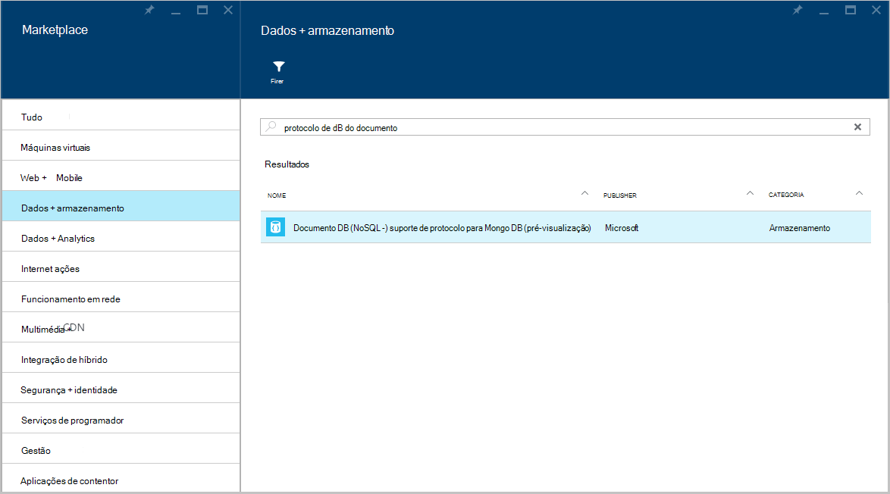
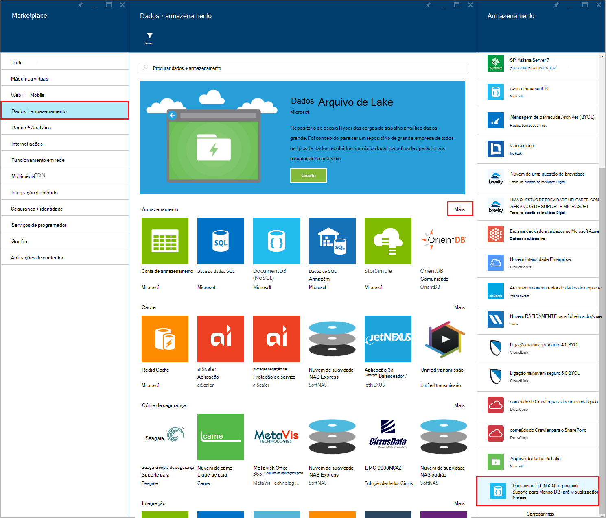
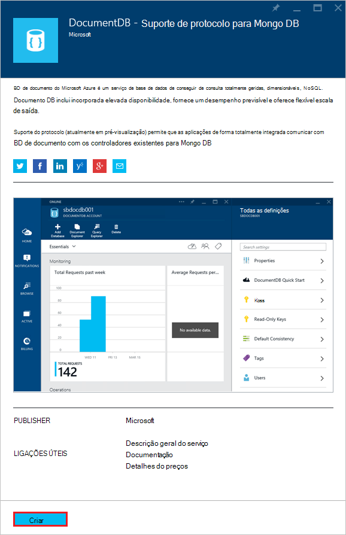
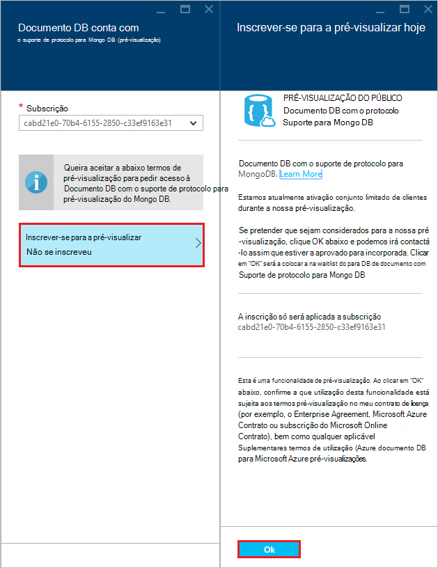
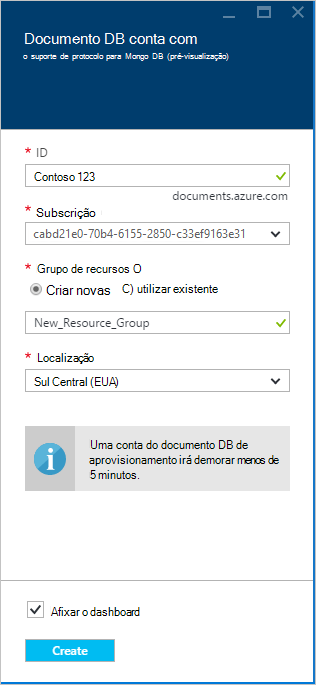
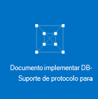
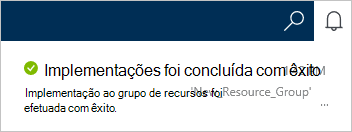
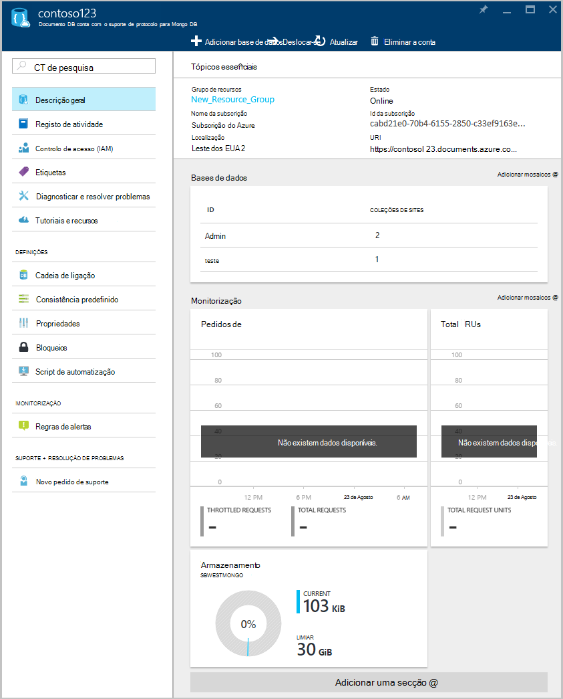

<properties 
    pageTitle="Criar uma conta de DocumentDB com suporte de protocolo para MongoDB | Microsoft Azure" 
    description="Saiba como criar uma conta de DocumentDB com o suporte de protocolo para MongoDB, agora disponível para a pré-visualização." 
    services="documentdb" 
    authors="AndrewHoh" 
    manager="jhubbard" 
    editor="" 
    documentationCenter=""/>

<tags 
    ms.service="documentdb" 
    ms.workload="data-services" 
    ms.tgt_pltfrm="na" 
    ms.devlang="na" 
    ms.topic="article" 
    ms.date="10/20/2016" 
    ms.author="anhoh"/>

# Como criar uma conta de DocumentDB com suporte de protocolo para MongoDB através do portal Azure

Para criar uma conta Azure DocumentDB com suporte de protocolo para MongoDB, tem de:

- Tem uma conta Azure. Pode obter uma [conta Azure gratuita](https://azure.microsoft.com/free/) se ainda não tiver um.

## Criar a conta  

Para criar uma conta de DocumentDB com suporte de protocolo para MongoDB, execute os passos seguintes.

1. Numa nova janela, inicie sessão no [Portal do Azure](https://portal.azure.com).
2. Clique em **Novo**, clique em **dados + armazenamento**, clique em **Ver todos os**e, em seguida, procure a categoria de **dados + armazenamento** para "DocumentDB protocolo". Clique em **DocumentDB - suporte de protocolo para MongoDB**.

    

3. Em alternativa, na categoria **dados + armazenamento** , em **armazenamento**, clique em **mais**e, em seguida, clique em **carregar mais** uma ou mais vezes para apresentar **DocumentDB - suporte de protocolo para MongoDB**. Clique em **DocumentDB - suporte de protocolo para MongoDB**.

    

4. No pá **DocumentDB - suporte de protocolo para MongoDB (pré-visualização)** , clique em **Criar** para iniciar o processo de inscrição de pré-visualização.

    

5. Na pá **DocumentDB conta** , clique em **Inscrever-se para a pré-visualizar**. Leia as informações e, em seguida, clique em **OK**.

    

6.  Depois de o aceitar os termos de pré-visualização, será devolvido para pá o criar.  Na pá **DocumentDB conta** , especifique a configuração da conta pretendida.

    

    - Na caixa **ID** , introduza um nome para identificar a conta.  Quando o **ID** for validado, aparece uma marca de verificação verde na caixa **ID** . O valor de **ID** torna-se o nome do anfitrião URI. O **ID** pode conter apenas minúsculas, números bem como a '-' caráter e tem de estar entre 3 e 50 carateres. Tenha em atenção que *documents.azure.com* é anexado ao nome do ponto final que escolhe, o resultado que irão tornar-se o seu ponto final de conta.

    - Para a **subscrição**, selecione a subscrição Azure que pretende utilizar para a conta. Se a sua conta tiver apenas uma subscrição, essa conta está selecionada por predefinição.

    - No **Grupo de recursos**, selecione ou crie um grupo de recursos para a conta.  Por predefinição, um grupo de recursos existente na subscrição Azure será escolhido.  No entanto, poderá, selecione a selecionar para criar um novo grupo de recursos ao qual gostaria de adicionar a conta. Para mais informações, consulte o artigo [utilizar o portal do Azure para gerir os seus recursos Azure](resource-group-portal.md).

    - Utilize a **localização** para especificar a localização geográfica nas quais se a conta do anfitrião.
    
    - Opcional: Verificação **Afixar ao dashboard**. Se afixados ao dashboard, siga o **passo 8** abaixo para ver a navegação no lado esquerdo da sua nova conta.

7.  Assim que estiverem configuradas as novas opções de conta, clique em **Criar**.  Pode demorar alguns minutos para criar a conta.  Se afixado ao dashboard, que pode monitorizar o progresso de aprovisionamento de Startboard.  
      

    Se não afixados ao dashboard, que pode monitorizar o progresso da partir do hub notificações.  

      

    

8.  Para aceder à sua nova conta, clique em **DocumentDB (NoSQL)** no menu à esquerda. Na sua lista de DocumentDB normal e DocumentDB com contas de suporte do protocolo Mongo, clique no nome da sua nova conta.

9.  Está agora pronto para ser utilizado com as definições predefinidas. 

    
    

## Próximos passos

- Saiba como para [Ligar](documentdb-connect-mongodb-account.md) a uma conta de DocumentDB com o protocolo de suporte do MongoDB.

 
