<properties 
    pageTitle="Tutorial do ASP.NET MVC para DocumentDB: desenvolvimento de aplicações Web | Microsoft Azure" 
    description="Tutorial do ASP.NET MVC para criar uma aplicação web em MVC utilizando DocumentDB. Irá armazenar JSON e aceder aos dados através de uma aplicação de todo alojada no Azure Web sites - tutorial ASP líquido MVC passo a passo." 
    keywords="tutorial do ASP.NET mvc, desenvolvimento de aplicações web, aplicação web de mvc, tutorial do mvc líquido asp passo a passo"
    services="documentdb" 
    documentationCenter=".net" 
    authors="syamkmsft" 
    manager="jhubbard" 
    editor="cgronlun"/>

<tags 
    ms.service="documentdb" 
    ms.workload="data-services" 
    ms.tgt_pltfrm="na" 
    ms.devlang="dotnet" 
    ms.topic="hero-article" 
    ms.date="08/25/2016" 
    ms.author="syamk"/>

# Do ASP.NET MVC Tutorial: Desenvolvimento de aplicações Web com DocumentDB

> [AZURE.SELECTOR]
- [.NET](documentdb-dotnet-application.md)
- [NODE.js](documentdb-nodejs-application.md)
- [Java](documentdb-java-application.md)
- [Python](documentdb-python-application.md) 

Para realçar como pode eficazmente tirar partido do Azure DocumentDB para armazenar e documentos JSON de consulta, este artigo fornece uma ponto a ponto guia passo a passo mostrando-lhe como criar uma aplicação de todo com Azure DocumentDB. As tarefas serão guardadas como documentos JSON no Azure DocumentDB.

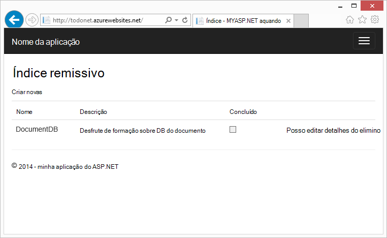

Este guia passo a passo mostra-lhe como utilizar o serviço de DocumentDB fornecido pelo Azure para armazenar e aceder aos dados a partir de uma aplicação web do ASP.NET MVC alojada no Azure. Se procura um tutorial que foca-se apenas em DocumentDB e não os componentes de ASP.NET MVC, consulte o artigo [criar uma aplicação de consola DocumentDB c#](documentdb-get-started.md).

> [AZURE.TIP] Neste tutorial assume que tem experiência prévia utilizando ASP.NET MVC e sites públicos do Azure. Se estiver familiarizado com o ASP.NET ou as [Ferramentas de pré-requisito](#_Toc395637760), recomendamos que o projeto de exemplo completos a ser transferidas a partir do [GitHub][] e seguir as instruções neste exemplo. Assim que a tenha criado, pode rever este artigo para obter conhecimentos aprofundados no código no contexto do projeto.

## Pré-requisitos para este tutorial de base de dados

Antes de seguir as instruções neste artigo, deverá Certifique-se de que tem o seguinte procedimento:

- Uma conta do Azure active. Se não tiver uma conta, pode criar uma conta de avaliação gratuita apenas de duas minutos. Para obter detalhes, consulte o artigo [Versão de avaliação gratuita do Azure](https://azure.microsoft.com/pricing/free-trial/).
- [Visual Studio 2015](http://www.visualstudio.com/) ou Visual Studio 2013 atualização 4 ou superior. Se utilizar o Visual Studio 2013, terá de instalar o [pacote de nuget Microsoft.Net.Compilers](https://www.nuget.org/packages/Microsoft.Net.Compilers/) para adicionar suporte para c# 6.0. 
- Azure SDK para .NET versão 2.5.1 ou superior, disponível através do [Microsoft Web plataforma Installer][].

Todas as capturas de ecrã neste artigo foi reencaminhadas utilizando o Visual Studio 2013 com Update 4 aplicado e o SDK do Azure para .NET versão 2.5.1. Se o seu sistema estiver configurado com diferentes versões é possível que as opções de ecrãs e não correspondem aos completamente, mas se cumprir os pré-requisitos acima esta solução deverá funcionar.

## Passo 1: Criar uma conta de base de dados DocumentDB

Vamos começar por criar uma conta de DocumentDB. Se já tiver uma conta, pode ignorar a [criar uma nova aplicação ASP.NET MVC](#_Toc395637762).

[AZURE.INCLUDE [documentdb-create-dbaccount](../../includes/documentdb-create-dbaccount.md)]

[AZURE.INCLUDE [documentdb-keys](../../includes/documentdb-keys.md)]

 
Vamos agora irá percorrer como criar uma nova aplicação ASP.NET MVC a partir da raiz de segurança. 

## Passo 2: Criar uma nova aplicação MVC do ASP.NET

Agora que tem uma conta, vamos criar o nosso novo projeto ASP.NET.

1. No Visual Studio, no menu **ficheiro** , aponte para **Novo**e, em seguida, clique em **projeto**.

    É apresentada a caixa de diálogo **Novo projeto** .
2. No painel de **tipos de projecto** , expanda **modelos**, **Visual c#**, **Web**e, em seguida, selecione a **Aplicação Web do ASP.NET**.

    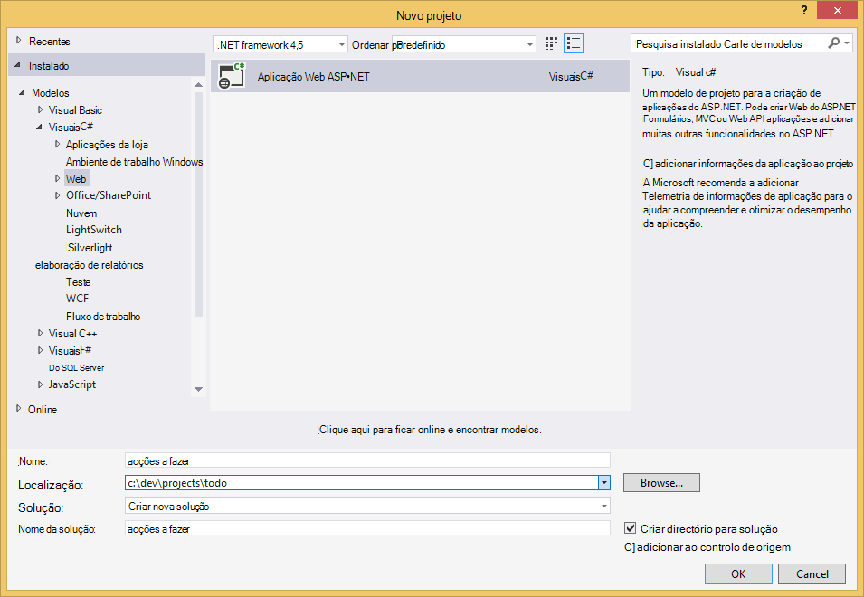

3. Na caixa **nome** , escreva o nome do projeto. Neste tutorial, utiliza o nome "todo". Se optar por utilizar algo que não isto, em seguida, sempre que este tutorial fala sobre o espaço de nomes de todo, terá ajustar os exemplos de código fornecido para utilizar o com o nome da aplicação. 

4. Clique em **Procurar** para navegar para a pasta onde pretende criar o projeto e, em seguida, clique em **OK**.

    É apresentada a caixa de diálogo **Novo projeto de ASP.NET** .

    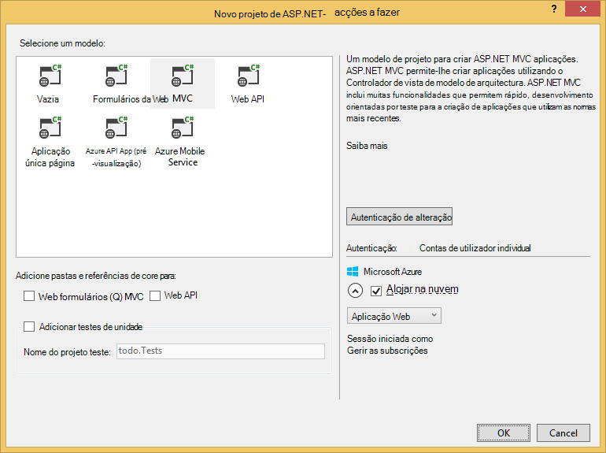

5. No painel de modelos, selecione **MVC**.

6. Se planeia alojamento da sua aplicação no Azure, em seguida, selecione **Host na nuvem** na parte inferior direita de ter Azure que aloja a aplicação. Vamos selecionou para alojar na nuvem e para executar a aplicação alojada num Web site Azure. Se selecionar esta opção preprovision um Web site Azure por si e facilitar vida quando chegar o momento para implementar a aplicação de trabalho final. Se pretender alojar o presente noutro local ou se não quiser configurar o Azure upfront, em seguida, basta desmarcar **anfitrião na nuvem**.

7. Clique em **OK** e permitir que o Visual Studio respetivo desempenham à volta de scaffolding o modelo de ASP.NET MVC vazio. 

8. Caso tenha optado por alojar isto na nuvem verá, pelo menos, um ecrã adicional pedir-lhe para iniciar sessão para a sua conta Azure e fornecem alguns valores para o novo Web site. Forneça os valores adicionais e continue. 

    Posso ainda não tiver escolhido "servidor de bases de dados" aqui, uma vez que recomendamos não estiver a utilizar um servidor de base de dados do SQL Azure aqui, iremos estar a criar uma nova conta do Azure DocumentDB mais tarde no Portal do Azure.

    Para mais informações sobre como escolher uma **aplicação de serviço de plano** e o **grupo de recursos**, consulte o artigo [Descrição geral de aprofundada de planos do serviço de aplicação do Azure](../app-service/azure-web-sites-web-hosting-plans-in-depth-overview.md).

    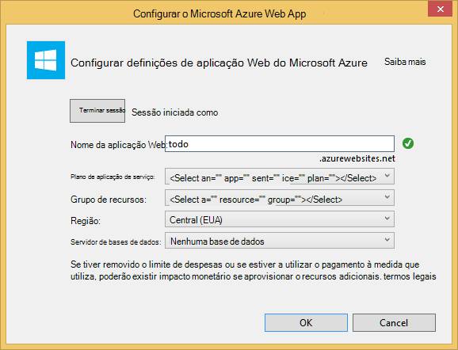

9. Assim que o Visual Studio concluiu a criação do texto automático aplicação MVC tiver uma aplicação vazia do ASP.NET que pode executar localmente.

    Vamos vai ignorar a executar o projecto localmente porque tenho a certeza de que visualizou todos ASP.NET "Olá mundo" aplicação. Vamos ir diretamente para adicionar DocumentDB para este projeto e de construção de nossa aplicação.

## Passo 3: Adicionar DocumentDB ao seu projeto de aplicação web MVC

Agora que temos a maior parte de canalização de ASP.NET MVC precisamos para esta solução, vamos para obter o objetivo real neste tutorial, adicionar Azure DocumentDB a nossa aplicação web do MVC.

1. O .NET SDK DocumentDB é embalado e distribuído como um pacote de NuGet. Para obter o pacote de NuGet no Visual Studio, utilize o Gestor de pacote de NuGet no Visual Studio ao clicar no projeto no **Explorador de solução** e, em seguida, clicar em **Gerir pacotes de NuGet**.

    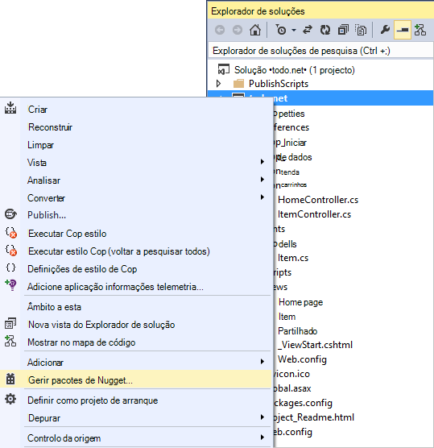

    É apresentada a caixa de diálogo **Gerir pacotes de NuGet** .

2. Na caixa de NuGet **Procurar** , escreva ***Azure DocumentDB***.
    
    Dos resultados da, instale o pacote de **Biblioteca de documentos do Microsoft Azure DocumentDB cliente** . Isto irá transfira e instale o pacote de DocumentDB, bem como todas as dependências, como Newtonsoft.Json. Clique em **OK** na janela de **pré-visualização** e **posso aceitar** na janela de **Aceitação de licença** para concluir a instalação.

    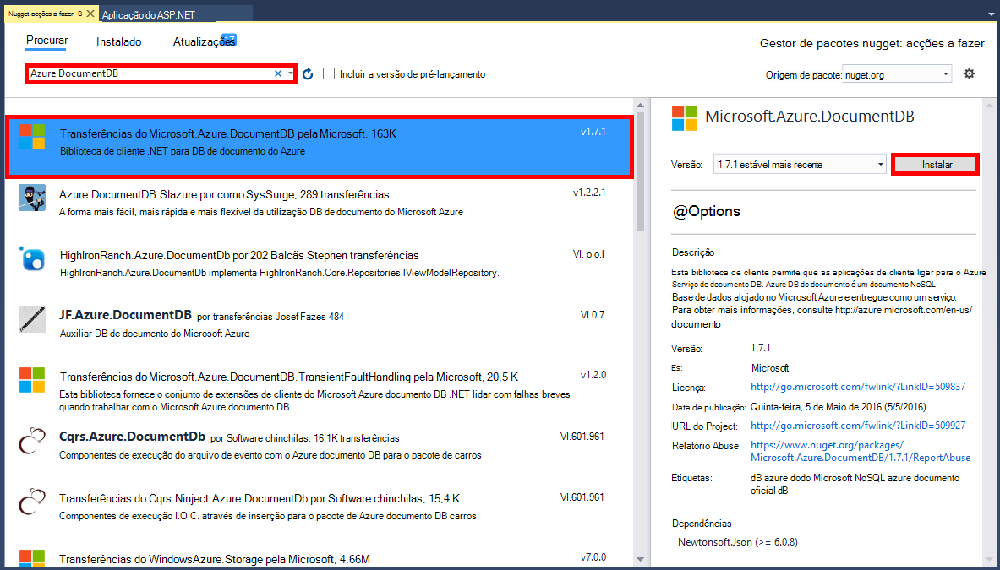

    Em alternativa pode utilizar a consola do Gestor de pacote para instalar o pacote. Para fazê-lo, no menu **Ferramentas** , clique em **Gestor de pacote NuGet**e, em seguida, clique em **Consola do Gestor de pacote**. Na linha de comandos, escreva o seguinte.

        Install-Package Microsoft.Azure.DocumentDB

3. Quando o pacote estiver instalado, a solução do Visual Studio deverá assemelhar-se as seguintes ações com duas novas referências adicionadas, Microsoft.Azure.Documents.Client e Newtonsoft.Json.

    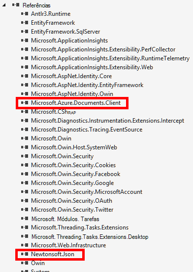

##Passo 4: Configurar a aplicação MVC do ASP.NET
 
Agora vamos adicionar controladores, vistas e modelos para esta aplicação MVC:

- [Adicionar um modelo](#_Toc395637764).
- [Adicionar um controlador](#_Toc395637765).
- [Vistas de adicionar](#_Toc395637766).

### Adicionar um modelo de dados JSON

Comecemos por criar o **M** no MVC, o modelo. 

1. No **Explorador de soluções**, com o botão direito na pasta **modelos** , clique em **Adicionar**e, em seguida, clique em **classe**.

    É apresentada a caixa de diálogo **Adicionar Novo Item** .

2. Atribuir um nome a sua aula nova **Item.cs** e clique em **Adicionar**. 

3. Neste ficheiro **Item.cs** novos, adicione o seguinte após a última *utilizando instrução*.
        
        using Newtonsoft.Json;
    
4. Agora substituir este código 
        
        public class Item
        {
        }

    com o código seguinte.

        public class Item
        {
            [JsonProperty(PropertyName = "id")]
            public string Id { get; set; }
             
            [JsonProperty(PropertyName = "name")]
            public string Name { get; set; }

            [JsonProperty(PropertyName = "description")]
            public string Description { get; set; }

            [JsonProperty(PropertyName = "isComplete")]
            public bool Completed { get; set; }
        }

    Todos os dados no DocumentDB é transmitido sobre o fio e armazenados como JSON. Para controlar a forma como os objetos são serializado/serialização anulada pelo JSON.NET pode utilizar o atributo **JsonProperty** conforme demonstrado na classe de **Item** que acabou de criar. Se não **tem** de fazer esta mas quiser garantir que o meu propriedades cumprem as convenções de nomenclatura de camelCase JSON. 
    
    Não, só pode pode controlar o formato do nome da propriedade quando-informações compõem JSON, mas pode totalmente mudar o nome de propriedades da .NET como posso fazer com a propriedade de **Descrição** . 
    

### Adicionar um controlador

Que tratará de **M**, agora vamos criar o **C** no MVC, uma classe controlador.

1. No **Explorador de soluções**, com o botão direito na pasta de **controladores de** , clique em **Adicionar**e, em seguida, clique em **controlador de**.

    É apresentada a caixa de diálogo **Adicionar Scaffold** .

2. Selecione **MVC controlador de 5 - vazia** e, em seguida, clique em **Adicionar**.

    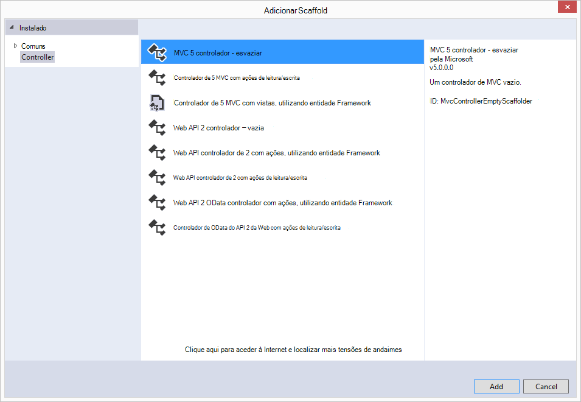

3. Nome do seu novo controlador, **ItemController.**

    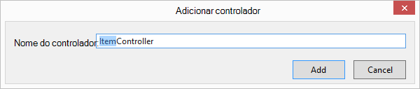

    Assim que o ficheiro é criado, a solução do Visual Studio deverá assemelhar-se a seguinte com o novo ficheiro ItemController.cs no **Explorador de soluções**. O novo ficheiro Item.cs criado anteriormente também é apresentado.

    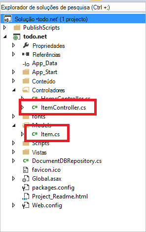

    Pode fechar ItemController.cs, podemos irá regresse ao-la mais tarde. 

### Adicionar vistas

Agora, vamos criar o **V** no MVC, as vistas:

- [Adicionar uma vista de índice do Item](#AddItemIndexView).
- [Adicionar uma vista de novo Item](#AddNewIndexView).
- [Adicionar uma vista de Editar Item](#_Toc395888515).

#### Adicionar uma vista de índice do Item

1. No **Explorador de soluções**, expanda a pasta de **vistas** , com o botão direito a pasta de **itens** vazia que Visual Studio criado por si quando adicionou o **ItemController** anteriormente, clique em **Adicionar**e, em seguida, clique em **Ver**.

    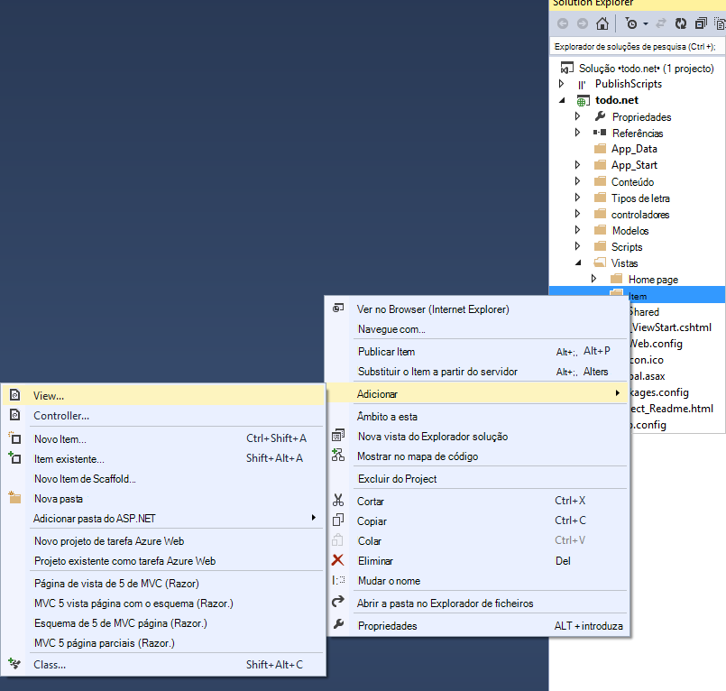

2. Na caixa de diálogo **Adicionar vista** , faça o seguinte:
    - Na caixa **nome** da vista, escreva o ***índice remissivo***.
    - Na caixa **modelo** , selecione ***lista***.
    - Na caixa de **classe do modelo** , selecione ***Item (todo. Modelos)***.
    - Deixe a caixa de **classe de contexto de dados** vazia. 
    - Na caixa de página esquema, escreva ***~/Views/Shared/_Layout.cshtml***.
    
    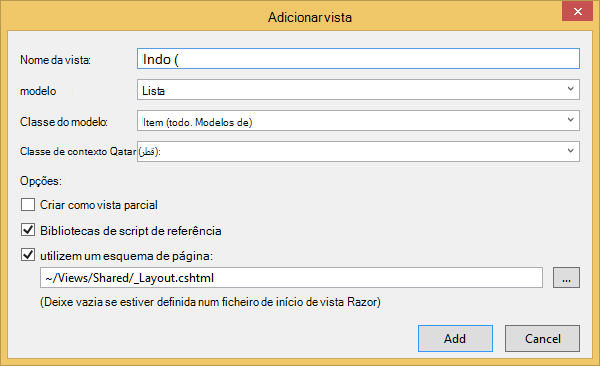

3. Depois de todos os estes valores são definidos, clique em **Adicionar** e permitir que o Visual Studio crie uma nova vista de modelo. Depois de o fazer, abrirá o ficheiro de cshtml que foi criado. Vamos pode fechar esse ficheiro no Visual Studio como podemos irão voltar ao mesmo mais tarde.

#### Adicionar uma vista de novo Item

Semelhante a como criámos numa vista de **Índice do Item** , vamos agora criará uma nova vista para a criação de novos **itens**.

1. No **Explorador de soluções**, botão direito do rato na pasta de **Item** novamente, clique em **Adicionar**e, em seguida, clique em **Ver**.

2. Na caixa de diálogo **Adicionar vista** , faça o seguinte:
    - Na caixa **nome** da vista, escreva o ***Criar***.
    - Na caixa **modelo** , selecione ***Criar***.
    - Na caixa de **classe do modelo** , selecione ***Item (todo. Modelos)***.
    - Deixe a caixa de **classe de contexto de dados** vazia.
    - Na caixa de página esquema, escreva ***~/Views/Shared/_Layout.cshtml***.
    - Clique em **Adicionar**.

#### Adicionar uma vista de Editar Item

E por fim, adicione uma última vista para edição de um **Item** da mesma forma como antes.

1. No **Explorador de soluções**, botão direito do rato na pasta de **Item** novamente, clique em **Adicionar**e, em seguida, clique em **Ver**.

2. Na caixa de diálogo **Adicionar vista** , faça o seguinte:
    - Na caixa **nome** da vista, escreva a ***Editar***.
    - Na caixa **modelo** , selecione ***Editar***.
    - Na caixa de **classe do modelo** , selecione ***Item (todo. Modelos)***.
    - Deixe a caixa de **classe de contexto de dados** vazia. 
    - Na caixa de página esquema, escreva ***~/Views/Shared/_Layout.cshtml***.
    - Clique em **Adicionar**.

Quando este estiver concluída, feche todos os documentos cshtml no Visual Studio como podemos irá regressar estas vistas mais tarde.

## Passo 5: Eléctricos o DocumentDB

Agora que está a tratar os conteúdos MVC padrão do, vamos ativar para adicionar o código para DocumentDB. 

Nesta secção, adicionaremos código para processar o seguinte procedimento:

- [Listar itens incompletos](#_Toc395637770).
- [Adicionar itens](#_Toc395637771).
- [Editar itens](#_Toc395637772).

### Listar itens incompletos na sua aplicação web do MVC

A primeira coisa a fazer aqui é adicionada uma classe que contém todos os a lógica para ligar e utilizar DocumentDB. Para este tutorial podemos irá incorporar todos os este lógica para uma classe de repositório denominada DocumentDBRepository. 

1. No **Explorador de soluções**, com o botão direito no projeto, clique em **Adicionar**e, em seguida, clique em **classe**. Atribua um nome da nova classe **DocumentDBRepository** e clique em **Adicionar**.
 
2. Na recentemente criado **DocumentDBRepository** classe e adicione as seguintes *utilizando declarações* acima da declaração de *espaço de nomes*
        
        using Microsoft.Azure.Documents; 
        using Microsoft.Azure.Documents.Client; 
        using Microsoft.Azure.Documents.Linq; 
        using System.Configuration;
        using System.Linq.Expressions;
        using System.Threading.Tasks;

    Agora substituir este código 

        public class DocumentDBRepository
        {
        }

    com o código seguinte.

        public static class DocumentDBRepository<T> where T : class
        {
            private static readonly string DatabaseId = ConfigurationManager.AppSettings["database"];
            private static readonly string CollectionId = ConfigurationManager.AppSettings["collection"];
            private static DocumentClient client;
    
            public static void Initialize()
            {
                client = new DocumentClient(new Uri(ConfigurationManager.AppSettings["endpoint"]), ConfigurationManager.AppSettings["authKey"]);
                CreateDatabaseIfNotExistsAsync().Wait();
                CreateCollectionIfNotExistsAsync().Wait();
            }
    
            private static async Task CreateDatabaseIfNotExistsAsync()
            {
                try
                {
                    await client.ReadDatabaseAsync(UriFactory.CreateDatabaseUri(DatabaseId));
                }
                catch (DocumentClientException e)
                {
                    if (e.StatusCode == System.Net.HttpStatusCode.NotFound)
                    {
                        await client.CreateDatabaseAsync(new Database { Id = DatabaseId });
                    }
                    else
                    {
                        throw;
                    }
                }
            }
    
            private static async Task CreateCollectionIfNotExistsAsync()
            {
                try
                {
                    await client.ReadDocumentCollectionAsync(UriFactory.CreateDocumentCollectionUri(DatabaseId, CollectionId));
                }
                catch (DocumentClientException e)
                {
                    if (e.StatusCode == System.Net.HttpStatusCode.NotFound)
                    {
                        await client.CreateDocumentCollectionAsync(
                            UriFactory.CreateDatabaseUri(DatabaseId),
                            new DocumentCollection { Id = CollectionId },
                            new RequestOptions { OfferThroughput = 1000 });
                    }
                    else
                    {
                        throw;
                    }
                }
            }
        }

    > [AZURE.TIP] Quando criar uma nova DocumentCollection pode fornecer um parâmetro opcional que RequestOptions de OfferType, que permite-lhe especificar o nível de desempenho da coleção de novo. Se este parâmetro não é transferido o tipo de oferta predefinido será utilizado. Para obter mais informações sobre DocumentDB tipos de oferta consulte [Níveis de desempenho DocumentDB](documentdb-performance-levels.md)

3. Vamos está a ler alguns valores de configuração, abra o ficheiro da **Web. config** da sua aplicação e adicione as seguintes linhas no `<AppSettings>` secção.
    
        <add key="endpoint" value="enter the URI from the Keys blade of the Azure Portal"/>
        <add key="authKey" value="enter the PRIMARY KEY, or the SECONDARY KEY, from the Keys blade of the Azure  Portal"/>
        <add key="database" value="ToDoList"/>
        <add key="collection" value="Items"/>
    
4. Agora, atualize os valores de *ponto final* e *authKey* utilizando o pá teclas do Portal do Azure. Utilizar o **URI** a partir do pá teclas como o valor da definição de ponto final e utilize a **Chave primária**ou **Chave secundária** a partir do pá teclas como o valor da definição authKey.

    Que demora cuidados de cabos o repositório DocumentDB, agora vamos adicionar os nossos lógica da aplicação.

5. A primeira coisa que queremos possam fazer com uma aplicação de lista todo é apresentar os itens incompletos.  Copie e cole o seguinte fragmento de código em qualquer local dentro da classe de **DocumentDBRepository** .

        public static async Task<IEnumerable<T>> GetItemsAsync(Expression<Func<T, bool>> predicate)
        {
            IDocumentQuery<T> query = client.CreateDocumentQuery<T>(
                UriFactory.CreateDocumentCollectionUri(DatabaseId, CollectionId))
                .Where(predicate)
                .AsDocumentQuery();

            List<T> results = new List<T>();
            while (query.HasMoreResults)
            {
                results.AddRange(await query.ExecuteNextAsync<T>());
            }

            return results;
        }

6. Abra o **ItemController** que adicionou anteriormente e adicionar o seguintes *utilizando declarações* acima da declaração de espaço de nomes.

        using System.Net;
        using System.Threading.Tasks;
        using todo.Models;

    Se o projeto não se chamar "todo", em seguida, terá de atualizar utilizando "todo. Modelos de"; para refletir o nome do seu projeto.

    Agora substituir este código

        //GET: Item
        public ActionResult Index()
        {
            return View();
        }

    com o código seguinte.

        [ActionName("Index")]
        public async Task<ActionResult> IndexAsync()
        {
            var items = await DocumentDBRepository<Item>.GetItemsAsync(d => !d.Completed);
            return View(items);
        }
    
7. Abra **Global.asax.cs** e adicione a linha seguinte para o método de **Application_Start** 
 
        DocumentDBRepository<todo.Models.Item>.Initialize();
    
Neste momento, a solução deverá conseguir construir sem erros.

Se executou a aplicação de agora, teria vá para o **HomeController** e na vista de **índice remissivo** do que o controlador de. Este é o comportamento predefinido para o projecto do modelo MVC optamos por no início, mas não Queremos que! Vamos alterar o encaminhamento de sobre esta aplicação MVC para alterar este comportamento.

Abrir ***aplicação\_Start\RouteConfig.cs*** e localize a linha a começar em "predefinições:" e alterá-la para que se pareça com o seguinte.

        defaults: new { controller = "Item", action = "Index", id = UrlParameter.Optional }

Este agora indica MVC ASP.NET que se não tiver especificado um valor no URL para controlar o comportamento de encaminhamento ou em vez disso, de **base**, utilizar **Item** como o controlador e o utilizador **índice** como a vista.

Agora se executar a aplicação, irá efetuar a chamada para o seu **ItemController** que vai ligar para a classe de repositório e utilize o método de GetItems para devolver todos os itens incompletos para as **vistas**\\**Item**\\vista de**índice remissivo** . 

Se criar e executar agora este projeto, deverá ver algo que parece isto agora.    

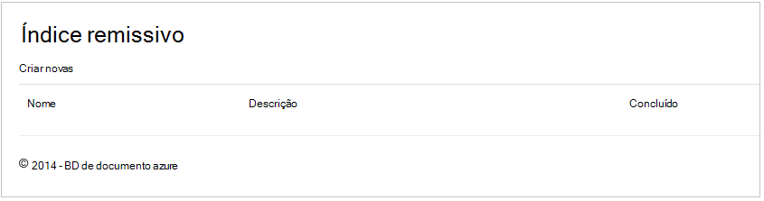

### Adicionar itens

Vamos colocar alguns itens para os nossos base de dados para que temos mais do que uma grelha vazia para ver algo.

Vamos adicionar alguns código a DocumentDBRepository e ItemController para manter o registo na DocumentDB.

1.  Adicione o seguinte método para a sua aula **DocumentDBRepository** .

        public static async Task<Document> CreateItemAsync(T item)
        {
            return await client.CreateDocumentAsync(UriFactory.CreateDocumentCollectionUri(DatabaseId, CollectionId), item);
        }

    Este método simplesmente leva-o até um objeto que lhe é transmitido e persisti-lo no DocumentDB.

2. Abra o ficheiro ItemController.cs e adicione o fragmento de código seguinte dentro da classe. Este é como ASP.NET MVC sabe o que fazer para a ação de **Criar** . Neste caso compostos apenas a vista Create.cshtml associada criada anteriormente.

        [ActionName("Create")]
        public async Task<ActionResult> CreateAsync()
        {
            return View();
        }

    Vamos agora precisa de algumas código mais neste controlador que irão aceitar a apresentação a partir da vista de **Criar** .

2. Adicione o bloco de código seguinte para a classe de ItemController.cs que lhe diz ASP.NET MVC o que fazer com um formulário de mensagem para este controlador.
    
        [HttpPost]
        [ActionName("Create")]
        [ValidateAntiForgeryToken]
        public async Task<ActionResult> CreateAsync([Bind(Include = "Id,Name,Description,Completed")] Item item)
        {
            if (ModelState.IsValid)
            {
                await DocumentDBRepository<Item>.CreateItemAsync(item);
                return RedirectToAction("Index");
            }

            return View(item);
        }

    Este código chama-se da a DocumentDBRepository e utiliza o método de CreateItemAsync para manter o novo item de todo para a base de dados. 
 
    **Nota de segurança**: O atributo **ValidateAntiForgeryToken** é utilizado aqui para ajudar a proteger esta aplicação ataques de falsificação de pedido de publicação em vários sites. Há mais para o mesmo que apenas a adição deste atributo, as vistas necessitar de trabalhar com este token anti-falsificação também. Para saber mais sobre o assunto e exemplos de como implementar este processo corretamente, consulte o artigo [Prevenir falsificação de pedido de publicação em vários sites][]. O código de origem fornecido na [GitHub][] tem a aplicação completa no local.

    **Nota de segurança**: Também utilizamos o atributo **vincular** sobre o parâmetro de método para ajudar a proteger contra indevidamente ataques de registo. Para obter mais detalhes, consulte [Operações CRUD básicas no ASP.NET MVC][].

Isto conclui código necessário para adicionar novos itens a nossa base de dados.

### Editar itens

Existe um critério último para-nos fazer e que é para adicionar a capacidade para editar os **itens** na base de dados e para marcá-las como concluída. A vista para edição já foi adicionada ao projeto, por isso Pedimos apenas tem de adicionar algum código para os nossos controlador de e para a classe de **DocumentDBRepository** novamente.

1. Adicione o seguinte para a classe de **DocumentDBRepository** .

        public static async Task<Document> UpdateItemAsync(string id, T item)
        {
            return await client.ReplaceDocumentAsync(UriFactory.CreateDocumentUri(DatabaseId, CollectionId, id), item);
        }

        public static async Task<T> GetItemAsync(string id)
        {
            try
            {
                Document document = await client.ReadDocumentAsync(UriFactory.CreateDocumentUri(DatabaseId, CollectionId, id));
                return (T)(dynamic)document;
            }
            catch (DocumentClientException e)
            {
                if (e.StatusCode == HttpStatusCode.NotFound)
                {
                    return null;
                }
                else
                {
                    throw;
                }
            }
        }
    
    O primeiro dos seguintes métodos, **GetItem** fetches um Item a partir do DocumentDB que lhe é transmitido novamente para o **ItemController** e, em seguida, para a vista de **edição** .
    
    O segundo dos métodos que acabou de adicionar substitui que o **documento** na DocumentDB com a versão do **documento** passada na partir de **ItemController**.

2. Adicione o seguinte para a classe de **ItemController** .

        [HttpPost]
        [ActionName("Edit")]
        [ValidateAntiForgeryToken]
        public async Task<ActionResult> EditAsync([Bind(Include = "Id,Name,Description,Completed")] Item item)
        {
            if (ModelState.IsValid)
            {
                await DocumentDBRepository<Item>.UpdateItemAsync(item.Id, item);
                return RedirectToAction("Index");
            }

            return View(item);
        }

        [ActionName("Edit")]
        public async Task<ActionResult> EditAsync(string id)
        {
            if (id == null)
            {
                return new HttpStatusCodeResult(HttpStatusCode.BadRequest);
            }

            Item item = await DocumentDBRepository<Item>.GetItemAsync(id);
            if (item == null)
            {
                return HttpNotFound();
            }

            return View(item);
        }
    
    O primeiro método trata o Http GET que acontece quando o utilizador clica na ligação **Editar** na vista de **índice remissivo** . Este método obtém um [**documento**](http://msdn.microsoft.com/library/azure/microsoft.azure.documents.document.aspx) a partir do DocumentDB e transmite-lo para a vista de **edição** .

    Da vista de **edição** , em seguida, irá fazer uma mensagem de Http à **IndexController**. 
    
    O segundo método adicionámos trata passar o objeto atualizado para DocumentDB para ser persistente na base de dados.

Já está, que é tudo o que precisamos de executar a nossa aplicação, incompleto **itens**de lista, adicionar novos **itens**e editar **itens**.

## Passo 6: Executar a aplicação localmente

Para testar a aplicação no seu computador local, faça o seguinte:

1. F5 no Visual Studio para criar a aplicação no modo de depuração de acertos. Deverá ser compilar a aplicação e iniciação num browser com a página vazia grelha que podemos viu antes:

    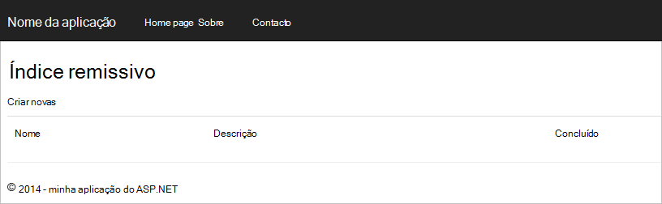

    Se estiver a utilizar o Visual Studio 2013 e a mensagem de erro "Não é possível aguardar no corpo de uma cláusula capturas." tem de instalar o [pacote de nuget Microsoft.Net.Compilers](https://www.nuget.org/packages/Microsoft.Net.Compilers/). Pode também comparar o seu código contra o projeto de exemplo no [GitHub][]. 

2. Clique na ligação **Criar novo** e adicione os valores para os campos **nome** e **Descrição** . Deixe a **concluída** marque a caixa desmarcada caso contrário, o novo **Item** será adicionado um estado concluído e não serão apresentados na lista inicial.

    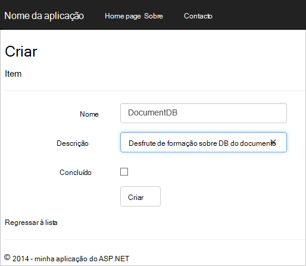

3. Clique em **Criar** e é redirecionado para a vista de **índice remissivo** e o **Item** apresentado na lista.

    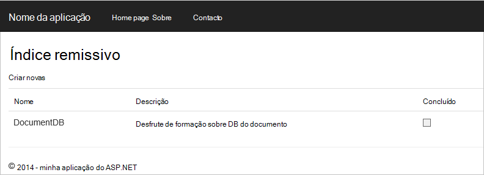

    Esteja à vontade adicionar mais alguns **itens** à sua lista de todo.

3. Clique em **Editar** junto a um **Item** na lista e sejam tomadas, para a vista de **edição** , onde pode atualizar qualquer propriedade do objeto, incluindo o sinalizador de **concluído** . Se marcar o sinalizador **concluída** e clique em **Guardar**, o **Item** é removido da lista de tarefas incompletas.

    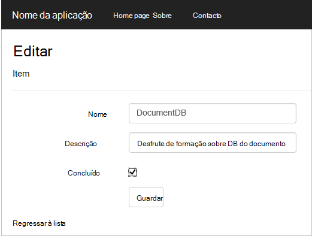

4. Uma vez que tenha testado a aplicação, prima Ctrl + F5 para parar de depuração a aplicação. Está pronto para implementar!

## Passo 7: Implementar a aplicação para sites públicos do Azure

Agora que tem a aplicação completa a funcionar corretamente com DocumentDB iremos para implementar esta aplicação web sites públicos do Azure. Se tiver selecionado **anfitrião na nuvem** , quando criou o projeto de ASP.NET MVC vazio Visual Studio facilita isto realmente e faz a maior parte do trabalho para si. 

1. Para publicar esta aplicação é tudo o que precisa de fazer com o botão direito no projeto no **Explorador de soluções** e clique em **Publicar**.

    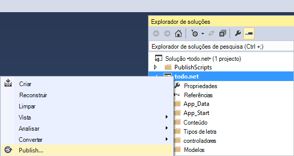

2. Tudo o que deve ser configurado de acordo com as suas credenciais; na verdade o Web site já foi criado no Azure por si no **URL de destino** apresentado, tudo o que precisa de fazer é clique em **Publicar**.

    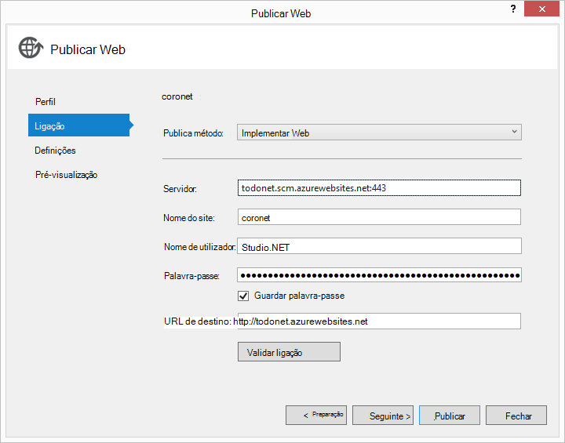

Em alguns segundos, Visual Studio irá concluir a publicação a aplicação web e iniciação num browser, onde pode ver o seu trabalho útil em execução no Azure!

## Próximos passos

Parabéns! Basta compilado seu MVC ASP.NET primeiro aplicação web utilizando o Azure DocumentDB e publicado-lo para sites públicos do Azure. O código de origem para a aplicação completo, incluindo a funcionalidade de detalhe e eliminar que não foram incluídos neste tutorial, pode ser transferido ou clonar a partir do [GitHub][]. Por isso, se está interessado em Adicionar que a sua aplicação, captar o código e adicioná-lo para esta aplicação.

Para adicionar funcionalidades adicionais para a sua aplicação, reveja as APIs disponíveis na [Biblioteca de .NET DocumentDB](https://msdn.microsoft.com/library/azure/dn948556.aspx) e à vontade contribuir para a biblioteca do .NET DocumentDB [GitHub][]. 

[\*]: https://microsoft.sharepoint.com/teams/DocDB/Shared%20Documents/Documentation/Docs.LatestVersions/PicExportError
[Visual Studio Express]: http://www.visualstudio.com/products/visual-studio-express-vs.aspx
[Microsoft Web plataforma Installer]: http://www.microsoft.com/web/downloads/platform.aspx
[Impedir falsificação de pedido de publicação em vários sites]: http://go.microsoft.com/fwlink/?LinkID=517254
[Operações CRUD básicas no MVC do ASP.NET]: http://go.microsoft.com/fwlink/?LinkId=317598
[GitHub]: https://github.com/Azure-Samples/documentdb-net-todo-app
