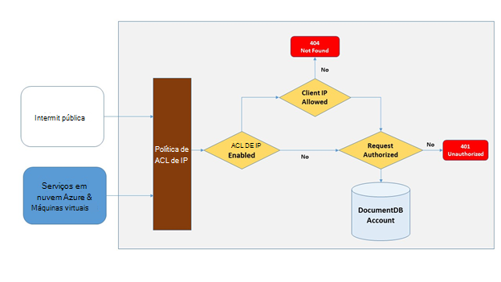
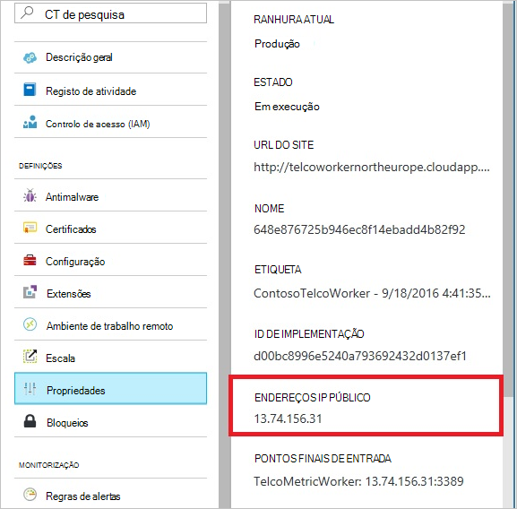
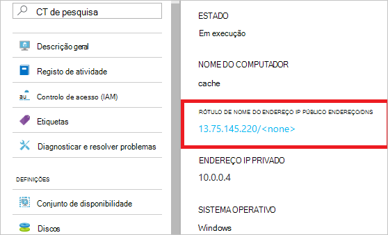
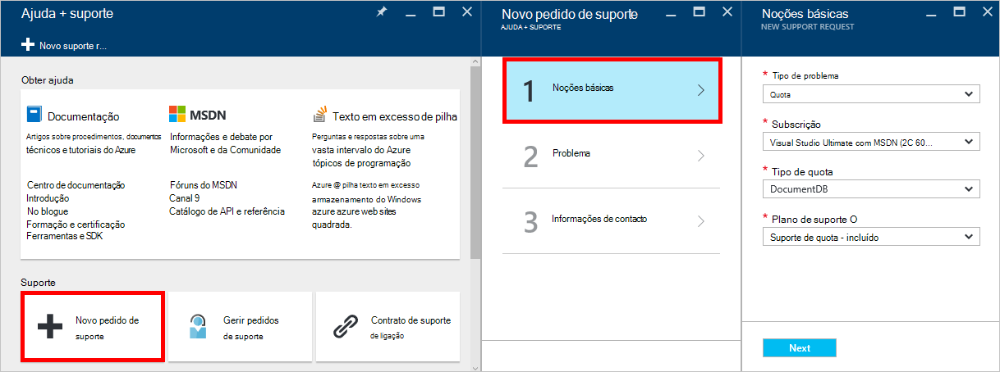
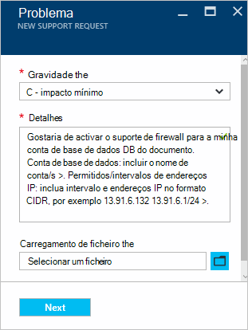

<properties
    pageTitle="Suporte de firewall DocumentDB | Microsoft Azure"
    description="Saiba como utilizar as políticas de controlo de acesso IP para o suporte de firewall contas do Azure DocumentDB da base de dados."
    keywords="Controlo de acesso IP, suporte de firewall"
    services="documentdb"
    authors="shahankur11"
    manager="jhubbard"
    editor=""
    tags="azure-resource-manager"
    documentationCenter=""/>

<tags 
    ms.service="documentdb" 
    ms.workload="data-services" 
    ms.tgt_pltfrm="na" 
    ms.devlang="na" 
    ms.topic="article" 
    ms.date="10/17/2016" 
    ms.author="ankshah; kraman"/>

# Suporte de firewall DocumentDB

Para proteger dados armazenados numa conta de base de dados do Azure DocumentDB, DocumentDB forneceu suporte baseada em secreta [modelo autorização](https://msdn.microsoft.com/library/azure/dn783368.aspx) que utiliza um código de autenticação de mensagem com base em Hash forte (HMAC). Agora, para além de modelo autorizações baseados em secreta, DocumentDB suporta política pelo esforço controlos de acesso baseado em IP para o suporte de firewall de entrada. Este modelo é muito semelhante a regras de firewall de um sistema de base de dados tradicional e fornece um nível de segurança para a conta de base de dados DocumentDB adicional. Com este modelo, agora pode configurar uma conta de base de dados DocumentDB para serem acessíveis apenas a partir de um conjunto aprovado de máquinas e/ou serviços em nuvem. Acesso aos recursos DocumentDB a partir destes aprovado conjuntos de computadores e serviços ainda requerem o autor da chamada apresentar um token de autorização válida.

## Descrição geral do controlo de acesso IP

Por predefinição, DocumentDB da base de dados é uma conta acessível a partir do internet pública desde que o pedido é acompanhar por um token de autorização válida. Para configurar o controlo de acesso baseado em política IP, o utilizador tem de fornecer o conjunto de endereços IP ou intervalos de endereços IP no formulário CIDR para ser incluída como a lista de permitidos do cliente IPs para uma conta de base de dados indicados. Assim que esta configuração é aplicada, todos os pedidos de provenientes máquinas fora esta lista de permitidos serão bloqueados pelo servidor.  A ligação processamento fluxo para o controlo de acesso baseado em IP é descrita no diagrama seguinte.

## Ligações dos serviços em nuvem

No Azure, serviços em nuvem são uma forma muito comum para alojamento lógica de serviço de camada utilizando DocumentDB. Para permitir o acesso a uma conta de base de dados DocumentDB a partir de um serviço na nuvem, o endereço IP público do serviço de nuvem tem de ser adicionado à lista de endereços IP associado com a sua conta de base de dados DocumentDB ao [contactar o suporte Azure](#configure-ip-policy)permitida.  Isto assegura que todas as instâncias de função de serviços em nuvem têm acesso à sua conta de base de dados DocumentDB. Pode obter endereços IP para os seus serviços na nuvem no portal do Azure, conforme apresentado na captura de ecrã seguinte. 

Quando dimensionar fora do seu serviço de nuvem através da adição de ocorrências de função adicionais, essas novas instâncias este tem automaticamente acesso à conta de base de dados de DocumentDB uma vez que fazem parte do mesmo serviço na nuvem.

## Ligações a partir de máquinas virtuais

[Máquinas virtuais](https://azure.microsoft.com/services/virtual-machines/) ou [conjuntos de escala de máquina virtual](../virtual-machine-scale-sets/virtual-machine-scale-sets-overview.md) também pode ser utilizados para serviços de camada utilizando DocumentDB do anfitrião.  Para configurar o DocumentDB conta da base de dados para permitir o acesso de máquinas virtuais, endereços IP públicos de máquina virtual e/ou conjunto de escala de máquina virtual tem de ser configurada como um dos endereços IP permitidos para a sua conta de base de dados DocumentDB ao [contactar o suporte Azure](#configure-ip-policy). Pode obter endereços IP para máquinas virtuais no portal do Azure, conforme apresentado na captura de ecrã seguinte.

Quando adiciona instâncias de máquina virtual adicionais para o grupo, são fornecidos automaticamente acesso à sua conta de base de dados DocumentDB.

## Ligações a partir da internet

Quando acede a uma conta de base de dados DocumentDB de um computador na internet, o endereço IP do cliente ou o intervalo de endereços IP do computador deve ser adicionado à lista de endereços IP para a conta de base de dados DocumentDB permitida. 

## Configurar a política de controlo de acesso IP

Utilize o portal do Azure de enviar um pedido com o [Suporte do Azure](https://portal.azure.com/?#blade/Microsoft_Azure_Support/HelpAndSupportBlade) para ativar a política de controlo de acesso IP na sua conta de base de dados.

1. Na pá [Ajuda + suporte](https://portal.azure.com/?#blade/Microsoft_Azure_Support/HelpAndSupportBlade) , selecione **novo pedido de suporte**.
2. Na pá **novo pedido de suporte** , selecione **informações básicas**.
3. Na pá **Noções básicas** , selecione o seguinte procedimento:
    - **Tipo de problema**: Quota
    - **Subscrição**: A subscrição associada à conta na qual pretende adicionar a política de controlo de acesso IP.
    - **Tipo de quota**: DocumentDB
    - **Plano de suporte**: suporte de Quota - incluído.
4. Na pá **problema** , faça o seguinte:
    - **Gravidade**: selecione C - impacto mínimo
    - **Detalhes**: Copie o seguinte texto na caixa e incluem o seu nome de conta/s e o endereço IP/es: "gostaria de activar o suporte de firewall para a minha conta de base de dados DocumentDB. Conta de base de dados: *conta de incluir nome/s*. Permitidos/intervalos de endereços IP: *incluir/intervalo de endereços IP no formato CIDR, por exemplo 13.91.6.132, 13.91.6.1/24*. "
    - Clique em **seguinte**. 
5. Na pá **informações de contacto** , preencha os detalhes do contactos e clique em **Criar**. 

Assim que o seu pedido for recebido, controlo de acesso IP deve ser activado dentro de 24 horas. Será notificado assim que o pedido estiver concluído.

## A política de controlo de acesso do IP de resolução de problemas

### Operações de portais

Ao ativar uma política de controlo de acesso IP para a sua conta de base de dados DocumentDB, todos os acesso à sua conta de base de dados de DocumentDB a partir do máquinas fora de configurado permitida lista de intervalos de endereços IP bloqueados. Ao abrigo neste modelo, a operação de plano de dados a partir do portal de navegação também será bloqueado para assegurar a integridade de controlo de acesso. 

### SDK & Rest API

Por motivos de segurança, access através do SDK ou REST API do máquinas não localizado na lista de permitidos irão devolver genérico 404 não encontrado resposta com sem detalhes adicionais. Verifique se o período de inquérito lista configurada para a sua conta de base de dados DocumentDB permitido para garantir que a configuração da política correta é aplicada à sua conta de base de dados DocumentDB.

## Próximos passos

Para obter informações sobre rede sugestões relacionadas com o desempenho, consulte o artigo [sugestões sobre o desempenho](documentdb-performance-tips.md).