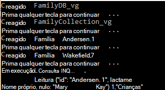
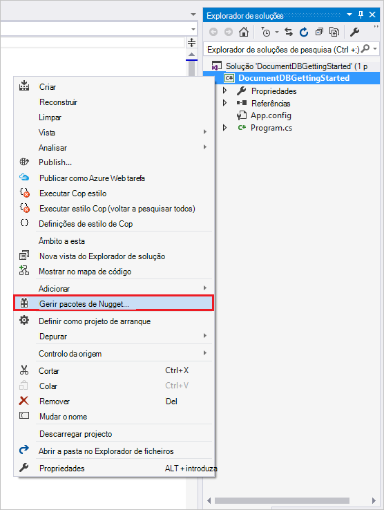

<properties
    pageTitle="NoSQL tutorial: DocumentDB .NET SDK | Microsoft Azure"
    description="Tutorial do NoSQL que cria uma base de dados online e a aplicação de consola do c# utilizando o SDK do .NET DocumentDB. DocumentDB é uma base de dados NoSQL para JSON."
    keywords="nosql tutorial, base de dados online, aplicação consola c#"
    services="documentdb"
    documentationCenter=".net"
    authors="AndrewHoh"
    manager="jhubbard"
    editor="monicar"/>

<tags
    ms.service="documentdb"
    ms.workload="data-services"
    ms.tgt_pltfrm="na"
    ms.devlang="dotnet"
    ms.topic="hero-article"
    ms.date="09/01/2016"
    ms.author="anhoh"/>

# NoSQL tutorial: criar um DocumentDB c# aplicação da consola

> [AZURE.SELECTOR]
- [.NET](documentdb-get-started.md)
- [NODE.js](documentdb-nodejs-get-started.md)

Bem-vindo ao tutorial NoSQL para o Azure DocumentDB .NET SDK! Depois de receber o projeto de guia de introdução ou concluir o tutorial, terá de uma aplicação de consola que cria e consultas DocumentDB recursos.

- **[Guia de introdução](#quickstart)**: Transferir o projeto de exemplo, adicione as informações de ligação e de ter uma aplicação de DocumentDB a ser executada em menos de 10 minutos.
- **[Tutorial](#tutorial)**: criar a aplicação de guia de introdução de raiz em 30 minutos.

## Pré-requisitos

- Uma conta do Azure active. Se não tiver uma, pode inscrever-se para uma [conta gratuita](https://azure.microsoft.com/free/).
- No [visual Studio 2013 ou o Visual Studio 2015](http://www.visualstudio.com/).
- .NET framework 4.6

## Guia de introdução

1. Transfira o projeto de exemplo. zip de [GitHub](https://github.com/Azure-Samples/documentdb-dotnet-getting-started-quickstart/archive/master.zip) ou clonar a repo [documentdb-dotnet-introdução-iniciado-guia de introdução](https://github.com/Azure-Samples/documentdb-dotnet-getting-started-quickstart) .
2. Utilize o portal do Azure para [criar uma conta de DocumentDB](documentdb-create-account.md).
3. No ficheiro App, substitua os valores EndpointUri e PrimaryKey os valores obtidos a partir do [Azure portal](https://portal.azure.com/), navegar para pá **DocumentDB (NoSQL)** , em seguida, clicando no **nome da conta**e, em seguida, clicando em **teclas** no menu de recursos.
    
4. Construa o projeto. A janela da consola mostra os novos recursos de que está a ser criados, consultados e, em seguida, desorganizados;.
    
    

## Tutorial

Neste tutorial orienta-o através da criação de uma base de dados DocumentDB, uma coleção de DocumentDB e JSON documentos. Em seguida, irá a coleção de consulta e limpar e eliminar a base de dados. Neste tutorial constrói o mesmo projecto do projecto do guia de introdução, mas irá criar-incrementada e irá receber explicação sobre o código que está a adicionar ao projeto.

## Passo 1: Criar uma conta de DocumentDB

Vamos criar uma conta de DocumentDB. Se já tiver uma conta que pretende utilizar, pode avançar para [Configurar a sua solução Studio Visual](#SetupVS).

[AZURE.INCLUDE [documentdb-create-dbaccount](../../includes/documentdb-create-dbaccount.md)]

## Passo 2: Configurar a sua solução do Visual Studio

1. Abra o **Visual Studio 2015** no seu computador.
2. No menu **ficheiro** , selecione **Novo**e, em seguida, escolha **projeto**.
3. Na caixa de diálogo **Novo projeto** , selecione **modelos** / **Visual c#** / **Aplicação da consola**, nome do seu projeto e, em seguida, clique em **OK**.

4. No **Explorador de soluções**, botão direito do rato clique na sua nova aplicação de consola, que é em sua solução do Visual Studio.
5. Em seguida, sem sair do menu, clique em **Gerir NuGet embalagens de...** 
 
6. No separador **Nuget** , clique em **Procurar**e, escreva **azure documentdb** na caixa de pesquisa.
7. Nos resultados da, localize **Microsoft.Azure.DocumentDB** e clique em **instalar**.
O ID de pacote para a biblioteca do cliente DocumentDB é [Microsoft.Azure.DocumentDB](https://www.nuget.org/packages/Microsoft.Azure.DocumentDB)

Excelentes! Agora que recomendamos terminar a configuração, vamos começar a escrever algum código. Pode encontrar um projeto de código concluído deste tutorial na [GitHub](https://github.com/Azure-Samples/documentdb-dotnet-getting-started/blob/master/src/Program.cs).

## Passo 3: Ligar a uma conta de DocumentDB

Em primeiro lugar, adicione estas referências para o início da sua aplicação c#, no ficheiro Program.cs:

    using System;
    using System.Linq;
    using System.Threading.Tasks;

    // ADD THIS PART TO YOUR CODE
    using System.Net;
    using Microsoft.Azure.Documents;
    using Microsoft.Azure.Documents.Client;
    using Newtonsoft.Json;

> [AZURE.IMPORTANT] Para poder concluir este tutorial NoSQL, certifique-se de que adicionar as dependências acima.

Agora, adicione estas duas constantes e a variável de *cliente* por baixo do seu *programa*de classe público.

    public class Program
    {
        // ADD THIS PART TO YOUR CODE
        private const string EndpointUri = "<your endpoint URI>";
        private const string PrimaryKey = "<your key>";
        private DocumentClient client;

Seguinte, cabeça do [Azure Portal](https://portal.azure.com) para obter o URI e a chave primária. A chave primária e DocumentDB URI são necessárias para a sua aplicação compreender de onde pretende ligar a e para DocumentDB confiar ligação da sua aplicação.

No Portal do Azure, navegue até à sua conta de DocumentDB e, em seguida, clique **nas teclas**.

Copiar o URI a partir do portal e colá-lo ao `<your endpoint URI>` no ficheiro program.cs. Em seguida, copie a chave primária a partir do portal e colá-lo ao `<your key>`.

![Captura de ecrã do Portal do Azure utilizada pelo tutorial NoSQL para criar uma aplicação de consola do c#. Mostra uma conta de DocumentDB, com concentrador activo realçada, o botão de teclas realçado na pá conta DocumentDB e os valores URI, chave primária e chave secundária realçados no pá teclas][keys]

Vamos começar a aplicação de introdução ao obter ao criar uma nova instância da **DocumentClient**.

Abaixo do método **principal** , adicione esta nova tarefa assíncrona denominada **GetStartedDemo**, que irá criar uma instância do nosso novo **DocumentClient**.

    static void Main(string[] args)
    {
    }

    // ADD THIS PART TO YOUR CODE
    private async Task GetStartedDemo()
    {
        this.client = new DocumentClient(new Uri(EndpointUri), PrimaryKey);
    }

Adicione o seguinte código para executar a tarefa assíncrona a partir do seu método de **principal** . O método **principais** irá capturas exceções e escrevê-los na consola.

    static void Main(string[] args)
    {
            // ADD THIS PART TO YOUR CODE
            try
            {
                    Program p = new Program();
                    p.GetStartedDemo().Wait();
            }
            catch (DocumentClientException de)
            {
                    Exception baseException = de.GetBaseException();
                    Console.WriteLine("{0} error occurred: {1}, Message: {2}", de.StatusCode, de.Message, baseException.Message);
            }
            catch (Exception e)
            {
                    Exception baseException = e.GetBaseException();
                    Console.WriteLine("Error: {0}, Message: {1}", e.Message, baseException.Message);
            }
            finally
            {
                    Console.WriteLine("End of demo, press any key to exit.");
                    Console.ReadKey();
            }

Prima **F5** para executar a sua aplicação.

Parabéns! Ligar a uma conta de DocumentDB com êxito, vamos agora um olhar sobre trabalhar com recursos DocumentDB.  

## Passo 4: Criar uma base de dados
Antes de adicionar o código para criar uma base de dados, adicione um método de ajuda para escrever publicações de consola.

Copie e cole o método de **WriteToConsoleAndPromptToContinue** sob o método de **GetStartedDemo** .

    // ADD THIS PART TO YOUR CODE
    private void WriteToConsoleAndPromptToContinue(string format, params object[] args)
    {
            Console.WriteLine(format, args);
            Console.WriteLine("Press any key to continue ...");
            Console.ReadKey();
    }

O DocumentDB [base de dados](documentdb-resources.md#databases) pode ser criados utilizando o método de [CreateDatabaseAsync](https://msdn.microsoft.com/library/microsoft.azure.documents.client.documentclient.createdatabaseasync.aspx) a classe de **DocumentClient** de. Uma base de dados é o contentor lógico de armazenamento de documento JSON dividido em coleções de.

Copie e cole o método de **CreateDatabaseIfNotExists** sob o método de **WriteToConsoleAndPromptToContinue** .

    // ADD THIS PART TO YOUR CODE
    private async Task CreateDatabaseIfNotExists(string databaseName)
    {
            // Check to verify a database with the id=FamilyDB does not exist
            try
            {
                    await this.client.ReadDatabaseAsync(UriFactory.CreateDatabaseUri(databaseName));
                    this.WriteToConsoleAndPromptToContinue("Found {0}", databaseName);
            }
            catch (DocumentClientException de)
            {
                    // If the database does not exist, create a new database
                    if (de.StatusCode == HttpStatusCode.NotFound)
                    {
                            await this.client.CreateDatabaseAsync(new Database { Id = databaseName });
                            this.WriteToConsoleAndPromptToContinue("Created {0}", databaseName);
                    }
                    else
                    {
                            throw;
                    }
            }
    }

Copie e cole o código seguinte para o seu método de **GetStartedDemo** sob a criação de cliente. Isto vai criar uma base de dados denominada *FamilyDB*.

    private async Task GetStartedDemo()
    {
        this.client = new DocumentClient(new Uri(EndpointUri), PrimaryKey);

        // ADD THIS PART TO YOUR CODE
        await this.CreateDatabaseIfNotExists("FamilyDB_va");

Prima **F5** para executar a sua aplicação.

Parabéns! Criou uma base de dados DocumentDB com êxito.  

## Passo 5: Criar uma coleção de  

> [AZURE.WARNING] **CreateDocumentCollectionAsync** irá criar uma nova coleção com débito reservado, que possui preços implicações. Para obter mais detalhes, visite a nossa [página de preços](https://azure.microsoft.com/pricing/details/documentdb/).

Uma [coleção de](documentdb-resources.md#collections) pode ser criados utilizando o método de [CreateDocumentCollectionAsync](https://msdn.microsoft.com/library/microsoft.azure.documents.client.documentclient.createdocumentcollectionasync.aspx) a classe de **DocumentClient** de. Uma coleção de é um contentor de documentos JSON e lógica da aplicação JavaScript associada.

Copie e cole o método de **CreateDocumentCollectionIfNotExists** abaixo do seu método de **CreateDatabaseIfNotExists** .

    // ADD THIS PART TO YOUR CODE
    private async Task CreateDocumentCollectionIfNotExists(string databaseName, string collectionName)
    {
        try
        {
            await this.client.ReadDocumentCollectionAsync(UriFactory.CreateDocumentCollectionUri(databaseName, collectionName));
            this.WriteToConsoleAndPromptToContinue("Found {0}", collectionName);
        }
        catch (DocumentClientException de)
        {
            // If the document collection does not exist, create a new collection
            if (de.StatusCode == HttpStatusCode.NotFound)
            {
                DocumentCollection collectionInfo = new DocumentCollection();
                collectionInfo.Id = collectionName;

                // Configure collections for maximum query flexibility including string range queries.
                collectionInfo.IndexingPolicy = new IndexingPolicy(new RangeIndex(DataType.String) { Precision = -1 });

                // Here we create a collection with 400 RU/s.
                await this.client.CreateDocumentCollectionAsync(
                    UriFactory.CreateDatabaseUri(databaseName),
                    collectionInfo,
                    new RequestOptions { OfferThroughput = 400 });

                this.WriteToConsoleAndPromptToContinue("Created {0}", collectionName);
            }
            else
            {
                throw;
            }
        }
    }

Copie e cole o código seguinte para o seu método de **GetStartedDemo** sob a criação de base de dados. Isto vai criar uma coleção de documento com o nome *FamilyCollection_va*.

        this.client = new DocumentClient(new Uri(EndpointUri), PrimaryKey);

        await this.CreateDatabaseIfNotExists("FamilyDB_oa");

        // ADD THIS PART TO YOUR CODE
        await this.CreateDocumentCollectionIfNotExists("FamilyDB_va", "FamilyCollection_va");

Prima **F5** para executar a sua aplicação.

Parabéns! Criou uma coleção de documento DocumentDB com êxito.  

## Passo 6: Criar documentos JSON
Um [documento](documentdb-resources.md#documents) pode ser criados utilizando o método de [CreateDocumentAsync](https://msdn.microsoft.com/library/microsoft.azure.documents.client.documentclient.createdocumentasync.aspx) a classe de **DocumentClient** de. Os documentos são (arbitrário) conteúdo JSON definidas pelo utilizador. Vamos agora pode inserir um ou mais documentos. Se já tiver dados que pretende armazenar na base de dados, pode utilizar da DocumentDB [ferramenta de migração de dados](documentdb-import-data.md).

Em primeiro lugar, precisamos de criar uma classe de **família** que representará objetos armazenados DocumentDB neste exemplo. Recomendamos também irá criar **principal**, **subordinado**, **Pet**, subclasses **endereço** que são utilizadas em **família**. Tenha em atenção que documentos têm de ter uma propriedade de **Id** serializada como **id** na JSON. Crie estes classes, adicionando as seguintes sub-classes internas após o método de **GetStartedDemo** .

Copie e cole a **família**, **principal**, **subordinado**, **companhia**e **endereço de** classes sob o método de **WriteToConsoleAndPromptToContinue** .

    private void WriteToConsoleAndPromptToContinue(string format, params object[] args)
    {
        Console.WriteLine(format, args);
        Console.WriteLine("Press any key to continue ...");
        Console.ReadKey();
    }

    // ADD THIS PART TO YOUR CODE
    public class Family
    {
        [JsonProperty(PropertyName = "id")]
        public string Id { get; set; }
        public string LastName { get; set; }
        public Parent[] Parents { get; set; }
        public Child[] Children { get; set; }
        public Address Address { get; set; }
        public bool IsRegistered { get; set; }
        public override string ToString()
        {
                return JsonConvert.SerializeObject(this);
        }
    }

    public class Parent
    {
        public string FamilyName { get; set; }
        public string FirstName { get; set; }
    }

    public class Child
    {
        public string FamilyName { get; set; }
        public string FirstName { get; set; }
        public string Gender { get; set; }
        public int Grade { get; set; }
        public Pet[] Pets { get; set; }
    }

    public class Pet
    {
        public string GivenName { get; set; }
    }

    public class Address
    {
        public string State { get; set; }
        public string County { get; set; }
        public string City { get; set; }
    }

Copie e cole o método de **CreateFamilyDocumentIfNotExists** abaixo do seu método de **CreateDocumentCollectionIfNotExists** .

    // ADD THIS PART TO YOUR CODE
    private async Task CreateFamilyDocumentIfNotExists(string databaseName, string collectionName, Family family)
    {
        try
        {
            await this.client.ReadDocumentAsync(UriFactory.CreateDocumentUri(databaseName, collectionName, family.Id));
            this.WriteToConsoleAndPromptToContinue("Found {0}", family.Id);
        }
        catch (DocumentClientException de)
        {
            if (de.StatusCode == HttpStatusCode.NotFound)
            {
                await this.client.CreateDocumentAsync(UriFactory.CreateDocumentCollectionUri(databaseName, collectionName), family);
                this.WriteToConsoleAndPromptToContinue("Created Family {0}", family.Id);
            }
            else
            {
                throw;
            }
        }
    }

E insira dois documentos, uma de cada tipo para a família Andersen e família Wakefield.

Copie e cole o código seguinte para o seu método de **GetStartedDemo** sob a criação de coleções de sites do documento.

    await this.CreateDatabaseIfNotExists("FamilyDB_va");

    await this.CreateDocumentCollectionIfNotExists("FamilyDB_va", "FamilyCollection_va");

    // ADD THIS PART TO YOUR CODE
    Family andersenFamily = new Family
    {
            Id = "Andersen.1",
            LastName = "Andersen",
            Parents = new Parent[]
            {
                    new Parent { FirstName = "Thomas" },
                    new Parent { FirstName = "Mary Kay" }
            },
            Children = new Child[]
            {
                    new Child
                    {
                            FirstName = "Henriette Thaulow",
                            Gender = "female",
                            Grade = 5,
                            Pets = new Pet[]
                            {
                                    new Pet { GivenName = "Fluffy" }
                            }
                    }
            },
            Address = new Address { State = "WA", County = "King", City = "Seattle" },
            IsRegistered = true
    };

    await this.CreateFamilyDocumentIfNotExists("FamilyDB_va", "FamilyCollection_va", andersenFamily);

    Family wakefieldFamily = new Family
    {
            Id = "Wakefield.7",
            LastName = "Wakefield",
            Parents = new Parent[]
            {
                    new Parent { FamilyName = "Wakefield", FirstName = "Robin" },
                    new Parent { FamilyName = "Miller", FirstName = "Ben" }
            },
            Children = new Child[]
            {
                    new Child
                    {
                            FamilyName = "Merriam",
                            FirstName = "Jesse",
                            Gender = "female",
                            Grade = 8,
                            Pets = new Pet[]
                            {
                                    new Pet { GivenName = "Goofy" },
                                    new Pet { GivenName = "Shadow" }
                            }
                    },
                    new Child
                    {
                            FamilyName = "Miller",
                            FirstName = "Lisa",
                            Gender = "female",
                            Grade = 1
                    }
            },
            Address = new Address { State = "NY", County = "Manhattan", City = "NY" },
            IsRegistered = false
    };

    await this.CreateFamilyDocumentIfNotExists("FamilyDB_va", "FamilyCollection_va", wakefieldFamily);

Prima **F5** para executar a sua aplicação.

Parabéns! Criou dois documentos DocumentDB com êxito.  

##Passo 7: Consultar DocumentDB recursos

DocumentDB suporta rich [consultas](documentdb-sql-query.md) contra JSON documentos armazenados na coleção de cada.  O código de exemplo seguinte mostra várias consultas - utilizar ambas as sintaxe DocumentDB SQL assim como LINQ - que recomendamos podem ser executados contra os documentos podemos inserido no passo anterior.

Copie e cole o método de **ExecuteSimpleQuery** abaixo do seu método de **CreateFamilyDocumentIfNotExists** .

    // ADD THIS PART TO YOUR CODE
    private void ExecuteSimpleQuery(string databaseName, string collectionName)
    {
        // Set some common query options
        FeedOptions queryOptions = new FeedOptions { MaxItemCount = -1 };

            // Here we find the Andersen family via its LastName
            IQueryable<Family> familyQuery = this.client.CreateDocumentQuery<Family>(
                    UriFactory.CreateDocumentCollectionUri(databaseName, collectionName), queryOptions)
                    .Where(f => f.LastName == "Andersen");

            // The query is executed synchronously here, but can also be executed asynchronously via the IDocumentQuery<T> interface
            Console.WriteLine("Running LINQ query...");
            foreach (Family family in familyQuery)
            {
                    Console.WriteLine("\tRead {0}", family);
            }

            // Now execute the same query via direct SQL
            IQueryable<Family> familyQueryInSql = this.client.CreateDocumentQuery<Family>(
                    UriFactory.CreateDocumentCollectionUri(databaseName, collectionName),
                    "SELECT * FROM Family WHERE Family.LastName = 'Andersen'",
                    queryOptions);

            Console.WriteLine("Running direct SQL query...");
            foreach (Family family in familyQueryInSql)
            {
                    Console.WriteLine("\tRead {0}", family);
            }

            Console.WriteLine("Press any key to continue ...");
            Console.ReadKey();
    }

Copie e cole o código seguinte para o seu método de **GetStartedDemo** sob a segunda criação de documento.

    await this.CreateFamilyDocumentIfNotExists("FamilyDB_va", "FamilyCollection_va", wakefieldFamily);

    // ADD THIS PART TO YOUR CODE
    this.ExecuteSimpleQuery("FamilyDB_va", "FamilyCollection_va");

Prima **F5** para executar a sua aplicação.

Parabéns! Ter consultado com êxito contra uma coleção de DocumentDB.

O diagrama seguinte ilustra como o SQL DocumentDB sintaxe de consulta chama-se contra a coleção de que criou e, a mesma lógica aplica-se à consulta LINQ.

A palavra-chave [FROM](documentdb-sql-query.md#from-clause) é opcional na consulta porque DocumentDB consultas já estão limitadas para uma coleção de única. Por conseguinte, "De famílias f" pode ser trocadas com "A partir de raiz r" ou qualquer outra variável de nomes escolher. DocumentDB será inferir esse famílias, raiz ou o nome da variável que escolheu, referenciar a colecção atual por predefinição.

##Passo 8: Substituir documento JSON

DocumentDB suporta substituir JSON documentos.  

Copie e cole o método de **ReplaceFamilyDocument** abaixo do seu método de **ExecuteSimpleQuery** .

    // ADD THIS PART TO YOUR CODE
    private async Task ReplaceFamilyDocument(string databaseName, string collectionName, string familyName, Family updatedFamily)
    {
        try
        {
            await this.client.ReplaceDocumentAsync(UriFactory.CreateDocumentUri(databaseName, collectionName, familyName), updatedFamily);
            this.WriteToConsoleAndPromptToContinue("Replaced Family {0}", familyName);
        }
        catch (DocumentClientException de)
        {
            throw;
        }
    }

Copie e cole o código seguinte para o seu método de **GetStartedDemo** sob a execução da consulta. Depois de substituir o documento, este será executada a mesma consulta novamente para visualizar o documento alterado.

    await this.CreateFamilyDocumentIfNotExists("FamilyDB_va", "FamilyCollection_va", wakefieldFamily);

    this.ExecuteSimpleQuery("FamilyDB_va", "FamilyCollection_va");

    // ADD THIS PART TO YOUR CODE
    // Update the Grade of the Andersen Family child
    andersenFamily.Children[0].Grade = 6;

    await this.ReplaceFamilyDocument("FamilyDB_va", "FamilyCollection_va", "Andersen.1", andersenFamily);

    this.ExecuteSimpleQuery("FamilyDB_va", "FamilyCollection_va");

Prima **F5** para executar a sua aplicação.

Parabéns! Com êxito ter substituído um documento DocumentDB.

##Passo 9: Eliminar documento JSON

DocumentDB suporta eliminação JSON documentos.  

Copie e cole o método de **DeleteFamilyDocument** abaixo do seu método de **ReplaceFamilyDocument** .

    // ADD THIS PART TO YOUR CODE
    private async Task DeleteFamilyDocument(string databaseName, string collectionName, string documentName)
    {
        try
        {
            await this.client.DeleteDocumentAsync(UriFactory.CreateDocumentUri(databaseName, collectionName, documentName));
            Console.WriteLine("Deleted Family {0}", documentName);
        }
        catch (DocumentClientException de)
        {
            throw;
        }
    }

Copie e cole o código seguinte para o seu método de **GetStartedDemo** sob a execução da segunda consulta.

    await this.ReplaceFamilyDocument("FamilyDB_va", "FamilyCollection_va", "Andersen.1", andersenFamily);

    this.ExecuteSimpleQuery("FamilyDB_va", "FamilyCollection_va");

    // ADD THIS PART TO CODE
    await this.DeleteFamilyDocument("FamilyDB_va", "FamilyCollection_va", "Andersen.1");

Prima **F5** para executar a sua aplicação.

Parabéns! Com êxito ter eliminado um documento DocumentDB.

##Passo 10: Eliminar a base de dados

Eliminar a base de dados criado removerá a base de dados e todos os recursos de crianças (coleções de sites, documentos, etc.).

Copie e cole o código seguinte para o seu método de **GetStartedDemo** sob o documento eliminar para eliminar toda a base de dados e todos os recursos de subordinados.

    this.ExecuteSimpleQuery("FamilyDB_va", "FamilyCollection_va");

    await this.DeleteFamilyDocument("FamilyDB_va", "FamilyCollection_va", "Andersen.1");

    // ADD THIS PART TO CODE
    // Clean up/delete the database
    await this.client.DeleteDatabaseAsync(UriFactory.CreateDatabaseUri("FamilyDB_va"));

Prima **F5** para executar a sua aplicação.

Parabéns! Com êxito que tenha eliminado uma base de dados DocumentDB.

##Passo 11: Executar a consola aplicação c# juntas!

F5 no Visual Studio para criar a aplicação no modo de depuração de acertos.

Deverá ver o resultado da sua aplicação de introdução de obter. O resultado irá apresentar os resultados das consultas que adicionou e deve corresponder o texto de exemplo abaixo.

    Created FamilyDB_va
    Press any key to continue ...
    Created FamilyCollection_va
    Press any key to continue ...
    Created Family Andersen.1
    Press any key to continue ...
    Created Family Wakefield.7
    Press any key to continue ...
    Running LINQ query...
        Read {"id":"Andersen.1","LastName":"Andersen","District":"WA5","Parents":[{"FamilyName":null,"FirstName":"Thomas"},{"FamilyName":null,"FirstName":"Mary Kay"}],"Children":[{"FamilyName":null,"FirstName":"Henriette Thaulow","Gender":"female","Grade":5,"Pets":[{"GivenName":"Fluffy"}]}],"Address":{"State":"WA","County":"King","City":"Seattle"},"IsRegistered":true}
    Running direct SQL query...
        Read {"id":"Andersen.1","LastName":"Andersen","District":"WA5","Parents":[{"FamilyName":null,"FirstName":"Thomas"},{"FamilyName":null,"FirstName":"Mary Kay"}],"Children":[{"FamilyName":null,"FirstName":"Henriette Thaulow","Gender":"female","Grade":5,"Pets":[{"GivenName":"Fluffy"}]}],"Address":{"State":"WA","County":"King","City":"Seattle"},"IsRegistered":true}
    Replaced Family Andersen.1
    Press any key to continue ...
    Running LINQ query...
        Read {"id":"Andersen.1","LastName":"Andersen","District":"WA5","Parents":[{"FamilyName":null,"FirstName":"Thomas"},{"FamilyName":null,"FirstName":"Mary Kay"}],"Children":[{"FamilyName":null,"FirstName":"Henriette Thaulow","Gender":"female","Grade":6,"Pets":[{"GivenName":"Fluffy"}]}],"Address":{"State":"WA","County":"King","City":"Seattle"},"IsRegistered":true}
    Running direct SQL query...
        Read {"id":"Andersen.1","LastName":"Andersen","District":"WA5","Parents":[{"FamilyName":null,"FirstName":"Thomas"},{"FamilyName":null,"FirstName":"Mary Kay"}],"Children":[{"FamilyName":null,"FirstName":"Henriette Thaulow","Gender":"female","Grade":6,"Pets":[{"GivenName":"Fluffy"}]}],"Address":{"State":"WA","County":"King","City":"Seattle"},"IsRegistered":true}
    Deleted Family Andersen.1
    End of demo, press any key to exit.

Parabéns! Concluiu este tutorial NoSQL e tiver uma aplicação de consola de c# da trabalhar!

## Próximos passos

- Quer um tutorial ASP.NET MVC NoSQL mais complexo? Consulte o artigo [criar uma aplicação web com MVC ASP.NET utilizando DocumentDB](documentdb-dotnet-application.md).
- Pretende efectuar escala e testar com DocumentDB desempenho? Consulte o artigo [Desempenho e a escala testar com Azure DocumentDB](documentdb-performance-testing.md)
-   Saiba como [monitor de uma conta de DocumentDB](documentdb-monitor-accounts.md).
-   Execute consultas de contra a nossa conjunto de dados de exemplo na [Consulta parques](https://www.documentdb.com/sql/demo).
-   Saiba mais sobre o modelo de programação na secção desenvolver da [página de documentação DocumentDB](https://azure.microsoft.com/documentation/services/documentdb/).

[documentdb-create-account]: documentdb-create-account.md
[documentdb-manage]: documentdb-manage.md
[keys]: media/documentdb-get-started-quickstart/nosql-tutorial-keys.png

