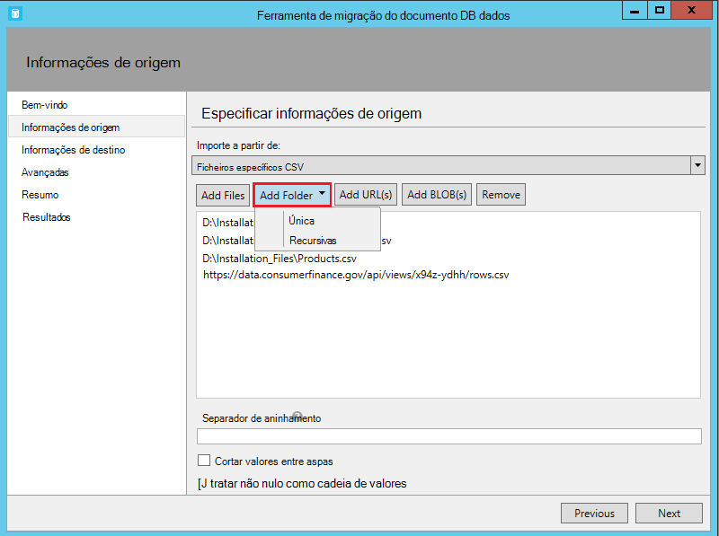
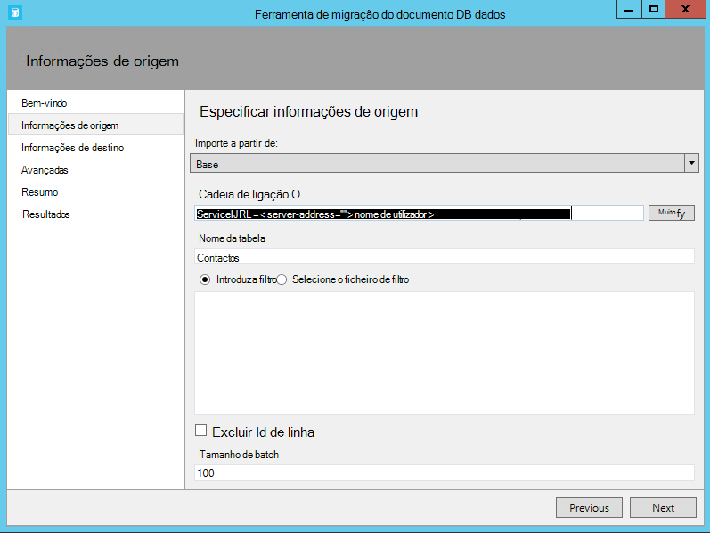
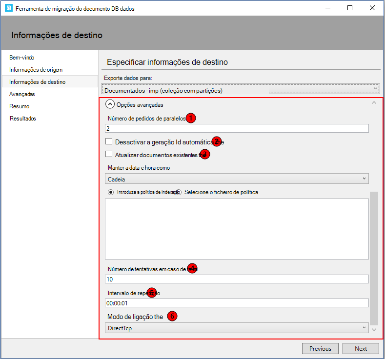

<properties
    pageTitle="Ferramenta de migração de base de dados para DocumentDB | Microsoft Azure"
    description="Saiba como utilizar as ferramentas de migração do abrir origem DocumentDB dados para importar dados para DocumentDB a partir de várias origens, incluindo ficheiros MongoDB, SQL Server, tabela armazenamento, Amazon DynamoDB, CSV e JSON. CSV conversão JSON."
    keywords="CSV para json, ferramentas de migração de base de dados, converter csv json"
    services="documentdb"
    authors="andrewhoh"
    manager="jhubbard"
    editor="monicar"
    documentationCenter=""/>

<tags
    ms.service="documentdb"
    ms.workload="data-services"
    ms.tgt_pltfrm="na"
    ms.devlang="na"
    ms.topic="article"
    ms.date="10/06/2016"
    ms.author="anhoh"/>

# Importar dados para DocumentDB com a ferramenta de migração de base de dados

Este artigo mostra-lhe como utilizar a ferramenta de migração do oficial abrir origem DocumentDB dados para importar dados para o [Microsoft Azure DocumentDB](https://azure.microsoft.com/services/documentdb/) a partir de várias origens, incluindo ficheiros JSON, ficheiros CSV, SQL, MongoDB, armazenamento de tabela do Azure, Amazon DynamoDB e DocumentDB coleções de sites.

Depois de ler este artigo, poderá atender as seguintes questões:  

-   Como posso importar ficheiro JSON, ficheiro CSV, dados do SQL Server ou MongoDB dados para DocumentDB?
-   Como importar dados a partir do armazenamento de tabela do Azure, Amazon DynamoDB e HBase para DocumentDB?
-   Como posso migrar dados entre colecções DocumentDB?

##Pré-requisitos

Antes de seguir as instruções neste artigo, certifique-se de que tem os seguintes componentes instalados:

- [Microsoft .NET Framework 4.51](https://www.microsoft.com/download/developer-tools.aspx) ou superior.

##Descrição geral da ferramenta de migração DocumentDB dados

A ferramenta de migração de dados de DocumentDB é uma solução de abrir origem que importa dados para DocumentDB a partir de uma variedade de origens, incluindo:

- Ficheiros JSON
- MongoDB
- Do SQL Server
- Ficheiros CSV
- Armazenamento de tabela do Azure
- Amazon DynamoDB
- HBase
- DocumentDB coleções de sites

Enquanto a ferramenta de importação inclui uma interface de utilizador gráfica (dtui.exe), também pode ser orientado da linha de comandos (dt.exe). Na verdade, existe uma opção para exportar o comando associado depois de configurar uma importação através da UI. Tabela de origem de dados (por exemplo, ficheiros do SQL Server ou CSV) pode ser transformadas assim que as relações hierárquicas (subdocumentos) podem ser criadas durante a importação. Continue a ler para saber mais sobre as opções de origem, linhas de comandos para importar a partir de cada origem, opções de destino e visualização importar resultados de exemplo.

##Instalar a ferramenta de migração de dados DocumentDB

O código de origem da ferramenta de migração está disponível no GitHub [neste](https://github.com/azure/azure-documentdb-datamigrationtool) repositório e uma versão compilada está disponível a partir do [Centro de transferências da Microsoft](http://www.microsoft.com/downloads/details.aspx?FamilyID=cda7703a-2774-4c07-adcc-ad02ddc1a44d). Poderá compilar a solução ou simplesmente transfira e extrair a versão compilada para um diretório da sua escolha. Em seguida, execute um:

- **Dtui.exe**: versão interface gráfica da ferramenta
- **DT.exe**: versão da linha de comandos da ferramenta

##Importar ficheiros JSON

A opção de importador de origem do JSON ficheiro permite-lhe importar um ou mais ficheiros JSON único documento ou ficheiros JSON que cada contêm uma matriz de documentos JSON. Quando adicionar pastas que contenham ficheiros JSON para importar, tem a opção de forma recursiva procurar ficheiros em subpastas.

Aqui estão alguns exemplos de linha de comandos para importar ficheiros JSON:

    #Import a single JSON file
    dt.exe /s:JsonFile /s.Files:.\Sessions.json /t:DocumentDBBulk /t.ConnectionString:"AccountEndpoint=<DocumentDB Endpoint>;AccountKey=<DocumentDB Key>;Database=<DocumentDB Database>;" /t.Collection:Sessions /t.CollectionThroughput:2500

    #Import a directory of JSON files
    dt.exe /s:JsonFile /s.Files:C:\TESessions\*.json /t:DocumentDBBulk /t.ConnectionString:" AccountEndpoint=<DocumentDB Endpoint>;AccountKey=<DocumentDB Key>;Database=<DocumentDB Database>;" /t.Collection:Sessions /t.CollectionThroughput:2500

    #Import a directory (including sub-directories) of JSON files
    dt.exe /s:JsonFile /s.Files:C:\LastFMMusic\**\*.json /t:DocumentDBBulk /t.ConnectionString:" AccountEndpoint=<DocumentDB Endpoint>;AccountKey=<DocumentDB Key>;Database=<DocumentDB Database>;" /t.Collection:Music /t.CollectionThroughput:2500

    #Import a directory (single), directory (recursive), and individual JSON files
    dt.exe /s:JsonFile /s.Files:C:\Tweets\*.*;C:\LargeDocs\**\*.*;C:\TESessions\Session48172.json;C:\TESessions\Session48173.json;C:\TESessions\Session48174.json;C:\TESessions\Session48175.json;C:\TESessions\Session48177.json /t:DocumentDBBulk /t.ConnectionString:"AccountEndpoint=<DocumentDB Endpoint>;AccountKey=<DocumentDB Key>;Database=<DocumentDB Database>;" /t.Collection:subs /t.CollectionThroughput:2500

    #Import a single JSON file and partition the data across 4 collections
    dt.exe /s:JsonFile /s.Files:D:\\CompanyData\\Companies.json /t:DocumentDBBulk /t.ConnectionString:"AccountEndpoint=<DocumentDB Endpoint>;AccountKey=<DocumentDB Key>;Database=<DocumentDB Database>;" /t.Collection:comp[1-4] /t.PartitionKey:name /t.CollectionThroughput:2500

##Importar do MongoDB

A opção de importador origem MongoDB permite-lhe importar a partir de uma coleção de MongoDB individual e filtrar, opcionalmente, documentos utilizando uma consulta e/ou modificar a estrutura do documento utilizando uma projecções.  

A cadeia de ligação está no formato MongoDB padrão:

    mongodb://<dbuser>:<dbpassword>@<host>:<port>/<database>

> [AZURE.NOTE] Utilize o comando Verify para se certificar de que pode ser acedida a instância de MongoDB especificada no campo cadeia de ligação.

Introduza o nome da coleção da partir do qual os dados serão importados. Opcionalmente, poderá especificar ou fornecer um ficheiro para uma consulta (por exemplo, {pop: {$gt: 5000}}) e/ou projecções (por exemplo, {loc:0}) para filtrar e modelar os dados para serem importados.

Aqui estão alguns exemplos de linha de comandos para importar a partir de MongoDB:

    #Import all documents from a MongoDB collection
    dt.exe /s:MongoDB /s.ConnectionString:mongodb://<dbuser>:<dbpassword>@<host>:<port>/<database> /s.Collection:zips /t:DocumentDBBulk /t.ConnectionString:"AccountEndpoint=<DocumentDB Endpoint>;AccountKey=<DocumentDB Key>;Database=<DocumentDB Database>;" /t.Collection:BulkZips /t.IdField:_id /t.CollectionThroughput:2500

    #Import documents from a MongoDB collection which match the query and exclude the loc field
    dt.exe /s:MongoDB /s.ConnectionString:mongodb://<dbuser>:<dbpassword>@<host>:<port>/<database> /s.Collection:zips /s.Query:{pop:{$gt:50000}} /s.Projection:{loc:0} /t:DocumentDBBulk /t.ConnectionString:"AccountEndpoint=<DocumentDB Endpoint>;AccountKey=<DocumentDB Key>;Database=<DocumentDB Database>;" /t.Collection:BulkZipsTransform /t.IdField:_id/t.CollectionThroughput:2500

##Importar ficheiros de exportação MongoDB

A opção de MongoDB exportar JSON ficheiro origem importador permite-lhe importar um ou mais ficheiros JSON produzidos a partir do utilitário mongoexport.  

Quando adicionar pastas que contenham MongoDB exportar JSON ficheiros para importação, tem a opção de forma recursiva procurar ficheiros em subpastas.

Eis um exemplo de linha de comandos para importar a partir de ficheiros JSON MongoDB exportar:

    dt.exe /s:MongoDBExport /s.Files:D:\mongoemployees.json /t:DocumentDBBulk /t.ConnectionString:"AccountEndpoint=<DocumentDB Endpoint>;AccountKey=<DocumentDB Key>;Database=<DocumentDB Database>;" /t.Collection:employees /t.IdField:_id /t.Dates:Epoch /t.CollectionThroughput:2500

##Importar do SQL Server

A opção de importador de origem do SQL permite-lhe importar a partir de uma base de dados do SQL Server individual e, opcionalmente, filtrar os registos para serem importados utilizando uma consulta. Além disso, pode modificar a estrutura do documento ao especificar um separador de aninhamento (mais informações sobre que num pouco a incorporá).  

O formato da cadeia de ligação é o formato da cadeia de ligação SQL padrão.

> [AZURE.NOTE] Utilize o comando Verify para se certificar de que pode ser acedida instância do SQL Server especificada no campo cadeia de ligação.

A propriedade de separação de aninhamento é utilizada para criar relações hierárquicas (documentos subpastas) durante a importação. Considere a seguinte consulta SQL:

*Selecione CAST (como BusinessEntityID varchar) como Id, nome, tipo de endereço como [Address.AddressType], AddressLine1 como [Address.AddressLine1], localidade como [Address.Location.City], Nomedoestadoprovíncia como [Address.Location.StateProvinceName], CódigoPostal como [Address.PostalCode], CountryRegionName como [Address.CountryRegionName] a partir do Sales.vStoreWithAddresses onde tipo de endereço = 'Principais do Office'*

Que devolve os seguintes resultados (parciais):

Tenha em atenção os aliases como Address.AddressType e Address.Location.StateProvinceName. Ao especificar um separador de aninhamento de '.', a ferramenta de importação cria subdocumentos endereço e Address.Location durante a importação. Eis um exemplo de um documento resultante no DocumentDB:

*{"id": "956", "nome": "Melhor e serviço de venda", "Endereço": {"tipo de endereço": "Principais Office", "AddressLine1": "#500 75 O'Connor Rua", "Localização": {"Cidade": "Otava", "Nomedoestadoprovíncia": "Ontário"}, "CódigoPostal": "K4B 1S2", "CountryRegionName": "Canadá"}}*

Aqui estão alguns exemplos de linha de comandos para importar a partir do SQL Server:

    #Import records from SQL which match a query
    dt.exe /s:SQL /s.ConnectionString:"Data Source=<server>;Initial Catalog=AdventureWorks;User Id=advworks;Password=<password>;" /s.Query:"select CAST(BusinessEntityID AS varchar) as Id, * from Sales.vStoreWithAddresses WHERE AddressType='Main Office'" /t:DocumentDBBulk /t.ConnectionString:" AccountEndpoint=<DocumentDB Endpoint>;AccountKey=<DocumentDB Key>;Database=<DocumentDB Database>;" /t.Collection:Stores /t.IdField:Id /t.CollectionThroughput:2500

    #Import records from sql which match a query and create hierarchical relationships
    dt.exe /s:SQL /s.ConnectionString:"Data Source=<server>;Initial Catalog=AdventureWorks;User Id=advworks;Password=<password>;" /s.Query:"select CAST(BusinessEntityID AS varchar) as Id, Name, AddressType as [Address.AddressType], AddressLine1 as [Address.AddressLine1], City as [Address.Location.City], StateProvinceName as [Address.Location.StateProvinceName], PostalCode as [Address.PostalCode], CountryRegionName as [Address.CountryRegionName] from Sales.vStoreWithAddresses WHERE AddressType='Main Office'" /s.NestingSeparator:. /t:DocumentDBBulk /t.ConnectionString:" AccountEndpoint=<DocumentDB Endpoint>;AccountKey=<DocumentDB Key>;Database=<DocumentDB Database>;" /t.Collection:StoresSub /t.IdField:Id /t.CollectionThroughput:2500

##Importar ficheiros CSV - CSV converter para JSON

A opção de importador de origem de ficheiro CSV permite-lhe importar um ou mais ficheiros CSV. Quando adicionar pastas que contenham ficheiros CSV de importação, tem a opção de forma recursiva procurar ficheiros em subpastas.

Semelhante à origem de SQL, a propriedade de separação aninhamento pode ser utilizada para criar relações hierárquicas (documentos subpastas) durante a importação. Tenha em consideração o seguinte cabeçalho CSV linhas de linha e de dados:

Tenha em atenção os aliases como DomainInfo.Domain_Name e RedirectInfo.Redirecting. Ao especificar um separador de aninhamento de '.', a ferramenta de importação irá criar subdocumentos DomainInfo e RedirectInfo durante a importação. Eis um exemplo de um documento resultante no DocumentDB:

*{"DomainInfo": {"Nome_de_domínio": "ACUS.GOV", "Domain_Name_Address": "http://www.ACUS.GOV"}, "Agência Federal": "administrativo conferência dos Estados Unidos", "RedirectInfo": {"Redirecionar": "0", "Redirect_Destination": ""}, "id": "9cc565c5-ebcd-1c03-ebd3-cc3e2ecd814d"}*

A ferramenta de importação tentará inferir informações do tipo para valores sem aspas nos ficheiros CSV (valores entre aspas são sempre tratados como cadeias).  Tipos de estão identificados pela seguinte ordem: número, data/hora, booleano.  

Existem dois outros aspetos a nota sobre a importação CSV:

1.  Por predefinição, os valores sem aspas são sempre limitados por motivos de separadores e espaços, enquanto valores entre aspas são preservados como-é. Este comportamento pode ser substituído com a caixa de verificação compactar valores entre aspas ou a opção de linha de comandos /s.TrimQuoted.

2.  Por predefinição, um sem aspas nulo é tratado como um valor nulo. Este comportamento pode ser substituído (ou seja, trate o uma null sem aspas como uma cadeia "nula") com a tratar não de valores nulos como caixa de verificação de cadeia ou a opção de linha de comandos /s.NoUnquotedNulls.

Eis um exemplo de linha de comandos para importação CSV:

    dt.exe /s:CsvFile /s.Files:.\Employees.csv /t:DocumentDBBulk /t.ConnectionString:"AccountEndpoint=<DocumentDB Endpoint>;AccountKey=<DocumentDB Key>;Database=<DocumentDB Database>;" /t.Collection:Employees /t.IdField:EntityID /t.CollectionThroughput:2500

##Importar a partir do armazenamento de tabela do Azure

A opção de importador de origem de armazenamento de tabela do Azure permite-lhe importar a partir de uma tabela de armazenamento de tabela do Azure individual e filtrar, opcionalmente, as entidades de tabela para serem importados.  

O formato da cadeia de ligação de armazenamento de tabela do Azure é:

    DefaultEndpointsProtocol=<protocol>;AccountName=<Account Name>;AccountKey=<Account Key>;

> [AZURE.NOTE] Utilize o comando Verify para se certificar de que pode ser acedida a instância de armazenamento de tabela do Azure especificada no campo cadeia de ligação.

Introduza o nome da tabela Azure a partir do qual os dados serão importados. Pode, opcionalmente, especifique um [filtro](https://msdn.microsoft.com/library/azure/ff683669.aspx).

A opção de importador de origem de armazenamento de tabela do Azure tem as seguintes opções adicionais:

1. Incluir campos internos
    2. All - incluir todos os campos internos (PartitionKey, RowKey e data/hora)
    3. Nenhum – excluir todos os campos internos
    4. RowKey - incluir apenas o campo RowKey
3. Selecionar colunas
    1. Azure filtros de armazenamento de tabela não suportam projecções. Se pretender importar apenas as propriedades de entidade de tabela do Azure específicas, adicioná-los à lista selecionar colunas. Todas as outras propriedades de entidade serão ignoradas.

Eis um exemplo de linha de comandos para importar a partir do armazenamento de tabela do Azure:

    dt.exe /s:AzureTable /s.ConnectionString:"DefaultEndpointsProtocol=https;AccountName=<Account Name>;AccountKey=<Account Key>" /s.Table:metrics /s.InternalFields:All /s.Filter:"PartitionKey eq 'Partition1' and RowKey gt '00001'" /s.Projection:ObjectCount;ObjectSize  /t:DocumentDBBulk /t.ConnectionString:" AccountEndpoint=<DocumentDB Endpoint>;AccountKey=<DocumentDB Key>;Database=<DocumentDB Database>;" /t.Collection:metrics /t.CollectionThroughput:2500

##Importar do Amazon DynamoDB

A opção de importador origem Amazon DynamoDB permite-lhe importar a partir de uma tabela de Amazon DynamoDB individual e filtrar, opcionalmente, as entidades para serem importados. Vários modelos são fornecidos para que a configurar uma importação é tão fácil como possíveis.

O formato da cadeia de ligação Amazon DynamoDB é:

    ServiceURL=<Service Address>;AccessKey=<Access Key>;SecretKey=<Secret Key>;

> [AZURE.NOTE] Utilize o comando Verify para se certificar de que pode ser acedida a instância da Amazon DynamoDB especificada no campo cadeia de ligação.

Eis um exemplo de linha de comandos para importar a partir da Amazon DynamoDB:

    dt.exe /s:DynamoDB /s.ConnectionString:ServiceURL=https://dynamodb.us-east-1.amazonaws.com;AccessKey=<accessKey>;SecretKey=<secretKey> /s.Request:"{   """TableName""": """ProductCatalog""" }" /t:DocumentDBBulk /t.ConnectionString:"AccountEndpoint=<DocumentDB Endpoint>;AccountKey=<DocumentDB Key>;Database=<DocumentDB Database>;" /t.Collection:catalogCollection /t.CollectionThroughput:2500

##Importar ficheiros de armazenamento de Blobs do Azure

O ficheiro JSON, ficheiro de exportação MongoDB e opções de importador de origem de ficheiro CSV permitem-lhe importar um ou mais ficheiros a partir do armazenamento de Blobs do Azure. Depois de especificar um URL de contentor BLOBs e uma chave de conta, basta fornecem uma expressão regular para selecionar o ficheiro (s) para importar.

Eis um exemplo de linha de comandos para importar ficheiros JSON de armazenamento de Blobs do Azure:

    dt.exe /s:JsonFile /s.Files:"blobs://<account key>@account.blob.core.windows.net:443/importcontainer/.*" /t:DocumentDBBulk /t.ConnectionString:"AccountEndpoint=<DocumentDB Endpoint>;AccountKey=<DocumentDB Key>;Database=<DocumentDB Database>;" /t.Collection:doctest

##Importar do DocumentDB

A opção de importador origem DocumentDB permite-lhe importar dados a partir de uma ou mais coleções de DocumentDB e filtrar, opcionalmente, documentos utilizando uma consulta.  

O formato da cadeia de ligação DocumentDB é:

    AccountEndpoint=<DocumentDB Endpoint>;AccountKey=<DocumentDB Key>;Database=<DocumentDB Database>;

O DocumentDB cadeia de ligação de conta pode ser obtida a partir do pá teclas do Azure portal, conforme descrito no artigo [como gerir uma conta de DocumentDB](documentdb-manage-account.md), no entanto o nome da base de dados tem de ser acrescentado com a cadeia de ligação no seguinte formato:

    Database=<DocumentDB Database>;

> [AZURE.NOTE] Utilize o comando Verify para se certificar de que pode ser acedida a instância de DocumentDB especificada no campo cadeia de ligação.

Para importar a partir de uma única colecção de DocumentDB, introduza o nome da coleção da partir do qual os dados serão importados. Para importar a partir de várias coleções de DocumentDB, fornecer uma expressão regular para corresponder a um ou mais nomes de coleções de sites (por exemplo, collection01 | collection02 | collection03). Opcionalmente, pode especificar ou fornecer um ficheiro para uma consulta para filtrar e forma os dados para serem importados.

> [AZURE.NOTE] Uma vez que o campo coleção aceita expressões regulares, se estiver a importar a partir de uma única colecção cujo nome contém carateres de expressão regular, em seguida, esses carateres devem ser escape em conformidade.

A opção de importador origem DocumentDB tem as seguintes opções avançadas:

1. Incluir campos internos: Especifica se pretende ou não incluir as propriedades de sistema do documento DocumentDB a exportação (por exemplo, _rid, _ts).
2. Número de tentativas em caso de falha: Especifica o número de vezes para repetir a ligação para DocumentDB em caso de falhas breves (por exemplo, interrupção de conectividade de rede).
3. Intervalo de repetição: Especifica quanto tempo a aguardar entre a repetir a ligação ao DocumentDB em caso de falhas breves (por exemplo, interrupção de conectividade de rede).
4. Modo de ligação: Especifica o modo de ligação para utilizar com DocumentDB. As opções disponíveis são DirectTcp, DirectHttps e Gateway. Os modos de ligação direta estão mais rápidos, enquanto o modo de gateway é mais firewall amigável, tal como utiliza apenas a porta 443.

> [AZURE.TIP] A ferramenta de importação por predefinição, o modo de ligação DirectTcp. Se tiver problemas de firewall, mude para modo de ligação Gateway, tal como requer apenas porta 443.

Aqui estão alguns exemplos de linha de comandos para importar a partir de DocumentDB:

    #Migrate data from one DocumentDB collection to another DocumentDB collections
    dt.exe /s:DocumentDB /s.ConnectionString:"AccountEndpoint=<DocumentDB Endpoint>;AccountKey=<DocumentDB Key>;Database=<DocumentDB Database>;" /s.Collection:TEColl /t:DocumentDBBulk /t.ConnectionString:" AccountEndpoint=<DocumentDB Endpoint>;AccountKey=<DocumentDB Key>;Database=<DocumentDB Database>;" /t.Collection:TESessions /t.CollectionThroughput:2500

    #Migrate data from multiple DocumentDB collections to a single DocumentDB collection
    dt.exe /s:DocumentDB /s.ConnectionString:"AccountEndpoint=<DocumentDB Endpoint>;AccountKey=<DocumentDB Key>;Database=<DocumentDB Database>;" /s.Collection:comp1|comp2|comp3|comp4 /t:DocumentDBBulk /t.ConnectionString:"AccountEndpoint=<DocumentDB Endpoint>;AccountKey=<DocumentDB Key>;Database=<DocumentDB Database>;" /t.Collection:singleCollection /t.CollectionThroughput:2500

    #Export a DocumentDB collection to a JSON file
    dt.exe /s:DocumentDB /s.ConnectionString:"AccountEndpoint=<DocumentDB Endpoint>;AccountKey=<DocumentDB Key>;Database=<DocumentDB Database>;" /s.Collection:StoresSub /t:JsonFile /t.File:StoresExport.json /t.Overwrite /t.CollectionThroughput:2500

##Importar do HBase

A opção de importador origem HBase permite-lhe importar dados de uma tabela de HBase e, opcionalmente, filtrar os dados. Vários modelos são fornecidos para que a configurar uma importação é tão fácil como possíveis.

O formato da cadeia de ligação HBase Stargate é:

    ServiceURL=<server-address>;Username=<username>;Password=<password>

> [AZURE.NOTE] Utilize o comando Verify para se certificar de que pode ser acedida a instância de HBase especificada no campo cadeia de ligação.

Eis um exemplo de linha de comandos para importar a partir de HBase:

    dt.exe /s:HBase /s.ConnectionString:ServiceURL=<server-address>;Username=<username>;Password=<password> /s.Table:Contacts /t:DocumentDBBulk /t.ConnectionString:"AccountEndpoint=<DocumentDB Endpoint>;AccountKey=<DocumentDB Key>;Database=<DocumentDB Database>;" /t.Collection:hbaseimport

##Importar para DocumentDB (importação em volume)

O importador em volume de DocumentDB permite-lhe importar a partir de qualquer uma das opções disponíveis origem, utilizando um procedimento DocumentDB armazenado para a eficiência. A ferramenta suporta a importação para uma coleção de DocumentDB divididos por única e importar sharded através das quais os dados são divididos em várias coleções de DocumentDB divididos por única. Para mais informações sobre como criar a partições dados, consulte o artigo [dimensionamento no Azure DocumentDB e divisão](documentdb-partition-data.md). A ferramenta irá criar, executar e, em seguida, eliminar o procedimento armazenado da coleção ou coleções de destino específicas.  

O formato da cadeia de ligação DocumentDB é:

    AccountEndpoint=<DocumentDB Endpoint>;AccountKey=<DocumentDB Key>;Database=<DocumentDB Database>;

O DocumentDB cadeia de ligação de conta pode ser obtida a partir do pá teclas do Azure portal, conforme descrito no artigo [como gerir uma conta de DocumentDB](documentdb-manage-account.md), no entanto o nome da base de dados tem de ser acrescentado com a cadeia de ligação no seguinte formato:

    Database=<DocumentDB Database>;

> [AZURE.NOTE] Utilize o comando Verify para se certificar de que pode ser acedida a instância de DocumentDB especificada no campo cadeia de ligação.

Para importar para uma única colecção, introduza o nome da coleção de à qual os dados serão importados e clique no botão Adicionar. Para importar para várias coleções de sites, introduza o nome de cada coleção individualmente ou utilizar a seguinte sintaxe para especificar várias coleções de ficheiros: *collection_prefix*[início index - o índice final]. Quando especificar várias colecções através de sintaxe acima referido, tenha o seguinte em mente:

1. São suportados apenas número inteiro intervalo padrões de nome. Por exemplo, especificar coleção [0-3] vai produzir os seguintes conjuntos: collection0, collection1, collection2, collection3.
2. Pode utilizar uma abreviada sintaxe: coleção [3] irá emitir o mesmo conjunto de coleções de mencionada no passo 1.
3. Pode ser fornecida mais do que uma substituição. Por exemplo, colecção [0-1], [0-9] irá gerar 20 coleções de sites nomes com zeros à esquerda (collection01,... 02,... 03).

Assim que tem sido especificados os nomes de coleções de sites, selecione o débito pretendido das coleção ou coleções específicas (400 RUs para 10.000 RUs). Para um melhor desempenho importar, escolha um débito superior. Para mais informações sobre níveis de desempenho, consulte o artigo [níveis de desempenho no DocumentDB](documentdb-performance-levels.md).

> [AZURE.NOTE] A definição de débito desempenho só se aplica a criação de coleções de sites. Se a coleção de especificado já existir, respetivo débito não será modificado.

Ao importar para várias coleções de sites, o importação ferramenta suporta hash com base sharding. Neste cenário, especifique a propriedade do documento que pretende utilizar como chave partição (se partição chave for deixado em branco, documentos será sharded aleatoriamente em coleções de destino).

Opcionalmente, pode especificar qual o campo na origem de importação deve ser utilizado como a propriedade de id do documento DocumentDB durante a importação (tenha em atenção que se documentos não contiverem esta propriedade, em seguida, a ferramenta de importação irá gerar um GUID como o valor da propriedade id).

Existem várias opções avançadas disponíveis durante a importação. Em primeiro lugar, enquanto a ferramenta inclui uma em volume predefinido importar procedimento armazenado (BulkInsert.js), pode optar por especificar o seu próprio procedimento armazenado de importar:

 

Para além disso, ao importar tipos de dados (por exemplo, a partir do SQL Server ou MongoDB), pode escolher entre três opções de importação:

 

-   Cadeia: Persistirem como um valor de cadeia
-   Época: Persistirem como um valor de número época
-   Ambos: Persistirem cadeia e valores numéricos época. Esta opção criará um subdocumento, por exemplo: "date_joined": {"Valor": "2013-10-21T21:17:25.2410000Z", "época": 1382390245}

O importador em volume de DocumentDB tem o seguinte adicionais, opções avançadas:

1. Tamanho do lote: As predefinições de ferramenta para um tamanho de lote de 50.  Se os documentos para serem importados são grandes, considere diminuir o tamanho do lote. Por outro lado, se os documentos para serem importados são pequenos, considere aumentar o tamanho do lote.
2. Tamanho máximo de Script (bytes): A ferramenta de predefinições para um tamanho máximo de script de 512KB
3. Geração de Id automática desativar: Se todos os documentos para serem importados contém um campo id, em seguida, selecionar esta opção pode aumentar o desempenho. Documentos em falta um campo id exclusivo não serão importados.
4. Atualização existentes documentos: A ferramenta de assume a predefinição não substituir documentos existentes com conflitos de id. Se selecionar esta opção permite que substituir documentos existentes com ids de correspondentes. Esta funcionalidade é útil para migrações de dados agendada que atualizar documentos existentes.
5. Número de tentativas em caso de falha: Especifica o número de vezes para repetir a ligação para DocumentDB em caso de falhas breves (por exemplo, interrupção de conectividade de rede).
6. Intervalo de repetição: Especifica quanto tempo a aguardar entre a repetir a ligação ao DocumentDB em caso de falhas breves (por exemplo, interrupção de conectividade de rede).
7. Modo de ligação: Especifica o modo de ligação para utilizar com DocumentDB. As opções disponíveis são DirectTcp, DirectHttps e Gateway. Os modos de ligação direta estão mais rápidos, enquanto o modo de gateway é mais firewall amigável, tal como utiliza apenas a porta 443.

> [AZURE.TIP] A ferramenta de importação por predefinição, o modo de ligação DirectTcp. Se tiver problemas de firewall, mude para modo de ligação Gateway, tal como requer apenas porta 443.

##Importar para DocumentDB (registo sequenciais importar)

O importador de registo sequenciais DocumentDB permite-lhe importar a partir de qualquer uma das opções disponíveis origem numa base de registo ao registo. Pode escolher esta opção se estiver a importar a uma coleção de existente que tenha atingido a sua quota de procedimentos armazenados. A ferramenta suporta a importação a um único (única partição e com várias partição) coleção DocumentDB, bem como sharded importar pelo qual os dados são divididos em várias coleções de DocumentDB única partição e/ou a partições com várias. Para mais informações sobre como criar a partições dados, consulte o artigo [dimensionamento no Azure DocumentDB e divisão](documentdb-partition-data.md).

O formato da cadeia de ligação DocumentDB é:

    AccountEndpoint=<DocumentDB Endpoint>;AccountKey=<DocumentDB Key>;Database=<DocumentDB Database>;

O DocumentDB cadeia de ligação de conta pode ser obtida a partir do pá teclas do Azure portal, conforme descrito no artigo [como gerir uma conta de DocumentDB](documentdb-manage-account.md), no entanto o nome da base de dados tem de ser acrescentado com a cadeia de ligação no seguinte formato:

    Database=<DocumentDB Database>;

> [AZURE.NOTE] Utilize o comando Verify para se certificar de que pode ser acedida a instância de DocumentDB especificada no campo cadeia de ligação.

Para importar para uma única colecção, introduza o nome da coleção de à qual os dados serão importados e clique no botão Adicionar. Para importar para várias coleções de sites, introduza o nome de cada coleção individualmente ou utilizar a seguinte sintaxe para especificar várias coleções de ficheiros: *collection_prefix*[início index - o índice final]. Quando especificar várias colecções através de sintaxe acima referido, tenha o seguinte em mente:

1. São suportados apenas número inteiro intervalo padrões de nome. Por exemplo, especificar coleção [0-3] vai produzir os seguintes conjuntos: collection0, collection1, collection2, collection3.
2. Pode utilizar uma abreviada sintaxe: coleção [3] irá emitir o mesmo conjunto de coleções de mencionada no passo 1.
3. Pode ser fornecida mais do que uma substituição. Por exemplo, colecção [0-1], [0-9] irá gerar 20 coleções de sites nomes com zeros à esquerda (collection01,... 02,... 03).

Assim que tem sido especificados os nomes de coleções de sites, selecione o débito pretendido das coleção ou coleções específicas (400 RUs para 250.000 RUs). Para um melhor desempenho importar, escolha um débito superior. Para mais informações sobre níveis de desempenho, consulte o artigo [níveis de desempenho no DocumentDB](documentdb-performance-levels.md). Qualquer importação para coleções de sites com débito > 10.000 RUs irão necessitar de uma chave de partição. Se optar por ter mais do que 250.000 RUs, consulte o artigo [Pedir aumentado DocumentDB limites da conta](documentdb-increase-limits.md).

> [AZURE.NOTE] A definição de débito só se aplica a criação de coleções de sites. Se a coleção de especificado já existir, respetivo débito não será modificado.

Ao importar para várias coleções de sites, o importação ferramenta suporta hash com base sharding. Neste cenário, especifique a propriedade do documento que pretende utilizar como chave partição (se partição chave for deixado em branco, documentos será sharded aleatoriamente em coleções de destino).

Opcionalmente, pode especificar qual o campo na origem de importação deve ser utilizado como a propriedade de id do documento DocumentDB durante a importação (tenha em atenção que se documentos não contiverem esta propriedade, em seguida, a ferramenta de importação irá gerar um GUID como o valor da propriedade id).

Existem várias opções avançadas disponíveis durante a importação. Em primeiro lugar, ao importar tipos de dados (por exemplo, a partir do SQL Server ou MongoDB), pode escolher entre três opções de importação:

 

-   Cadeia: Persistirem como um valor de cadeia
-   Época: Persistirem como um valor de número época
-   Ambos: Persistirem cadeia e valores numéricos época. Esta opção criará um subdocumento, por exemplo: "date_joined": {"Valor": "2013-10-21T21:17:25.2410000Z", "época": 1382390245}

DocumentDB - importador registo sequenciais tem as seguintes opções avançadas adicionais:

1. Número de pedidos de paralelos: A ferramenta de assume a predefinição de 2 pedidos paralelos. Se os documentos para serem importados são pequenos, considere aumentar o número de pedidos paralelos. Tenha em atenção que se este número é elevado demasiada, a importação poderá ocorrer limitação.
2. Geração de Id automática desativar: Se todos os documentos para serem importados contém um campo id, em seguida, selecionar esta opção pode aumentar o desempenho. Documentos em falta um campo id exclusivo não serão importados.
3. Atualização existentes documentos: A ferramenta de assume a predefinição não substituir documentos existentes com conflitos de id. Se selecionar esta opção permite que substituir documentos existentes com ids de correspondentes. Esta funcionalidade é útil para migrações de dados agendada que atualizar documentos existentes.
4. Número de tentativas em caso de falha: Especifica o número de vezes para repetir a ligação para DocumentDB em caso de falhas breves (por exemplo, interrupção de conectividade de rede).
5. Intervalo de repetição: Especifica quanto tempo a aguardar entre a repetir a ligação ao DocumentDB em caso de falhas breves (por exemplo, interrupção de conectividade de rede).
6. Modo de ligação: Especifica o modo de ligação para utilizar com DocumentDB. As opções disponíveis são DirectTcp, DirectHttps e Gateway. Os modos de ligação direta estão mais rápidos, enquanto o modo de gateway é mais firewall amigável, tal como utiliza apenas a porta 443.

> [AZURE.TIP] A ferramenta de importação por predefinição, o modo de ligação DirectTcp. Se tiver problemas de firewall, mude para modo de ligação Gateway, tal como requer apenas porta 443.

##Especificar uma política de indexação quando criar DocumentDB coleções de sites

Quando a permitir a ferramenta de migração criar coleções de sites durante a importação, pode especificar a política de indexação das coleções de ficheiros. Nas opções avançadas do secção em volume DocumentDB importe e opções de registo de DocumentDB sequenciais, navegue para a secção política de indexação.

Utilizar a política de indexação opção avançada, pode selecionar um ficheiro de política de indexação, manualmente introduza uma política de indexação ou selecione a partir de um conjunto de modelos predefinidos (ao clicar com o botão direito do rato na caixa de texto de política indexação).

Os modelos de política que a ferramenta fornece são:

- Por predefinição. Esta política é melhor quando estiver a realizar consultas de igualdade contra cadeias e utilizar ORDER BY, intervalo e consultas de igualdade como para os números. Esta política tem um inferior gerais de armazenamento de índice remissivo que intervalo.
- Intervalo. Esta política é melhor que estiver a utilizar consultas ORDER BY, intervalo e igualdade como números e cadeias. Esta política tem uma sobrecarga de armazenamento de índice remissivo mais elevada que o predefinido ou Hash.

> [AZURE.NOTE] Se não especificar uma política de indexação, em seguida, a política predefinida será aplicada. Para mais informações sobre as políticas de indexação, consulte o artigo [DocumentDB políticas de indexação](documentdb-indexing-policies.md).

## Exportar para ficheiro JSON

O exportador DocumentDB JSON permite-lhe exportar qualquer uma das opções disponíveis de origem para um ficheiro JSON que contém uma matriz de documentos JSON. A ferramenta de processará a exportação para si ou pode optar por ver o comando de migração resultante e execute o comando a próprio. O ficheiro JSON resultante pode ser armazenado localmente ou no armazenamento de Blobs do Azure.

Opcionalmente, pode optar por prettify a JSON resultante, o que aumenta o tamanho do documento resultante ao efetuar o conteúdo mais humanos legível.

    Standard JSON export
    [{"id":"Sample","Title":"About Paris","Language":{"Name":"English"},"Author":{"Name":"Don","Location":{"City":"Paris","Country":"France"}},"Content":"Don's document in DocumentDB is a valid JSON document as defined by the JSON spec.","PageViews":10000,"Topics":[{"Title":"History of Paris"},{"Title":"Places to see in Paris"}]}]

    Prettified JSON export
    [
    {
    "id": "Sample",
    "Title": "About Paris",
    "Language": {
      "Name": "English"
    },
    "Author": {
      "Name": "Don",
      "Location": {
        "City": "Paris",
        "Country": "France"
      }
    },
    "Content": "Don's document in DocumentDB is a valid JSON document as defined by the JSON spec.",
    "PageViews": 10000,
    "Topics": [
      {
        "Title": "History of Paris"
      },
      {
        "Title": "Places to see in Paris"
      }
    ]
    }]

## Configuração avançada

No ecrã de configuração avançadas, especifique a localização do ficheiro de registo ao qual gostaria algum erro escrito. As seguintes regras aplicam a esta página:

1.  Se não for fornecido um nome de ficheiro, em seguida, todos os erros serão devolvidos na página resultados.
2.  Se for fornecido um nome de ficheiro sem um diretório, em seguida, o ficheiro irá ser criado (ou substituído) no diretório ambiente atual.
3.  Se selecionar um existente será substituído ficheiro, em seguida, o ficheiro, existe uma opção de acréscimo.

Em seguida, escolha se pretende iniciar a sessão todos, crítica, ou sem mensagens de erro. Por fim, decida frequência será atualizada a mensagem de transferência no ecrã com o seu progresso.

    

## Confirmar as definições de importação e linha de comandos de vista

1. Depois de especificar informações de origem, informações de destino e configuração avançada, reveja a migração de resumo e, opcionalmente, ver/cópia o comando de migração resultante (copiar o comando é útil para automatizar operações de importação):

    

    

2. Quando estiver satisfeito com as opções de origem e destino, clique em **Importar**. O tempo decorrido, contar transferido e informações de falha (se não fornecer um nome de ficheiro na configuração avançada) serão atualizada tal como a importação estiver no processo. Uma vez concluída, pode exportar os resultados (por exemplo, para lidar com qualquer falhas de importação).

    

3. Também pode iniciar uma nova importação, em manter as definições de existentes (por exemplo, escolha de informações, origem e destino de cadeia de ligação, etc.) ou repor todos os valores.

    

## Próximos passos

- Para saber mais sobre DocumentDB, consulte o [Caminho de formação](https://azure.microsoft.com/documentation/learning-paths/documentdb/).
