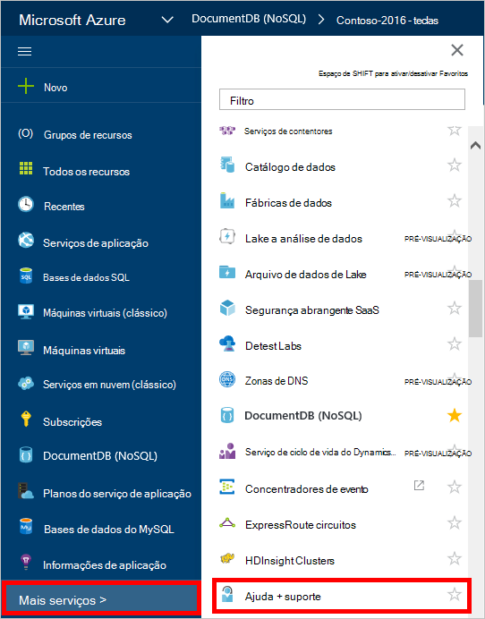
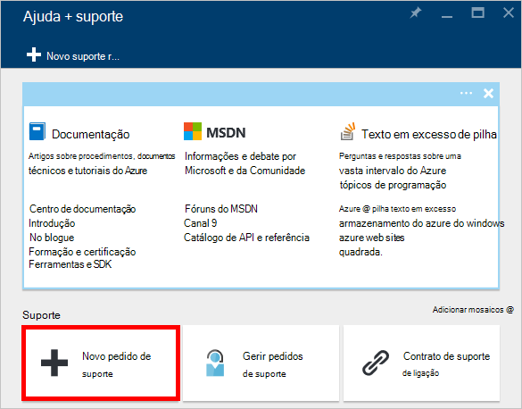
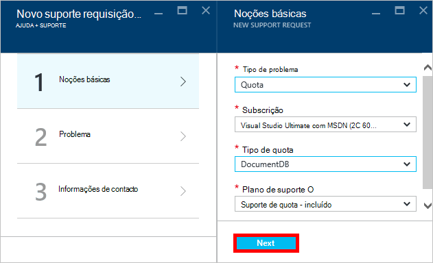
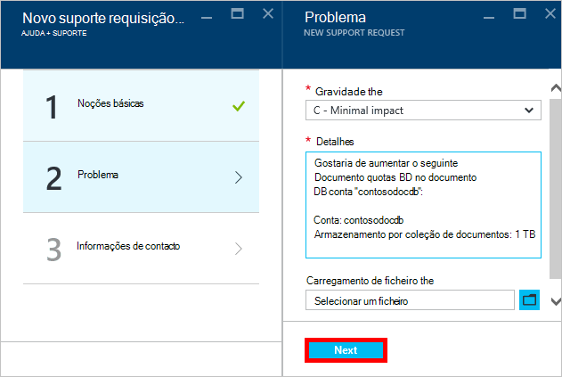
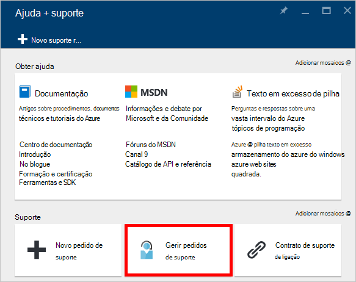

<properties
    pageTitle="Pedido de aumentado quotas de conta DocumentDB | Microsoft Azure"
    description="Saiba como pedir um ajustamento DocumentDB as quotas de base de dados como o armazenamento de documentos e débito por coleção."
    services="documentdb"
    authors="AndrewHoh"
    manager="jhubbard"
    editor="monicar"
    documentationCenter=""/>

<tags
    ms.service="documentdb"
    ms.workload="data-services"
    ms.tgt_pltfrm="na"
    ms.devlang="na"
    ms.topic="article"
    ms.date="08/25/2016"
    ms.author="anhoh"/>

# Pedido de aumentado DocumentDB limites da conta

[Microsoft Azure DocumentDB](https://azure.microsoft.com/services/documentdb/) tem um conjunto de quotas predefinidas que podem ser ajustadas ao contactar o suporte Azure.  Este artigo mostra como pedir um aumento de quota.

Depois de ler este artigo, poderá atender as seguintes questões:  

-   Quais as quotas de base de dados de DocumentDB podem ser ajustadas ao contactar o suporte Azure?
-   Como posso pedir um ajuste de quota DocumentDB conta?

##DocumentDB as quotas de conta

A tabela seguinte descreve as quotas de DocumentDB. As quotas que têm um asterisco (*) podem ser ajustadas ao contactar o suporte Azure:

[AZURE.INCLUDE [azure-documentdb-limits](../../includes/azure-documentdb-limits.md)]

##Pedir um ajuste de quota
Os seguintes passos mostram como pedir um ajuste de quota.

1. No [portal do Azure](https://portal.azure.com), clique em **Mais serviços**e, em seguida, clique em **Ajuda + suporte**.

    

2. Na pá **Ajuda + suporte** , clique em **novo pedido de suporte**.

    

3. Na pá **novo pedido de suporte** , clique em **informações básicas**. Próximo, defina **o tipo de problema** para **Quota**, a **subscrição** à sua subscrição que aloja a sua DocumentDB da conta, **tipo de Quota** para **DocumentDB**e **plano de suporte** para o **Suporte da Quota - incluído**. Em seguida, clique em **seguinte**.

    

4. No pá **problema** , escolha uma gravidade e incluir informações sobre o aumento de quota nos **Detalhes**. Clique em **seguinte**.

    

5. Por fim, preencha as informações de contacto a pá **informações de contacto** e clique em **Criar**.

Assim que tem sido criado de bilhetes de suporte, deverá receber o número de pedido de suporte por correio eletrónico.  Também pode ver o pedido de suporte ao clicar em **pedidos de suporte de gerir** no pá de **Ajuda + suporte** .

##Próximos passos
- Para saber mais sobre DocumentDB, clique [aqui](http://azure.com/docdb).
