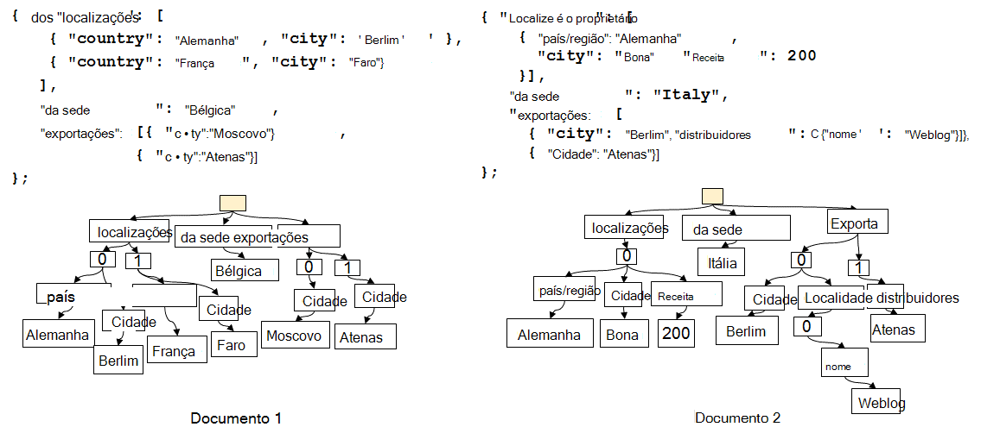
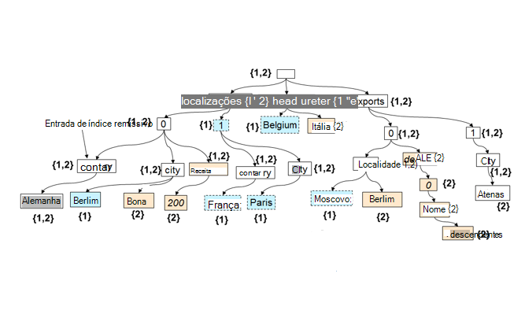

<properties 
    pageTitle="Indexação automática na DocumentDB | Microsoft Azure" 
    description="Saiba mais sobre como automática funciona indexação no Azure DocumentDB." 
    services="documentdb" 
    authors="arramac" 
    manager="jhubbard" 
    editor="mimig" 
    documentationCenter=""/>

<tags 
    ms.service="documentdb" 
    ms.workload="data-services" 
    ms.tgt_pltfrm="na" 
    ms.devlang="na" 
    ms.topic="article" 
    ms.date="10/27/2016" 
    ms.author="arramac"/>
    
# Automático indexação na DocumentDB do Azure

Este artigo é extraído da papel ["esquema desconhecido indexação com Azure DocumentDB"](http://www.vldb.org/pvldb/vol8/p1668-shukla.pdf) , que será apresentado na [Conferência interno 41st no muito grandes bases de dados](http://www.vldb.org/2015/) entre 31 de Agosto - 4 de Setembro de 2015, e está a uma introdução para a forma como indexar funciona no Azure DocumentDB. 

Depois de ler isto, irá responda às seguintes questões:

- Como é que o DocumentDB inferir o esquema de um documento JSON?
- Como é que DocumentDB construir um índice remissivo nos documentos diferentes?
- Como é que o DocumentDB efectuar a indexação automática na escala?

##Como funciona a indexação DocumentDB

[Microsoft Azure DocumentDB](https://azure.microsoft.com/services/documentdb/) é um objetivo verdadeiro libertar o esquema da base de dados criado para JSON. Não esperar ou exigir qualquer esquema ou definições de índice secundário indexar dados à escala. Esta opção permite-lhe definir e iteramos sobre modelos de dados de aplicação utilizando DocumentDB rapidamente. À medida que adiciona documentos para uma coleção de, DocumentDB índices automaticamente todas as propriedades do documento para que fiquem disponíveis para a consulta. Indexação automática permite-lhe armazenar documentos que pertencem a esquemas completamente arbitrários sem se preocupar esquemas ou índices secundários.

Com um objetivo para eliminar o erro de correspondência impedância entre a base de dados e os modelos de programação de aplicações, DocumentDB explore simplificar de JSON e respetiva falta de uma especificação de esquema. Torna os pressupostos sobre os documentos e permite aos documentos dentro de uma colecção de DocumentDB para variar no esquema, para além dos valores específicos da instância. Contrariamente ao outras bases de dados do documento, o motor de base de dados do DocumentDB opera diretamente ao nível da gramática JSON, restante desconhecido o conceito de um esquema de documento e blurring o limite entre os valores de estrutura e instância de documentos. Esta, no-ativar, permite-lo ao índice automaticamente os documentos sem necessidade de esquema ou índices secundários.

A indexação na DocumentDB tira partido do facto de que gramática JSON permite que os documentos para ser **representado como árvores**. Para um documento JSON ser representado como uma árvore, um nó raiz fictícios tem de ser criada parents qual o resto de nós no documento sob reais. Cada etiqueta, incluindo os índices de matriz num documento JSON torna-se um nó da árvore. A figura seguinte ilustra um documento JSON de exemplo e a respectiva representação de árvore correspondente.

>[AZURE.NOTE] Uma vez que JSON é descreve a próprio ou seja, cada documento incluir esquema (metadados) e dados, por exemplo, `{"locationId": 5, "city": "Moscow"}` revela que não existem duas propriedades `locationId` e `city`, e que têm uma valores de propriedade numéricos e de cadeia. É possível inferir o esquema de documentos e indexá-los quando são inseridas ou substituídos, sem que tenha alguma vez definir esquemas ou índices secundários DocumentDB.

**Documentos JSON como árvores:**

Por exemplo, no exemplo mostrado acima:

- A propriedade JSON `{"headquarters": "Belgium"}` propriedade no exemplo acima corresponde ao caminho/sede/Bélgica.
- A matriz JSON `{"exports": [{"city": “Moscow"}`, `{"city": Athens"}]}` corresponde aos caminhos `/exports/[]/city/Moscow` e `/exports/[]/city/Athens`.

Com automático indexação (1) cada caminho de uma árvore de documento é indexado (a menos que o programador explicitamente tenha configurada a política de indexação para excluir determinadas padrões de caminho). (2) cada actualização de um documento a uma coleção de DocumentDB orienta para atualizar da estrutura de índice (por exemplo, causas adição ou remoção de nós). Uma dos requisitos principais da indexação automática de documentos é para se certificar de que o custo para indexar e um documento com fortemente aninhada estrutura da consulta, diga 10 níveis, é o mesmo que um documento JSON simples que consiste pares valor de chave apenas um nível de profundidade. Por conseguinte uma representação de caminho normalizado é foundation no qual foram criados ambos os subsistemas automáticos de indexação e consulta.

Uma implicações importantes dos treating ambos os valores de esquema e instância uniformemente em termos de caminhos é que logicamente, à semelhança documentos individuais, um índice remissivo dos dois documentos apresentado que mantém um mapa entre caminhos e os ids de documento que contém o caminho também podem ser representados como uma árvore. DocumentDB utiliza este facto para criar uma árvore de índice remissivo que está construída fora da União de todas as árvores que representa a documentos individuais dentro da coleção. A árvore de índice remissivo DocumentDB coleções cresce ao longo do tempo, como novos documentos obtenham adicionados ou atualizados para a coleção.

**Índice de DocumentDB como uma árvore de:**

Apesar de ser o esquema de royalties, SQL e JavaScript do DocumentDB consulta idiomas fornecem projecções relacionais e filtros, hierárquica navegação ao longo de documentos, operações espaciais e invocação de UDFs escrito totalmente JavaScript. Tempo de execução de consulta do DocumentDB é possível suportar estas consultas desde-pode funcionar diretamente contra esta representação da árvore de índice remissivo dos dados.

A política predefinida para indexação automaticamente índices todas as propriedades de todos os documentos e fornece consultas consistentes (que significa que o índice será atualizado modo síncrono com a escrita documento). Como DocumentDB suporta as atualizações consistentes a árvore de índice remissivo à escala? DocumentDB utiliza escrita otimizada, bloquear gratuito e registo estruturado técnicas de manutenção de índice remissivo. Isto significa que DocumentDB pode suportar um volume constante de escritas rápidas enquanto ainda funcionar consultas consistentes. 

Indexação do DocumentDB foi concebido para eficiência de armazenamento e a processar multitenancy. Para eficácia de custo, a sobrecarga de armazenamento no disco do índice remissivo é mínimo e previsíveis. Atualizações de índice remissivo também são executadas dentro do orçamento de recursos do sistema atribuídos por DocumentDB coleção.

##Próximos passos
- Transfira ["esquema desconhecido indexação com Azure DocumentDB"](http://www.vldb.org/pvldb/vol8/p1668-shukla.pdf), para ser apresentado na conferência 41st interna no muito grandes bases de dados, 31 de Agosto - 4 de Setembro de 2015.
- [Consulta com DocumentDB SQL](documentdb-sql-query.md)
- Saiba mais sobre como personalizar o índice DocumentDB [aqui](documentdb-indexing-policies.md)
 
