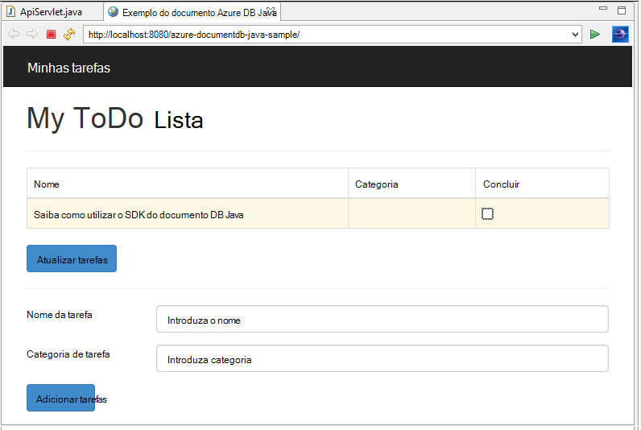
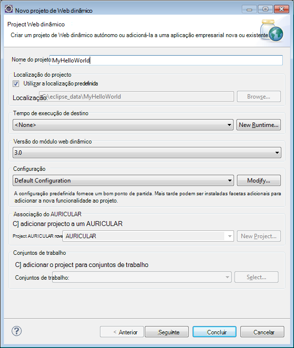
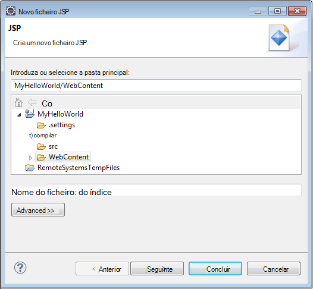
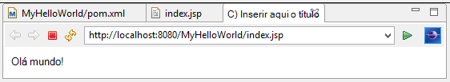
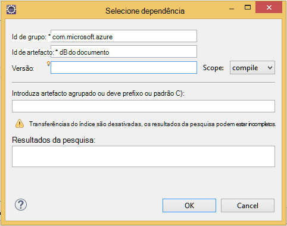

<properties
    pageTitle="Tutorial de desenvolvimento de aplicações Java utilizando DocumentDB | Microsoft Azure"
    description="Neste tutorial de aplicação web Java mostra-lhe como utilizar o serviço do Azure DocumentDB para armazenar e aceder a dados a partir de uma aplicação de Java alojada no Azure sites."
    keywords="Desenvolvimento de aplicações, tutorial de base de dados, aplicação java, tutorial de aplicação web de java, documentdb, azure, Microsoft azure"
    services="documentdb"
    documentationCenter="java"
    authors="dennyglee"
    manager="jhubbard"
    editor="mimig"/>

<tags
    ms.service="documentdb"
    ms.devlang="java"
    ms.topic="hero-article"
    ms.tgt_pltfrm="NA"
    ms.workload="data-services"
    ms.date="08/24/2016"
    ms.author="denlee"/>

# Criar uma Java aplicação web DocumentDB

> [AZURE.SELECTOR]
- [.NET](documentdb-dotnet-application.md)
- [NODE.js](documentdb-nodejs-application.md)
- [Java](documentdb-java-application.md)
- [Python](documentdb-python-application.md)

Neste tutorial de aplicação web Java mostra-lhe como utilizar o serviço do [Microsoft Azure DocumentDB](https://portal.azure.com/#gallery/Microsoft.DocumentDB) para armazenar e aceder a dados a partir de uma aplicação de Java alojada no Azure sites. Neste tópico, vai aprender:

- Como criar uma aplicação de JSP básica no Eclipse.
- Como trabalhar com o serviço do Azure DocumentDB utilizando o [DocumentDB Java SDK](https://github.com/Azure/azure-documentdb-java).

Neste tutorial de aplicação Java mostra-lhe como criar uma aplicação baseada na web gestão de tarefas que lhe permite criar, recuperar e marcar como concluída, as tarefas conforme apresentado na seguinte imagem. Cada uma das tarefas na lista de ToDo são armazenados como documentos JSON no Azure DocumentDB.

> [AZURE.TIP] Neste tutorial de desenvolvimento de aplicações assume que tem experiência prévia utilizando Java. Se estiver familiarizado com o Java ou as [Ferramentas de pré-requisito](#Prerequisites), recomendamos que transferindo o projeto concluída [todo](https://github.com/Azure-Samples/documentdb-java-todo-app) de GitHub e de construção-lo utilizando [as instruções fornecidas no final deste artigo](#GetProject). Assim que a tenha criado, pode rever o artigo para obter conhecimentos aprofundados no código no contexto do projeto.  

##Pré-requisitos para este tutorial de aplicação web Java
Antes de começar este tutorial de desenvolvimento de aplicações, tem de ter o seguinte procedimento:

- Uma conta do Azure active. Se não tiver uma conta, pode criar uma conta de avaliação gratuita apenas de duas minutos. Para obter detalhes, consulte o artigo [Versão de avaliação gratuita do Azure](https://azure.microsoft.com/pricing/free-trial/).
- [Java Development Kit (JDK 7 +)](http://www.oracle.com/technetwork/java/javase/downloads/index.html).
- [Eclipse IDE para programadores de EE Java.](http://www.eclipse.org/downloads/packages/eclipse-ide-java-ee-developers/lunasr1)
- [Um site do Azure com um Java runtime ambiente (por exemplo, Tomcat ou cais) ativado.](../app-service-web/web-sites-java-get-started.md)

Se estiver a instalar estas ferramentas pela primeira vez, coreservlets.com fornece uma guia passo a passo do processo de instalação, na secção de guia de introdução da sua [Tutorial: instalar TomCat7 e utilizá-lo com Eclipse](http://www.coreservlets.com/Apache-Tomcat-Tutorial/tomcat-7-with-eclipse.html) artigo.

##Passo 1: Criar uma conta de base de dados DocumentDB

Vamos começar por criar uma conta de DocumentDB. Se já tiver uma conta, pode avançar para [passo 2: criar a aplicação de Java JSP](#CreateJSP).

[AZURE.INCLUDE [documentdb-create-dbaccount](../../includes/documentdb-create-dbaccount.md)]

[AZURE.INCLUDE [documentdb-keys](../../includes/documentdb-keys.md)]

##Passo 2: Criar a aplicação de Java JSP

Para criar a aplicação JSP:

1. Primeiro, vamos começar através da criação de um projeto Java. Iniciar Eclipse, em seguida, clique em **ficheiro**, clique em **Novo**e, em seguida, clique em **Projeto de Web dinâmicos**. Se não vir o **Projecto Web dinâmicos** listado como um projeto disponível, faça o seguinte: clique em **ficheiro**, clique em **Novo**, clique em **projeto**..., expanda **Web**, clique em **Projeto de Web dinâmicos**e clique em **seguinte**.

    

2. Introduza um nome de projeto na caixa **nome do projeto** e, no menu pendente **Runtime de destino** , opcionalmente, selecione um valor (por exemplo, Apache Tomcat v 7.0) e, em seguida, clique em **Concluir**. Selecionar um destino runtime permite-lhe executar o seu projeto localmente através de Eclipse.
3. Na Eclipse, na vista do Project Explorer, expanda o projeto. Com o botão direito **ConteúdoWeb**, clique em **Novo**e, em seguida, clique em **Ficheiro de JSP**.
4. Na caixa de diálogo **Novo ficheiro JSP** , dê um nome de ficheiro **index.jsp**. Manter a pasta principal como **ConteúdoWeb**, conforme mostrado na ilustração seguinte e, em seguida, clique em **seguinte**.

    

5. Na caixa de diálogo **Seleccionar o modelo de JSP** , para este tutorial, selecione **Novo ficheiro JSP (html)**e, em seguida, clique em **Concluir**.

6. Quando abre o ficheiro index.jsp no Eclipse, adicionar texto a apresentar **Olá mundo!** dentro dos existentes <body> elemento. O atualizada <body> conteúdo deverá ter o aspeto o seguinte código:

        <body>
            <% out.println("Hello World!"); %>
        </body>

8. Guarde o ficheiro index.jsp.
9. Se definir um tempo de execução de destino no passo 2, pode clicar em **projeto** e, em seguida, **Executar** para executar a sua aplicação de JSP localmente:

    

##Passo 3: Instalar o DocumentDB Java SDK ##

A maneira mais fácil de separar no SDK do Java DocumentDB e respectivas dependências é através de [Apache Maven](http://maven.apache.org/).

Para fazer isto, terá de converter o seu projeto a um projeto maven completando os passos seguintes:

1. Botão direito do rato o seu projeto no Project Explorer, clique em **Configurar**, clique em **Converter para Maven projeto**.
2. Na janela **Criar novo POM** , aceite as predefinições e clique em **Concluir**.
3. No **Project Explorer**, abra o ficheiro pom.xml.
4. No separador **dependências** , no painel **dependências** , clique em **Adicionar**.
4. Na janela de **Dependência selecione** , faça o seguinte:
 - Na caixa **ID de grupo** , introduza com.microsoft.azure.
 - Na caixa **Id artefacto** introduza azure documentdb.
 - Na caixa **versão** introduza 1.5.1.

    

    Ou adicionar a dependência de XML para ID de grupo e ArtifactId diretamente à pom.xml através de um editor de texto:

        <dependency>
            <groupId>com.microsoft.azure</groupId>
            <artifactId>azure-documentdb</artifactId>
            <version>1.5.1</version>
        </dependency>

5. Clique em **Ok** e Maven instalará o SDK do Java DocumentDB.
6. Guarde o ficheiro pom.xml.

##Passo 4: Utilizar o serviço de DocumentDB numa aplicação Java

1. Primeiro, vamos definir o objeto TodoItem:

        @Data
        @Builder
        public class TodoItem {
            private String category;
            private boolean complete;
            private String id;
            private String name;
        }

    Este projeto, estamos a utilizar [Lombok de projeto](http://projectlombok.org/) para gerar o construtor, getters, setters e um construtor. Em alternativa, pode escrever este código manualmente ou ter IDE gerá-lo.

2. Para invocar o serviço de DocumentDB, tem de criar uma instância de um novo **DocumentClient**. Em geral, é melhor reutilizar **DocumentClient** - em vez de construir um novo cliente para cada pedido subsequente. Vamos pode reutilizar o cliente ao moldar o cliente de estação de um **DocumentClientFactory**. É também onde precisa colar o valor de chave primária e URI que guardou para a área de transferência no [passo 1](#CreateDB). Substituir [o\_ponto final\_aqui] com o seu URI e substituir [o\_chave\_aqui] com a sua chave primária.

        private static final String HOST = "[YOUR_ENDPOINT_HERE]";
        private static final String MASTER_KEY = "[YOUR_KEY_HERE]";

        private static DocumentClient documentClient;

        public static DocumentClient getDocumentClient() {
            if (documentClient == null) {
                documentClient = new DocumentClient(HOST, MASTER_KEY,
                        ConnectionPolicy.GetDefault(), ConsistencyLevel.Session);
            }

            return documentClient;
        }

3. Agora vamos criar um objeto de acesso de dados (DAO) para abstract persistência nossos itens ToDo para DocumentDB.

    Para guardar os itens de ToDo para uma coleção de, o cliente precisa de saber quais base de dados e coleções de sites para persistir para (como referenciado personalizada liga). Em geral, é melhor a base de dados e coleções de sites sempre que possível para evitar IDA adicionais à base de dados em cache.

    O código seguinte ilustra como obter o nosso base de dados e coleções de sites, se existir ou crie um novo se não existe:

        public class DocDbDao implements TodoDao {
            // The name of our database.
            private static final String DATABASE_ID = "TodoDB";

            // The name of our collection.
            private static final String COLLECTION_ID = "TodoCollection";

            // The DocumentDB Client
            private static DocumentClient documentClient = DocumentClientFactory
                    .getDocumentClient();

            // Cache for the database object, so we don't have to query for it to
            // retrieve self links.
            private static Database databaseCache;

            // Cache for the collection object, so we don't have to query for it to
            // retrieve self links.
            private static DocumentCollection collectionCache;

            private Database getTodoDatabase() {
                if (databaseCache == null) {
                    // Get the database if it exists
                    List<Database> databaseList = documentClient
                            .queryDatabases(
                                    "SELECT * FROM root r WHERE r.id='" + DATABASE_ID
                                            + "'", null).getQueryIterable().toList();

                    if (databaseList.size() > 0) {
                        // Cache the database object so we won't have to query for it
                        // later to retrieve the selfLink.
                        databaseCache = databaseList.get(0);
                    } else {
                        // Create the database if it doesn't exist.
                        try {
                            Database databaseDefinition = new Database();
                            databaseDefinition.setId(DATABASE_ID);

                            databaseCache = documentClient.createDatabase(
                                    databaseDefinition, null).getResource();
                        } catch (DocumentClientException e) {
                            // TODO: Something has gone terribly wrong - the app wasn't
                            // able to query or create the collection.
                            // Verify your connection, endpoint, and key.
                            e.printStackTrace();
                        }
                    }
                }

                return databaseCache;
            }

            private DocumentCollection getTodoCollection() {
                if (collectionCache == null) {
                    // Get the collection if it exists.
                    List<DocumentCollection> collectionList = documentClient
                            .queryCollections(
                                    getTodoDatabase().getSelfLink(),
                                    "SELECT * FROM root r WHERE r.id='" + COLLECTION_ID
                                            + "'", null).getQueryIterable().toList();

                    if (collectionList.size() > 0) {
                        // Cache the collection object so we won't have to query for it
                        // later to retrieve the selfLink.
                        collectionCache = collectionList.get(0);
                    } else {
                        // Create the collection if it doesn't exist.
                        try {
                            DocumentCollection collectionDefinition = new DocumentCollection();
                            collectionDefinition.setId(COLLECTION_ID);

                            collectionCache = documentClient.createCollection(
                                    getTodoDatabase().getSelfLink(),
                                    collectionDefinition, null).getResource();
                        } catch (DocumentClientException e) {
                            // TODO: Something has gone terribly wrong - the app wasn't
                            // able to query or create the collection.
                            // Verify your connection, endpoint, and key.
                            e.printStackTrace();
                        }
                    }
                }

                return collectionCache;
            }
        }

4. O passo seguinte é escrever algumas código para continuarem a TodoItems para a coleção. Neste exemplo, irá utilizamos [Gson](https://code.google.com/p/google-gson/) serializar e anular a serialização objetos de Java TodoItem simples antigo (POJOs) para documentos JSON. [Jackson](http://jackson.codehaus.org/) ou o seu próprio serializador personalizado também são excelentes alternativas para serializar POJOs.

        // We'll use Gson for POJO <=> JSON serialization for this example.
        private static Gson gson = new Gson();

        @Override
        public TodoItem createTodoItem(TodoItem todoItem) {
            // Serialize the TodoItem as a JSON Document.
            Document todoItemDocument = new Document(gson.toJson(todoItem));

            // Annotate the document as a TodoItem for retrieval (so that we can
            // store multiple entity types in the collection).
            todoItemDocument.set("entityType", "todoItem");

            try {
                // Persist the document using the DocumentClient.
                todoItemDocument = documentClient.createDocument(
                        getTodoCollection().getSelfLink(), todoItemDocument, null,
                        false).getResource();
            } catch (DocumentClientException e) {
                e.printStackTrace();
                return null;
            }

            return gson.fromJson(todoItemDocument.toString(), TodoItem.class);
        }

5. Como DocumentDB bases de dados e coleções de sites, documentos também são referenciados por hiperligações personalizada. A função helper seguinte permite-nos obter documentos por outro atributo (por exemplo, "id") em vez de ligação automática:

        private Document getDocumentById(String id) {
            // Retrieve the document using the DocumentClient.
            List<Document> documentList = documentClient
                    .queryDocuments(getTodoCollection().getSelfLink(),
                            "SELECT * FROM root r WHERE r.id='" + id + "'", null)
                    .getQueryIterable().toList();

            if (documentList.size() > 0) {
                return documentList.get(0);
            } else {
                return null;
            }
        }

6. Vamos pode utilizar o método de ajuda no passo 5 para obter um documento TodoItem JSON por id e, em seguida, serialização-lo para um POJO:

        @Override
        public TodoItem readTodoItem(String id) {
            // Retrieve the document by id using our helper method.
            Document todoItemDocument = getDocumentById(id);

            if (todoItemDocument != null) {
                // De-serialize the document in to a TodoItem.
                return gson.fromJson(todoItemDocument.toString(), TodoItem.class);
            } else {
                return null;
            }
        }

7. Pode também utilizamos a DocumentClient para obter uma coleção de ou lista de TodoItems utilizando DocumentDB SQL:

        @Override
        public List<TodoItem> readTodoItems() {
            List<TodoItem> todoItems = new ArrayList<TodoItem>();

            // Retrieve the TodoItem documents
            List<Document> documentList = documentClient
                    .queryDocuments(getTodoCollection().getSelfLink(),
                            "SELECT * FROM root r WHERE r.entityType = 'todoItem'",
                            null).getQueryIterable().toList();

            // De-serialize the documents in to TodoItems.
            for (Document todoItemDocument : documentList) {
                todoItems.add(gson.fromJson(todoItemDocument.toString(),
                        TodoItem.class));
            }

            return todoItems;
        }

8. Existem várias formas de atualizar um documento com o DocumentClient. Na aplicação nossa lista Todo, podemos pretenda que administre Ativar/desativar se uma TodoItem está concluída. Isto pode ser realizado pelos atualizar o atributo "concluído" dentro do documento:

        @Override
        public TodoItem updateTodoItem(String id, boolean isComplete) {
            // Retrieve the document from the database
            Document todoItemDocument = getDocumentById(id);

            // You can update the document as a JSON document directly.
            // For more complex operations - you could de-serialize the document in
            // to a POJO, update the POJO, and then re-serialize the POJO back in to
            // a document.
            todoItemDocument.set("complete", isComplete);

            try {
                // Persist/replace the updated document.
                todoItemDocument = documentClient.replaceDocument(todoItemDocument,
                        null).getResource();
            } catch (DocumentClientException e) {
                e.printStackTrace();
                return null;
            }

            return gson.fromJson(todoItemDocument.toString(), TodoItem.class);
        }

9. Por fim, queremos a capacidade de eliminar um TodoItem da nossa lista. Para fazer isto, podemos pode utilizar o método de helper que vamos escrever anteriormente para obter a ligação automática e, em seguida, indicar ao cliente para eliminá-la:

        @Override
        public boolean deleteTodoItem(String id) {
            // DocumentDB refers to documents by self link rather than id.

            // Query for the document to retrieve the self link.
            Document todoItemDocument = getDocumentById(id);

            try {
                // Delete the document by self link.
                documentClient.deleteDocument(todoItemDocument.getSelfLink(), null);
            } catch (DocumentClientException e) {
                e.printStackTrace();
                return false;
            }

            return true;
        }

##Passo 5: Sobre o resto da cablagem a de projecto de desenvolvimento de aplicações Java em conjunto

Agora que recomendamos terminar o seu caminho bits - tudo o que para a esquerda é criar um utilizador rápido da interface e fio-la por excesso para o nosso DAO.

1. Primeiro, vamos começar pelos construir um controlador para ligar a nossa DAO:

        public class TodoItemController {
            public static TodoItemController getInstance() {
                if (todoItemController == null) {
                    todoItemController = new TodoItemController(TodoDaoFactory.getDao());
                }
                return todoItemController;
            }

            private static TodoItemController todoItemController;

            private final TodoDao todoDao;

            TodoItemController(TodoDao todoDao) {
                this.todoDao = todoDao;
            }

            public TodoItem createTodoItem(@NonNull String name,
                    @NonNull String category, boolean isComplete) {
                TodoItem todoItem = TodoItem.builder().name(name).category(category)
                        .complete(isComplete).build();
                return todoDao.createTodoItem(todoItem);
            }

            public boolean deleteTodoItem(@NonNull String id) {
                return todoDao.deleteTodoItem(id);
            }

            public TodoItem getTodoItemById(@NonNull String id) {
                return todoDao.readTodoItem(id);
            }

            public List<TodoItem> getTodoItems() {
                return todoDao.readTodoItems();
            }

            public TodoItem updateTodoItem(@NonNull String id, boolean isComplete) {
                return todoDao.updateTodoItem(id, isComplete);
            }
        }

    Numa aplicação mais complexa, o controlador de pode alojar lógica de negócio complicada na parte superior a DAO.

2. Em seguida, vamos criar uma servlet para encaminhar os pedidos HTTP para o controlador de:

        public class TodoServlet extends HttpServlet {
            // API Keys
            public static final String API_METHOD = "method";

            // API Methods
            public static final String CREATE_TODO_ITEM = "createTodoItem";
            public static final String GET_TODO_ITEMS = "getTodoItems";
            public static final String UPDATE_TODO_ITEM = "updateTodoItem";

            // API Parameters
            public static final String TODO_ITEM_ID = "todoItemId";
            public static final String TODO_ITEM_NAME = "todoItemName";
            public static final String TODO_ITEM_CATEGORY = "todoItemCategory";
            public static final String TODO_ITEM_COMPLETE = "todoItemComplete";

            public static final String MESSAGE_ERROR_INVALID_METHOD = "{'error': 'Invalid method'}";

            private static final long serialVersionUID = 1L;
            private static final Gson gson = new Gson();

            @Override
            protected void doGet(HttpServletRequest request,
                    HttpServletResponse response) throws ServletException, IOException {

                String apiResponse = MESSAGE_ERROR_INVALID_METHOD;

                TodoItemController todoItemController = TodoItemController
                        .getInstance();

                String id = request.getParameter(TODO_ITEM_ID);
                String name = request.getParameter(TODO_ITEM_NAME);
                String category = request.getParameter(TODO_ITEM_CATEGORY);
                boolean isComplete = StringUtils.equalsIgnoreCase("true",
                        request.getParameter(TODO_ITEM_COMPLETE)) ? true : false;

                switch (request.getParameter(API_METHOD)) {
                case CREATE_TODO_ITEM:
                    apiResponse = gson.toJson(todoItemController.createTodoItem(name,
                            category, isComplete));
                    break;
                case GET_TODO_ITEMS:
                    apiResponse = gson.toJson(todoItemController.getTodoItems());
                    break;
                case UPDATE_TODO_ITEM:
                    apiResponse = gson.toJson(todoItemController.updateTodoItem(id,
                            isComplete));
                    break;
                default:
                    break;
                }

                response.getWriter().println(apiResponse);
            }

            @Override
            protected void doPost(HttpServletRequest request,
                    HttpServletResponse response) throws ServletException, IOException {
                doGet(request, response);
            }
        }

3. Vamos terá uma Interface de utilizador da Web para apresentar ao utilizador. Vamos novamente escrever o index.jsp que criámos anterior:

        <html>
        <head>
          <meta http-equiv="Content-Type" content="text/html; charset=ISO-8859-1">
          <meta http-equiv="X-UA-Compatible" content="IE=edge;" />
          <title>Azure DocumentDB Java Sample</title>

          <!-- Bootstrap -->
          <link href="//ajax.aspnetcdn.com/ajax/bootstrap/3.2.0/css/bootstrap.min.css" rel="stylesheet">

          
        </head>
        <body>
          <!-- Nav Bar -->
          

            

              

                <a class="navbar-brand" href="#">My Tasks</a>
              

            

          

          <!-- Body -->
          

            <h1>My ToDo List</h1>

            

            <!-- The ToDo List -->
            

              <table class="table table-bordered table-striped" id="todoItems">
                <thead>
                  <tr>
                    <th>Name</th>
                    <th>Category</th>
                    <th>Complete</th>
                  </tr>
                </thead>
                <tbody>
                </tbody>
              </table>

              <!-- Update Button -->
              

                <form class="form-horizontal" role="form">
                  <button type="button" class="btn btn-primary">Update Tasks</button>
                </form>
              

            

            

            <!-- Item Input Form -->
            

              <form class="form-horizontal" role="form">
                

                  <label for="inputItemName" class="col-sm-2">Task Name</label>
                  

                    <input type="text" class="form-control" id="inputItemName" placeholder="Enter name">
                  

                

                

                  <label for="inputItemCategory" class="col-sm-2">Task Category</label>
                  

                    <input type="text" class="form-control" id="inputItemCategory" placeholder="Enter category">
                  

                

                <button type="button" class="btn btn-primary">Add Task</button>
              </form>
            

          

          <!-- Placed at the end of the document so the pages load faster -->
          
          
          
        </body>
        </html>

4. E, por fim, escrever algumas Javascript do lado do cliente para associam a interface de utilizador da web e o servlet em conjunto:

        var todoApp = {
          /*
           * API methods to call Java backend.
           */
          apiEndpoint: "api",

          createTodoItem: function(name, category, isComplete) {
            $.post(todoApp.apiEndpoint, {
                "method": "createTodoItem",
                "todoItemName": name,
                "todoItemCategory": category,
                "todoItemComplete": isComplete
              },
              function(data) {
                var todoItem = data;
                todoApp.addTodoItemToTable(todoItem.id, todoItem.name, todoItem.category, todoItem.complete);
              },
              "json");
          },

          getTodoItems: function() {
            $.post(todoApp.apiEndpoint, {
                "method": "getTodoItems"
              },
              function(data) {
                var todoItemArr = data;
                $.each(todoItemArr, function(index, value) {
                  todoApp.addTodoItemToTable(value.id, value.name, value.category, value.complete);
                });
              },
              "json");
          },

          updateTodoItem: function(id, isComplete) {
            $.post(todoApp.apiEndpoint, {
                "method": "updateTodoItem",
                "todoItemId": id,
                "todoItemComplete": isComplete
              },
              function(data) {},
              "json");
          },

          /*
           * UI Methods
           */
          addTodoItemToTable: function(id, name, category, isComplete) {
            var rowColor = isComplete ? "active" : "warning";

            todoApp.ui_table().append($("<tr>")
              .append($("<td>").text(name))
              .append($("<td>").text(category))
              .append($("<td>")
                .append($("<input>")
                  .attr("type", "checkbox")
                  .attr("id", id)
                  .attr("checked", isComplete)
                  .attr("class", "isComplete")
                ))
              .addClass(rowColor)
            );
          },

          /*
           * UI Bindings
           */
          bindCreateButton: function() {
            todoApp.ui_createButton().click(function() {
              todoApp.createTodoItem(todoApp.ui_createNameInput().val(), todoApp.ui_createCategoryInput().val(), false);
              todoApp.ui_createNameInput().val("");
              todoApp.ui_createCategoryInput().val("");
            });
          },

          bindUpdateButton: function() {
            todoApp.ui_updateButton().click(function() {
              // Disable button temporarily.
              var myButton = $(this);
              var originalText = myButton.text();
              $(this).text("Updating...");
              $(this).prop("disabled", true);

              // Call api to update todo items.
              $.each(todoApp.ui_updateId(), function(index, value) {
                todoApp.updateTodoItem(value.name, value.value);
                $(value).remove();
              });

              // Re-enable button.
              setTimeout(function() {
                myButton.prop("disabled", false);
                myButton.text(originalText);
              }, 500);
            });
          },

          bindUpdateCheckboxes: function() {
            todoApp.ui_table().on("click", ".isComplete", function(event) {
              var checkboxElement = $(event.currentTarget);
              var rowElement = $(event.currentTarget).parents('tr');
              var id = checkboxElement.attr('id');
              var isComplete = checkboxElement.is(':checked');

              // Toggle table row color
              if (isComplete) {
                rowElement.addClass("active");
                rowElement.removeClass("warning");
              } else {
                rowElement.removeClass("active");
                rowElement.addClass("warning");
              }

              // Update hidden inputs for update panel.
              todoApp.ui_updateForm().children("input[name='" + id + "']").remove();

              todoApp.ui_updateForm().append($("<input>")
                .attr("type", "hidden")
                .attr("class", "updateComplete")
                .attr("name", id)
                .attr("value", isComplete));

            });
          },

          /*
           * UI Elements
           */
          ui_createNameInput: function() {
            return $(".todoForm #inputItemName");
          },

          ui_createCategoryInput: function() {
            return $(".todoForm #inputItemCategory");
          },

          ui_createButton: function() {
            return $(".todoForm button");
          },

          ui_table: function() {
            return $(".todoList table tbody");
          },

          ui_updateButton: function() {
            return $(".todoUpdatePanel button");
          },

          ui_updateForm: function() {
            return $(".todoUpdatePanel form");
          },

          ui_updateId: function() {
            return $(".todoUpdatePanel .updateComplete");
          },

          /*
           * Install the TodoApp
           */
          install: function() {
            todoApp.bindCreateButton();
            todoApp.bindUpdateButton();
            todoApp.bindUpdateCheckboxes();

            todoApp.getTodoItems();
          }
        };

        $(document).ready(function() {
          todoApp.install();
        });

5. Cibermagia! Agora tudo o que falta é testar a aplicação. Executar a aplicação localmente e adicione alguns itens de Todo preencher a categoria e o nome do item e clicando em **Adicionar tarefa**.

6. Quando o item aparece, pode atualizar se é concluída alternar a caixa de verificação e clicando em **Atualizar tarefas**.

##Passo 6: Implementar a aplicação de Java para sites públicos do Azure

Sites públicos do Azure torna implementar aplicações Java tão simples como exportar a sua aplicação como um ficheiro de guerra e quer carregá-lo através de controlo de origem (por exemplo, GIT) ou FTP.

1. Para exportar a sua aplicação como uma guerra, com o botão direito no seu projeto no **Project Explorer**, clique em **Exportar**e, em seguida, clique em **Ficheiro de guerra**.
2. Na janela do **Guerra exportar** , faça o seguinte:
 - Na caixa de projeto Web, introduza azure-documentdb java exemplo.
 - Na caixa de destino, escolha um destino para guardar o ficheiro de guerra.
 - Clique em **Concluir**.

3. Agora que tem um ficheiro de guerra em mão, pode simplesmente carregá-lo para o diretório do seu Web site Azure **webapps** . Para obter instruções sobre o ficheiro a carregar, consulte o artigo [Adicionar uma aplicação para o Web site Java no Azure](../app-service-web/web-sites-java-add-app.md).

    Assim que o ficheiro de guerra é carregado para o directório webapps, irá detectar o ambiente do runtime que tenha adicionado-lo e irá automaticamente carregá-lo.
4. Para ver o seu produto acabado, navegue para http://YOUR\_SITE\_NAME.azurewebsites.net/azure-documentdb-java-sample/ e começar a adicionar as suas tarefas!

##Obter o projeto a partir do GitHub

Todas as amostras neste tutorial estão incluídas no projeto [todo](https://github.com/Azure-Samples/documentdb-java-todo-app) no GitHub. Para importar o projeto todo para Eclipse, certifique-se de que tem o software e recursos listados na secção de [Pré-requisitos](#Prerequisites) , em seguida, efetue o seguinte procedimento:

1. Instale o [Project Lombok](http://projectlombok.org/). Lombok é utilizada para gerar construtores, getters, setters no projeto. Assim que tiver transferido o ficheiro lombok.jar, faça duplo clique para instalá-lo ou instalá-lo da linha de comandos.
2. Se Eclipse estiver aberta, fechá-lo e reinicie-o para carregar Lombok.
3. Na Eclipse, no menu **ficheiro** , clique em **Importar**.
4. Na janela de **importação** , clique em **Git**, clique em **projetos de Git**e, em seguida, clique em **seguinte**.
5. No ecrã de **Selecionar o repositório de origem** , clique em **Clonar URI**.
6. No ecrã do **Repositório de Git de origem** , na caixa **URI** , introduza https://github.com/Azure-Samples/documentdb-java-todo-app.git e, em seguida, clique em **seguinte**.
7. No ecrã de **Seleção de ramo** , certifique-se de que **mestra** está selecionada e, em seguida, clique em **seguinte**.
8. No ecrã do **Local de destino** , clique em **Procurar** para selecionar uma pasta onde o repositório pode ser copiado e, em seguida, clique em **seguinte**.
9. No ecrã de **selecionar um Assistente para utilizar para importar projetos** , certifique-se de que **Importar projetos existentes** está selecionada e, em seguida, clique em **seguinte**.
10. No ecrã **Importar projetos** , anular a seleção de projeto **DocumentDB** e, em seguida, clique em **Concluir**. O projecto DocumentDB contém o SDK de Java DocumentDB, que vamos adicionar como uma dependência em vez disso.
11. No **Project Explorer**, navegue para azure-documentdb-java-sample\src\com.microsoft.azure.documentdb.sample.dao\DocumentClientFactory.java e substitua os valores de anfitrião e MASTER_KEY a URI e a chave primária para a sua conta de DocumentDB e, em seguida, guarde o ficheiro. Para mais informações, consulte o artigo [passo 1. Criar uma conta de base de dados DocumentDB](#CreateDB).
12. No **Project Explorer**, clique com o botão direito do rato em **azure-documentdb java exemplo**, clique em **Criar caminho**e, em seguida, clique em **Configurar o caminho de criar**.
13. No ecrã **Java construir caminho** , no painel direito, selecione o separador de **bibliotecas** e, em seguida, clique em **Adicionar vasos externos**. Navegue para a localização do ficheiro lombok.jar e clique em **Abrir**e, em seguida, clique em **OK**.
14. Utilizar passo 12 para abrir a janela de **Propriedades** novamente e, em seguida, no painel esquerdo, clique em **Runtimes atribuído**.
15. No ecrã **Runtimes atribuído** , clique em **Novo**, selecione **v 7.0 de Apache Tomcat**e, em seguida, clique em **OK**.
16. Utilize o passo 12 para abrir a janela de **Propriedades** novamente e, em seguida, no painel esquerdo, clique em **Projeto facetas**.
17. No ecrã **Facetas de projeto** , selecione **Módulo Web dinâmico** e **Java**e, em seguida, clique em **OK**.
18. No separador **servidores** na parte inferior do ecrã, **Tomcat v 7.0 servidor em localhost** com o botão direito e, em seguida, clique em **Adicionar e remover**.
19. Na janela **Adicionar e remover** , mover **azure-documentdb java exemplo** para a caixa **configurado** e, em seguida, clique em **Concluir**.
20. No separador **servidor** , com o botão direito **Tomcat v 7.0 servidor em localhost**e, em seguida, clique em **reiniciar**.
21. Num browser, navegue para http://localhost:8080/azure-documentdb-java-sample / e começar a adicionar à lista de tarefas. Note que, se tiver alterado os valores de porta predefinida, altere 8080 para o valor que selecionou.
22. Para implementar o projeto para um web site do Azure, consulte o artigo [passo 6. Implementar a aplicação para sites públicos do Azure](#Deploy).

[1]: media/documentdb-java-application/keys.png
