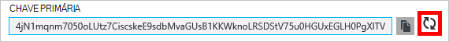
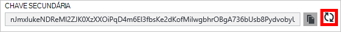

<properties
    pageTitle="Gerir uma conta de DocumentDB através do Portal do Azure | Microsoft Azure"
    description="Saiba como gerir a sua conta DocumentDB através do Portal do Azure. Localize um guia sobre como utilizar o Portal do Azure para ver, copiar, eliminar e aceder a contas."
    keywords="Portal Azure, documentdb, azure, Microsoft azure"
    services="documentdb"
    documentationCenter=""
    authors="kirillg"
    manager="jhubbard"
    editor="cgronlun"/>

<tags
    ms.service="documentdb"
    ms.workload="data-services"
    ms.tgt_pltfrm="na"
    ms.devlang="na"
    ms.topic="article"
    ms.date="10/14/2016"
    ms.author="kirillg"/>

# Como gerir uma conta de DocumentDB

Saiba como definir consistência global, trabalhar com as teclas e eliminar uma conta de DocumentDB no portal do Azure.

## Gerir as definições de consistência DocumentDB

Selecionar o nível de consistência direita depende a semântica da sua aplicação. Deverá familiarizar-se com os níveis de consistência disponíveis no DocumentDB ao ler o artigo [utilizar níveis de consistência para maximizar a disponibilidade e desempenho no DocumentDB] [consistency]. DocumentDB fornece consistência, disponibilidade e desempenho garantias, cada nível de consistência disponíveis para a sua conta de base de dados. Configurar a sua conta de base de dados com um nível de consistência de forte requer que os seus dados for fechada a uma única região Azure e não globalmente está disponível. Por outro lado, os níveis de consistência média - staleness delimitada, session ou ativar eventual para associar qualquer número de regiões Azure com a sua conta de base de dados. Os seguintes passos simples mostram-lhe como selecionar o nível de consistência predefinido para a sua conta de base de dados. 

### Para especificar a consistência predefinido para uma conta de DocumentDB

1. No [portal do Azure](https://portal.azure.com/), aceder à sua conta DocumentDB.
2. Na pá conta, clique em **predefinição consistência**.
3. Na pá **Consistência predefinido** , selecione o novo nível de consistência e clique em **Guardar**.
    ![Sessões de consistência predefinido][5]

## Ver, copiar e gerar teclas de acesso
Quando cria uma conta de DocumentDB, o serviço gera duas teclas de acesso principal que podem ser utilizadas para autenticação, quando a conta DocumentDB é acedida. Fornecendo dois teclas de acesso, DocumentDB permite-lhe gerar chaves com sem interrupções à sua conta DocumentDB. 

No [portal do Azure](https://portal.azure.com/), aceder a pá **teclas** a partir do menu de recursos na pá **DocumentDB conta** para ver, copiar e gerar as teclas de acesso que são utilizadas para aceder à sua conta DocumentDB.

> [AZURE.NOTE] A **teclas** pá também inclui cadeias de ligação principais e secundários que podem ser utilizadas para ligar à sua conta a partir da [Ferramenta de migração de dados](documentdb-import-data.md).

Teclas só de leitura também estão disponíveis neste pá. Lê e consultas são operações só de leitura, enquanto cria, elimina, e substitui não.

### Copiar uma tecla de acesso no Portal do Azure

No pá **teclas** , clique no botão **Copiar** para a direita da chave que pretende copiar.

### Gerar teclas de acesso

Deverá alterar as teclas de acesso à sua conta DocumentDB periodicamente para ajudar a manter as suas ligações mais segura. Teclas de acesso duas são atribuídas a permitem-lhe manter as ligações para a conta de DocumentDB utilizando uma tecla de acesso, enquanto que gerar a tecla de acesso.

> [AZURE.WARNING] Voltar a gerar teclas de acesso afeta todas as aplicações que são dependentes à chave atual. Todos os clientes que utilizam a tecla do access para aceder à conta DocumentDB têm de ser atualizados para utilizar a nova chave.

Se tiver aplicações ou serviços em nuvem através da conta DocumentDB, perderá as ligações se voltar a gerar chaves, a menos que as suas chaves filmar. Os passos seguintes descrevem o processo de envolvidos na gradual suas chaves.

1. Atualize a tecla de acesso no seu código de aplicação para fazer referência a tecla de acesso secundário da conta DocumentDB.
2. Voltar a gerar a chave primária acesso para a sua conta DocumentDB. No [Portal do Azure](https://portal.azure.com/), aceder à sua conta DocumentDB.
3. No pá **DocumentDB conta** , clique **nas teclas**.
4. No pá **teclas** , clique no botão voltar a gerar, em seguida, clique em **Ok** para confirmar que pretende gerar uma nova chave.
    

5. Assim que tiver confirmado que a nova chave está disponível para utilização (aproximadamente 5 minutos depois de nova geração), atualize a tecla de acesso no seu código de aplicação para fazer referência a nova chave de acesso principal.
6. Voltar a gerar a tecla de acesso secundário.

    

> [AZURE.NOTE] Pode demorar alguns minutos antes de uma chave gerada recentemente pode ser utilizada para aceder à sua conta DocumentDB.

## Obter a cadeia de ligação

Para obter a cadeia de ligação, faça o seguinte: 

1. No [portal do Azure](https://portal.azure.com), aceder à sua conta DocumentDB.
2. No menu do recurso, clique **nas teclas**.
3. Clique no botão **Copiar** junto à caixa **Cadeia de ligação principal** ou **Secundário cadeia de ligação** . 

Se estiver a utilizar a cadeia de ligação na [Ferramenta de migração de base de dados de DocumentDB](documentdb-import-data.md), anexe o nome da base de dados para o fim da cadeia de ligação. `AccountEndpoint=< >;AccountKey=< >;Database=< >`.

## Eliminar uma conta de DocumentDB
Para remover uma conta de DocumentDB a partir do Portal do Azure que já não está a utilizar, utilize o comando **Eliminar conta** na pá **DocumentDB conta** .

1. No [portal do Azure](https://portal.azure.com/), acesso à conta de DocumentDB que pretende eliminar.
2. No pá **DocumentDB conta** , clique em **mais**e, em seguida, clique em **Eliminar conta**. Ou, com o botão direito no nome da base de dados e clique em **Eliminar a conta**.
3. No resultante pá de confirmação, escreva o nome da conta DocumentDB para confirmar que pretende eliminar a conta.
4. Clique no botão **Eliminar** .

## Próximos passos

Saiba como [começar com a sua conta DocumentDB](http://go.microsoft.com/fwlink/p/?LinkId=402364).

Para saber mais sobre DocumentDB, consulte a documentação do Azure DocumentDB no [azure.com](http://go.microsoft.com/fwlink/?LinkID=402319&clcid=0x409).

<!--Image references-->
[1]: ./media/documentdb-manage-account/documentdb_add_region-1.png
[2]: ./media/documentdb-manage-account/documentdb_add_region-2.png
[3]: ./media/documentdb-manage-account/documentdb_change_write_region-1.png
[4]: ./media/documentdb-manage-account/documentdb_change_write_region-2.png
[5]: ./media/documentdb-manage-account/documentdb_change_consistency-1.png
[6]: ./media/documentdb-manage-account/chooseandsaveconsistency.png

<!--Reference style links - using these makes the source content way more readable than using inline links-->
[bcdr]: https://azure.microsoft.com/documentation/articles/best-practices-availability-paired-regions/
[consistency]: https://azure.microsoft.com/documentation/articles/documentdb-consistency-levels/
[azureregions]: https://azure.microsoft.com/en-us/regions/#services
[offers]: https://azure.microsoft.com/en-us/pricing/details/documentdb/
