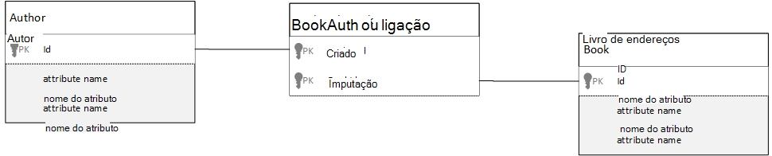

<properties 
    pageTitle="Modelação de dados no Azure DocumentDB | Microsoft Azure" 
    description="Saiba mais sobre Modelação de dados para DocumentDB, uma base de dados do documento NoSQL." 
    keywords="modelação de dados"
    services="documentdb" 
    authors="kiratp" 
    manager="jhubbard" 
    editor="mimig1" 
    documentationCenter=""/>

<tags 
    ms.service="documentdb" 
    ms.workload="data-services" 
    ms.tgt_pltfrm="na" 
    ms.devlang="na" 
    ms.topic="article" 
    ms.date="08/05/2016" 
    ms.author="kipandya"/>

#Modelação de dados DocumentDB#
Enquanto o esquema de royalties bases de dados, como o Azure DocumentDB, torná-lo super fácil Aproveite alterações ao seu modelo de dados que deve ainda gastou algumas pensar tempo sobre os seus dados. 

Como são dados vai ser armazenado? Como é que a aplicação vai para obter e consultar dados? É a sua aplicação ler grossa, ou escrita grossa? 

Depois de ler este artigo, será capaz de responder às seguintes questões:

- Como deve pensar sobre um documento numa base de dados do documento?
- O que é a modelação de dados e por que motivo deve devo preocupar-se? 
- Modelação de dados numa base de dados do documento é diferente para uma base de dados relacional?
- Como posso express relações de dados numa base de dados que não sejam relacionais?
- Quando incorporar dados e quando ligar a dados?

##Incorporar dados##
Quando começar a modelação de dados de um arquivo de documentos, tal como DocumentDB, tente trate o seu entidades como **documentos autónomos** representado em JSON.

Antes de Vamos começar demasiado muito para além disso, diga-nos recuperar alguns passos e ter um olhar sobre como podemos poderá do modelo de algo numa base de dados relacional, um assunto muitos dos casos já estão familiarizados com. O exemplo seguinte mostra como uma pessoa pode estar armazenada numa base de dados relacional. 

Ao trabalhar com bases de dados relacionais, recomendamos tenha sido ensinados de anos a normalizar, normalizar, normalizar.

Normalizar os seus dados normalmente envolve uma entidade, tal como uma pessoa, a efetuar e separá-la para baixo para descontínuos blocos de dados. No exemplo acima, uma pessoa pode ter vários registos de detalhes de contacto, bem como vários registos de endereço. Vamos mesmo avance um pouco e divide detalhes do contacto por novas extrair comuns campos como um tipo de. Mesmo endereço, cada registo aqui tem um tipo de como *casa* ou *negócio* 

O orientar premise quando normalização de dados é para **Evite armazenar dados redundantes** em cada registo e preferir fazer referência a dados. Neste exemplo, para ler uma pessoa, com todos os seus detalhes de contacto e endereços, é necessário utilizar associações para agregar eficazmente os seus dados em tempo de execução.

    SELECT p.FirstName, p.LastName, a.City, cd.Detail
    FROM Person p
    JOIN ContactDetail cd ON cd.PersonId = p.Id
    JOIN ContactDetailType on cdt ON cdt.Id = cd.TypeId
    JOIN Address a ON a.PersonId = p.Id

Atualizar uma única pessoa com os respetivos detalhes de contacto e endereços requer operações de escrita em muitas tabelas individuais. 

Agora vamos dar uma como podemos seria modelar os mesmos dados como uma entidade autónomo numa base de dados do documento.
        
    {
        "id": "1",
        "firstName": "Thomas",
        "lastName": "Andersen",
        "addresses": [
            {            
                "line1": "100 Some Street",
                "line2": "Unit 1",
                "city": "Seattle",
                "state": "WA",
                "zip": 98012
            }
        ],
        "contactDetails": [
            {"email: "thomas@andersen.com"},
            {"phone": "+1 555 555-5555", "extension": 5555}
        ] 
    }

Utilizando a abordagem acima temos agora **não normalizado** pessoa gravar onde podemos **incorporado** todas as informações relacionados com esta pessoa, tais como os respetivos detalhes de contacto e endereços, num único documento JSON.
Além disso, uma vez que recomendamos não está a limitados a um esquema fixo temos a flexibilidade de poder fazer coisas como tendo totalmente detalhes de contacto de formas diferentes. 

Obter um registo de pessoa completa da base de dados é agora uma única operação contra uma única colecção e para um documento só de leitura. Atualizar um registo de pessoa com as respetivas detalhes do contacto e endereços, também é uma operação de escrita única contra num único documento.

Por denormalizing dados, a sua aplicação poderá ter de emitir menos consultas e atualizações para concluir operações comuns. 

###Quando incorporar

Em geral, utilize dados incorporados modelos quando:

- Existem **contém** relações entre entidades.
- Existem **um para algumas** relações entre entidades.
- Não existe dados incorporados que **altera com pouca frequência**.
- Está incorporado dados não aumentar **sem limite**.
- Existe dados incorporados que são o **integral** a dados num documento.

> [AZURE.NOTE] Normalmente, os modelos de dados não normalizado fornecem um melhor desempenho de **Ler** .

###Quando não incorporar

Enquanto está a regra útil numa base de dados do documento para denormalize tudo e incorporar todos os dados a um único documento, este pode levar a algumas situações que devem ser evitadas.

Tomar este fragmento JSON.

    {
        "id": "1",
        "name": "What's new in the coolest Cloud",
        "summary": "A blog post by someone real famous",
        "comments": [
            {"id": 1, "author": "anon", "comment": "something useful, I'm sure"},
            {"id": 2, "author": "bob", "comment": "wisdom from the interwebs"},
            …
            {"id": 100001, "author": "jane", "comment": "and on we go ..."},
            …
            {"id": 1000000001, "author": "angry", "comment": "blah angry blah angry"},
            …
            {"id": ∞ + 1, "author": "bored", "comment": "oh man, will this ever end?"},
        ]
    }

Isto pode ser uma entidade de mensagem com comentários incorporados aspeto se podemos foram modelação um blogue típico ou CMS, sistema. O problema com este exemplo é que é a matriz de comentários **corrigem**, que significa que não existe nenhum limite (prático) para o número de comentários que pode ter qualquer mensagem única. Isto irá tornar-se um problema tal como o tamanho do documento pode aumentar significativamente.

> [AZURE.TIP] Os documentos no DocumentDB têm um tamanho máximo. Para obter mais informações sobre isto consulte [DocumentDB limites](documentdb-limits.md).

À medida que o tamanho do documento cresce a capacidade de transmitir os dados sobre o fio, bem como de leitura e atualizar o documento, em escala, vai ser afetada.

Neste caso seria melhor a ter em consideração o seguinte modelo.
        
    Post document:
    {
        "id": "1",
        "name": "What's new in the coolest Cloud",
        "summary": "A blog post by someone real famous",
        "recentComments": [
            {"id": 1, "author": "anon", "comment": "something useful, I'm sure"},
            {"id": 2, "author": "bob", "comment": "wisdom from the interwebs"},
            {"id": 3, "author": "jane", "comment": "....."}
        ]
    }

    Comment documents:
    {
        "postId": "1"
        "comments": [
            {"id": 4, "author": "anon", "comment": "more goodness"},
            {"id": 5, "author": "bob", "comment": "tails from the field"},
            ...
            {"id": 99, "author": "angry", "comment": "blah angry blah angry"}
        ]
    },
    {
        "postId": "1"
        "comments": [
            {"id": 100, "author": "anon", "comment": "yet more"},
            ...
            {"id": 199, "author": "bored", "comment": "will this ever end?"}
        ]
    }

Este modelo tem os três dados mais recentes comentários incorporados na mensagem propriamente dito, que é uma matriz com uma fixo vinculado este período de tempo. Os outros comentários estão agrupados para secções de 100 comentários e armazenados em documentos diferentes. O tamanho do lote de foi escolhido como 100 porque a nossa aplicação fictícia permite ao utilizador carregar 100 comentários de cada vez.  

Caso outra onde a incorporação de dados não não uma boa ideia é quando os dados incorporados são utilizados frequentemente em documentos e irão alterar frequentemente. 

Tomar este fragmento JSON.

    {
        "id": "1",
        "firstName": "Thomas",
        "lastName": "Andersen",
        "holdings": [
            {
                "numberHeld": 100,
                "stock": { "symbol": "zaza", "open": 1, "high": 2, "low": 0.5 }
            },
            {
                "numberHeld": 50,
                "stock": { "symbol": "xcxc", "open": 89, "high": 93.24, "low": 88.87 }
            }
        ]
    }

Isto pode representar portefólio de cotações de uma pessoa. Vamos ter escolhido incorporar as informações de cotações para cada documento portefólio. Num ambiente onde dados relacionados está a alterar frequentemente, como uma unidade populacional negociação aplicação, incorporar dados mudarem com frequência é que vai significa que está constantemente a atualizar cada documento portefólio sempre que um cotações são transaccionada.

Cotações *zaza* podem ser comercializados muitos centenas de vezes num único dia e milhares dos utilizadores podem ter *zaza* na sua portefólio. Com um modelo de dados como temos para atualizar vários milhares de documentos de portefólio muitas vezes acima diariamente levando a um sistema que não dimensionar muito bem. 

##Referenciar dados##

Por isso, incorporar dados funciona corretamente para muitos casos, mas é que não existem cenários quando denormalizing os seus dados causará mais problemas que em Limpar. O que recomendamos fazer agora? 

Bases de dados relacionais não são o único local onde pode criar relações entre entidades. Numa base de dados do documento pode ter informações num único documento que realmente relaciona para dados noutros documentos. Agora, posso estou não Defender mesmo de um minuto que criamos sistemas seriam melhor a uma base de dados relacional DocumentDB ou outra base de dados de documento, mas relações simples são finas e podem ser muito útil. 

O JSON abaixo optamos por para utilizar o exemplo de um portefólio de cotações anterior, mas desta vez podemos referir-se para o item de cotações no portefólio em vez de incorporá-lo. Desta forma, quando o item de cotações altera frequentemente ao longo do dia, o documento apenas que precisa de ser atualizados é o único documento de cotações. 

    Person document:
    {
        "id": "1",
        "firstName": "Thomas",
        "lastName": "Andersen",
        "holdings": [
            { "numberHeld":  100, "stockId": 1},
            { "numberHeld":  50, "stockId": 2}
        ]
    }
    
    Stock documents:
    {
        "id": "1",
        "symbol": "zaza",
        "open": 1,
        "high": 2,
        "low": 0.5,
        "vol": 11970000,
        "mkt-cap": 42000000,
        "pe": 5.89
    },
    {
        "id": "2",
        "symbol": "xcxc",
        "open": 89,
        "high": 93.24,
        "low": 88.87,
        "vol": 2970200,
        "mkt-cap": 1005000,
        "pe": 75.82
    }
    

Embora uma desvantagem imediata a esta abordagem é se a aplicação é necessária para mostrar informações sobre cada cotações que são mantida quando apresentar portefólio de uma pessoa; Neste caso que precisa para efetuar viagens múltiplas a base de dados para carregar as informações para cada documento de cotações. Aqui efetuámos uma decisão para melhorar a eficiência de operações de escrita, que ocorrer frequentemente ao longo do dia, mas que por sua vez comprometida em operações de leitura potencialmente têm menos impacto no desempenho deste sistema específico.

> [AZURE.NOTE] Normalizar dados modelos **pode requerer mais round viagens** no servidor.

### E chaves externas?
Porque não atualmente não conceito de um constrangimento, chave externa ou caso contrário, qualquer documentos dependências entre relações que têm nos documentos estão eficazmente "ligações fracas" e a base de dados não serão verificadas. Se quiser garantir que os dados de que um documento é se referir à realmente existe, em seguida, tem de fazer na sua aplicação ou através da utilização de accionadores do lado do servidor ou procedimentos armazenados no DocumentDB.

###Quando fazer referência a
Em geral, utilize dados normalizados modelos quando:

- Que representa **um-para-muitos** relações.
- Que representa as relações de **muitos-para-muitos** .
- Relacionadas com os dados **forem alterados com frequência**.
- Dados referenciados dever **corrigem**.

> [AZURE.NOTE] Normalmente, normalizar fornece um melhor desempenho **escrever** .

###Onde coloquei a relação?
O crescimento de relação irão ajudar a determinar no qual o documento para armazenar a referência.

Se olharmos para o JSON abaixo que os modelos fabricantes e livros.

    Publisher document:
    {
        "id": "mspress",
        "name": "Microsoft Press",
        "books": [ 1, 2, 3, ..., 100, ..., 1000]
    }

    Book documents:
    {"id": "1", "name": "DocumentDB 101" }
    {"id": "2", "name": "DocumentDB for RDBMS Users" }
    {"id": "3", "name": "Taking over the world one JSON doc at a time" }
    ...
    {"id": "100", "name": "Learn about Azure DocumentDB" }
    ...
    {"id": "1000", "name": "Deep Dive in to DocumentDB" }

Se o número de livros por publisher for pequeno com crescimento limitado, poderá ser útil armazenar, em seguida, a referência a um livro dentro do documento do publisher. No entanto, se o número de livros por publisher for corrigem, em seguida, este modelo de dados seria conduzir a matrizes mutáveis, crescentes, tal como o documento do publisher exemplo acima. 

Mudar coisas à volta de um pouco resultaria num modelo que ainda representa os mesmos dados, mas agora evita estas colecções mutáveis grandes.

    Publisher document: 
    {
        "id": "mspress",
        "name": "Microsoft Press"
    }
    
    Book documents: 
    {"id": "1","name": "DocumentDB 101", "pub-id": "mspress"}
    {"id": "2","name": "DocumentDB for RDBMS Users", "pub-id": "mspress"}
    {"id": "3","name": "Taking over the world one JSON doc at a time"}
    ...
    {"id": "100","name": "Learn about Azure DocumentDB", "pub-id": "mspress"}
    ...
    {"id": "1000","name": "Deep Dive in to DocumentDB", "pub-id": "mspress"}

No exemplo acima, podemos ter ignorados a coleção de corrigem no documento publisher. Em vez disso, temos apenas um uma referência para o publisher em cada documento de livro de endereços.

###Como modelo de relações muitos: muitos?
Numa base de dados relacional relações *muitos: muitos* frequentemente são modeladas com tabelas de associação, basta juntar registos a partir de outras tabelas. 

Poderá ser tentado para criar uma réplica da mesma coisa com documentos e produzir um modelo de dados com um aspeto semelhante ao seguinte.

    Author documents: 
    {"id": "a1", "name": "Thomas Andersen" }
    {"id": "a2", "name": "William Wakefield" }
    
    Book documents:
    {"id": "b1", "name": "DocumentDB 101" }
    {"id": "b2", "name": "DocumentDB for RDBMS Users" }
    {"id": "b3", "name": "Taking over the world one JSON doc at a time" }
    {"id": "b4", "name": "Learn about Azure DocumentDB" }
    {"id": "b5", "name": "Deep Dive in to DocumentDB" }
    
    Joining documents: 
    {"authorId": "a1", "bookId": "b1" }
    {"authorId": "a2", "bookId": "b1" }
    {"authorId": "a1", "bookId": "b2" }
    {"authorId": "a1", "bookId": "b3" }

Este procedimento iria funcionar. No entanto, quer um autor com os seus livros a ser carregados ou carregar um livro com o seu autor, sempre implica, pelo menos, duas consultas adicionais na base de dados. Uma consulta para o documento Unir e, em seguida, outra consulta para obter a serem associada real do documento. 

Se tudo está a fazer esta tabela de associação está a colar em conjunto dois blocos de dados, em seguida, por que motivo não largue-a completamente?
Considere o seguinte:

    Author documents:
    {"id": "a1", "name": "Thomas Andersen", "books": ["b1, "b2", "b3"]}
    {"id": "a2", "name": "William Wakefield", "books": ["b1", "b4"]}
    
    Book documents: 
    {"id": "b1", "name": "DocumentDB 101", "authors": ["a1", "a2"]}
    {"id": "b2", "name": "DocumentDB for RDBMS Users", "authors": ["a1"]}
    {"id": "b3", "name": "Learn about Azure DocumentDB", "authors": ["a1"]}
    {"id": "b4", "name": "Deep Dive in to DocumentDB", "authors": ["a2"]}

Agora, se tinha o autor, sei quais livros que tenham escrito imediatamente e máxima se tiver a um documento do livro de endereços carregado seria sei os ids do ou dos autores. Este procedimento guarda essa consulta intermédio contra a tabela de associação reduzindo o número do servidor arredondar viagens de aplicação tem de fazer. 

##Modelos de dados híbrido##
Vamos agora conseguiu incorporação (ou denormalizing) e dados de referência (ou normalizar), cada ter os respetivos upsides e cada ter compromete conforme podemos ter visto. 

-Não tem de estar sempre quer ou, a não ser scared misturar um pouco coisas para cima. 

Com base na sua aplicação padrões específicos de utilização e das cargas de trabalho podem existir casos onde misturar incorporado e dados referenciados faz sentido e poderia conduzir a lógica da aplicação mais simples com o servidor menos tempo de ida e mantendo ainda um boa nível de desempenho.

Considere a seguinte JSON. 

    Author documents: 
    {
        "id": "a1",
        "firstName": "Thomas",
        "lastName": "Andersen",     
        "countOfBooks": 3,
        "books": ["b1", "b2", "b3"],
        "images": [
            {"thumbnail": "http://....png"}
            {"profile": "http://....png"}
            {"large": "http://....png"}
        ]
    },
    {
        "id": "a2",
        "firstName": "William",
        "lastName": "Wakefield",
        "countOfBooks": 1,
        "books": ["b1"],
        "images": [
            {"thumbnail": "http://....png"}
        ]
    }
    
    Book documents:
    {
        "id": "b1",
        "name": "DocumentDB 101",
        "authors": [
            {"id": "a1", "name": "Thomas Andersen", "thumbnailUrl": "http://....png"},
            {"id": "a2", "name": "William Wakefield", "thumbnailUrl": "http://....png"}
        ]
    },
    {
        "id": "b2",
        "name": "DocumentDB for RDBMS Users",
        "authors": [
            {"id": "a1", "name": "Thomas Andersen", "thumbnailUrl": "http://....png"},
        ]
    }

Aqui vamos (principalmente) seguiu modelo incorporado, onde dados a partir de outras entidades são incorporados no documento de nível superior, mas são referenciados outros dados. 

Se observe o documento de livro de endereços, é possível ver algumas interessantes campos quando olharmos para a matriz de autores. Existe um campo *id* que é o campo que utilizamos para volte a consultar a um documento do autor, prática padrão num modelo de normalizado, mas, em seguida, também temos *nome* e *thumbnailUrl*. Vamos poderia ter apenas com problemas com o *id* e para a esquerda a aplicação para obter qualquer informação adicional-necessária a partir do documento de autor respetivos utilizando "ligação", mas porque a nossa aplicação apresenta o nome do autor e uma imagem miniatura com cada livro apresentado podemos pode guardar uma ida e volta para o servidor por livro numa lista por denormalizing **alguns** dados do autor.

Tem a certeza, se o nome do autor alteradas ou pretendiam atualizar na foto que temos para aceder uma atualização cada livro de endereços que nunca publicados mas para nossa aplicação, partem do princípio que os autores não alterar os seus nomes muito frequentemente, esta é uma decisão de aceitável de estrutura.  

No exemplo existem valores **calculados previamente agregados** para guardar o processamento dispendioso numa operação de leitura. No exemplo, alguns dos dados incorporados no documento autor está dados que são calculados ao tempo de execução. Sempre que for publicado um livro novo, é criado um documento do livro de endereços **e** que o campo countOfBooks está definido para um valor calculado com base no número de documentos do livro de endereços que existem para que um autor específico. Esta optimização seria boa nos sistemas grossas leitura onde podemos pode perder de forma alguma fazer cálculos escritas para poder otimizar lê.

A capacidade de ter um modelo com campos calculados previamente é tornada possível, uma vez DocumentDB suporta **transações com vários documentos**. Muitas NoSQL lojas não é possível fazer transações nos documentos e, por conseguinte, advocate decisões de projeto, tal como "sempre incorporar tudo", devido a esta limitação. Com DocumentDB, pode utilizar accionadores do lado do servidor ou procedimentos armazenados, que inserir livros e atualizar os autores tudo dentro de uma transação ácido. Agora que não **tenham** para incorporar tudo na um documento apenas a certifique-se de que os seus dados permanecem consistentes.

##Próximos passos

É os takeaways maiores partir deste artigo compreender que modelação de dados no esquema de royalties do mundo são tão importantes como no passado. 

Tal como não existe nenhuma forma única para representar uma parte dos dados num ecrã, não existe nenhuma forma única para modelar os dados. Que necessita para compreender a aplicação e como vão produzir consumir e os dados do processo. Em seguida, ao aplicar algumas das diretrizes apresentadas aqui pode definir sobre a criação de um modelo que resolve as necessidades da sua aplicação de imediatas. Quando precisar de alterar as aplicações, pode tirar partido a flexibilidade de um esquema de royalties base de dados para Aproveite a alterar e desenvolva o seu modelo de dados facilmente. 

Para saber mais sobre Azure DocumentDB, consulte a página de [documentação](https://azure.microsoft.com/documentation/services/documentdb/) do serviço. 

Para saber mais acerca dos índices de sintonização no Azure DocumentDB, consulte o artigo [políticas](documentdb-indexing-policies.md)de indexação.

Para compreender como para shard os seus dados em múltiplas partições, consulte a [Partições dados DocumentDB](documentdb-partition-data.md). 

Por fim, para obter orientações sobre Modelação de dados e sharding para aplicações do inquilinos com várias, e consultar e [dimensionamento uma aplicação do inquilino com várias com Azure DocumentDB](http://blogs.msdn.com/b/documentdb/archive/2014/12/03/scaling-a-multi-tenant-application-with-azure-documentdb.aspx).
 
