<properties 
    pageTitle="Utilizar MongoChef com uma conta de DocumentDB com suporte de protocolo para MongoDB | Microsoft Azure" 
    description="Saiba como utilizar MongoChef com uma conta de DocumentDB com suporte de protocolo para MongoDB, agora disponível para a pré-visualização." 
    keywords="mongochef"
    services="documentdb" 
    authors="AndrewHoh" 
    manager="jhubbard" 
    editor="" 
    documentationCenter=""/>

<tags 
    ms.service="documentdb" 
    ms.workload="data-services" 
    ms.tgt_pltfrm="na" 
    ms.devlang="na" 
    ms.topic="article" 
    ms.date="08/25/2016" 
    ms.author="anhoh"/>

# Utilizar MongoChef com uma conta de DocumentDB com suporte de protocolo para MongoDB

Para ligar a uma conta Azure DocumentDB com suporte de protocolo para MongoDB utilizando MongoChef, tem de:

- Transferir e instalar o [MongoChef](http://3t.io/mongochef)
- Tem a conta DocumentDB com suporte de protocolo para obter informações de [cadeia de ligação](documentdb-connect-mongodb-account.md) MongoDB

## Criar a ligação no MongoChef  

Para adicionar a sua conta de DocumentDB com o suporte de protocolo para MongoDB para o Gestor de ligação MongoChef, execute os passos seguintes.

1. Recuperar a sua DocumentDB com suporte de protocolo MongoDB informações de ligação utilizando as instruções [aqui](documentdb-connect-mongodb-account.md).

    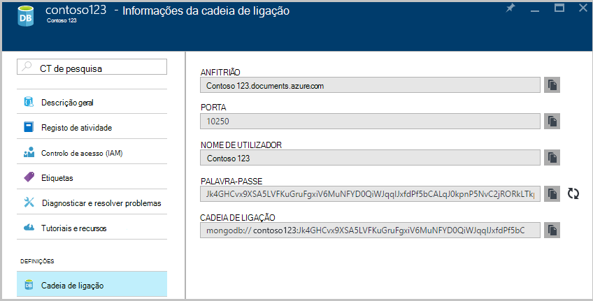

2. Clique em **Ligar** para abrir o Gestor de ligação, em seguida, clique em **Nova ligação**

    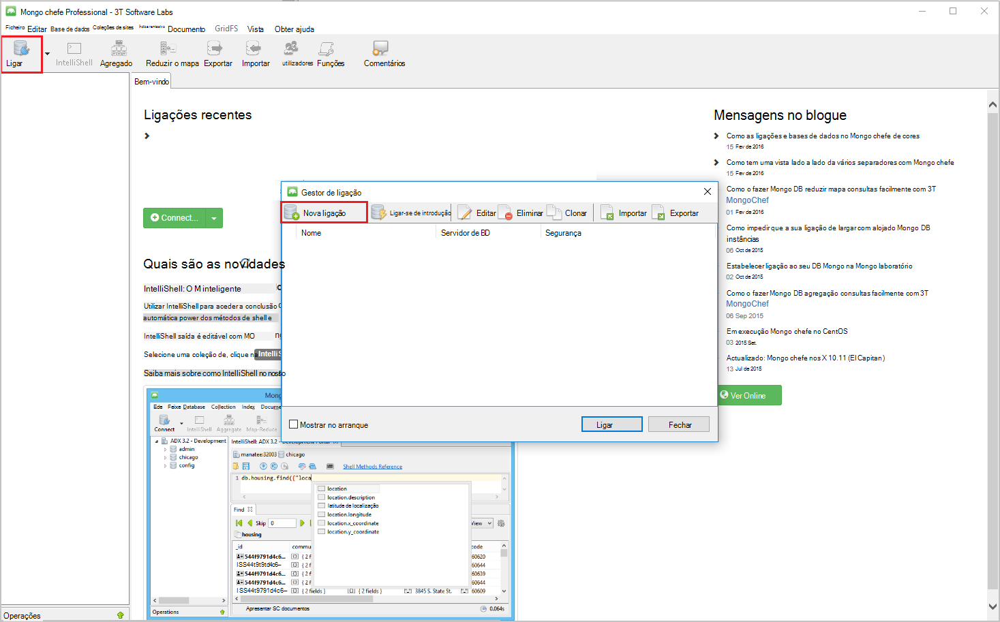
    
2. Na janela de **Nova ligação** , no separador **servidor** , introduza o anfitrião (FQDN) da conta DocumentDB com o suporte de protocolo para MongoDB e a porta.
    
    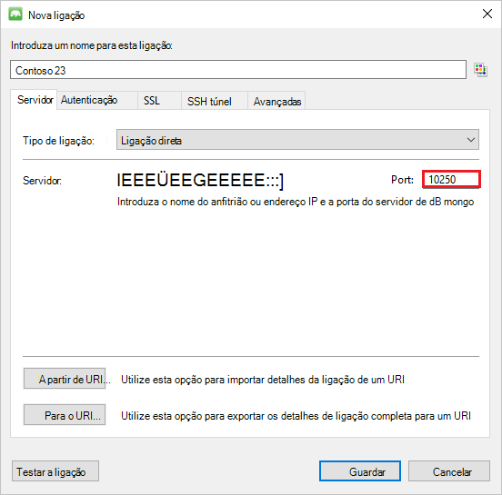

3. Na janela **Nova ligação** , no separador de **autenticação** , selecione o modo de autenticação **padrão (MONGODB CR ou SCARM-SHA-1)** e introduza o nome de utilizador e palavra-passe.  Aceitar db de autenticação de predefinido (admin) ou fornecer o seu próprio valor.

    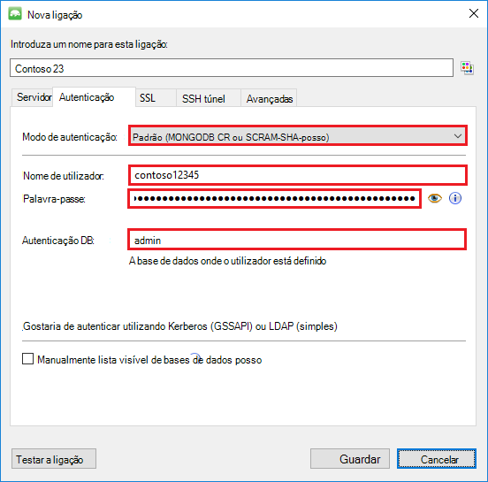

4. Na janela **Nova ligação** , no separador **SSL** , selecione a caixa de verificação do **protocolo de utilizar SSL para ligar** e o botão de opção **autoassinados aceitar os certificados SSL** .

    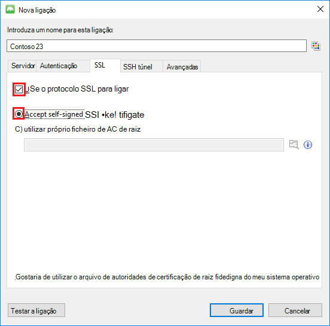

5. Clique no botão **Testar ligação** para validar as informações de ligação, clique em **OK** para voltar para a janela de nova ligação e, em seguida, clique em **Guardar**.

    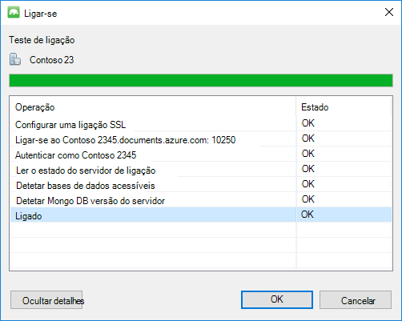

## Utilizar MongoChef para criar uma base de dados, coleções de sites e documentos  

Para criar uma base de dados, coleções de sites e documentos com MongoChef, execute os passos seguintes.

1. No **Gestor de ligação**, realce a ligação e clique em **Ligar**.

    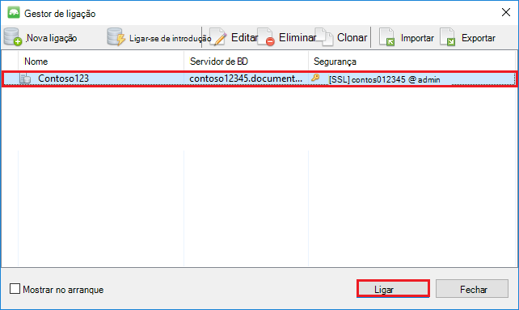

2. Clique com o botão direito do rato em anfitrião do e selecione **Adicionar a base de dados**.  Forneça um nome de base de dados e clique em **OK**.
    
    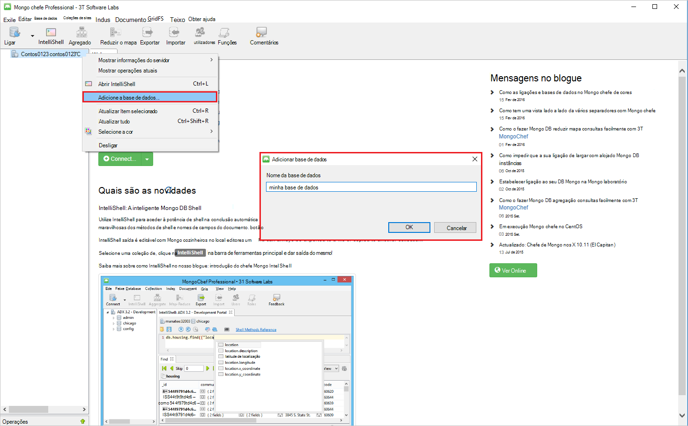

3. Clique com o botão direito do rato em da base de dados e selecione **Adicionar coleção**.  Forneça um nome de coleções de sites e clique em **Criar**.

    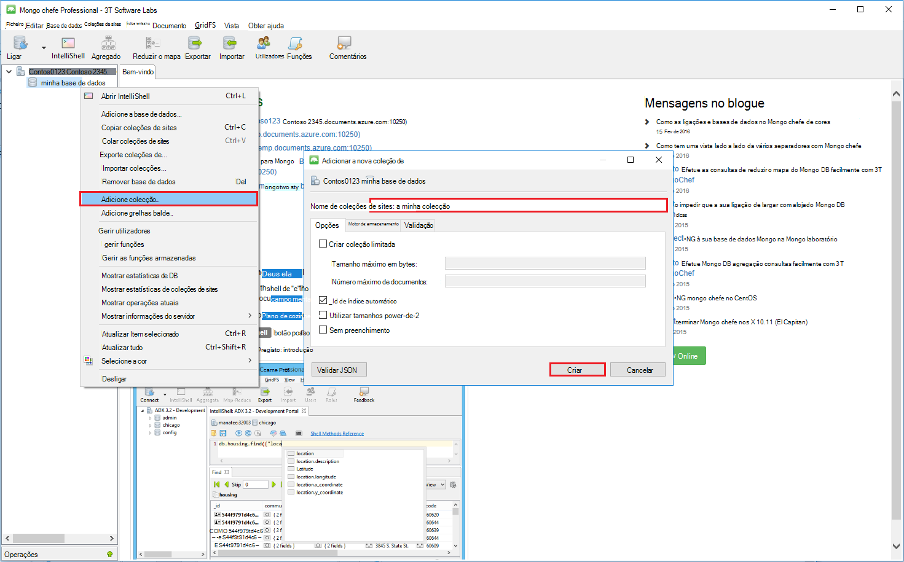

4. Clique no item de menu de **coleções de sites** , em seguida, clique em **Adicionar documento**.

    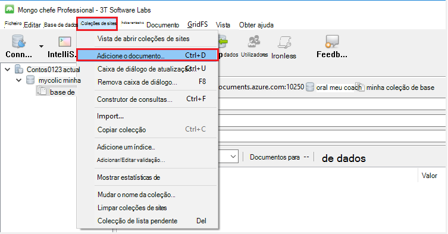

5. Na caixa de diálogo Adicionar documento, cole o seguinte e, em seguida, clique em **Adicionar documento**.

        {
        "_id": "AndersenFamily",
        "lastName": "Andersen",
        "parents": [
            { "firstName": "Thomas" },
            { "firstName": "Mary Kay"}
        ],
        "children": [
        {
            "firstName": "Henriette Thaulow", "gender": "female", "grade": 5,
            "pets": [{ "givenName": "Fluffy" }]
        }
        ],
        "address": { "state": "WA", "county": "King", "city": "seattle" },
        "isRegistered": true
        }

    
6. Adicione noutro documento, desta vez com o seguinte conteúdo.

        {
        "_id": "WakefieldFamily",
        "parents": [
            { "familyName": "Wakefield", "givenName": "Robin" },
            { "familyName": "Miller", "givenName": "Ben" }
        ],
        "children": [
            {
                "familyName": "Merriam", 
                "givenName": "Jesse", 
                "gender": "female", "grade": 1,
                "pets": [
                    { "givenName": "Goofy" },
                    { "givenName": "Shadow" }
                ]
            },
            { 
                "familyName": "Miller", 
                "givenName": "Lisa", 
                "gender": "female", 
                "grade": 8 }
        ],
        "address": { "state": "NY", "county": "Manhattan", "city": "NY" },
        "isRegistered": false
        }

7. Execute uma consulta de exemplo. Por exemplo, procure famílias com o apelido «Andersen» e devolver o pais e os campos de estado.

    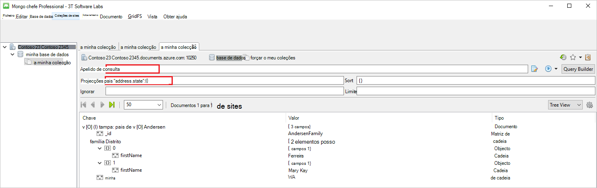
    

## Próximos passos

- Explore DocumentDB com o suporte de protocolo para MongoDB [amostras](documentdb-mongodb-samples.md).

 
