<properties
    pageTitle="Monitorizar os pedidos de DocumentDB e armazenamento | Microsoft Azure"
    description="Saiba como monitorizar a sua conta de DocumentDB para métricas de desempenho, tais como os pedidos e erros no servidor e métricas de utilização, como o consumo de armazenamento."
    services="documentdb"
    documentationCenter=""
    authors="mimig1"
    manager="jhubbard"
    editor="cgronlun"/>

<tags
    ms.service="documentdb"
    ms.workload="data-services"
    ms.tgt_pltfrm="na"
    ms.devlang="na"
    ms.topic="article"
    ms.date="10/17/2016"
    ms.author="mimig"/>

# Monitorizar pedidos DocumentDB, a utilização e armazenamento

Pode monitorizar as suas contas do Azure DocumentDB no [portal do Azure](https://portal.azure.com/). Para cada conta DocumentDB, ambos os métricas de desempenho, tais como os pedidos e erros no servidor e métricas de utilização, como o consumo de armazenamento, estão disponíveis.

Métricas podem ser revistas pá a conta ou o novo pá métricas.

## Métricas de desempenho de vista na pá métricas

1. Numa nova janela, abra o [Azure portal](https://portal.azure.com/), clique em **Mais serviços**, clique em **DocumentDB (NoSQL)**e, em seguida, clique no nome da conta DocumentDB para o qual pretende ver métricas de desempenho.
2. No menu do recurso, clique em **métricas**.

Abre o pá métricas e pode selecionar a coleção de para rever. Pode rever métricas de disponibilidade, pedidos, débito e armazenamento e compará-los para o SLA DocumentDB.

## Métricas de desempenho de vista no pá a conta
1.  Numa nova janela, abra o [Azure portal](https://portal.azure.com/), clique em **Mais serviços**, clique em **DocumentDB (NoSQL)**e, em seguida, clique no nome da conta DocumentDB para o qual pretende ver métricas de desempenho.

2.  Por predefinição, a lente de **monitorização** apresenta os mosaicos seguintes:
    *   Total de pedidos do dia atual.
    *   Armazenamento utilizado.

    Se a sua tabela apresenta **sem dados disponíveis** e acreditar que existe dados na base de dados, consulte a secção de [resolução de problemas](#troubleshooting) .

    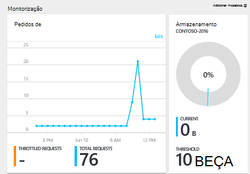

3.  Se clicar no **armazenamento** ou **pedidos de** mosaico abre uma pá **métrica** detalhada.
4.  O pá **métrica** mostra-lhe detalhes sobre as métricas que tiver selecionado.  No topo da pá é um gráfico de pedidos de representados por hora e abaixo o que é a tabela que mostra os valores de agregação de pedidos de desacelerado e total.  O pá métrica também mostra a lista de alertas que foram definidas, filtrado para as métricas que aparecem no pá métrica atual (desta forma, se tiver um número de alertas, só verá aqueles relevantes aqui apresentadas).   

    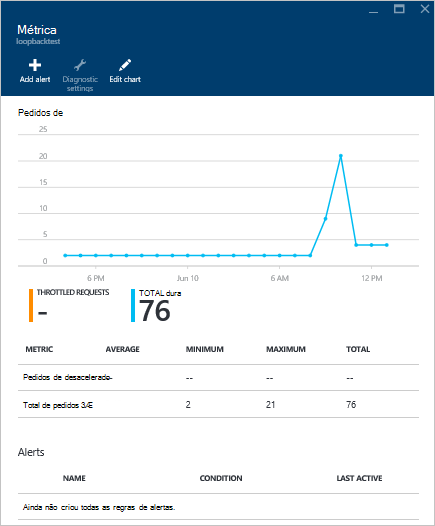

## Personalizar vistas de métricas de desempenho no portal

1.  Para personalizar as métricas que apresentam num determinado gráfico, clique no gráfico para abri-lo no pá a **métrica** e, em seguida, clique em **Editar gráfico**.  
    

2.  No pá **Editar gráfico** , existem opções para modificar as métricas apresentados no gráfico, bem como os respetivos intervalo de tempo.  
    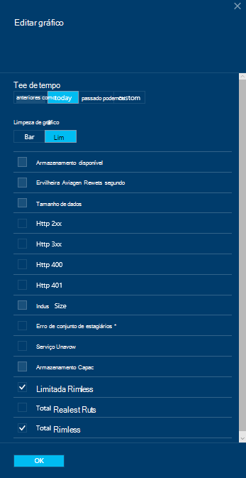

3.  Para alterar métricas apresentadas na peça, basta selecionar ou desmarcar as métricas de desempenho disponíveis e, em seguida, clique em **OK** na parte inferior da pá.  
4.  Para alterar o intervalo de tempo, selecione um intervalo diferente (por exemplo, a **personalizadas**) e, em seguida, clique em **OK** na parte inferior da pá.  

    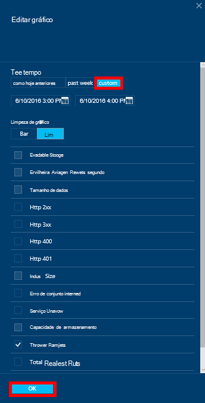

## Criar gráficos lado a lado no portal
Portal do Azure permite-lhe criar gráficos de métricos de lado a lado.  

1.  Em primeiro lugar, botão direito do rato no gráfico que pretende copiar e selecione **Personalizar**.

    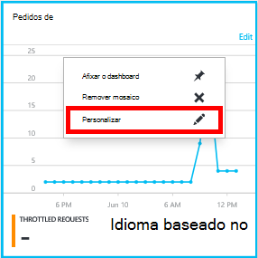

2.  Clique em **clonar** no menu para copiar a peça e, em seguida, clique em **Personalizar como concluído**.

    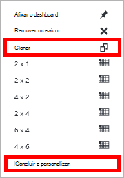  

Agora pode tratar nesta peça como qualquer outra parte métrica, personalizar o intervalo de métricas e a hora apresentado na peça.  Ao fazê-lo, pode ver duas métricas diferentes gráfico lado a lado ao mesmo tempo.  
    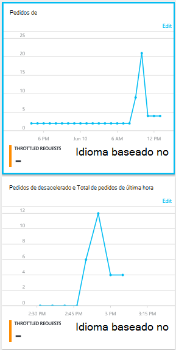  

## Configurar alertas no portal
1.  No [portal do Azure](https://portal.azure.com/), clique em **Mais serviços**, clique em **DocumentDB (NoSQL)**e, em seguida, clique no nome da conta DocumentDB para as quais gostaria de alertas de métricas de desempenho do programa de configuração.

2.  No menu do recurso, clique em **Regras de alerta** para abrir o separador regras de alerta.  
    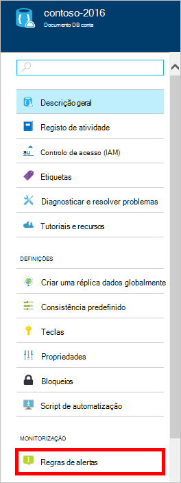

3.  Na pá **alertas regras** , clique em **Adicionar alerta**.  
    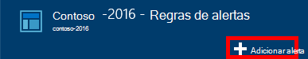

4.  Na pá **Adicionar uma regra de alerta** , especifique:
    *   O nome da regra alerta estiver a configurar.
    *   Uma descrição da regra nova alerta.
    *   Métrica para a regra de alerta.
    *   A condição, limiar e período que determinam quando ativa o alerta. Por exemplo, um erro no servidor contar o número maior que 5 sobre últimos 15 minutos.
    *   Se o administrador de serviços e coadministrators são receber uma mensagem quando é acionada o alerta.
    *   Endereços de e-mail adicionais para as notificações de alerta.  
    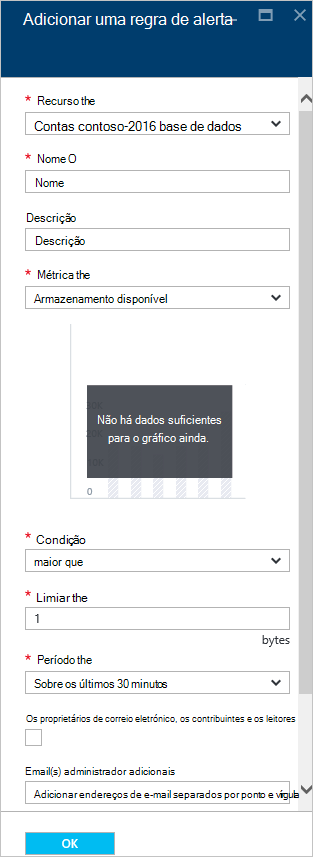

## Monitorizar DocumentDB forma programática
Métricas de nível de conta disponíveis no portal do, tal como conta a utilização e total pedidos de armazenamento, não estão disponíveis através da API do DocumentDB. No entanto, pode obter dados de utilização nível da coleção de utilizando as APIs DocumentDB. Para obter dados de nível de coleções de sites, faça o seguinte:

- Para utilizar a API REST, [execute GET na coleção de](https://msdn.microsoft.com/library/mt489073.aspx). As informações de quota e a utilização da coleção de são devolvidas nos cabeçalhos da x-ms-recurso-quota e utilização-de-ms-recursos-x na resposta.
- Para utilizar o .NET SDK, utilize o método de [DocumentClient.ReadDocumentCollectionAsync](https://msdn.microsoft.com/library/microsoft.azure.documents.client.documentclient.readdocumentcollectionasync.aspx) , que devolve uma [ResourceResponse](https://msdn.microsoft.com/library/dn799209.aspx) que contém um número de propriedades de utilização, tais como **CollectionSizeUsage**, **DatabaseUsage**, **DocumentUsage**e muito mais.

Para aceder ao métricas adicionais, utilize o [Azure Monitor SDK](https://www.nuget.org/packages/Microsoft.Azure.Insights). Podem ser obtidas definições métricas disponíveis por telefone:

    https://management.azure.com/subscriptions/{SubscriptionId}/resourceGroups/{ResourceGroup}/providers/Microsoft.DocumentDb/databaseAccounts/{DocumentDBAccountName}/metricDefinitions?api-version=2015-04-08

Consultas para obter métricas individuais utilizam o seguinte formato:

    https://management.azure.com/subscriptions/{SubecriptionId}/resourceGroups/{ResourceGroup}/providers/Microsoft.DocumentDb/databaseAccounts/{DocumentDBAccountName}/metrics?api-version=2015-04-08&$filter=%28name.value%20eq%20%27Total%20Requests%27%29%20and%20timeGrain%20eq%20duration%27PT5M%27%20and%20startTime%20eq%202016-06-03T03%3A26%3A00.0000000Z%20and%20endTime%20eq%202016-06-10T03%3A26%3A00.0000000Z

Para mais informações, consulte o artigo [Obter métricas de recursos através do Azure Monitor REST API](https://blogs.msdn.microsoft.com/cloud_solution_architect/2016/02/23/retrieving-resource-metrics-via-the-azure-insights-api/). Tenha em atenção que "Azure Inights" nome foi mudado "Azure Monitor".  Esta entrada de blogue refere-se para o nome antigo.

## Resolução de problemas
Se os mosaicos monitorização apresentam a mensagem **sem dados disponíveis** e efetuadas pedidos ou adicionar dados à base de dados recentemente, pode editar o mosaico para refletir a utilização da recente.

### Editar um mosaico para atualizar os dados atuais
1.  Para personalizar as métricas que apresentadas de uma determinada parte, clique no gráfico para abrir o pá **métrica** e, em seguida, clique em **Editar gráfico**.  
    

2.  No pá **Editar gráfico** , na secção **Intervalo de tempo** , clique em **anteriores hora**e, em seguida, clique em **OK**.  
    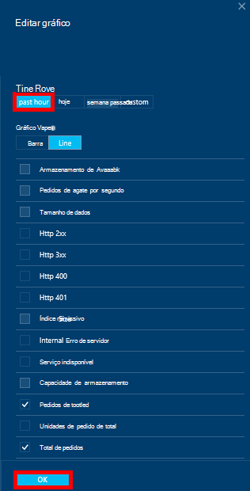

3.  O seu mosaico deve atualizar agora a mostrar os dados atuais e a utilização.  
    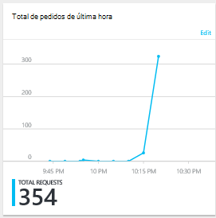

## Próximos passos
Para saber mais sobre a capacidade de DocumentDB, consulte o artigo [Gerir DocumentDB capacidade](documentdb-manage.md).
