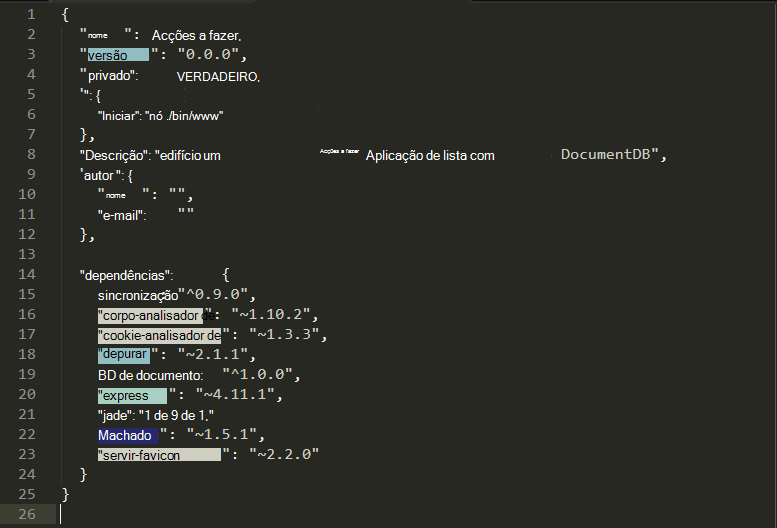

<properties 
    pageTitle="Saiba Node.js - DocumentDB Node.js Tutorial | Microsoft Azure" 
    description="Saiba Node.js! Tutorial explora como utilizar o Microsoft Azure DocumentDB para armazenar e aceder a dados a partir de uma aplicação de web Node.js Express alojada no Azure sites." 
    keywords="Desenvolvimento de aplicações, tutorial de base de dados, saiba node.js, node.js tutorial, documentdb, azure, Microsoft azure"
    services="documentdb" 
    documentationCenter="nodejs" 
    authors="syamkmsft" 
    manager="jhubbard" 
    editor="cgronlun"/>

<tags 
    ms.service="documentdb" 
    ms.workload="data-services" 
    ms.tgt_pltfrm="na" 
    ms.devlang="nodejs" 
    ms.topic="hero-article" 
    ms.date="08/25/2016" 
    ms.author="syamk"/>

# Criar uma Node.js aplicação web DocumentDB

> [AZURE.SELECTOR]
- [.NET](documentdb-dotnet-application.md)
- [NODE.js](documentdb-nodejs-application.md)
- [Java](documentdb-java-application.md)
- [Python](documentdb-python-application.md)

Neste tutorial Node.js mostra-lhe como utilizar o serviço do Azure DocumentDB para armazenar e aceder a dados a partir de uma aplicação de Node.js Express alojada no sites públicos do Azure.

Recomendamos que a introdução ao ver o vídeo seguinte, onde vai aprender a aprovisionar uma conta de base de dados do Azure DocumentDB e armazenar documentos JSON na sua aplicação Node.js. 

> [AZURE.VIDEO azure-demo-getting-started-with-azure-documentdb-on-nodejs-in-linux]

Em seguida, regresse neste tutorial Node.js, qual irá aprender as respostas para as seguintes questões:

- Como trabalhar com DocumentDB utilizar o módulo de npm documentdb?
- Como posso implementar a aplicação web sites públicos do Azure?

Ao seguir este tutorial de base de dados, irá criar uma aplicação de simples baseados na web e gestão de tarefas que permite criar, a obter e a conclusão de tarefas. As tarefas serão guardadas como documentos JSON no Azure DocumentDB.

Não ter tempo para concluir a iniciação e apenas pretende obter a solução completa? Não é um problema, pode obter a solução de exemplo completos do [GitHub][].

## Pré-requisitos

> [AZURE.TIP] Neste tutorial Node.js assume que tem alguma experiência prévia utilizando Node.js e sites públicos do Azure.

Antes de seguir as instruções neste artigo, deverá Certifique-se de que tem o seguinte procedimento:

- Uma conta do Azure active. Se não tiver uma conta, pode criar uma conta de avaliação gratuita apenas de duas minutos. Para obter detalhes, consulte o artigo [Versão de avaliação gratuita do Azure](https://azure.microsoft.com/pricing/free-trial/).
- [Node.js][] versão v0.10.29 ou superior.
- [Gerador de Express](http://www.expressjs.com/starter/generator.html) (pode instalar esta através do `npm install express-generator -g`)
- [Git][].

## Passo 1: Criar uma conta de base de dados DocumentDB

Vamos começar por criar uma conta de DocumentDB. Se já tiver uma conta, pode avançar para [passo 2: criar uma nova aplicação Node.js](#_Toc395783178).

[AZURE.INCLUDE [documentdb-create-dbaccount](../../includes/documentdb-create-dbaccount.md)]

[AZURE.INCLUDE [documentdb-keys](../../includes/documentdb-keys.md)]

## Passo 2: Saiba como criar uma nova aplicação Node.js

Agora vamos aprender a criar um projeto Node.js Olá mundo básico utilizando o framework [Express](http://expressjs.com/) .

1. Abra o terminal favorito.

2. Utilize o gerador express para gerar uma nova aplicação denominada **todo**.

        express todo

3. Abra o seu novo directório de **todo** e instale dependências.

        cd todo
        npm install

4. Execute a sua nova aplicação.

        npm start

5. Pode utilizar ver a nova aplicação através da navegação do seu browser para [http://localhost:3000](http://localhost:3000).

    

## Passo 3: Instalar módulos adicionais

O ficheiro **package.json** é um dos ficheiros criados na raiz do projeto. Este ficheiro contém uma lista de módulos adicionais que são necessários para a sua aplicação Node.js. Mais tarde, quando implementar esta aplicação a um Web sites Azure, este ficheiro é utilizado para determinar que módulos necessitam de ser instalada no Azure para suportar a sua aplicação. Ainda é necessário instalar pacotes mais duas para este tutorial.

1. No terminal, instale o módulo **assíncrona** através do npm.

        npm install async --save

1. Instale o módulo de **documentdb** através do npm. Este é o módulo em que todos os a magia DocumentDB acontece.

        npm install documentdb --save

3. Uma verificação rápida do ficheiro **package.json** da aplicação deverá mostrar os módulos adicionais. Este ficheiro irá indicar Azure que pacotes para transferir e instalar quando executar a aplicação. -Deve um aspeto semelhante ao exemplo abaixo.

    

    Isto indica que nó (e mais tarde Azure) que a aplicação depende estes módulos adicionais.

## Passo 4: Utilizar o serviço de DocumentDB numa aplicação nó

Que leva-o até aceita de todos os configuração inicial e configuração, agora vamos obter para baixo por que motivo estamos aqui, sendo que escrever algum código utilizando Azure DocumentDB.

### Criar o modelo

1. No directório de projeto, crie um novo directório denominado **modelos**.
2. No directório de **modelos** , crie um novo ficheiro chamado **taskDao.js**. Este ficheiro irá conter o modelo para as tarefas criadas por nossa aplicação.
3. No mesmo diretório de **modelos** , crie outro novo ficheiro chamado **docdbUtils.js**. Este ficheiro irá conter algumas código útil, reutilizável, que faremos em toda a nossa aplicação. 
4. Copiar o código seguinte para **docdbUtils.js**

        var DocumentDBClient = require('documentdb').DocumentClient;
            
        var DocDBUtils = {
            getOrCreateDatabase: function (client, databaseId, callback) {
                var querySpec = {
                    query: 'SELECT * FROM root r WHERE r.id= @id',
                    parameters: [{
                        name: '@id',
                        value: databaseId
                    }]
                };
        
                client.queryDatabases(querySpec).toArray(function (err, results) {
                    if (err) {
                        callback(err);
        
                    } else {
                        if (results.length === 0) {
                            var databaseSpec = {
                                id: databaseId
                            };
        
                            client.createDatabase(databaseSpec, function (err, created) {
                                callback(null, created);
                            });
        
                        } else {
                            callback(null, results[0]);
                        }
                    }
                });
            },
        
            getOrCreateCollection: function (client, databaseLink, collectionId, callback) {
                var querySpec = {
                    query: 'SELECT * FROM root r WHERE r.id=@id',
                    parameters: [{
                        name: '@id',
                        value: collectionId
                    }]
                };             
                
                client.queryCollections(databaseLink, querySpec).toArray(function (err, results) {
                    if (err) {
                        callback(err);
        
                    } else {        
                        if (results.length === 0) {
                            var collectionSpec = {
                                id: collectionId
                            };
                            
                            client.createCollection(databaseLink, collectionSpec, function (err, created) {
                                callback(null, created);
                            });
        
                        } else {
                            callback(null, results[0]);
                        }
                    }
                });
            }
        };
                
        module.exports = DocDBUtils;

    > [AZURE.TIP] createCollection leva um parâmetro opcional requestOptions que pode ser utilizado para especificar o tipo de oferta para a coleção. Se não for fornecido nenhum valor requestOptions.offerType, em seguida, a coleção de será criada utilizando o tipo de oferta predefinido.
    >
    > Para mais informações sobre tipos de oferecer DocumentDB consulte [níveis de desempenho no DocumentDB](documentdb-performance-levels.md) 
        
3. Guarde e feche o ficheiro **docdbUtils.js** .

4. No início do ficheiro **taskDao.js** , adicione o seguinte código para fazer referência a **DocumentDBClient** e **docdbUtils.js** que criámos acima:

        var DocumentDBClient = require('documentdb').DocumentClient;
        var docdbUtils = require('./docdbUtils');

4. Em seguida, irá adicionar código para definir e exportar o objeto de tarefa. Este é o responsável pela inicialização nosso objeto de tarefa e configurar a base de dados e colecção de documentos, que vamos utilizar.

        function TaskDao(documentDBClient, databaseId, collectionId) {
          this.client = documentDBClient;
          this.databaseId = databaseId;
          this.collectionId = collectionId;
        
          this.database = null;
          this.collection = null;
        }
        
        module.exports = TaskDao;

5. Em seguida, adicione o seguinte código para definir métodos adicionais no objeto tarefa, que permitem interações com dados armazenados num DocumentDB.

        TaskDao.prototype = {
            init: function (callback) {
                var self = this;
        
                docdbUtils.getOrCreateDatabase(self.client, self.databaseId, function (err, db) {
                    if (err) {
                        callback(err);
                    } else {
                        self.database = db;
                        docdbUtils.getOrCreateCollection(self.client, self.database._self, self.collectionId, function (err, coll) {
                            if (err) {
                                callback(err);
        
                            } else {
                                self.collection = coll;
                            }
                        });
                    }
                });
            },
        
            find: function (querySpec, callback) {
                var self = this;
        
                self.client.queryDocuments(self.collection._self, querySpec).toArray(function (err, results) {
                    if (err) {
                        callback(err);
        
                    } else {
                        callback(null, results);
                    }
                });
            },
        
            addItem: function (item, callback) {
                var self = this;
        
                item.date = Date.now();
                item.completed = false;
        
                self.client.createDocument(self.collection._self, item, function (err, doc) {
                    if (err) {
                        callback(err);
        
                    } else {
                        callback(null, doc);
                    }
                });
            },
        
            updateItem: function (itemId, callback) {
                var self = this;
        
                self.getItem(itemId, function (err, doc) {
                    if (err) {
                        callback(err);
        
                    } else {
                        doc.completed = true;
        
                        self.client.replaceDocument(doc._self, doc, function (err, replaced) {
                            if (err) {
                                callback(err);
        
                            } else {
                                callback(null, replaced);
                            }
                        });
                    }
                });
            },
        
            getItem: function (itemId, callback) {
                var self = this;
        
                var querySpec = {
                    query: 'SELECT * FROM root r WHERE r.id = @id',
                    parameters: [{
                        name: '@id',
                        value: itemId
                    }]
                };
        
                self.client.queryDocuments(self.collection._self, querySpec).toArray(function (err, results) {
                    if (err) {
                        callback(err);
        
                    } else {
                        callback(null, results[0]);
                    }
                });
            }
        };

6. Guarde e feche o ficheiro **taskDao.js** . 

### Criar o controlador de

1. No diretório do seu projeto **rotas** , crie um novo ficheiro chamado **tasklist.js**. 
2. Adicione o seguinte código para **tasklist.js**. Este procedimento carrega a DocumentDBClient e assíncrona módulos, quais são utilizados pelo **tasklist.js**. Isto também definida a função de **lista de tarefas** , que lhe é transmitida uma instância do objeto **tarefa** definido anteriormente:

        var DocumentDBClient = require('documentdb').DocumentClient;
        var async = require('async');
        
        function TaskList(taskDao) {
          this.taskDao = taskDao;
        }
        
        module.exports = TaskList;

3. Continue a adicionar o ficheiro **tasklist.js** ao adicionar os métodos utilizados para **showTasks, addTask**e **completeTasks**:
        
        TaskList.prototype = {
            showTasks: function (req, res) {
                var self = this;
        
                var querySpec = {
                    query: 'SELECT * FROM root r WHERE r.completed=@completed',
                    parameters: [{
                        name: '@completed',
                        value: false
                    }]
                };
        
                self.taskDao.find(querySpec, function (err, items) {
                    if (err) {
                        throw (err);
                    }
        
                    res.render('index', {
                        title: 'My ToDo List ',
                        tasks: items
                    });
                });
            },
        
            addTask: function (req, res) {
                var self = this;
                var item = req.body;
        
                self.taskDao.addItem(item, function (err) {
                    if (err) {
                        throw (err);
                    }
        
                    res.redirect('/');
                });
            },
        
            completeTask: function (req, res) {
                var self = this;
                var completedTasks = Object.keys(req.body);
        
                async.forEach(completedTasks, function taskIterator(completedTask, callback) {
                    self.taskDao.updateItem(completedTask, function (err) {
                        if (err) {
                            callback(err);
                        } else {
                            callback(null);
                        }
                    });
                }, function goHome(err) {
                    if (err) {
                        throw err;
                    } else {
                        res.redirect('/');
                    }
                });
            }
        };

4. Guarde e feche o ficheiro **tasklist.js** .
 
### Adicionar config.js

1. No diretório do seu projeto crie um novo ficheiro chamado **config.js**.
2. Adicione o seguinte para **config.js**. Isto define as definições de configuração e valores necessários para a nossa aplicação.

        var config = {}
        
        config.host = process.env.HOST || "[the URI value from the DocumentDB Keys blade on http://portal.azure.com]";
        config.authKey = process.env.AUTH_KEY || "[the PRIMARY KEY value from the DocumentDB Keys blade on http://portal.azure.com]";
        config.databaseId = "ToDoList";
        config.collectionId = "Items";
        
        module.exports = config;

3. No ficheiro de **config.js** , atualize os valores do anfitrião e AUTH_KEY utilizando os valores que se encontram no pá a teclas da sua conta de DocumentDB no [Portal do Microsoft Azure](https://portal.azure.com):

4. Guarde e feche o ficheiro **config.js** .
 
### Modificar app.js

1. No directório de projeto, abra o ficheiro **app.js** . Este ficheiro foi criado anteriormente quando a aplicação web do Express foi criada.
2. Adicione o seguinte código na parte superior do **app.js**
    
        var DocumentDBClient = require('documentdb').DocumentClient;
        var config = require('./config');
        var TaskList = require('./routes/tasklist');
        var TaskDao = require('./models/taskDao');

3. Este código define o ficheiro de configuração para ser utilizado e avança para ler valores fora deste ficheiro para algumas variáveis utilizamos mais rapidamente.
4. Substitua as duas linhas seguintes **app.js** ficheiro:

        app.use('/', routes);
        app.use('/users', users); 

      com o fragmento que se segue:

        var docDbClient = new DocumentDBClient(config.host, {
            masterKey: config.authKey
        });
        var taskDao = new TaskDao(docDbClient, config.databaseId, config.collectionId);
        var taskList = new TaskList(taskDao);
        taskDao.init();
        
        app.get('/', taskList.showTasks.bind(taskList));
        app.post('/addtask', taskList.addTask.bind(taskList));
        app.post('/completetask', taskList.completeTask.bind(taskList));
        app.set('view engine', 'jade');

6. Estas linhas definem uma nova instância do objeto nosso **TaskDao** , com uma nova ligação para DocumentDB (utilizando os valores ler a partir de **config.js**), iniciar o objeto de tarefa e, em seguida, vincular acções de formulário para métodos no nosso controlador de **lista de tarefas** . 

7. Finalmente, guarde e feche o ficheiro **app.js** , podemos praticamente terminar.
 
## Passo 5: Criar uma interface de utilizador

Agora vamos desativar os nossos atenção para construir a interface de utilizador para que um utilizador realmente pode interagir com os nossos aplicação. A aplicação de Express criámos utiliza **Jade** como o motor de vista. Para mais informações sobre Jade consulte [http://jade-lang.com/](http://jade-lang.com/).

1. O ficheiro **layout.jade** no diretório **vistas** é utilizado como um modelo global para outros ficheiros **.jade** . Neste passo será modificá-lo para utilizar o [Arranque Twitter](https://github.com/twbs/bootstrap), que é um toolkit que torna mais fácil criar um Web site com um aspecto totalmente. 
2. Abrir o ficheiro **layout.jade** localizado na pasta **vistas** e substituir o conteúdo com os seguintes procedimentos:
    
        doctype html
        html
          head
            title= title
            link(rel='stylesheet', href='//ajax.aspnetcdn.com/ajax/bootstrap/3.3.2/css/bootstrap.min.css')
            link(rel='stylesheet', href='/stylesheets/style.css')
          body
            nav.navbar.navbar-inverse.navbar-fixed-top
              div.navbar-header
                a.navbar-brand(href='#') My Tasks
            block content
            script(src='//ajax.aspnetcdn.com/ajax/jQuery/jquery-1.11.2.min.js')
            script(src='//ajax.aspnetcdn.com/ajax/bootstrap/3.3.2/bootstrap.min.js')

    Esta forma eficaz indica o motor **Jade** para compor algumas HTML para a nossa aplicação e cria um **Bloco de** denominada **conteúdo** onde podemos pode fornecer o esquema para a nossa páginas de conteúdo.
    Guarde e feche este ficheiro **layout.jade** .

4. Agora, abra o ficheiro de **index.jade** , na vista que será utilizada pelo nossa aplicação e, substitua o conteúdo do ficheiro com o seguinte:

        extends layout
        
        block content
          h1 #{title}
          br
        
          form(action="/completetask", method="post")
            table.table.table-striped.table-bordered
              tr
                td Name
                td Category
                td Date
                td Complete
              if (typeof tasks === "undefined")
                tr
                  td
              else
                each task in tasks
                  tr
                    td #{task.name}
                    td #{task.category}
                    - var date  = new Date(task.date);
                    - var day   = date.getDate();
                    - var month = date.getMonth() + 1;
                    - var year  = date.getFullYear();
                    td #{month + "/" + day + "/" + year}
                    td
                      input(type="checkbox", name="#{task.id}", value="#{!task.completed}", checked=task.completed)
            button.btn(type="submit") Update tasks
          hr
          form.well(action="/addtask", method="post")
            label Item Name:
            input(name="name", type="textbox")
            label Item Category:
            input(name="category", type="textbox")
            br
            button.btn(type="submit") Add item

    Expande o esquema e fornece conteúdo para o marcador de posição de **conteúdo** , que podemos viu no ficheiro **layout.jade** anterior.
    
    Neste esquema criámos duas formas HTML. 
    Primeiro formulário contém uma tabela para os nossos dados e um botão que lhe permite-nos atualizar os itens, publicando método **/completetask** do nosso controlador de.
    O segundo formulário contém dois campos de entrada e um botão que permite-nos criar um novo item, publicando método **/addtask** do nosso controlador de.
    
    Deve ser tudo o que precisamos para nossa aplicação funcione.

5. Abra o ficheiro de **style.css** no diretório **public\stylesheets** e substituir o código com o seguinte:

        body {
          padding: 50px;
          font: 14px "Lucida Grande", Helvetica, Arial, sans-serif;
        }
        a {
          color: #00B7FF;
        }
        .well label {
          display: block;
        }
        .well input {
          margin-bottom: 5px;
        }
        .btn {
          margin-top: 5px;
          border: outset 1px #C8C8C8;
        }

    Guarde e feche este ficheiro **style.css** .

## Passo 6: Executar a sua aplicação localmente

1. Para testar a aplicação no seu computador local, execute `npm start` num terminal para iniciar a aplicação e iniciação num browser com uma página com um aspeto semelhante a imagem abaixo:

    

2. Utilize os campos fornecidos para o Item, nome do Item e categoria para introduzir informações e, em seguida, clique em **Adicionar Item**.

3. A página deve actualizar para apresentar o item recentemente criado na lista de ToDo.

    

4. Para concluir uma tarefa, basta verificar a caixa de verificação na coluna completa e, em seguida, clique em **Atualizar tarefas**.

## Passo 7: Implementar o projeto de desenvolvimento de aplicações para sites públicos do Azure

1. Se ainda não o fez, ativar um repositório de git para o seu site do Azure. Poderá encontrar instruções sobre como fazer isto no tópico de [Implementação de Git Local para a aplicação de serviço de Azure](../app-service-web/app-service-deploy-local-git.md) .

2. Adicione o seu Web site Azure como um git remoto.

        git remote add azure https://username@your-azure-website.scm.azurewebsites.net:443/your-azure-website.git

3. Implemente ao conduza para o controlo remoto.

        git push azure master

4. Em alguns segundos, git irá concluir a publicação a aplicação web e iniciação num browser, onde pode ver o seu trabalho útil em execução no Azure!

## Próximos passos

Parabéns! Tem apenas criadas a sua primeira Node.js Express aplicação Web Azure DocumentDB e publicado-lo para sites públicos do Azure.

O código de origem para a aplicação de uma referência completa pode ser transferido das [GitHub][].

Para mais informações, consulte o [Centro de programadores do Node.js](https://azure.microsoft.com/develop/nodejs/).

[NODE.js]: http://nodejs.org/
[Git]: http://git-scm.com/
[Github]: https://github.com/Azure-Samples/documentdb-node-todo-app
 
