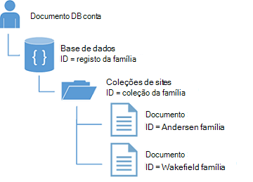

<properties
  pageTitle="Tutorial NoSQL Node.js para DocumentDB | Microsoft Azure"
  description="Tutorial do NoSQL Node.js que cria uma aplicação de base de dados e consola de nó utilizando o SDK do Node.js DocumentDB. DocumentDB é uma base de dados NoSQL para JSON."
    keywords="tutorial node.js, base de dados nó"
  services="documentdb"
  documentationCenter="node.js"
  authors="AndrewHoh"
  manager="jhubbard"
  editor="monicar"/>

<tags
  ms.service="documentdb"
  ms.workload="data-services"
  ms.tgt_pltfrm="na"
  ms.devlang="node"
  ms.topic="hero-article"
  ms.date="08/11/2016"
  ms.author="anhoh"/>

# <a name="nosql-nodejs-tutorial-documentdb-nodejs-console-application"></a>Tutorial NoSQL Node.js: aplicação de consola DocumentDB Node.js  

> [AZURE.SELECTOR]
- [.NET](documentdb-get-started.md)
- [NODE.js](documentdb-nodejs-get-started.md)

Bem-vindo ao tutorial Node.js para o SDK do Azure DocumentDB Node.js! Depois de seguir este tutorial, terá de uma aplicação de consola que cria e consultas DocumentDB recursos, incluindo uma base de dados de nó.

Vamos abordar:

- Criar e ligar a uma conta de DocumentDB
- Configurar a sua aplicação
- Criar uma base de dados de nó
- Criar uma coleção de
- Criar documentos JSON
- Consultar a coleção de
- Substituir um documento
- Eliminar um documento
- Eliminar a base de dados de nó

Não tem o tempo? Não se preocupe! A solução completa está disponível no [GitHub](https://github.com/Azure-Samples/documentdb-node-getting-started). Consulte o artigo [obter a solução completa](#GetSolution) para obter instruções rápidas.

Depois de concluir o tutorial Node.js, utilize os botões de voto na parte superior e inferior desta página para nos dar feedback. Se gostaria-nos para contactá-lo diretamente, esteja à vontade incluir o seu endereço de e-mail nos seus comentários.

Agora vamos começar!

## <a name="prerequisites-for-the-nodejs-tutorial"></a>Pré-requisitos para o tutorial Node.js

Certifique-se de que tem o seguinte procedimento:

- Uma conta do Azure active. Se não tiver uma, pode inscrever-se para uma [Versão de avaliação gratuita do Azure](https://azure.microsoft.com/pricing/free-trial/).
- [Node.js](https://nodejs.org/) versão v0.10.29 ou superior.

## <a name="step-1-create-a-documentdb-account"></a>Passo 1: Criar uma conta de DocumentDB

Vamos criar uma conta de DocumentDB. Se já tiver uma conta que pretende utilizar, pode avançar para a [sua aplicação Node.js do programa de configuração](#SetupNode).

[AZURE.INCLUDE [documentdb-create-dbaccount](../../includes/documentdb-create-dbaccount.md)]

## <a id="SetupNode"></a>Passo 2: Configurar a sua aplicação Node.js

1. Abra o terminal favorito.
2. Localize a pasta ou diretório onde pretende guardar a sua aplicação Node.js.
3. Crie dois ficheiros JavaScript vazios com os seguintes comandos:
  - Windows:
      * ```fsutil file createnew app.js 0```
        * ```fsutil file createnew config.js 0```
  - Linux/SO x:
      * ```touch app.js```
        * ```touch config.js```
4. Instale o módulo de documentdb através do npm. Utilize o seguinte comando:
    * ```npm install documentdb --save```

Excelentes! Agora que terminar a configuração, vamos começar a escrever algum código.

## <a id="Config"></a>Passo 3: Configurar configurações da sua aplicação

Abrir ```config.js``` no seu editor de texto favorito.

Em seguida, copiar e colar o fragmento de código abaixo e definir as propriedades ```config.endpoint``` e ```config.primaryKey``` aos seus DocumentDB uri de ponto final e a chave primária. Podem encontrar estas ambas as configurações no [Portal do Azure](https://portal.azure.com).

![NODE.js tutorial - captura de ecrã do Portal do Azure, que mostra uma conta de DocumentDB, com o concentrador ATIVO realçado, o botão de teclas realçado na pá conta DocumentDB e os valores URI, chave primária e chave secundária realçados no pá a teclas - base de dados nó][keys]

    // ADD THIS PART TO YOUR CODE
    var config = {}

    config.endpoint = "~your DocumentDB endpoint uri here~";
    config.primaryKey = "~your primary key here~";

Copiar e colar a ```database id```, ```collection id```, e ```JSON documents``` para sua ```config``` objeto abaixo onde definir seu ```config.endpoint``` e ```config.authKey``` propriedades. Se já tiver dados que pretende armazenar na base de dados, pode utilizar [ferramenta de migração de dados](documentdb-import-data.md) em da DocumentDB vez de adicionar as definições de documento.

    config.endpoint = "~your DocumentDB endpoint uri here~";
    config.primaryKey = "~your primary key here~";

    // ADD THIS PART TO YOUR CODE
    config.database = {
        "id": "FamilyDB"
    };

    config.collection = {
        "id": "FamilyColl"
    };

    config.documents = {
        "Andersen": {
            "id": "Anderson.1",
            "lastName": "Andersen",
            "parents": [{
                "firstName": "Thomas"
            }, {
                    "firstName": "Mary Kay"
                }],
            "children": [{
                "firstName": "Henriette Thaulow",
                "gender": "female",
                "grade": 5,
                "pets": [{
                    "givenName": "Fluffy"
                }]
            }],
            "address": {
                "state": "WA",
                "county": "King",
                "city": "Seattle"
            }
        },
        "Wakefield": {
            "id": "Wakefield.7",
            "parents": [{
                "familyName": "Wakefield",
                "firstName": "Robin"
            }, {
                    "familyName": "Miller",
                    "firstName": "Ben"
                }],
            "children": [{
                "familyName": "Merriam",
                "firstName": "Jesse",
                "gender": "female",
                "grade": 8,
                "pets": [{
                    "givenName": "Goofy"
                }, {
                        "givenName": "Shadow"
                    }]
            }, {
                    "familyName": "Miller",
                    "firstName": "Lisa",
                    "gender": "female",
                    "grade": 1
                }],
            "address": {
                "state": "NY",
                "county": "Manhattan",
                "city": "NY"
            },
            "isRegistered": false
        }
    };


A base de dados, recolha e definições de documento irão funcionar como seu DocumentDB ```database id```, ```collection id```e os dados dos documentos.

Por fim, exportar o ```config``` objecto, de modo a que pode fazer referência a-la dentro de ```app.js``` ficheiro.

            },
            "isRegistered": false
        }
    };

    // ADD THIS PART TO YOUR CODE
    module.exports = config;

##<a id="Connect"></a>Passo 4: Ligar a uma conta de DocumentDB

Abra o seu esvaziar ```app.js``` ficheiro no editor de texto. Copie e cole o código abaixo para importarem o ```documentdb``` módulo e o seu recentemente criado ```config``` módulo.

    // ADD THIS PART TO YOUR CODE
    "use strict";

    var documentClient = require("documentdb").DocumentClient;
    var config = require("./config");
    var url = require('url');

Copie e cole o código para utilizar a versão guardada anteriormente ```config.endpoint``` e ```config.primaryKey``` para criar um novo DocumentClient.

    var config = require("./config");
    var url = require('url');

    // ADD THIS PART TO YOUR CODE
    var client = new documentClient(config.endpoint, { "masterKey": config.primaryKey });

Agora que tem o código para iniciar o cliente de documentdb, vamos dar uma trabalhar com recursos DocumentDB.

## <a name="step-5-create-a-node-database"></a>Passo 5: Criar uma base de dados de nó
Copie e cole o código abaixo para definir o estado HTTP para não encontrado, o url de base de dados e o url de coleções de sites. Estes urls são como o cliente DocumentDB irá encontrar a base de dados à direita e coleções de sites.

    var client = new documentClient(config.endpoint, { "masterKey": config.primaryKey });

    // ADD THIS PART TO YOUR CODE
    var HttpStatusCodes = { NOTFOUND: 404 };
    var databaseUrl = `dbs/${config.database.id}`;
    var collectionUrl = `${databaseUrl}/colls/${config.collection.id}`;

Uma [base de dados](documentdb-resources.md#databases) pode ser criados ao utilizar a função [createDatabase](https://azure.github.io/azure-documentdb-node/DocumentClient.html) a classe de **DocumentClient** de. Uma base de dados é o contentor lógico de divididos em coleções de armazenamento no documento.

Copiar e colar a função **getDatabase** para criar a sua nova base de dados no ficheiro app.js com o ```id``` especificado na ```config``` objeto. A função vai verificar se a base de dados com o mesmo ```FamilyRegistry``` id já não existe. Se existir, podemos irá regressar a base de dados em vez de criar um novo.

    var collectionUrl = `${databaseUrl}/colls/${config.collection.id}`;

    // ADD THIS PART TO YOUR CODE
    function getDatabase() {
        console.log(`Getting database:\n${config.database.id}\n`);

        return new Promise((resolve, reject) => {
            client.readDatabase(databaseUrl, (err, result) => {
                if (err) {
                    if (err.code == HttpStatusCodes.NOTFOUND) {
                        client.createDatabase(config.database, (err, created) => {
                            if (err) reject(err)
                            else resolve(created);
                        });
                    } else {
                        reject(err);
                    }
                } else {
                    resolve(result);
                }
            });
        });
    }

Copie e cole o código abaixo onde definir a função **getDatabase** para adicionar o auxiliar função **Sair** que irá imprimir a mensagem de saída e a chamada para a função **getDatabase** .

                } else {
                    resolve(result);
                }
            });
        });
    }

    // ADD THIS PART TO YOUR CODE
    function exit(message) {
        console.log(message);
        console.log('Press any key to exit');
        process.stdin.setRawMode(true);
        process.stdin.resume();
        process.stdin.on('data', process.exit.bind(process, 0));
    }

    getDatabase()
    .then(() => { exit(`Completed successfully`); })
    .catch((error) => { exit(`Completed with error ${JSON.stringify(error)}`) });

No seu terminal, localize o ```app.js``` de ficheiros e execute o comando:```node app.js```

Parabéns! Criou uma base de dados DocumentDB com êxito.

##<a id="CreateColl"></a>Passo 6: Criar uma coleção de  

> [AZURE.WARNING] **CreateDocumentCollectionAsync** irá criar uma nova coleção, tem de preços implicações. Para obter mais detalhes, visite a nossa [página de preços](https://azure.microsoft.com/pricing/details/documentdb/).

Uma [coleção de](documentdb-resources.md#collections) pode ser criados ao utilizar a função [createCollection](https://azure.github.io/azure-documentdb-node/DocumentClient.html) a classe de **DocumentClient** de. Uma coleção de é um contentor de documentos JSON e lógica da aplicação JavaScript associada.

Copiar e colar a função **getCollection** sob a função **getDatabase** para criar a nova coleção com o ```id``` especificado na ```config``` objeto. Podemos irá verifique novamente para se certificar de uma coleção de com o mesmo ```FamilyCollection``` id já não existe. Se existir, podemos irá regressar essa coleção em vez de criar um novo.

                } else {
                    resolve(result);
                }
            });
        });
    }

    // ADD THIS PART TO YOUR CODE
    function getCollection() {
        console.log(`Getting collection:\n${config.collection.id}\n`);

        return new Promise((resolve, reject) => {
            client.readCollection(collectionUrl, (err, result) => {
                if (err) {
                    if (err.code == HttpStatusCodes.NOTFOUND) {
                        client.createCollection(databaseUrl, config.collection, { offerThroughput: 400 }, (err, created) => {
                            if (err) reject(err)
                            else resolve(created);
                        });
                    } else {
                        reject(err);
                    }
                } else {
                    resolve(result);
                }
            });
        });
    }

Copie e cole o código abaixo da chamada para **getDatabase** para executar a função **getCollection** .

    getDatabase()

    // ADD THIS PART TO YOUR CODE
    .then(() => getCollection())
    // ENDS HERE

    .then(() => { exit(`Completed successfully`); })
    .catch((error) => { exit(`Completed with error ${JSON.stringify(error)}`) });

No seu terminal, localize o ```app.js``` de ficheiros e execute o comando:```node app.js```

Parabéns! Criou uma coleção de DocumentDB com êxito.

##<a id="CreateDoc"></a>Passo 7: Criar um documento
Um [documento](documentdb-resources.md#documents) pode ser criados ao utilizar a função [createDocument](https://azure.github.io/azure-documentdb-node/DocumentClient.html) a classe de **DocumentClient** de. Os documentos são (arbitrário) conteúdo JSON definidas pelo utilizador. Agora pode inserir um documento DocumentDB.

Copiar e colar a função **getFamilyDocument** sob a função **getCollection** para criar documentos que contém os dados JSON guardados na ```config``` objeto. Novamente, podemos verifique Certifique-se de que um documento com o mesmo id já não existe.

                } else {
                    resolve(result);
                }
            });
        });
    }

    // ADD THIS PART TO YOUR CODE
    function getFamilyDocument(document) {
        let documentUrl = `${collectionUrl}/docs/${document.id}`;
        console.log(`Getting document:\n${document.id}\n`);

        return new Promise((resolve, reject) => {
            client.readDocument(documentUrl, { partitionKey: document.district }, (err, result) => {
                if (err) {
                    if (err.code == HttpStatusCodes.NOTFOUND) {
                        client.createDocument(collectionUrl, document, (err, created) => {
                            if (err) reject(err)
                            else resolve(created);
                        });
                    } else {
                        reject(err);
                    }
                } else {
                    resolve(result);
                }
            });
        });
    };

Copie e cole o código abaixo da chamada para **getCollection** para executar a função **getFamilyDocument** .

    getDatabase()
    .then(() => getCollection())

    // ADD THIS PART TO YOUR CODE
    .then(() => getFamilyDocument(config.documents.Andersen))
    .then(() => getFamilyDocument(config.documents.Wakefield))
    // ENDS HERE

    .then(() => { exit(`Completed successfully`); })
    .catch((error) => { exit(`Completed with error ${JSON.stringify(error)}`) });

No seu terminal, localize o ```app.js``` de ficheiros e execute o comando:```node app.js```

Parabéns! Criou uma documentos DocumentDB com êxito.



##<a id="Query"></a>Passo 8: DocumentDB recursos de consulta

DocumentDB suporta [consultas ricos](documentdb-sql-query.md) contra JSON documentos armazenados na coleção de cada. O código de exemplo seguinte mostra uma consulta que pode executar contra os documentos na coleção de.

Copie e cole a função **queryCollection** sob a função **getFamilyDocument** . DocumentDB suporta consultas SQL semelhantes, conforme apresentado abaixo. Para mais informações sobre como criar consultas complexas, consulte o artigo a [Consulta parques](https://www.documentdb.com/sql/demo) e a [documentação da consulta](documentdb-sql-query.md).

                } else {
                    resolve(result);
                }
            });
        });
    }

    // ADD THIS PART TO YOUR CODE
    function queryCollection() {
        console.log(`Querying collection through index:\n${config.collection.id}`);

        return new Promise((resolve, reject) => {
            client.queryDocuments(
                collectionUrl,
                'SELECT VALUE r.children FROM root r WHERE r.lastName = "Andersen"'
            ).toArray((err, results) => {
                if (err) reject(err)
                else {
                    for (var queryResult of results) {
                        let resultString = JSON.stringify(queryResult);
                        console.log(`\tQuery returned ${resultString}`);
                    }
                    console.log();
                    resolve(results);
                }
            });
        });
    };


O diagrama seguinte ilustra como a sintaxe da consulta DocumentDB SQL chama-se contra a coleção de criou.


A palavra-chave [FROM](documentdb-sql-query.md#from-clause) é opcional na consulta porque DocumentDB consultas já estão limitadas para uma coleção de única. Por conseguinte, "De famílias f" pode ser trocadas com "A partir de raiz r" ou qualquer outra variável de nomes escolher. DocumentDB será inferir esse famílias, raiz ou o nome da variável que escolheu, referenciar a colecção atual por predefinição.

Copie e cole o código abaixo da chamada para **getFamilyDocument** para executar a função **queryCollection** .

    .then(() => getFamilyDocument(config.documents.Andersen))
    .then(() => getFamilyDocument(config.documents.Wakefield))

    // ADD THIS PART TO YOUR CODE
    .then(() => queryCollection())
    // ENDS HERE

    .then(() => { exit(`Completed successfully`); })
    .catch((error) => { exit(`Completed with error ${JSON.stringify(error)}`) });

No seu terminal, localize o ```app.js``` de ficheiros e execute o comando:```node app.js```

Parabéns! Ter consultado com êxito DocumentDB documentos.

##<a id="ReplaceDocument"></a>Passo 9: Substituir um documento
DocumentDB suporta substituir JSON documentos.

Copie e cole a função **replaceDocument** sob a função **queryCollection** .

                    }
                    console.log();
                    resolve(result);
                }
            });
        });
    }

    // ADD THIS PART TO YOUR CODE
    function replaceFamilyDocument(document) {
        let documentUrl = `${collectionUrl}/docs/${document.id}`;
        console.log(`Replacing document:\n${document.id}\n`);
        document.children[0].grade = 6;

        return new Promise((resolve, reject) => {
            client.replaceDocument(documentUrl, document, (err, result) => {
                if (err) reject(err);
                else {
                    resolve(result);
                }
            });
        });
    };

Copie e cole o código abaixo da chamada para **queryCollection** para executar a função **replaceDocument** . Além disso, adicione o código para chamar **queryCollection** novamente para verificar se o documento com êxito tinha alteradas.

    .then(() => getFamilyDocument(config.documents.Andersen))
    .then(() => getFamilyDocument(config.documents.Wakefield))
    .then(() => queryCollection())

    // ADD THIS PART TO YOUR CODE
    .then(() => replaceFamilyDocument(config.documents.Andersen))
    .then(() => queryCollection())
    // ENDS HERE

    .then(() => { exit(`Completed successfully`); })
    .catch((error) => { exit(`Completed with error ${JSON.stringify(error)}`) });

No seu terminal, localize o ```app.js``` de ficheiros e execute o comando:```node app.js```

Parabéns! Com êxito ter substituído um documento DocumentDB.

##<a id="DeleteDocument"></a>Passo 10: Eliminar um documento
DocumentDB suporta eliminação JSON documentos.

Copie e cole a função **deleteDocument** sob a função **replaceDocument** .

                else {
                    resolve(result);
                }
            });
        });
    };

    // ADD THIS PART TO YOUR CODE
    function deleteFamilyDocument(document) {
        let documentUrl = `${collectionUrl}/docs/${document.id}`;
        console.log(`Deleting document:\n${document.id}\n`);

        return new Promise((resolve, reject) => {
            client.deleteDocument(documentUrl, (err, result) => {
                if (err) reject(err);
                else {
                    resolve(result);
                }
            });
        });
    };

Copie e cole o código abaixo da chamada para a segunda **queryCollection** para executar a função **deleteDocument** .

    .then(() => queryCollection())
    .then(() => replaceFamilyDocument(config.documents.Andersen))
    .then(() => queryCollection())

    // ADD THIS PART TO YOUR CODE
    .then(() => deleteFamilyDocument(config.documents.Andersen))
    // ENDS HERE

    .then(() => { exit(`Completed successfully`); })
    .catch((error) => { exit(`Completed with error ${JSON.stringify(error)}`) });

No seu terminal, localize o ```app.js``` de ficheiros e execute o comando:```node app.js```

Parabéns! Com êxito ter eliminado um documento DocumentDB.

##<a id="DeleteDatabase"></a>Passo 11: Eliminar a base de dados de nó

Eliminar a base de dados criado removerá a base de dados e todos os recursos de crianças (coleções de sites, documentos, etc.).

Copiar e colar o fragmento de código seguinte (função **Limpeza**) para remover a base de dados e todos os recursos de subordinados.

                else {
                    resolve(result);
                }
            });
        });
    };

    // ADD THIS PART TO YOUR CODE
    function cleanup() {
        console.log(`Cleaning up by deleting database ${config.database.id}`);

        return new Promise((resolve, reject) => {
            client.deleteDatabase(databaseUrl, (err) => {
                if (err) reject(err)
                else resolve(null);
            });
        });
    }

Copie e cole o código abaixo da chamada para **deleteDocument** para executar a função de **Limpeza** .

    .then(() => deleteFamilyDocument(config.documents.Andersen))

    // ADD THIS PART TO YOUR CODE
    .then(() => cleanup())
    // ENDS HERE

    .then(() => { exit(`Completed successfully`); })
    .catch((error) => { exit(`Completed with error ${JSON.stringify(error)}`) });

##<a id="Run"></a>Passo 12: Executar a aplicação de Node.js juntas!

Completamente, a sequência de para chamar funções do seu deve o seguinte aspeto:

    getDatabase()
    .then(() => getCollection())
    .then(() => getFamilyDocument(config.documents.Andersen))
    .then(() => getFamilyDocument(config.documents.Wakefield))
    .then(() => queryCollection())
    .then(() => replaceFamilyDocument(config.documents.Andersen))
    .then(() => queryCollection())
    .then(() => deleteFamilyDocument(config.documents.Andersen))
    .then(() => cleanup())
    .then(() => { exit(`Completed successfully`); })
    .catch((error) => { exit(`Completed with error ${JSON.stringify(error)}`) });

No seu terminal, localize o ```app.js``` de ficheiros e execute o comando:```node app.js```

Deverá ver o resultado da sua aplicação de introdução de obter. O resultado deve corresponder o texto de exemplo abaixo.

    Getting database:
    FamilyDB

    Getting collection:
    FamilyColl

    Getting document:
    Anderson.1

    Getting document:
    Wakefield.7

    Querying collection through index:
    FamilyColl
        Query returned [{"firstName":"Henriette Thaulow","gender":"female","grade":5,"pets":[{"givenName":"Fluffy"}]}]

    Replacing document:
    Anderson.1

    Querying collection through index:
    FamilyColl
        Query returned [{"firstName":"Henriette Thaulow","gender":"female","grade":6,"pets":[{"givenName":"Fluffy"}]}]

    Deleting document:
    Anderson.1

    Cleaning up by deleting database FamilyDB
    Completed successfully
    Press any key to exit

Parabéns! Que criou concluiu o tutorial Node.js e tiver a aplicação de consola DocumentDB primeira!

## <a id="GetSolution"></a>Obter a solução de iniciação Node.js concluída
Para criar a solução GetStarted que contém todas as amostras neste artigo, terá o seguinte procedimento:

-   [Conta DocumentDB][documentdb-create-account].
-   A solução disponível no GitHub [GetStarted](https://github.com/Azure-Samples/documentdb-node-getting-started) .

Instale o módulo de **documentdb** através do npm. Utilize o seguinte comando:
* ```npm install documentdb --save```

Seguinte, na ```config.js``` de ficheiros, atualize os valores config.endpoint e config.authKey como descrito no [passo 3: Configurar configurações da sua aplicação](#Config).

## <a name="next-steps"></a>Próximos passos

-   Quer uma amostra de Node.js mais complexa? Consulte o artigo [criar uma Node.js aplicação web DocumentDB](documentdb-nodejs-application.md).
-  Saiba como [monitor de uma conta de DocumentDB](documentdb-monitor-accounts.md).
-  Execute consultas de contra a nossa conjunto de dados de exemplo na [Consulta parques](https://www.documentdb.com/sql/demo).
-  Saiba mais sobre o modelo de programação na secção desenvolver da [página de documentação DocumentDB](https://azure.microsoft.com/documentation/services/documentdb/).

[documentdb-create-account]: documentdb-create-account.md
[documentdb-manage]: documentdb-manage.md

[keys]: media/documentdb-nodejs-get-started/node-js-tutorial-keys.png
