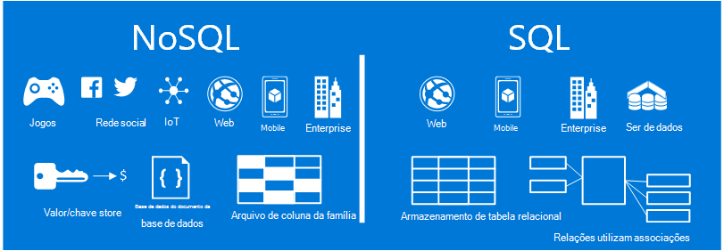
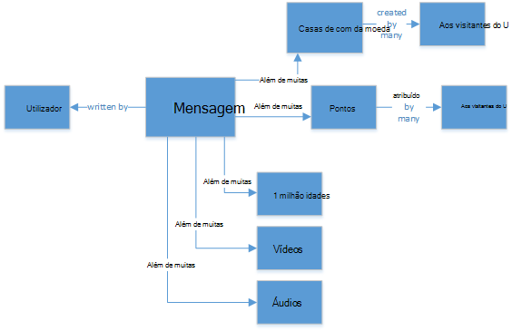
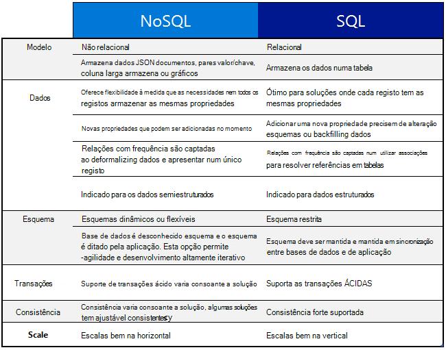
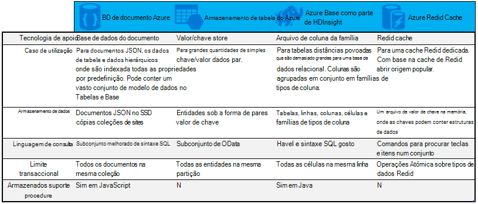

<properties
    pageTitle="Quando utilizar NoSQL vs SQL | Microsoft Azure"
    description="Compare as vantagens da utilização NoSQL soluções não relacionais versus soluções SQL. Saber se um dos serviços Microsoft Azure NoSQL ou do SQL Server melhor se adequa seu cenário."
    keywords="nosql vs sql, quando se deve utilizar NoSQL, sql vs nosql"
    services="documentdb"
    documentationCenter=""
    authors="mimig1"
    manager="jhubbard"
    editor=""/>

<tags
    ms.service="documentdb"
    ms.workload="data-services"
    ms.tgt_pltfrm="na"
    ms.devlang="dotnet"
    ms.topic="article" 
    ms.date="06/24/2016"
    ms.author="mimig"/>

# NoSQL vs SQL

SQL Server bases de dados relacionais (RDBMS) foram e as bases de dados para ir para a mais de 20 anos. No entanto, a maior necessidade de processar mais elevados volumes e variedades de dados com uma taxa rápida alterou da natureza necessidades de armazenamento de dados para os programadores de aplicações. Para permitir que este cenário, NoSQL bases de dados que permitem o armazenamento de dados não estruturados e heterogéneos escala tem adquirida com a popularidade. 

NoSQL é uma categoria de bases de dados diferentes a partir de bases de dados SQL. NoSQL é frequentemente utilizado para fazer referência a sistemas de gestão de dados que são "Não SQL" ou uma abordagem de gestão de dados que inclui "SQL não só". Existem um número de tecnologias na categoria NoSQL, incluindo bases de dados do documento, arquivos de valor de chave, armazena da família da coluna e bases de dados do gráfico, que são populares com jogos, sociais, e IoT apps.

É o objetivo deste artigo saber mais sobre as diferenças entre NoSQL e SQL e fornecer-lhe uma introdução às ofertas de NoSQL e SQL da Microsoft.  

## Quando utilizar NoSQL?

Vamos imagine que estiver a compilar um novo site de Cativação social. Os utilizadores podem criar mensagens e adicionar imagens, vídeos e música aos mesmos. Outros utilizadores podem comentar as mensagens e dar à pontos (gostos) para classificar as mensagens. A página de destino terá um feed das mensagens que os utilizadores podem partilhar e interagir com. 

Então como pode armazenar estes dados? Se estiver familiarizado com SQL, poderá começar a desenhar algo parecido com:

Por isso, até ao momento, por isso, muito bom, mas agora pense sobre a estrutura de uma única mensagem e como apresentá-la. Se quiser mostrar a mensagem e as imagens associadas, áudio, vídeo, comentários, pontos e informações de utilizador num Web site ou aplicação, teria que executar uma consulta com oito tabela associações apenas a obter o conteúdo. Agora imagine uma sequência de mensagens que dinamicamente carregar e apresentadas no ecrã e pode facilmente prever que vai para exigir o registo milhares de consultas e muitas associações para concluir a tarefa.

Agora pode utilizar uma solução relacional como SQL Server para armazenar os dados - mas há outra opção, uma opção de NoSQL que simplifica a abordagem. Por transformará a mensagem para um documento JSON semelhante ao seguinte e armazená-los DocumentDB, um serviço de base de dados do Azure NoSQL documento, pode aumentar o desempenho e obter a mensagem com uma consulta e sem associações toda. É uma mais simples, extremamente mais simples e performant mais resultado.

    {
        "id":"ew12-res2-234e-544f",
        "title":"post title",
        "date":"2016-01-01",
        "body":"this is an awesome post stored on NoSQL",
        "createdBy":User,
        "images":["http://myfirstimage.png","http://mysecondimage.png"],
        "videos":[
            {"url":"http://myfirstvideo.mp4", "title":"The first video"},
            {"url":"http://mysecondvideo.mp4", "title":"The second video"}
        ],
        "audios":[
            {"url":"http://myfirstaudio.mp3", "title":"The first audio"},
            {"url":"http://mysecondaudio.mp3", "title":"The second audio"}
        ]
    }

Além disso, estes dados podem ser divididos por id de mensagem, permitindo que os dados Dimensionar saída naturalmente e tirar partido das NoSQL características de escala. Também NoSQL sistemas permitir que os programadores tirando consistência e oferecem aplicações altamente disponíveis.  Por fim, esta solução não requer os programadores definir, gerir e manter o esquema na camada dados permitindo iteração rápida.

Em seguida, pode criar nesta solução com outros serviços do Azure:

- [Azure pesquisa](https://azure.microsoft.com/services/search/) podem ser utilizados através da aplicação web para permitir que os utilizadores procurar mensagens.
- [Serviços de aplicação do Azure](https://azure.microsoft.com/services/app-service/) podem ser utilizados para alojar aplicações e processos em segundo plano.
- [Armazenamento de Blobs do Azure](https://azure.microsoft.com/services/storage/) pode ser utilizada para armazenar os perfis de utilizador completo incluindo imagens.
- [Base de dados do SQL Azure](https://azure.microsoft.com/services/sql-database/) pode ser utilizada para armazenar grandes quantidades de dados como informações de início de sessão e para a análise de utilização.
- [Formação do Azure máquina](https://azure.microsoft.com/services/machine-learning/) podem ser utilizados para criar conhecimentos e informações da empresa que podem fornecer comentários para o processo e ajudar a entregar o conteúdo correto para os utilizadores à direita.

Este site de rede social Cativação é apenas um cenário em que uma base de dados NoSQL é o modelo de dados à direita para a tarefa. Se está interessado no modo de leitura mais informações sobre este cenário e como modelo de dados de DocumentDB nas aplicações de redes sociais, consulte o artigo [aceder sociais com DocumentDB](documentdb-social-media-apps.md). 

## Comparação SQL NoSQL vs

A tabela seguinte compara as principais diferenças entre NoSQL e SQL. 

Se uma base de dados NoSQL melhor se adequa às suas necessidades, continue para secção seguinte para obter mais informações sobre os serviços de NoSQL disponíveis a partir do Azure. Caso contrário, se uma base de dados SQL melhor se adequa às suas necessidades, avance para o [quais são as ofertas do Microsoft SQL?](#what-are-the-microsoft-sql-offerings)

## Quais são as ofertas do Microsoft Azure NoSQL?

Azure tem quatro serviços NoSQL completamente geridas: 

- [Azure DocumentDB](https://azure.microsoft.com/services/documentdb/)
- [Armazenamento de tabela do Azure](https://azure.microsoft.com/services/storage/)
- [Azure HBase como parte da HDInsight](https://azure.microsoft.com/services/hdinsight/)
- [Cache de Azure Redis](https://azure.microsoft.com/services/cache/)

O gráfico de comparação seguinte mapas saída os elementos de diferenciação chaves para cada serviço. Qual com mais exatidão descreve as necessidades da sua aplicação? 

Se uma ou mais destes serviços poderão satisfazer as necessidades da sua aplicação, mais com os seguintes recursos: 

- [Caminho de formação DocumentDB](https://azure.microsoft.com/documentation/learning-paths/documentdb/) e [DocumentDB casos de utilização](documentdb-use-cases.md)
- [Introdução ao armazenamento de tabela do Azure](../storage/storage-dotnet-how-to-use-tables.md)
- [O que é HBase no HDInsight](../hdinsight/hdinsight-hbase-overview.md)
- [Redis Cache caminho de formação](https://azure.microsoft.com/documentation/learning-paths/redis-cache/)

Em seguida, aceda ao [seguir os passos](#next-steps) para obter informações de avaliação gratuitas.

## Quais são as ofertas do Microsoft SQL?

Microsoft tem cinco ofertas de SQL: 

- [Base de dados Azure SQL](https://azure.microsoft.com/services/sql-database/)
- [SQL Server em máquinas virtuais Azure](https://azure.microsoft.com/services/virtual-machines/sql-server/)
- [Do SQL Server](https://www.microsoft.com/server-cloud/products/sql-server-2016/)
- [Armazém de dados do Azure SQL (pré-visualização)](https://azure.microsoft.com/services/sql-data-warehouse/)
- [Sistema de plataforma de análise (aparelho no local)](https://www.microsoft.com/en-us/server-cloud/products/analytics-platform-system/)

Se está interessado em SQL Server num Máquina Virtual ou base de dados SQL, em seguida, continue a ler [Escolha uma opção do SQL Server nuvem: base de dados SQL Azure (PaaS) ou do SQL Server no Azure VMs (IaaS)](../sql-database/sql-database-paas-vs-sql-server-iaas.md) para saber mais sobre as diferenças entre as duas.

Se SQL sons, como a melhor opção, em seguida, aceda ao [SQL Server](https://www.microsoft.com/server-cloud/products/) para obter mais informações sobre o nosso Microsoft SQL produtos e serviços de tem que oferecer.

Em seguida, consulte [os passos seguintes](#next-steps) gratuitamente ligações de versão de avaliação e avaliação.

## Próximos passos

Vamos convidá-lo para saber mais sobre os nossos produtos SQL e NoSQL por a experimentá-los gratuitamente. 

- Para todos os serviços Azure, pode inscrever-se um [mês de uma versão de avaliação gratuita](https://azure.microsoft.com/pricing/free-trial/) e receber $200 gasto em qualquer um dos serviços Azure.
    - [Azure DocumentDB](https://azure.microsoft.com/services/documentdb/)
    - [Azure HBase como parte da HDInsight](https://azure.microsoft.com/services/hdinsight/)
    - [Cache de Azure Redis](https://azure.microsoft.com/services/cache/)
    - [Armazém de dados do Azure SQL (pré-visualização)](https://azure.microsoft.com/services/sql-data-warehouse/)
    - [Base de dados Azure SQL](https://azure.microsoft.com/services/sql-database/)
    - [Armazenamento de tabela do Azure](https://azure.microsoft.com/services/storage/)

- Pode giratório para cima de uma [versão de avaliação do SQL Server 2016 num computador virtual](https://azure.microsoft.com/marketplace/partners/microsoft/sqlserver2016ctp33evaluationwindowsserver2012r2/) ou transferir uma [versão de avaliação do SQL Server](https://www.microsoft.com/en-us/evalcenter/evaluate-sql-server-2016).
    - [Do SQL Server](https://www.microsoft.com/server-cloud/products/sql-server-2016/)
    - [SQL Server em máquinas virtuais Azure](https://azure.microsoft.com/services/virtual-machines/sql-server/)

