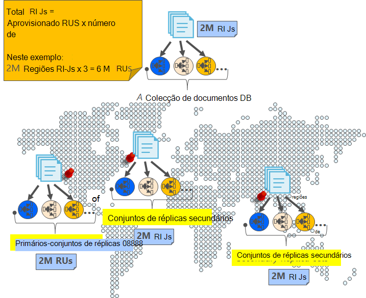
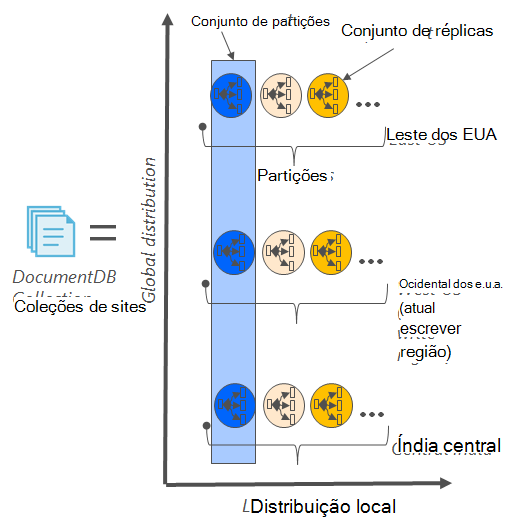
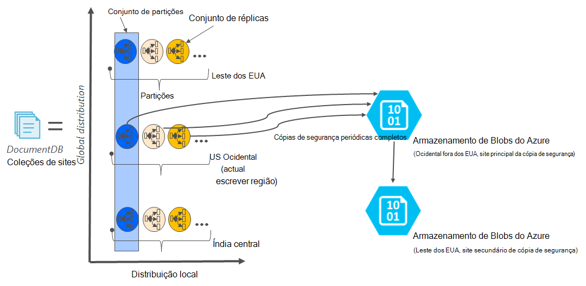

<properties
    pageTitle="Online cópia de segurança e restauro com DocumentDB | Microsoft Azure"
    description="Saiba como efetuar cópias de segurança automáticas e restaurar NoSQL bases de dados com Azure DocumentDB."
    keywords="cópia de segurança e restauro, cópia de segurança online"
    services="documentdb"
    documentationCenter=""
    authors="RahulPrasad16"
    manager="jhubbard"
    editor="monicar"/>

<tags
    ms.service="documentdb"
    ms.workload="data-services"
    ms.tgt_pltfrm="na"
    ms.devlang="multiple"
    ms.topic="article"
    ms.date="09/23/2016"
    ms.author="raprasa"/>

# Cópia de segurança automática online e restaurar com DocumentDB 

Azure DocumentDB leva automaticamente cópias de segurança de todos os seus dados em intervalos regulares. Cópias de segurança automáticas são tidos sem afetar o desempenho ou a disponibilidade das operações de base de dados de NoSQL. Todas as cópias de segurança são armazenadas em separado num outro serviço de armazenamento e as cópias de segurança globalmente são replicadas para RDP contra catástrofes regionais. Cópias de segurança automáticas destinam-se para obter cenários quando eliminar acidentalmente a sua coleção de DocumentDB e exigir mais tarde recuperação de dados ou uma solução de recuperação de falhas.  

Este artigo começa com um recapitular rápida da redundância de dados e disponibilidade no DocumentDB e, em seguida, aborda cópias de segurança. 

## Elevada disponibilidade com DocumentDB - um recapitular

DocumentDB foi concebido para ser [distribuído globalmente](documentdb-distribute-data-globally.md) – permite-lhe dimensionar débito entre as regiões Azure múltiplos juntamente com política pelo esforço activação e APIs multi-homing transparentes. Como um sistema de base de dados perguntar se [99,99% disponibilidade SLA](https://azure.microsoft.com/support/legal/sla/documentdb/v1_0/), todas as gravações no DocumentDB são permanentemente consolidadas para discos locais por um quórum de réplicas dentro de um centro de dados locais antes de confirmar ao cliente. Note que a disponibilidade de alta de DocumentDB baseia-se em armazenamento local e não dependem qualquer tecnologias de armazenamento externo. Para além disso, se a sua conta de base de dados está associada a mais do que uma região Azure, as gravações são replicadas em outras regiões também. Para dimensionar os débito e aceder aos dados na latências baixos, pode ter muitos ser lido regiões associados com a sua conta de base de dados que quiser. Em cada região de leitura, os dados (replicados) durável são mantidos através de um conjunto de réplica.  

Conforme ilustrado no diagrama seguinte, uma única colecção de DocumentDB é a [partições horizontalmente](documentdb-partition-data.md). Uma "partição" é representada por um círculo no diagrama seguinte e cada partição é disponibilizada altamente através de um conjunto de réplica. Esta é a distribuição local numa única região Azure (representada pelo eixo X). Além disso, cada partição (com o seu conjunto de réplica correspondentes), em seguida, é distribuída globalmente em várias regiões associados com a sua conta de base de dados (por exemplo, neste regiões de ilustração as três – Leste dos EUA, EUA oeste e Central Índia). "Conjunto de partições" é um globalmente distribuído entidade que inclua de várias cópias dos seus dados em cada região (representada pelo eixo do Y). Pode atribuir prioridade para as regiões associadas à sua conta de base de dados e DocumentDB transparente irá activação pós-falha à região de seguinte em caso de falhas. Pode também manualmente simular activação pós-falha para testar a disponibilidade de ponto a ponto da sua aplicação.  

A imagem seguinte ilustra o elevado grau de redundância com DocumentDB.

## Cópias de segurança completos, automáticas, onlinehttps

, que eliminei minha coleção ou base de dados! Com DocumentDB, não apenas os seus dados, mas as cópias de segurança dos seus dados são também efetuadas altamente redundantes e flexível a catástrofes regionais. Estas cópias de segurança automatizadas atualmente são tidos aproximadamente em quatro horas. 

As cópias de segurança forem tomadas sem afetar o desempenho ou a disponibilidade das operações de base de dados. DocumentDB leva a cópia de segurança em segundo plano sem consumir os RUs aprovisionadas ou afetar o desempenho e sem afetar a disponibilidade da base de dados NoSQL. 

Ao contrário dos seus dados que estão armazenados no interior DocumentDB, cópias de segurança automáticas são armazenadas no serviço de armazenamento de Blobs do Azure. Para garantir o carregamento de latência baixa/eficientes, instantâneo da cópia de segurança é carregado para uma instância de armazenamento de Blobs do Azure na mesma região como a região atual de escrita da sua conta de base de dados DocumentDB. Para RDP contra falhas regionais, cada instantâneo dos seus dados de cópia de segurança no armazenamento de Blobs do Azure novamente é replicado através do armazenamento geo redundantes (GRS) para outro região. O diagrama seguinte mostra que toda a colecção DocumentDB (com todos os três partições primárias no US Ocidental, neste exemplo) cópias de segurança numa conta de armazenamento de Blobs do Azure remota no EUA oeste e, em seguida, GRS replicadas para leste dos EUA. 

A imagem seguinte ilustra periódicas cópias de segurança completos de todas as entidades DocumentDB no GRS armazenamento do Windows Azure.

## Período de retenção para um determinado instantâneo

Conforme descrito acima, podemos periodicamente instantâneos dos seus dados e por nossos regulamentos de conformidade, podemos manter o instantâneo mais recente para cerca de 90 dias antes de-obtém acaba por ser eliminada. Se uma conta ou coleções de sites é eliminada, DocumentDB armazena última cópia de segurança durante cerca de 90 dias.

## Restaurar a base de dados da cópia de segurança online

Caso elimine acidentalmente os seus dados, pode [ficheiro um bilhetes de suporte](https://portal.azure.com/?#blade/Microsoft_Azure_Support/HelpAndSupportBlade) ou [contacte o suporte Azure](https://azure.microsoft.com/support/options/) para restaurar os dados da última cópia de segurança automática. Para um instantâneo específico da cópia de segurança a ser restaurada, DocumentDB requer que foram, pelo menos, disponíveis com-nos dados para a duração do ciclo de cópia de segurança para essa instantâneo.

## Próximos passos

Para criar uma réplica da sua base de dados NoSQL nos vários centros de dados, consulte o artigo [distribuir os seus dados globalmente com DocumentDB](documentdb-distribute-data-globally.md). 

Para o contacto do ficheiro Azure suporte, [ficheiro uma permissão a partir do portal Azure](https://portal.azure.com/?#blade/Microsoft_Azure_Support/HelpAndSupportBlade).