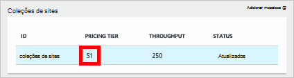
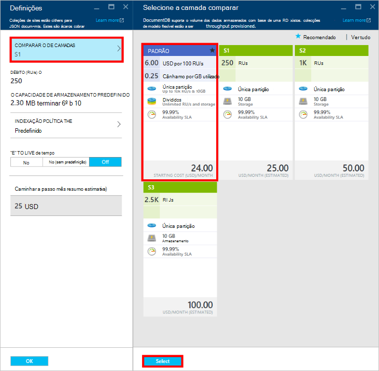
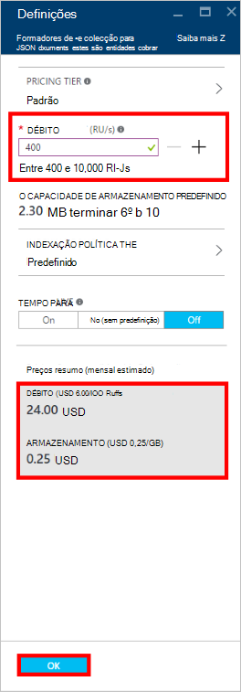
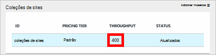

<properties
    pageTitle="Níveis de desempenho no DocumentDB | Microsoft Azure"
    description="Saiba mais sobre como os níveis de desempenho no DocumentDB permitem-lhe reservar débito numa base por coleção."
    services="documentdb"
    authors="mimig1"
    manager="jhubbard"
    editor="monicar"
    documentationCenter=""/>

<tags
    ms.service="documentdb"
    ms.workload="data-services"
    ms.tgt_pltfrm="na"
    ms.devlang="na"
    ms.topic="article"
    ms.date="08/26/2016"
    ms.author="mimig"/>

# Níveis de desempenho no DocumentDB

Este artigo fornece uma descrição geral de níveis de desempenho no [Microsoft Azure DocumentDB](https://azure.microsoft.com/services/documentdb/).

Depois de ler este artigo, poderá atender as seguintes questões:  

-   O que é um nível de desempenho?
-   Como é reservado débito para uma conta de base de dados?
-   Como trabalhar com níveis de desempenho?
-   Como estou faturada para níveis de desempenho?

## Introdução aos níveis de desempenho

Cada coleção de DocumentDB criada numa conta padrão está aprovisionada com um nível de desempenho associado. Cada uma das coleções numa base de dados pode ter um nível de desempenho diferentes, permitindo-lhe designar mais débito para coleções de acedidas frequentemente e menor débito para coleções de acedidos com pouca frequência. DocumentDB suporta ambos os níveis de desempenho definidos pelo utilizador e previamente definido níveis de desempenho.  

Cada nível de desempenho tem um limite da taxa associado [unidade pedido (RU)](documentdb-request-units.md) . Este é o débito que vai estar reservado para uma coleção de com base no seu nível de desempenho e está disponível para ser utilizado por essa coleção exclusivamente.

<table border="0" cellspacing="0" cellpadding="0">
    <tbody>
        <tr>
            <td valign="top">

</td>
            <td valign="top">
Detalhes
</td>
            <td valign="top">
Limites de débito
</td>
            <td valign="top">
Limites de armazenamento
</td>
            <td valign="top">
Versão
</td>
            <td valign="top">
APIs
</td>            
        </tr>
        <tr>
            <td valign="top">
Desempenho definidos pelo utilizador
</td>
            <td valign="top">
Armazenamento com tráfego limitado a com base em utilização em GB.

Débito em unidades de 100 RU/s
</td>
            <td valign="top">
Ilimitado. 400 - 250.000 pedir unidades/s por predefinição (mais alto por pedido)
</td>
            <td valign="top">
Ilimitado. 250 GB por predefinição (mais alto por pedido) 
</td>
            <td valign="top">
V2
</td>
            <td valign="top">
API 2015-12-16 e mais recente
</td>  
        </tr>
        <tr>
            <td valign="top">
Desempenho predefinido
</td>
            <td valign="top">
Armazenamento de 10 GB reservada.

S1 = 250 RU/s, S2 = 1000 RU/s, S3 = 2500 RU/s
</td>
            <td valign="top">
2500 RU/s
</td>
            <td valign="top">
10 GB
</td>
            <td valign="top">
V1
</td>
            <td valign="top">
Qualquer
</td>  
        </tr>        
    </tbody>
</table>                

DocumentDB permite que um conjunto avançado de operações de base de dados, incluindo consultas, procedimentos de consultas com funções definidas pelo utilizador (UDFs), armazenados e accionadores. O custo de processamento associado a cada uma destas operações variam consoante CPU, IO e memória necessário para concluir a operação. Em vez de pensar sobre e gestão de recursos de hardware, poderá pensar uma unidade de pedido como uma medida única para os recursos necessários para realizar várias operações de base de dados e um pedido de aplicação de serviço.

Coleções de sites podem ser criadas através de do [portal do Microsoft Azure](https://portal.azure.com), de [REST API](https://msdn.microsoft.com/library/azure/mt489078.aspx) ou de qualquer um do [SDK DocumentDB](https://msdn.microsoft.com/library/azure/dn781482.aspx). API do DocumentDB permitem-lhe especificar o nível de desempenho de uma coleção de.

> [AZURE.NOTE] O nível de desempenho de uma coleção de pode ser ajustado através de APIs ou o [portal do Microsoft Azure](https://portal.azure.com/). Alterações ao nível do desempenho são esperadas para concluir dentro de minutos 3.

## Definir níveis de desempenho para coleções de sites
Quando uma coleção de estiver criada, a alocação completa da RUs com base no nível de desempenho designada são reservados para a coleção.

Nota que com ambos os níveis de desempenho definidos pelo utilizador e predefinidos, DocumentDB funciona com base no reserva de débito. Ao criar uma coleção de, uma aplicação tem reservadas e é faturada para débito reservado, independentemente da quantidade desse débito é utilizada ativamente. Com níveis de desempenho definidos pelo utilizador, armazenamento é com tráfego limitado com base em consumo, mas com níveis de desempenho predefinidos, 10 GB de armazenamento é reservado no momento da criação de coleções de sites.  

Após a criação de coleções de sites, pode modificar o nível de desempenho através dos SDK DocumentDB ou através do Portal clássica do Azure.

> [AZURE.IMPORTANT] Coleções de padrão DocumentDB são faturadas com uma taxa de hora a hora e cada coleção de que criar vai ser faturada para uma mínima de uma hora após a utilização.

Se ajustar o nível de desempenho de uma coleção de dentro de uma hora, ser faturada para o nível de desempenho mais alto, definido durante a hora. Por exemplo, se aumentar o seu nível de desempenho para uma coleção de 8:53 am será cobrado para o novo nível de começando na 8:00 am. Da mesma forma, se Diminuir nível de desempenho em 8:53 am, será aplicada a taxa de nova na 9:00 am.

Pedido de unidades são reservadas para cada coleção com base no conjunto de nível de desempenho. Consumo de unidade pedido é avaliado como um por taxa segunda. As aplicações que excedam a taxa de unidade pedido aprovisionada (ou o nível de desempenho) numa coleção de vai ser limitadas até a taxa desce abaixo o nível de reservadas para essa coleção. Se a sua aplicação requer um nível superior de débito, pode aumentar o nível de desempenho para cada coleção.

> [AZURE.NOTE] Quando a aplicação ultrapassa os níveis de desempenho para coleções de um ou vários, vai ser limitados pedidos numa base por coleção. Isto significa que alguns pedidos de aplicação poderão ter êxito enquanto outras pessoas podem ser limitadas. Recomenda-se para adicionar um pequeno número de tentativas quando limitada para processar picos no tráfego pedido.

## Trabalhar com níveis de desempenho
Coleções de DocumentDB permitem-lhe agrupar os seus dados com base no padrões de consulta e necessidades de desempenho da aplicação. Com do DocumentDB indexação automática e suporte de consulta, é bastante comum para colocar documentos heterogéneos dentro da mesma coleção. As considerações chaves para decidir se devem ser utilizadas colecções separadas incluem:

- Consultas – uma coleção de é o âmbito para a execução da consulta. Se precisar de consulta num conjunto de documentos, os padrões de leitura mais eficientes originam nos documentos coinstalação numa única coleção.
- Transações – todas as operações estão limitadas para dentro de uma única colecção. Se tiver documentos que têm de ser atualizados dentro de um único procedimento armazenado ou accionador, deve ser armazenados dentro da mesma coleção. Mais especificamente, uma tecla de partição dentro de uma coleção de é o limite da transação. Consulte o artigo [divisão no DocumentDB](documentdb-partition-data.md) para obter mais detalhes.
- Isolamento de desempenho – um conjunto tem um nível de desempenho associado. Isto garante que cada uma das coleções tem um desempenho previsível através da RUs reservadas. Dados podem ser atribuídos para coleções de sites diferentes, com os níveis de desempenho diferentes, com base na frequência de acesso.

> [AZURE.IMPORTANT] É importante compreender o que vai ser faturada a taxas completa padrão com base no número de coleções de sites criados pela aplicação.

Recomenda-se que a aplicação faz com que utilização de um pequeno número de coleções de sites, a menos que tenha grandes requisitos de armazenamento ou débito. Certifique-se de que também tenham entendido padrões de aplicação para a criação de novas colecções. Pode optar por reservar criação da colecção de como uma ação de gestão gerida fora da sua aplicação. Da mesma forma, ajustar o nível de desempenho para uma coleção de irá alterar a taxa de hora a hora em que a coleção de é faturada. Deve monitorizar níveis de desempenho de coleções de sites, se a sua aplicação ajusta estes dinamicamente.

## Alterar de S1, S2, S3 para desempenho definidos pelo utilizador

Siga estes passos para alterar de utilização de níveis de débito predefinidos para os níveis de débito definidos pelo utilizador no portal do Azure. Ao utilizar níveis de débito definidos pelo utilizador, pode personalizar o seu débito às suas necessidades. E se ainda estiver a utilizar uma conta de S1, pode aumentar o débito predefinido de 250 RU/s para 400 RU/s com apenas alguns cliques.

Para mais informações sobre o comparar débito relacionado com predefinidos e definidos pelo utilizador de alterações, consulte a mensagem do blogue [DocumentDB: tudo o que precisa de saber sobre como utilizar as novas opções de definição de preços](https://azure.microsoft.com/blog/documentdb-use-the-new-pricing-options-on-your-existing-collections/).

> [AZURE.VIDEO changedocumentdbcollectionperformance]

1. No seu browser, navegue para o [**Azure portal**](https://portal.azure.com).
2. Clique em **Procurar** -> **DocumentDB contas**, em seguida, selecione a conta de DocumentDB a modificar.   
3. No lens **bases de dados** , selecione a base de dados para modificar e, em seguida, na pá **base de dados** , selecione a coleção de modificar. As contas utilizando débito predefinido têm uma camada preços de S1, S2 ou S3.

      

4. No pá **coleções de sites** , clique em **mais**, em seguida, **Definições** na barra superior.   
5. No pá **Definições** , clique em **Níveis de preços** e repare que a estimativa de custo mensal para cada um dos planos é apresentada na pá **Selecione a camada comparar** . Para alterar para débito definidos pelo utilizador, clique em **padrão**e, em seguida, clique em **Selecionar** para guardar a alteração.

      

6. Novamente na pá **Definições** , a **Camada preços** é alterado para **padrão** e é apresentada a caixa de **débito (RU/s)** com um valor predefinido de 400. Definir o débito entre 400 e 10.000 [Pedir unidades](documentdb-request-units.md)/second (RU/s). O **Resumo preços** na parte inferior da página atualiza automaticamente para fornecer uma estimativa do custo mensal. Clique em **OK** para guardar as alterações.

    

7. Novamente no pá **base de dados** , pode verificar o débito da coleção de novo.

    

Se determinar que precisa de mais débito (maior que 10.000 RU/s) ou mais armazenamento (maior que 10GB) pode criar uma coleção de com partições. Para criar uma coleção de com partições, consulte o artigo [criar uma coleção de](documentdb-create-collection.md).

>[AZURE.NOTE] Alterar os níveis de desempenho de uma coleção de poderá demorar até 2 minutos.

## Alterar os níveis de desempenho utilizando o SDK .NET

Outra opção para alterar os níveis de desempenho do seu coleções de sites é através da nossa SDK. Esta secção abrange apenas a alterar o nível de desempenho de uma coleção utilizando os nossos [.NET SDK](https://msdn.microsoft.com/library/azure/dn948556.aspx), mas o processo é semelhante para os nossos [SDK](https://msdn.microsoft.com/library/azure/dn781482.aspx). Se estiver familiarizado com o nosso .NET SDK, visite a nossa [Tutorial de iniciação](documentdb-get-started.md).

Eis um fragmento de código para alterar o débito oferta 50.000 pedido as unidades por segundo:

    //Fetch the resource to be updated
    Offer offer = client.CreateOfferQuery()
                      .Where(r => r.ResourceLink == collection.SelfLink)    
                      .AsEnumerable()
                      .SingleOrDefault();

    // Set the throughput to 5000 request units per second
    offer = new OfferV2(offer, 5000);

    //Now persist these changes to the database by replacing the original resource
    await client.ReplaceOfferAsync(offer);

    // Set the throughput to S2
    offer = new Offer(offer);
    offer.OfferType = "S2";

    //Now persist these changes to the database by replacing the original resource
    await client.ReplaceOfferAsync(offer);

> [AZURE.NOTE] Coleções aprovisionadas com 10.000 em unidades de pedido por segundo podem ser migradas entre ofertas com definidos pelo utilizador débito e débito predefinido (S1, S2, S3) em qualquer altura. Coleções de sites aprovisionadas com acima 10.000 unidades pedido por segundo não podem ser convertidas aos níveis de débito predefinidos.

Visite o [MSDN](https://msdn.microsoft.com/library/azure/microsoft.azure.documents.client.documentclient.aspx) para ver mais exemplos e saiba mais sobre os nossos métodos de oferta:

- [**ReadOfferAsync**](https://msdn.microsoft.com/library/azure/microsoft.azure.documents.client.documentclient.readofferasync.aspx)
- [**ReadOffersFeedAsync**](https://msdn.microsoft.com/library/azure/microsoft.azure.documents.client.documentclient.readoffersfeedasync.aspx)
- [**ReplaceOfferAsync**](https://msdn.microsoft.com/library/azure/microsoft.azure.documents.client.documentclient.replaceofferasync.aspx)
- [**CreateOfferQuery**](https://msdn.microsoft.com/library/azure/microsoft.azure.documents.linq.documentqueryable.createofferquery.aspx)

## Alterar o débito de uma coleção de

Se já estiver a utilizar o desempenho definidos pelo utilizador, pode alterar o débito da sua coleção de ao efetuar o seguinte. Se precisar de alterar a partir de um nível de desempenho S1, S2 ou S3 (desempenho predefinido) para o desempenho definidos pelo utilizador, consulte o artigo [alterar a partir de S1, S2, S3 desempenho definidos pelo utilizador](#changing-performance-levels-using-the-azure-portal).

1. No seu browser, navegue para o [**Azure portal**](https://portal.azure.com).
2. Clique em **Procurar** -> **DocumentDB contas**, em seguida, selecione a conta de DocumentDB a modificar.   
3. No pá **DocumentDB conta** , no lens **bases de dados** , selecione a base de dados para modificar e, em seguida, na pá **base de dados** , selecione a coleção de modificar.
4. No pá **coleções de sites** , clique em **Definições** , na barra superior.   
5. Na pá **Definições** , aumente o valor na caixa de **débito (RU/s)** e, em seguida, clique em **OK** para guardar a alteração. O **Resumo preços** na parte inferior das atualizações de pá para mostrar os novos custos mensal estimado dessa coleção numa única região.

    

Se não ainda tem a certeza quanto para aumentar o seu débito, consulte o artigo [precisa de débito Estimating](documentdb-request-units.md#estimating-throughput-needs) e [Pedir Calculadora de unidade](https://www.documentdb.com/capacityplanner).

## Próximos passos

Para saber mais sobre como preços e gerir dados com Azure DocumentDB, explore estes recursos:

- [DocumentDB preços](https://azure.microsoft.com/pricing/details/documentdb/)
- [Gerir a capacidade de DocumentDB](documentdb-manage.md)
- [Modelação de dados DocumentDB](documentdb-modeling-data.md)
- [Criar a partições dados DocumentDB](documentdb-partition-data.md)
- [Pedido de unidades](http://go.microsoft.com/fwlink/?LinkId=735027)

Para saber mais sobre DocumentDB, consulte a [documentação](https://azure.microsoft.com/documentation/services/documentdb/)do Azure DocumentDB.

Para começar com escala e testar com DocumentDB desempenho, consulte o artigo [Desempenho e escala testes com Azure DocumentDB](documentdb-performance-testing.md).

[1]: ./media/documentdb-performance-levels/documentdb-change-collection-performance7-9.png
[2]: ./media/documentdb-performance-levels/documentdb-change-collection-performance10-11.png
