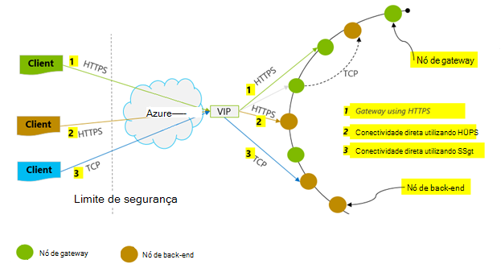
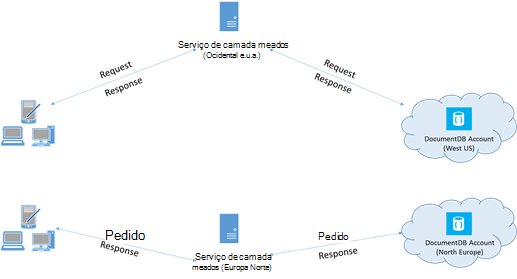

<properties 
    pageTitle="Sugestões sobre o desempenho DocumentDB | Microsoft Azure" 
    description="Saiba mais opções de configuração do cliente para melhorar o desempenho do Azure DocumentDB da base de dados"
    keywords="como melhorar o desempenho da base de dados"
    services="documentdb" 
    authors="mimig1" 
    manager="jhubbard" 
    editor="" 
    documentationCenter=""/>

<tags 
    ms.service="documentdb" 
    ms.workload="data-services" 
    ms.tgt_pltfrm="na" 
    ms.devlang="na" 
    ms.topic="article" 
    ms.date="10/17/2016" 
    ms.author="mimig"/>

# Sugestões de desempenho para DocumentDB

Azure DocumentDB é uma alternativa rápida e flexível distribuído base de dados que se adapta de forma totalmente integrada com latência garantia e débito. Não possui que fazer alterações de arquitectura principais ou escrever código complexo para dimensionar a base de dados com DocumentDB. Dimensionamento cima e para baixo é tão fácil como efetuar uma chamada à API única ou [SDK chamada de um método](documentdb-performance-levels.md#changing-performance-levels-using-the-net-sdk). No entanto, uma vez que DocumentDB é acedida através das chamadas de rede existem Otimizações do lado do cliente que pode efetuar a alcançar o desempenho de pico.

Para que se precisar "como posso melhorar meu desempenho de bases de dados?" Considere as seguintes opções:

## Funcionamento em rede

1. **Política de ligação: utilizar o modo de ligação direta**
    
    Como um cliente liga-se ao Azure DocumentDB tem implicações importantes sobre o desempenho, especialmente em termos de latência observado do lado do cliente. Existem duas definições de configuração da chave disponíveis para configurar a política de ligação – o *modo* de ligação e o [de ligação de *protocolo*](#connection-protocol)de cliente.  Os dois modos disponíveis são:

    1. Modo de gateway (predefinição)
    2. Modo direto

    Uma vez que DocumentDB um sistema de armazenamento distribuído, recursos DocumentDB como coleções de sites estão divididos em vários computadores e cada partição é replicada para elevada disponibilidade. Lógica para tradução de endereço físico é mantida numa tabela de encaminhamento, também está disponível internamente como um recurso.

    No modo de Gateway, as máquinas de gateway DocumentDB executar este encaminhamento, permitindo assim o código do cliente ser simples e compacta. Uma aplicação de cliente emite pedidos para máquinas de gateway DocumentDB, que traduzem o URI lógico no pedido de para o endereço físico do nó back-end e reencaminhar o pedido de corretamente.  Por outro lado, no modo direta clientes devem manter – e actualizar periodicamente – uma cópia da tabela de encaminhamento e, em seguida, diretamente ligue aos nós de DocumentDB back-end.

    Modo de gateway é suportado em todas as plataformas SDK e é a predefinição configurada.  Se a aplicação for executado dentro de uma rede de empresa com restrições estritamente firewall, o modo de Gateway é a melhor escolha uma vez que utiliza a porta HTTPS padrão e um ponto final de único. A variação de desempenho, contudo, é o modo de Gateway envolve salto uma rede adicionais, sempre que dados são leitura ou escritos para DocumentDB.   Por esta razão, o modo direta oferece um melhor desempenho devido menos saltos de rede.

2. **Política de ligação: utilizar o protocolo TCP**

    Quando tirar partido da modo direta, existem duas opções de protocolo disponíveis:

    - TCP
    - HTTPS

    DocumentDB oferece uma alteração simples e abra o modelo de programação RESTful por HTTPS. Para além disso, oferece um protocolo TCP eficiente, que também é RESTful no seu modelo de comunicação e está disponível através do cliente .NET SDK. Direta TCP e HTTPS utilizar SSL para autenticação inicial e o tráfego de encriptação. Para um melhor desempenho, utilize o protocolo TCP sempre que possível. 

    Quando utiliza o TCP no modo de Gateway, TCP porta 443 é a porta DocumentDB e 10250 é a porta MongoDB API. Quando utiliza o TCP no modo de direta, para além das portas de Gateway, terá de garantir a porta intervalo entre 10000 e 20000 está aberto porque DocumentDB utiliza portas TCP dinâmicas. Se estas portas não estão abertas e tentar utilizar TCP, receberá um erro 503 Serviço indisponível. 

    O modo de conectividade está configurado durante a construção da instância DocumentClient com o parâmetro ConnectionPolicy. Se for utilizado direta modo, também pode definir o protocolo dentro o parâmetro ConnectionPolicy.

        var serviceEndpoint = new Uri("https://contoso.documents.net");
        var authKey = new "your authKey from Azure Mngt Portal";
        DocumentClient client = new DocumentClient(serviceEndpoint, authKey, 
        new ConnectionPolicy
        {
            ConnectionMode = ConnectionMode.Direct,
            ConnectionProtocol = Protocol.Tcp
        });

    Uma vez que o TCP só é suportada no modo de direta, se é utilizado o modo de Gateway, em seguida, o protocolo HTTPS sempre é utilizado para comunicar com o Gateway e o valor protocolo na ConnectionPolicy é ignorado.

    

3. **Chamar OpenAsync para evitar latência de arranque no primeiro pedido**

    Por predefinição, o primeiro pedido terá uma latência superior, porque tem que obter a tabela de encaminhamento de endereço. Para evitar este latência de arranque no primeiro pedido, deverá contactar o OpenAsync() uma vez durante a inicialização da seguinte forma.

        await client.OpenAsync();

4. **Colocar os clientes no mesmo região Azure para obter um desempenho**

    Sempre que possível, coloque todas as aplicações que entra em contacto DocumentDB na mesma região como a base de dados DocumentDB. Para uma comparação aproximada, as chamadas para DocumentDB dentro da mesma região concluída dentro ms 1-2, mas a latência entre oeste e Costa Leste dos EUA é > 50 ms. Este latência pode variar provavelmente a partir de um pedido para solicitar consoante a rota tomada pelo pedido transmite a partir do cliente para o limite do Centro de dados Azure. A latência possível mais baixa é obtida, certificando-se que a aplicação de chamada se encontra dentro da mesma região Azure como o ponto final de DocumentDB aprovisionada. Para obter uma lista das regiões disponíveis, consulte o artigo [Azure regiões](https://azure.microsoft.com/regions/#services).

    

5. **Aumentar o número de threads/tarefas**

    Uma vez que as chamadas para DocumentDB são feitas através da rede, poderá ter de variar o grau de paralelismo de pedidos de modo a que a aplicação de cliente passa pouco muito tempo a aguardar entre os pedidos. Por exemplo, se estiver a utilizar. Do líquido [Biblioteca paralelo de duas tarefas](https://msdn.microsoft.com//library/dd460717.aspx), criar pela ordem 100s das tarefas de leitura ou escrita para DocumentDB.

## Utilização SDK

1. **Instalar o SDK mais recente**

    O SDK DocumentDB constantemente estão a ser melhorados para fornecer o melhor desempenho. Consulte as páginas de [DocumentDB SDK](documentdb-sdk-dotnet.md) para determinar o SDK do mais recente e rever melhorias. 

2. **Utilizar um cliente de DocumentDB singleton para a duração da sua aplicação**
  
    Note que cada instância DocumentClient é tópico seguro e executa a gestão da ligação eficientes e endereço colocação em cache quando a funcionar no modo direta. Para permitir a gestão da ligação eficientes e melhor desempenho por DocumentClient, recomenda-se para utilizar uma única ocorrência de DocumentClient por domínio de aplicação para o tempo de vida da aplicação.

3. **Aumentar System.Net MaxConnections por anfitrião**

    Pedidos de DocumentDB são feitos ao longo do HTTPS/resto por predefinição e são submetidos para o limite de ligação predefinido por nome do anfitrião ou o endereço IP. Poderá ter de definir o MaxConnections para um valor superior (100-1000) para que a biblioteca do cliente pode utilizar múltiplas ligações em simultâneo para DocumentDB. No .NET SDK 1.8.0 e acima, o valor predefinido para [ServicePointManager.DefaultConnectionLimit](https://msdn.microsoft.com/library/system.net.servicepointmanager.defaultconnectionlimit.aspx) é 50 e para alterar o valor, pode definir a [Documents.Client.ConnectionPolicy.MaxConnectionLimit](https://msdn.microsoft.com/en-us/library/azure/microsoft.azure.documents.client.connectionpolicy.maxconnectionlimit.aspx) para um valor superior.  

4. **Otimização do paralelo de duas consultas de colecções com partições de**

     DocumentDB .NET SDK versão 1.9.0 e acima consultas paralelas suporte, que permitem-lhe uma coleção de com partições em paralelo de consulta (consulte o artigo [trabalhar com os SDK](documentdb-partition-data.md#working-with-the-sdks) e as relacionados [exemplos de código](https://github.com/Azure/azure-documentdb-dotnet/blob/master/samples/code-samples/Queries/Program.cs) para obter mais informações). Consultas paralelas foram concebidas para melhorar a latência da consulta e débito sobre os respetivos homólogo para revisão em série. As consultas paralelas fornecem dois parâmetros que os utilizadores podem sintonizar para personalizada-ajustar os respetivos requisitos, (um) MaxDegreeOfParallelism: para controlar o número máximo de partições que podem ser consultados em paralelo e MaxBufferedItemCount (b): para controlar o número de resultados obtidos previamente. 
    
    (um) ***Tuning MaxDegreeOfParallelism\: *** 
    paralelas consulta funciona consultando múltiplas partições em paralelo. No entanto, os dados a partir de um recolher com partições individual seja obtidos em série relativamente à consulta. Por isso, definir a MaxDegreeOfParallelism para o número de partições deu máxima dar a oportunidade de alcançar a maioria dos consulta performant, todas as outras condições de sistema permanecem inalteradas. Se não sabe o número de partições, pode definir a MaxDegreeOfParallelism para um número elevado e o sistema irá escolher o mínimo (número de partições, fornecidos introdução de dados) como o MaxDegreeOfParallelism. 
    
    É importante ter em atenção que consultas paralelas produzem os benefícios melhor se os dados uniformemente são distribuídos em todas as partições relativamente à consulta. Se a coleção com partições é a partições uma forma a que todos os ou a maioria dos dados devolvidos por uma consulta é concentrada em alguns partições (uma partição pior), em seguida, o desempenho da consulta seria estar congestionado por essas partições. 
    
    (b) ***Tuning MaxBufferedItemCount\: *** 
    consulta paralela foi concebida para previamente obter resultados enquanto está a ser processado o lote atual de resultados pelo cliente. A obtenção prévia ajuda-o a melhoria de latência geral de uma consulta. MaxBufferedItemCount é o parâmetro para limitar a quantidade de resultados obtidos previamente. A definição de MaxBufferedItemCount para o número de resultados devolvidos esperado (ou um número mais alto) permite a consulta para receber benefícios máximo de obtenção prévia. 
    
    Note que a obtenção prévia funciona da mesma forma, independentemente de MaxDegreeOfParallelism e existe uma única memória intermédia para os dados a partir de todas as partições.  

5. **Ativar GC do lado do servidor**
    
    Reduzir a frequência de recolha de lixo pode ajudar em alguns casos. No .NET, defina [gcServer](https://msdn.microsoft.com/library/ms229357.aspx) como verdadeiro.

6. **Implementar duplicar em intervalos de RetryAfter**
 
    Durante a testes de desempenho, deverá aumentar carga até uma taxa de pedidos de pequenas obter limitada. Se limitada, a aplicação de cliente deve duplicar no borboleta para o intervalo de repetição servidor especificado. Respeitar o duplicar assegura que despenderam quantidade mínima de espera de tempo entre tentativas. Suporte de política de repetir é incluída na versão 1.8.0 e acima da DocumentDB [.NET](documentdb-sdk-dotnet.md) e [Java](documentdb-sdk-java.md)e versão 1.9.0 e acima da [Node.js](documentdb-sdk-node.md) e [Python](documentdb-sdk-python.md). Para mais informações, consulte o artigo [limites de débito reservado Exceeding](documentdb-request-units.md#exceeding-reserved-throughput-limits) e [RetryAfter](https://msdn.microsoft.com/library/microsoft.azure.documents.documentclientexception.retryafter.aspx).

7. **Dimensionar fora do seu cliente-carga de trabalho**

    Se estiver a testar em níveis de débito alta (> 50.000 RU/s), a aplicação de cliente pode tornar-se congestionamento devido a máquina/minúsculas saída sobre a utilização da CPU ou na rede. Se a chegar ao ponto, pode continuar a emissão ainda mais a conta de DocumentDB por dimensionamento das suas aplicações de cliente por vários servidores.

8. **Documento URIs para latência da leitura inferior em cache**

    Documento de cache URIs sempre que possível para o melhor desempenho de leitura.

9. **Ajustar o tamanho da página para consultas/lidas feeds para um melhor desempenho**

    Quando executar uma em volume de leitura de documentos com leitura feed funcionalidade (por exemplo, ReadDocumentFeedAsync) ou ao emitir uma consulta DocumentDB SQL, os resultados são devolvidos de uma forma segmentada se o conjunto de resultados for demasiado grande. Por predefinição, os resultados são devolvidos no blocos de 100 itens ou 1 MB, independentemente limite é de acertos na primeira. 

    Para reduzir o número de rede arredondar viagens necessárias para obter todos os resultados aplicáveis, pode aumentar o tamanho da página, utilizando cabeçalho x-ms-máximo--contagem de itens pedido até 1000. Em casos onde precisa para apresentar apenas alguns resultados, por exemplo, se o utilizador interface ou aplicação API do devolve 10 apenas os resultados uma hora, também pode reduzir o tamanho da página para 10 para reduzir o débito consumido para lê e consultas.

    Também pode definir o tamanho da página utilizando o SDK DocumentDB disponíveis.  Por exemplo:
    
        IQueryable<dynamic> authorResults = client.CreateDocumentQuery(documentCollection.SelfLink, "SELECT p.Author FROM Pages p WHERE p.Title = 'About Seattle'", new FeedOptions { MaxItemCount = 1000 });

10. **Aumentar o número de threads/tarefas**

    Consulte o artigo [aumentar o número de threads/tarefas](#increase-threads) na secção funcionamento em rede.

## Política de indexação

1. **Utilizar a indexação preguiça taxas de ingestão de tempo de pico mais rápido**

    DocumentDB permite-lhe especificar – nível da coleção de – uma política de indexação, que permite-lhe escolher se pretende que os documentos numa coleção de indexado automaticamente ou não.  Além disso, também pode escolher entre síncrono (consistente) e o comportamento assíncronas atualizações de índice remissivo (lenta). Por predefinição, o índice é atualizado modo síncrono no cada inserir, substituir ou eliminar de um documento para a coleção. Modo síncrono modo permite que as consultas satisfazer ao mesmo [nível de consistência](documentdb-consistency-levels.md) que o lê documento sem qualquer atraso para o índice "acompanhar".
    
    A indexação lenta pode ser considerada para cenários em que a rajada escritos dados e pretende amortizar o trabalho necessário para indexar conteúdo após um longo período de tempo. A indexação lenta também permite-lhe utilizar o seu débito aprovisionado eficazmente e servir pedidos de escrita em alturas de pico com uma latência mínima. É importante ter em conta, no entanto, que quando a indexação lenta está ativada, os resultados da consulta serão eventualmente consistentes independentemente o nível de consistência configurado para a conta DocumentDB.

    Por conseguinte, consistente modo indexação (IndexingPolicy.IndexingMode está definido para consistente) como o encargo de unidade pedido mais alto por escrita, enquanto lenta indexação modo (IndexingPolicy.IndexingMode está definido para lenta) e não indexação (IndexingPolicy.Automatic está definido como falso) têm zero custo indexação no momento da escrita.

2. **Excluir não utilizados caminhos da indexação para escritas mais rápidas**

    Política de indexação do DocumentDB também permite-lhe especificar que caminhos de documento para incluir ou excluir da indexação por tirar partido da indexação caminhos (IndexingPolicy.IncludedPaths e IndexingPolicy.ExcludedPaths). A utilização da indexação caminhos pode oferecer melhorada de escrita e desempenho inferior armazenamento de índice remissivo para cenários em que os padrões de consulta são conhecidos previamente, custos indexação estão associados diretamente para o número de caminhos únicos indexados.  Por exemplo, o código seguinte mostra como excluir (também conhecido como uma secção inteira dos documentos uma subárvore) a partir de indexação utilizando o "*" universais.

        var collection = new DocumentCollection { Id = "excludedPathCollection" };
        collection.IndexingPolicy.IncludedPaths.Add(new IncludedPath { Path = "/*" });
        collection.IndexingPolicy.ExcludedPaths.Add(new ExcludedPath { Path = "/nonIndexedContent/*");
        collection = await client.CreateDocumentCollectionAsync(UriFactory.CreateDatabaseUri("db"), excluded);

    Para mais informações, consulte o artigo [DocumentDB políticas de indexação](documentdb-indexing-policies.md).

## Débito

1. **Medir e ajustar o pedido inferior de unidades/segundo a utilização**

    DocumentDB oferece um conjunto avançado de operações de base de dados, incluindo consultas relacionais e hierárquicas com UDFs, procedimentos armazenados e accionadores – todos os operativo em documentos numa coleção de base de dados. O custo associado a cada uma destas operações variar consoante IO, necessário para concluir a operação de memória e CPU. Em vez de pensar e gestão de recursos de hardware, poderá pensar uma unidade de pedido (RU) como uma medida única para os recursos necessários para realizar várias operações de base de dados e um pedido de aplicação de serviço.

    [Pedir unidades](documentdb-request-units.md) são aprovisionada para cada conta da base de dados com base no número de unidades de capacidade de compras. Consumo de unidade pedido é avaliado como uma taxa por segundo. Aplicações que excederem a taxa de unidade pedido aprovisionada para respetiva conta é limitada até a taxa desce abaixo do nível reservado da conta. Se a sua aplicação requer um nível superior de débito, pode comprar unidades capacidade adicional.

    A complexidade de uma consulta impactos são consumidas quantas unidades pedir para uma operação. O número de predicados, natureza de predicados, número de UDFs e o tamanho do conjunto de dados de origem todos os influenciar o custo de operações de consulta.

    Medir o overhead da qualquer operação (criar, atualizar ou eliminar), inspecionar cabeçalho x-ms pedido gratuitas (ou a propriedade RequestCharge equivalente no ResourceResponse<T> ou FeedResponse<T> no .NET SDK) medir o número de unidades pedido média consumida por estas operações.

        // Measure the performance (request units) of writes
        ResourceResponse<Document> response = await client.CreateDocumentAsync(collectionSelfLink, myDocument);
        Console.WriteLine("Insert of document consumed {0} request units", response.RequestCharge);
        // Measure the performance (request units) of queries
        IDocumentQuery<dynamic> queryable = client.CreateDocumentQuery(collectionSelfLink, queryString).AsDocumentQuery();
        while (queryable.HasMoreResults)
             {
                  FeedResponse<dynamic> queryResponse = await queryable.ExecuteNextAsync<dynamic>();
                  Console.WriteLine("Query batch consumed {0} request units", queryResponse.RequestCharge);
             }
        
    O encargo de pedido devolvido por este cabeçalho é uma fração do seu débito aprovisionada (por exemplo, 2000 RUs segunda). Por exemplo, se a consulta acima devolve 1000 1KB documentos, o custo da operação de será 1000. Como tal, dentro de um segundo, o servidor respeita apenas dois esses pedidos antes de limitação pedidos subsequentes. Para mais informações, consulte o artigo [unidades pedido](documentdb-request-units.md) e a [Calculadora de unidade pedido](https://www.documentdb.com/capacityplanner).

2. **Alça de taxa limitar/velocidade do pedido demasiado grande**

    Quando um cliente tenta exceda o débito reservado para uma conta, existem sem degradação do desempenho no servidor e sem utilização da capacidade de débito para além do nível reservada. O servidor preemptively irá terminar o pedido com RequestRateTooLarge (código de estado HTTP 429) e devolver o cabeçalho x-ms-Repetir-após-ms que indica a quantidade de tempo, em milissegundos, que o utilizador tem de aguardar antes de tentar novamente o pedido.
 
        HTTP Status 429,
        Status Line: RequestRateTooLarge
        x-ms-retry-after-ms :100

    Todos os implicitamente dos SDK capturas esta resposta, respeitam especificado servidor após Repetir cabeçalho e repetem o pedido. A menos que a sua conta está a ser acedida em simultâneo por vários clientes, a tentativa seguinte será bem sucedida.

    Se tiver mais do que um cliente funcionar de forma consistente cumulativamente acima da taxa de pedido, a predefinição da contagem de repetir definida para 9 internamente pelo cliente não pode ser suficiente; Neste caso, o cliente inicia uma DocumentClientException com código de estado 429 para a aplicação. Repetir a predefinição da contagem pode ser alterada definindo a RetryOptions na instância ConnectionPolicy. Por predefinição, DocumentClientException com código de estado 429 é devolvido após um tempo de espera cumulativa de 30 segundos se o pedido continuar a trabalhar com acima da taxa de pedido. Isto ocorre mesmo quando a contagem de repetir atual é menor que a contagem de tentativas máx, quer seja o predefinido de 9 ou um valor definido pelo utilizador.

    Enquanto o comportamento de repetir automatizado ajuda a melhorar para a maioria das aplicações e RDP, podem ser em odds quando efetuar avaliações de desempenho, especialmente quando medir latência.  A latência observado cliente será picos se a experiência a limitação de servidor de acertos e faz com que o cliente SDK para silenciosamente repetir. Para evitar latência picos durante as experiências de desempenho, medir o encargo devolvido por cada operação e certifique-se de que se pedidos estão a funcionar abaixo a taxa de reservadas pedido. Para mais informações, consulte o artigo [Pedir unidades](documentdb-request-units.md).
   
3. **Estrutura para documentos mais pequenos para débito mais elevado**

    O encargo de pedido (ou seja, processamento de pedidos de custo) de uma determinada operação relacionado diretamente para o tamanho do documento. Operações em documentos grandes custam mais do que operações para documentos pequenas.

## Níveis de consistência

1. **Utilizar níveis de consistência mais fracos para melhor latências de leitura**

    Outro factor importante ter em consideração ao otimizar o desempenho das aplicações de DocumentDB é consistência nível. A escolha de nível de consistência tem implicações no desempenho para operações de leitura e escrita. Pode configurar o nível de consistência predefinido na conta de base de dados e o nível de consistência que selecionou, em seguida, aplica a todas as colecções (através de todas as bases de dados) dentro da conta DocumentDB. Em termos de operações de escrita, o impacto de alterar o nível de consistência é observado como latência pedido. Como os níveis de consistência mais fortes são utilizados, escrita latências aumenta. Por outro lado, o impacto de nível de consistência no operações de leitura é observado em termos de débito. Mais fraca consistência níveis permitem superiores leia débito para realizados pelo cliente.

    Por predefinição, todas as operações de leitura e consultas emitidas relativamente os recursos definidos pelo utilizador irão utilizar o nível de consistência predefinido especificado na conta de base de dados. No entanto, pode, diminuir o nível de consistência de um pedido de leitura/consulta específica, especificando o cabeçalho x-ms consistência nível pedido. Para mais informações, consulte o artigo [níveis de consistência no DocumentDB](documentdb-consistency-levels.md).

## Próximos passos

Para uma aplicação de exemplo utilizada para avaliar DocumentDB para cenários de alto desempenho em alguns computadores de cliente, consulte o artigo [Desempenho e a escala testar com Azure DocumentDB](documentdb-performance-testing.md).

Além disso, para saber mais acerca da criação da sua aplicação de escala e alto desempenho, consulte o artigo [dimensionamento no Azure DocumentDB e divisão](documentdb-partition-data.md).
