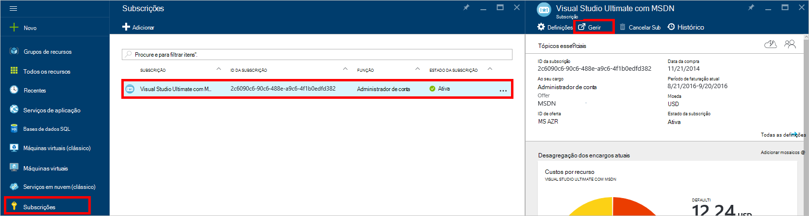
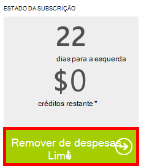

<properties
    pageTitle="Resolução de problemas no portal do DocumentDB | Microsoft Azure"
    description="Descubra para resolver problemas no portal do DocumentDB Azure." 
    services="documentdb"
    documentationCenter=""
    authors="mimig1"
    manager="jhubbard"
    editor="monicar"/>

<tags
    ms.service="documentdb"
    ms.workload="data-services"
    ms.tgt_pltfrm="na"
    ms.devlang="na"
    ms.topic="article"
    ms.date="08/29/2016"
    ms.author="mimig"/>

# Azure DocumentDB portal sugestões de resolução de problemas

Este artigo descreve como resolver problemas de DocumentDB no portal do Azure. 

## Recursos estão em falta

**Sintoma**: bases de dados ou coleções de sites em falta a partir do seu portais pás.

**Solução**: baixar a utilização da aplicação para trabalhar com na quota de débito máximo para a coleção. 

**Explicação**: O portal é uma aplicação como quaisquer outros, efetuar chamadas aos seus DocumentDB base de dados e a coleção. Se os pedidos de estão atualmente a ser limitados devido a chamadas a ser criadas a partir de uma aplicação separada, o portal pode também ser limitado, a causar recursos não seja apresentado no portal. Para resolver o problema, corrigir a causa da utilização de débito alta e, em seguida, atualize a pá portal. Informações sobre como medir e a utilização de débito inferior podem ser encontradas na secção de [débito](documentdb-performance-tips.md#throughput) do artigo [sugestões sobre o desempenho](documentdb-performance-tips.md) .
 
## Não é possível carregar páginas ou pás

**Sintoma**: páginas e pás no portal do não são apresentadas.

**Solução**: baixar a utilização da aplicação para trabalhar com na quota de débito máximo para a coleção. 

**Explicação**: O portal é uma aplicação como quaisquer outros, efetuar chamadas aos seus DocumentDB base de dados e a coleção. Se os pedidos de estão atualmente a ser limitados devido a chamadas a ser criadas a partir de uma aplicação separada, o portal pode também ser limitado, a causar recursos não seja apresentado no portal. Para resolver o problema, corrigir a causa da utilização de débito alta e, em seguida, atualize a pá portal. Informações sobre como medir e a utilização de débito inferior podem ser encontradas na secção de [débito](documentdb-performance-tips.md#throughput) do artigo [sugestões sobre o desempenho](documentdb-performance-tips.md) .

## Adicionar botão coleção está desativado

**Sintoma**: no pá da base de dados, no botão **Adicionar colecção** está desativado.

**Explicação**: se a sua subscrição do Azure está associada a benefício créditos, tais como créditos gratuitos oferecido a partir de uma subscrição do MSDN e tenha utilizado todas os créditos do mês, não conseguir criar todas as colecções adicionais no DocumentDB.

**Solução**: remover o limite de despesas da sua conta.

1. No portal do Azure, no Jumpbar, clique em **subscrições**, clique na subscrição associada a base de dados DocumentDB e, em seguida, no pá **subscrição** , clique em **Gerir**. 
    

2. Numa nova janela do browser, verá que tem sem créditos restante. Clique no botão **Remover limite de despesas** para remover as despesas para apenas o período de faturação atual ou indefinidamente. Em seguida, conclua o Assistente para adicionar ou confirme as suas informações de cartão de crédito. 
    

 
## Conclui Explorer de consulta com erros

Consulte o artigo [resolver problemas de consulta Explorer](documentdb-query-collections-query-explorer.md#troubleshoot).

## Não existem dados disponíveis no monitorização de mosaicos

Consulte o artigo [resolver problemas de monitorização de mosaicos](documentdb-monitor-accounts.md#troubleshooting).

## Não existem documentos devolvidos no Explorador de documentos

Consulte o artigo [resolução de problemas de Explorador de documentos](documentdb-view-json-document-explorer.md#troubleshoot).

## Próximos passos

Se ainda estiver a ter problemas no portal do, e-mail [askdocdb@microsoft.com](mailto:askdocdb@microsoft.com) para obter assistência ou ficheiro um pedido de suporte relativo no portal ao clicar em **Procurar**, **Ajuda + suporte**e, em seguida, clicar em **Criar pedido de suporte**.
