<properties
    pageTitle="Tutorial do BI Power DocumentDB conector de | Microsoft Azure"
    description="Utilize este tutorial de Power BI para importar JSON, criar relatórios inteligentes e visualizar dados utilizando o conector DocumentDB e o Power BI."
    keywords="Power bi tutorial, visualizar dados, conector de power bi"
    services="documentdb"
    authors="h0n"
    manager="jhubbard"
    editor="mimig"
    documentationCenter=""/>

<tags
    ms.service="documentdb"
    ms.workload="data-services"
    ms.tgt_pltfrm="na"
    ms.devlang="na"
    ms.topic="article"
    ms.date="09/22/2016"
    ms.author="hawong"/>

# Iniciação do Power BI para DocumentDB: visualizar dados utilizando o conector do Power BI

[PowerBI.com](https://powerbi.microsoft.com/) é um serviço online, onde pode criar e partilhar dashboards e relatórios com dados que são importantes para si e a sua organização.  Ambiente de trabalho do Power BI é uma dedicada ferramenta criação de relatórios que lhe permite obter dados a partir de várias origens de dados, impressão em série e transformar os dados, criar visualizações e relatórios poderosos e publicar os relatórios no Power BI.  Com a versão mais recente do Power BI Desktop, agora pode ligar à sua conta DocumentDB através do conector de DocumentDB para o Power BI.   

Neste tutorial de Power BI, iremos guiá-lo através dos passos para ligar a uma conta de DocumentDB no Power BI Desktop, navegue para uma coleção de onde queremos para extrair os dados utilizando o navegador de, transformar dados JSON num formato tabular utilizando o Editor de consultas do Power BI Desktop e criar e publicar um relatório no PowerBI.com.

Depois de concluir este tutorial de Power BI, poderá atender as seguintes questões:  

-   Como pode criar relatórios com dados a partir do DocumentDB utilizar o Power BI Desktop?
-   Como posso ligar a uma conta de DocumentDB no ambiente de trabalho do Power BI?
-   Como pode obter dados a partir de uma coleção de no ambiente de trabalho do Power BI?
-   Como transformar a aninhadas dados JSON no ambiente de trabalho do Power BI?
-   Como publicar e partilhar os meus relatórios no PowerBI.com?

## Pré-requisitos

Antes de seguir as instruções neste tutorial de Power BI, certifique-se de que tem o seguinte procedimento:

- [A versão mais recente do Power BI Desktop](https://powerbi.microsoft.com/desktop).
- Acesso a nossa demonstração conta ou os dados na sua conta Azure DocumentDB.
    - A conta de demonstração é povoada com os dados de volcano apresentados neste tutorial. Esta conta de demonstração não está vinculada por qualquer SLA e se destinar demonstração apenas para fins de.  Estamos reservar direita para que as modificações nesta conta demonstração, incluindo, mas não limitado para, terminar a conta, alteração da chave, restringir o acesso, alterar e eliminar os dados, sem antecedência ou razão em qualquer altura.
        - URL: https://analytics.documents.azure.com
        - Chave só de leitura: MSr6kt7Gn0YRQbjd6RbTnTt7VHc5ohaAFu7osF0HdyQmfR + YhwCH2D2jcczVIR1LNK3nMPNBD31losN7lQ/fkw = =
    - Em alternativa, para criar a sua própria conta, consulte o artigo [criar uma conta de base de dados de DocumentDB utilizando o portal do Azure](https://azure.microsoft.com/documentation/articles/documentdb-create-account/). Em seguida, para obter volcano exemplo dados que são semelhantes ao que são utilizados neste tutorial (mas não contém os blocos de GeoJSON), consulte o [NOAA site](https://www.ngdc.noaa.gov/nndc/struts/form?t=102557&s=5&d=5) e, em seguida, importar os dados utilizando a [ferramenta de migração do DocumentDB dados](https://azure.microsoft.com/documentation/articles/documentdb-import-data/).

Para partilhar os seus relatórios no PowerBI.com, tem de ter uma conta no PowerBI.com.  Para saber mais sobre o Power BI para gratuitos e Power BI Pro, visite [https://powerbi.microsoft.com/pricing](https://powerbi.microsoft.com/pricing).

## Vamos começar
Neste tutorial, vamos imagine que se encontra um geologist estudar comunicações em todo o mundo.  Os dados de volcano são armazenados numa conta DocumentDB e os documentos JSON procure como o apresentado abaixo.

    {
        "Volcano Name": "Rainier",
        "Country": "United States",
        "Region": "US-Washington",
        "Location": {
            "type": "Point",
            "coordinates": [
            -121.758,
            46.87
            ]
        },
        "Elevation": 4392,
        "Type": "Stratovolcano",
        "Status": "Dendrochronology",
        "Last Known Eruption": "Last known eruption from 1800-1899, inclusive"
    }

Pretende obter os dados de volcano a partir da conta DocumentDB e visualizar dados num relatório do Power BI interativos como o apresentado abaixo.

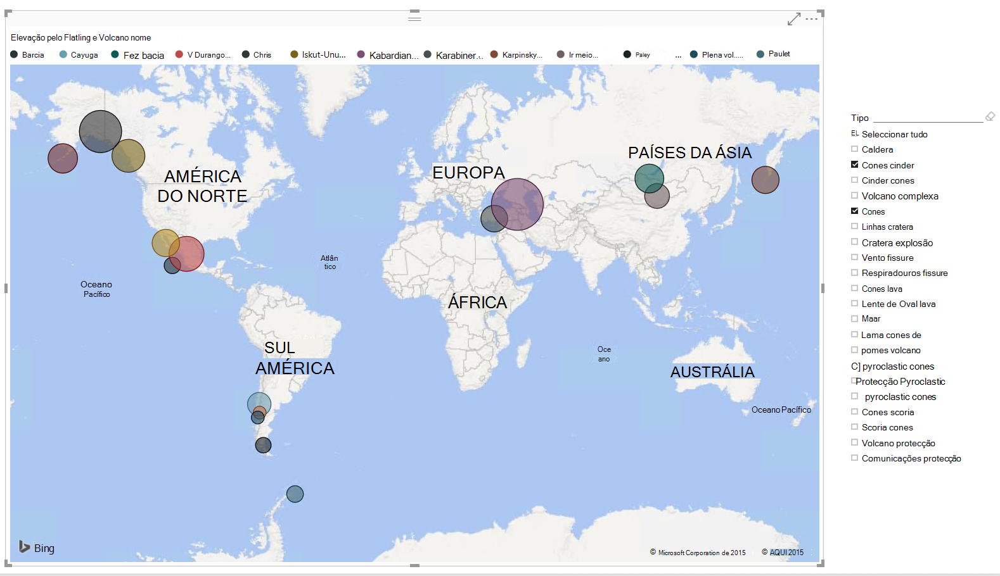

Está pronto para conferir um experimentar? Vamos começar.

1. Execute o Power BI Desktop na estação de trabalho.
2. Assim que o Power BI Desktop é iniciado, é apresentado um ecrã de *boas-vindas* .

    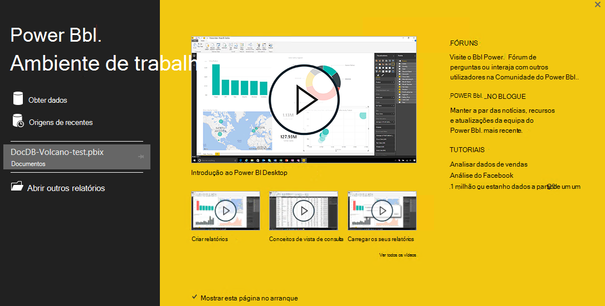

3. Pode **Obter dados**, consulte o artigo **Origens recentes**ou **Abrir outros relatórios** diretamente a partir do ecrã de *boas-vindas* .  Clique no X no canto superior direito para fechar o ecrã. A vista de **relatório** do Power BI Desktop é apresentada.

    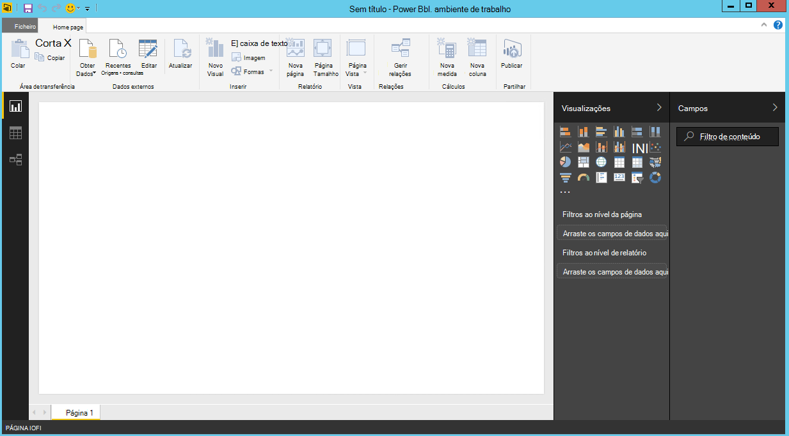

4. Selecione o friso **base** , em seguida, clique em **Obter dados**.  A janela de **Obter dados** deverá aparecer.

5. Clique no **Azure**, selecione **Microsoft Azure DocumentDB (Beta)**e, em seguida, clique em **Ligar**.  Janela do **Microsoft Azure DocumentDB ligar** deverá aparecer.

    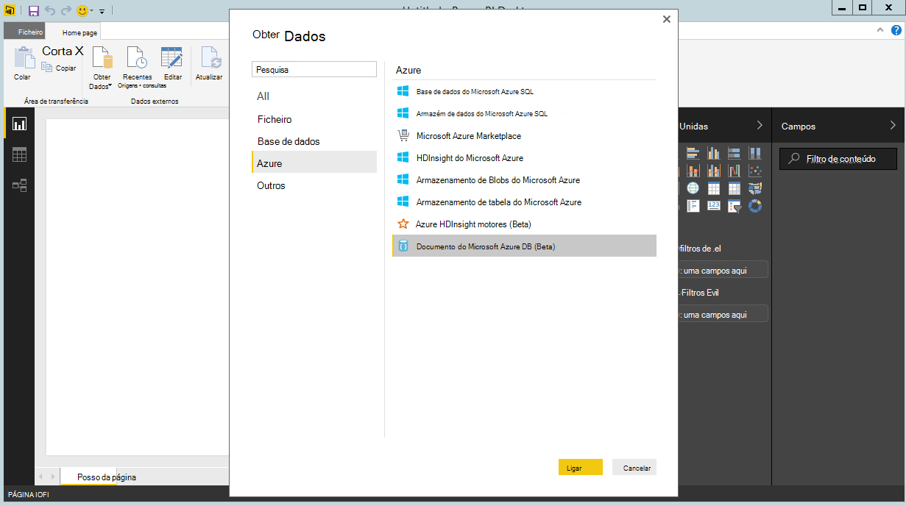

6. Especifique o URL de ponto final de conta DocumentDB que gostaria de obter os dados a partir de, conforme apresentado abaixo e, em seguida, clique em **OK**. Pode obter o URL na caixa de URI na pá a **[teclas](documentdb-manage-account.md#keys)** do Azure portal ou pode utilizar a conta de demonstração, neste caso o URL é `https://analytics.documents.azure.com`. 

    Deixe o nome da base de dados, nome da coleção e instrução SQL em branco como estes campos são opcionais.  Em vez disso, utilizamos no navegador de para selecionar a base de dados e coleções de sites para identificar onde vêm os dados.

    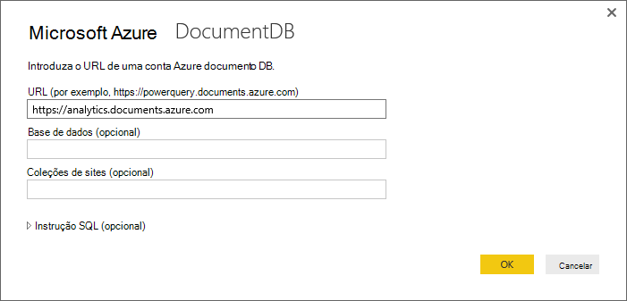

7. Se estiver a ligar a este ponto final pela primeira vez, ser-lhe-á pedido a chave de conta.  Pode obter a chave na caixa de **Chave primária** na pá a **[teclas só de leitura](documentdb-manage-account.md#keys)** do Azure portal ou pode utilizar a conta de demonstração, na qual está a chave de maiúsculas/minúsculas `RcEBrRI2xVnlWheejXncHId6QRcKdCGQSW6uSUEgroYBWVnujW3YWvgiG2ePZ0P0TppsrMgscoxsO7cf6mOpcA==`. Introduza a chave de conta e clique em **Ligar**.

    Recomendamos que utilize a tecla só de leitura durante a criação de relatórios.  Isto irá impedir exposição desnecessária da chave de modelo global para potenciais riscos de segurança. A tecla só de leitura está disponível a partir do pá [teclas](documentdb-manage-account.md#keys) do Azure portal ou pode utilizar as informações da conta demonstração fornecidas acima.

    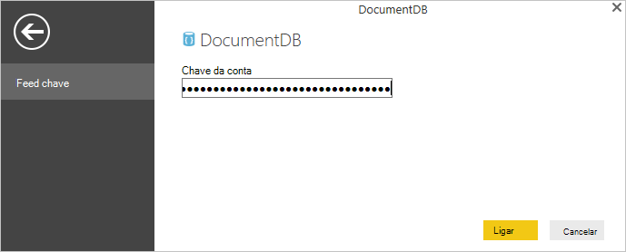

8. Quando a conta está ligada com êxito, aparecerá no **navegador** .  O **navegador** irá mostrar uma lista de bases de dados sob a conta.
9. Clique em e expanda da base de dados onde os dados para o relatório seja reencaminhado a partir de, se estiver a utilizar a conta de demonstração, selecione **volcanodb**.   

10. Agora, selecione uma coleção de que irá obter dados a partir de. Se estiver a utilizar a conta de demonstração, selecione **volcano1**.

    O painel de pré-visualização mostra uma lista de itens de **registo** .  Um documento é representado como um tipo de **registo** no Power BI. Da mesma forma, um bloco JSON aninhado dentro de um documento também é um **registo**.

    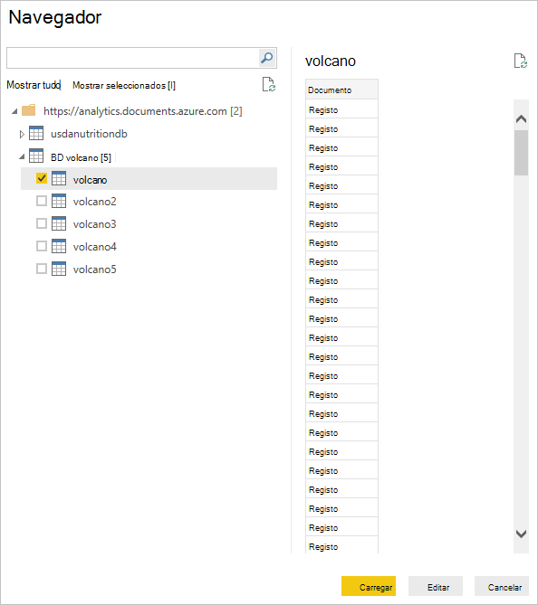

11. Clique em **Editar** para iniciar o Editor de consultas, de modo que pode transformar os dados.

## Atenuamento e transformará documentos JSON
1. No Power BI Editor de consultas, deverá ver uma coluna de **documento** no painel central.
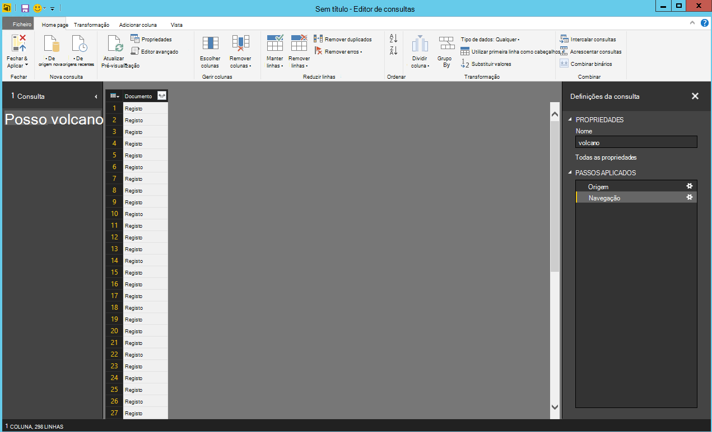

2. Clique em Expansor no lado direito do cabeçalho de coluna do **documento** .  Menu de contexto com uma lista de campos serão apresentados.  Selecione os campos que necessita para o seu relatório, por exemplo, nome Volcano, país, região, localização, elevação, tipo, estado e última interrupção saber, e, em seguida, clique em **OK**.

    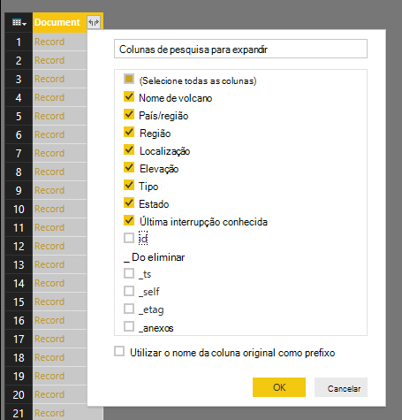

3. Painel central do será apresentada uma pré-visualização do resultado com os campos selecionados.

    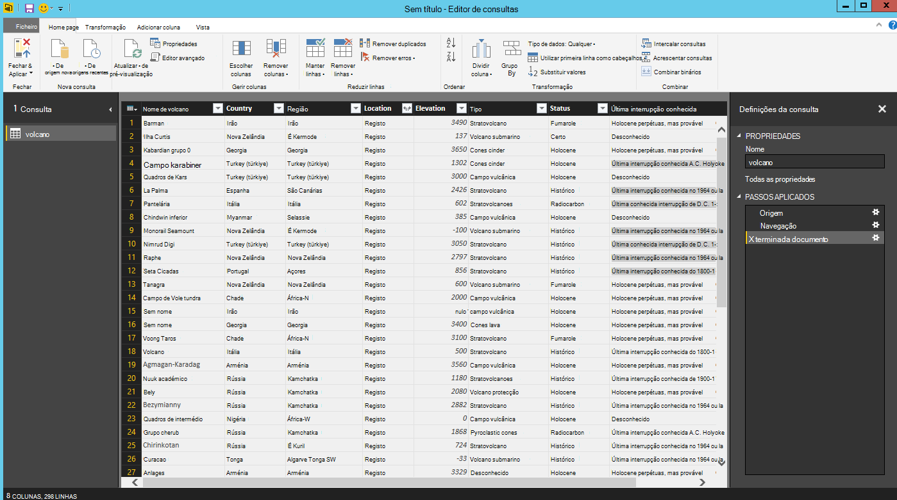

4. No nosso exemplo, a propriedade de localização é um bloco de GeoJSON num documento.  Como pode ver, localização é representada como um tipo de **registo** no ambiente de trabalho do Power BI.  
5. Clique em Expansor no lado direito do cabeçalho da coluna de localização.  Menu de contexto com campos Tipo e coordenadas irão aparecer.  Vamos, selecione o campo coordenadas e clique em **OK**.

    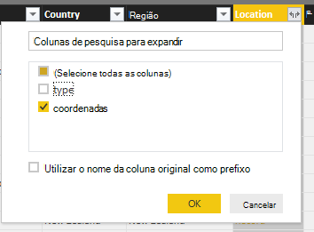

6. Painel central do agora mostra uma coluna de coordenadas de tipo de **lista** .  Como é mostrado no início do tutorial, os dados de GeoJSON neste tutorial são ponto com valores de Latitude e Longitude gravados na matriz coordenadas.

    O elemento de coordenadas [0] representa Longitude enquanto coordenadas [1] representa Latitude.
    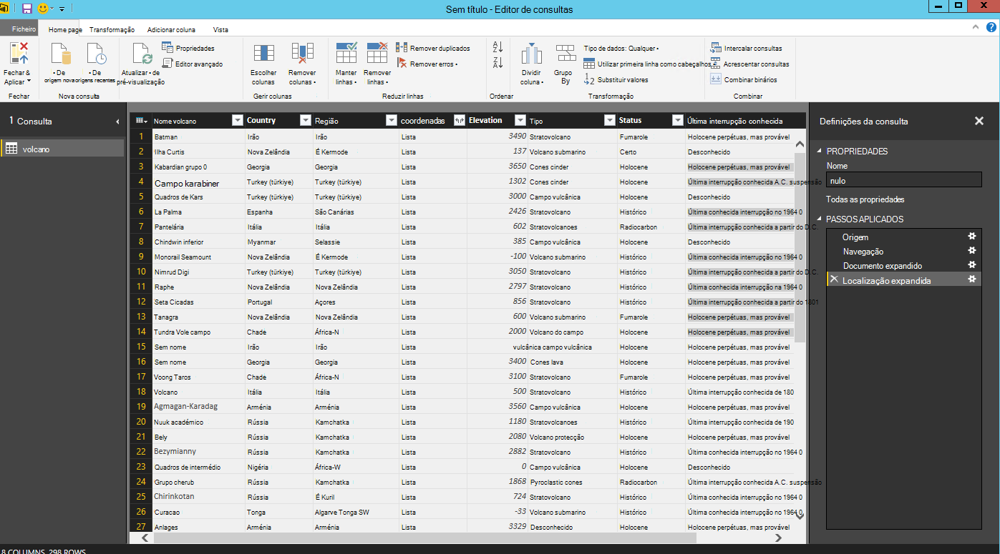

7. Para aplanar a matriz de coordenadas, criamos uma **Coluna personalizada** denominada LatLong.  Selecione o Friso de **Adicionar coluna** e clique em **Adicionar coluna personalizada**.  Deverá aparecer a janela **Adicionar coluna personalizada** .

8. Forneça um nome para a nova coluna, por exemplo, LatLong.

9. Em seguida, especifique a fórmula personalizada para a nova coluna.  Para o nosso exemplo, vamos irá concatenar os valores de Latitude e Longitude separados por vírgula, conforme apresentado abaixo utilizando a seguinte fórmula: `Text.From([Document.Location.coordinates]{1})&","&Text.From([Document.Location.coordinates]{0})`. Clique em **OK**.

    Para obter mais informações sobre expressões DAX (Data Analysis) incluindo funções do DAX, visite [Básicas de DAX no Power BI Desktop](https://support.powerbi.com/knowledgebase/articles/554619-dax-basics-in-power-bi-desktop).

    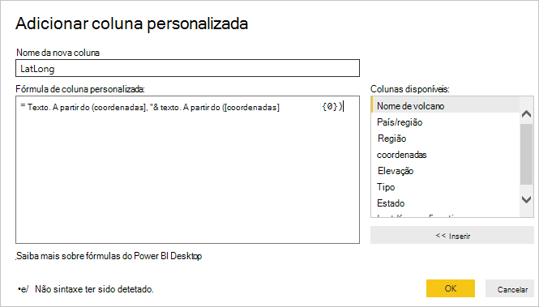

10. Agora, o painel central do irá apresentar a nova coluna LatLong povoada com os valores de Latitude e Longitude separados por vírgula.

    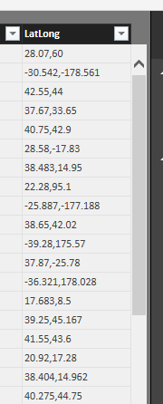

    Se receber um erro na nova coluna, certifique-se de que os passos em definições de consulta aplicados correspondem na figura seguinte:

    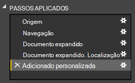

    Se os passos são diferentes, elimine os passos adicionais e tente novamente a adicionar a coluna personalizada. 

11. Agora tiver concluído a atenuamento os dados no formato tabular.  Pode tirar partido de todas as funcionalidades disponíveis no Editor de consultas a forma e transformar os dados no DocumentDB.  Se estiver a utilizar o exemplo, altere o tipo de dados para a elevação de **número inteiro** ao alterar o **Tipo de dados** no friso **base** .

    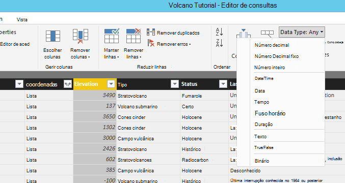

12. Clique em **Fechar e aplicar** para guardar o modelo de dados.

    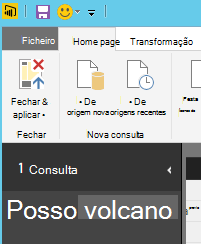

## Criar os relatórios
Vista do Power BI Desktop relatório é onde pode começar a criar relatórios para visualização desses dados.  Pode criar relatórios ao arrastar e largar campos para a tela de **relatório** .

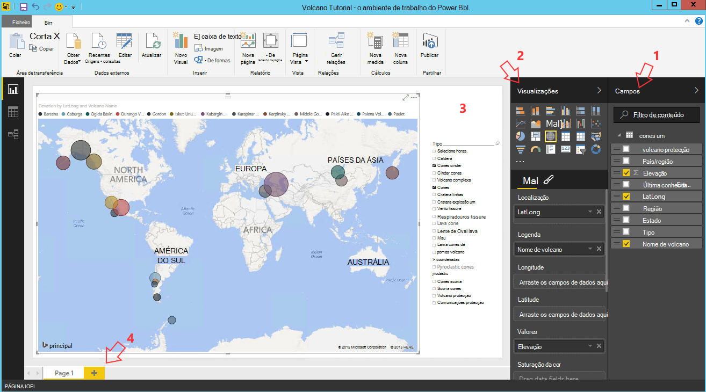

Na vista de relatório, deverá encontrar:

 1. Painel **campos** , é onde irá ver uma lista de modelos de dados com os campos que pode utilizar para os relatórios.

 2. O painel de **visualizações** . Um relatório pode conter um único ou várias visualizações.  Escolha os tipos de visuais ajustar às suas necessidades a partir do painel de **visualizações** .

 3. Tela de **relatório** , esta é onde irá criar os efeitos visuais para o seu relatório.

 4. A página do **relatório** . Pode adicionar várias páginas do relatório no ambiente de trabalho do Power BI.

A imagem seguinte mostra os passos básicos da criação de um relatório simples de vista de mapa interativo.

1. Para o nosso exemplo, criamos uma vista de mapa que mostra a localização de cada volcano.  No painel de **visualizações** , clique no tipo mapa de visual conforme realçado na captura de ecrã acima.  Deverá ver visual tipo de mapa de desenhado na tela **relatório** .  O painel de **visualização** também deve mostrar um conjunto de propriedades relacionadas com o tipo de visual mapa.

2. Agora, arraste e largue o campo LatLong a partir do painel de **campos** para a propriedade da **localização** no painel de **visualizações** .
3. Em seguida, arraste e largue o campo Volcano nome para a propriedade **legenda** .  

4. Em seguida, arraste e largue o campo elevação para a propriedade **tamanho** .  

5. Deverá agora visualizar o mapa que mostra um conjunto de bolhas que indica a localização de cada volcano com o tamanho da bolha correlacionar para a elevação do volcano visual.

6. Agora ter criado um relatório básico.  Pode continuar a personalizar o relatório ao adicionar mais visualizações.  No nosso caso, adicionámos uma segmentação de dados do tipo de Volcano para tornar o relatório interativos.  

    

## Publicar e partilhar o seu relatório
Para partilhar o seu relatório, tem de ter uma conta no PowerBI.com.

1. No Power BI Desktop, clique no friso **base** .
2. Clique em **Publicar**.  Vai ser-lhe para introduzir o nome de utilizador e palavra-passe para a sua conta PowerBI.com.
3. Assim que a credencial ter sido autenticada, o relatório é publicado ao seu destino que selecionou.
4. Clique em **Abrir 'PowerBITutorial.pbix' no Power BI** para ver e partilhar o seu relatório em PowerBI.com.

    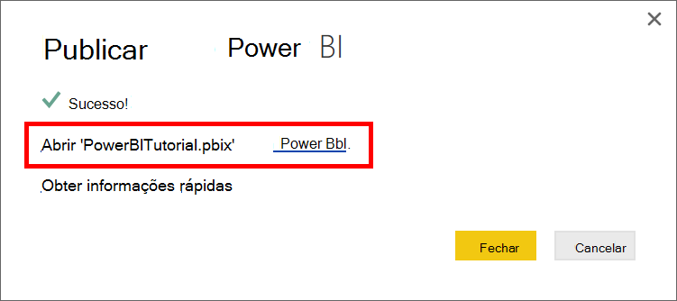

## Criar um dashboard no PowerBI.com

Agora que tem um relatório, permite partilhar no PowerBI.com

Quando publicar o seu relatório a partir do Power BI Desktop para PowerBI.com, gera um **relatório** e um **conjunto de dados** no seu inquilino PowerBI.com. Por exemplo, depois de publicado um relatório denominado **PowerBITutorial** para PowerBI.com, verá PowerBITutorial nas secções os **relatórios** e de **conjuntos de dados** no PowerBI.com.

   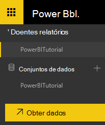

Para criar um dashboard de partilha, clique no botão **Afixar Live página** no seu relatório PowerBI.com.

   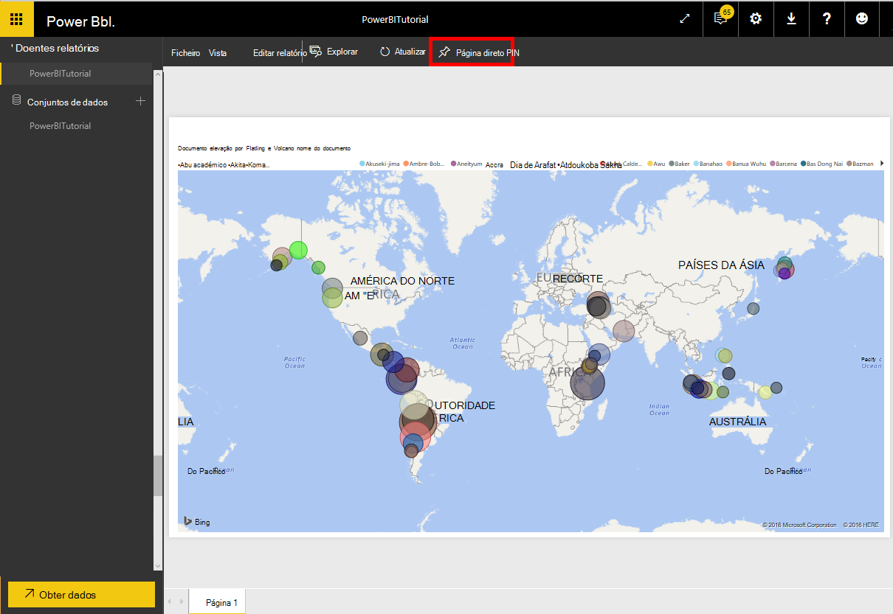

Em seguida, siga as instruções em [Afixar um mosaico de um relatório](https://powerbi.microsoft.com/documentation/powerbi-service-pin-a-tile-to-a-dashboard-from-a-report/#pin-a-tile-from-a-report) para criar um novo dashboard. 

Também pode fazer modificações ad hoc ao relatório antes de criar um dashboard. No entanto, recomendamos que utilize o Power BI Desktop para executar as modificações e voltar a publicar o relatório para PowerBI.com.

## Atualizar dados no PowerBI.com

Existem duas formas para atualizar os dados, ad hoc e agendados.

Para uma atualização de ad hoc, clique nos eclipses (…) ao **conjunto de dados**, por exemplo, PowerBITutorial. Deverá ver uma lista de ações, incluindo **Atualizar agora**. Clique em **Atualizar agora** para atualizar os dados.

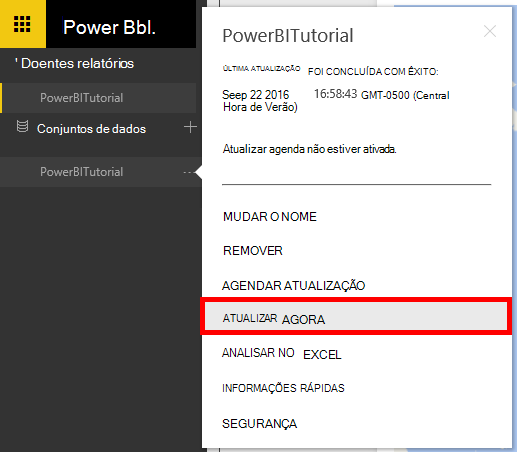

Para uma atualização agendada, faça o seguinte.

1. Clique em **Agendar Atualização** na lista de ação. 
    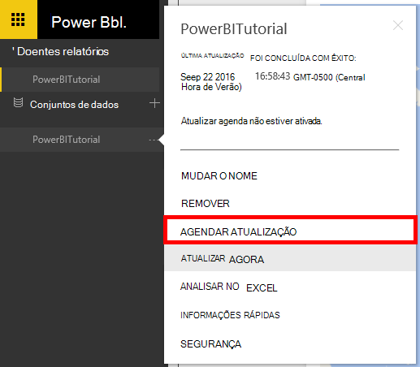

2. Na página **Definições** , expanda **as credenciais da origem de dados**. 

3. Clique em **Editar credenciais**. 

    É apresentada a janela de popup configurar. 

4. Introduza a chave para ligar à conta DocumentDB para esse conjunto de dados e, em seguida, clique em **Iniciar sessão**. 

5. Expanda a **Agendar Atualização** e configurar a agenda que pretende atualizar o conjunto de dados. 
  
6. Clique em **Aplicar** e tiver terminado a configurar a atualização agendada.

## Próximos passos
- Para saber mais sobre o Power BI, consulte o artigo [Introdução ao Power BI](https://powerbi.microsoft.com/documentation/powerbi-service-get-started/).
- Para saber mais sobre DocumentDB, consulte a [documentação DocumentDB página de destino](https://azure.microsoft.com/documentation/services/documentdb/).
