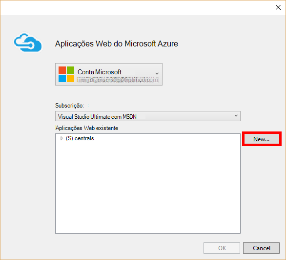

<properties
    pageTitle="Balão de Python Web desenvolvimento de aplicações com DocumentDB | Microsoft Azure"
    description="Rever um tutorial de base de dados sobre como utilizar DocumentDB para armazenar e aceder aos dados a partir de uma aplicação de web Python balão alojada no Azure. Encontre soluções de desenvolvimento de aplicações." 
    keywords="Desenvolvimento de aplicações, tutorial de base de dados, balão python, aplicação web da python, desenvolvimento de python da web, documentdb, azure, Microsoft azure"
    services="documentdb"
    documentationCenter="python"
    authors="syamkmsft"
    manager="jhubbard"
    editor="cgronlun"/>

<tags
    ms.service="documentdb"
    ms.workload="data-management"
    ms.tgt_pltfrm="na"
    ms.devlang="python"
    ms.topic="hero-article"
    ms.date="08/25/2016"
    ms.author="syamk"/>

# <a name="python-flask-web-application-development-with-documentdb"></a>Balão de Python Web desenvolvimento de aplicações com DocumentDB

> [AZURE.SELECTOR]
- [.NET](documentdb-dotnet-application.md)
- [NODE.js](documentdb-nodejs-application.md)
- [Java](documentdb-java-application.md)
- [Python](documentdb-python-application.md)

Este tutorial mostra-lhe como utilizar o Azure DocumentDB para armazenar e dados do access a partir de um Python aplicação alojada no Azure web e pressupõe que tem alguma experiência prévia utilizando Python e Web sites Azure.

Neste tutorial de base de dados abrange:

1. Criar e uma conta de DocumentDB de aprovisionamento.
2. Criar uma aplicação Python MVC.
3. Ligar a e utilizar Azure DocumentDB a partir da sua aplicação web.
4. Implementar a aplicação web sites públicos do Azure.

Ao seguir este tutorial, irá criar uma aplicação de voto simple que permite-lhe votar para um inquérito.


## <a name="database-tutorial-prerequisites"></a>Pré-requisitos tutoriais de base de dados

Antes de seguir as instruções neste artigo, deverá Certifique-se de que tem os seguintes componentes instalados:

- Uma conta do Azure active. Se não tiver uma conta, pode criar uma conta de avaliação gratuita apenas de duas minutos. Para obter detalhes, consulte o artigo [Versão de avaliação gratuita do Azure](https://azure.microsoft.com/pricing/free-trial/).
- [Visual Studio 2013](http://www.visualstudio.com/) ou superior, ou [Visual Studio Express](), que é a versão gratuita. As instruções neste tutorial são escritas especificamente para Visual Studio 2015. 
- Ferramentas de Python para Visual Studio a partir do [GitHub](http://microsoft.github.io/PTVS/). Neste tutorial utiliza Python ferramentas de VS 2015. 
- Azure Python SDK para Visual Studio, versão 2,4 ou superior disponível a partir do [azure.com](https://azure.microsoft.com/downloads/). Microsoft Azure SDK é utilizada para Python 2.7.
- Python 2.7 a partir do [python.org][2]. Utilizámos Python 2.7.11. 

> [AZURE.IMPORTANT] Se estiver a instalar Python 2.7 pela primeira vez, certifique-se de que no ecrã de personalizar Python 2.7.11, seleciona **Adicionar python.exe ao caminho**.
> 
>    

- Microsoft Visual C++ compilador para Python 2.7 a partir do [Centro de transferências da Microsoft][3].

## <a name="step-1-create-a-documentdb-database-account"></a>Passo 1: Criar uma conta de base de dados DocumentDB

Vamos começar por criar uma conta de DocumentDB. Se já tiver uma conta, pode avançar para [passo 2: criar uma nova aplicação web do balão de Python](#step-2:-create-a-new-python-flask-web-application).

[AZURE.INCLUDE [documentdb-create-dbaccount](../../includes/documentdb-create-dbaccount.md)]

<br/>
Vamos agora irá percorrer como criar uma nova aplicação de web Python balão do terreno para cima.

## <a name="step-2-create-a-new-python-flask-web-application"></a>Passo 2: Criar uma nova aplicação web do balão de Python

1. No Visual Studio, no menu **ficheiro** , aponte para **Novo**e, em seguida, clique em **projeto**.

    É apresentada a caixa de diálogo **Novo projeto** .

2. No painel esquerdo, expanda **modelos** e, em seguida, **Python**e, em seguida, clique em **Web**. 

3. Selecione o **Balão de projecto da Web** no painel centro, em seguida, na caixa tipo **tutorial**o **nome** e, em seguida, clique em **OK**. Lembre-se de que os nomes de pacote Python devem ser todas minúsculos, conforme descrito no [Guia de estilo para o código de Python](https://www.python.org/dev/peps/pep-0008/#package-and-module-names).

    Para os novos para Python balão, é um quadro de desenvolvimento de aplicação web que o ajuda a criar aplicações web no Python mais rápido.

    

4. Na janela do **Python ferramentas para o Visual Studio** , clique em **instalar para um ambiente virtual**. 

    

5. Na janela **Adicionar ambiente Virtual** , pode aceite as predefinições e utilizar Python 2.7 como o ambiente base porque PyDocumentDB não suporta atualmente Python 3. x e, em seguida, clique em **Criar**. Isto configura o ambiente virtual Python necessário para o seu projeto.

    

    Na janela de saída apresenta `Successfully installed Flask-0.10.1 Jinja2-2.8 MarkupSafe-0.23 Werkzeug-0.11.5 itsdangerous-0.24 'requirements.txt' was installed successfully.` quando o ambiente é instalado com êxito.

## <a name="step-3-modify-the-python-flask-web-application"></a>Passo 3: Modificar a aplicação web do balão de Python

### <a name="add-the-python-flask-packages-to-your-project"></a>Adicionar os pacotes de balão Python ao seu projeto

Depois do seu projeto está configurado, terá de adicionar os pacotes de balão necessários ao seu projeto, incluindo pydocumentdb, o pacote de Python DocumentDB.

1. No Explorador de solução, abra o ficheiro denominado **requirements.txt** e substituir o conteúdo com o seguinte:

        flask==0.9
        flask-mail==0.7.6
        sqlalchemy==0.7.9
        flask-sqlalchemy==0.16
        sqlalchemy-migrate==0.7.2
        flask-whooshalchemy==0.55a
        flask-wtf==0.8.4
        pytz==2013b
        flask-babel==0.8
        flup
        pydocumentdb>=1.0.0

2. Guarde o ficheiro **requirements.txt** . 
3. No Explorador de solução, com o botão direito **Envelope** e clique em **instalar a partir de requirements.txt**.

    

    Após a instalação bem sucedida, na janela de saída apresenta o seguinte:

        Successfully installed Babel-2.3.2 Tempita-0.5.2 WTForms-2.1 Whoosh-2.7.4 blinker-1.4 decorator-4.0.9 flask-0.9 flask-babel-0.8 flask-mail-0.7.6 flask-sqlalchemy-0.16 flask-whooshalchemy-0.55a0 flask-wtf-0.8.4 flup-1.0.2 pydocumentdb-1.6.1 pytz-2013b0 speaklater-1.3 sqlalchemy-0.7.9 sqlalchemy-migrate-0.7.2

    > [AZURE.NOTE] Em casos raros, poderá ver uma falha na janela de saída. Se isto acontece, verifique se o erro relacionado com limpeza. Por vezes, a limpeza do falha, mas a instalação continuarão bem sucedido (deslocamento para cima na janela de saída para verificar isto). Pode verificar a instalação, [verificando o ambiente virtual](#verify-the-virtual-environment). Se a instalação falhou, mas a verificação é efetuada com êxito, é para continuar.

### <a name="verify-the-virtual-environment"></a>Verifique se o ambiente virtual

Vamos Certifique-se de que tudo está corretamente instalado.

1. Criar a solução, premindo **Ctrl**+**Shift**+**B**.
2. Depois da compilação ser bem sucedida, começar o Web site premindo a tecla **F5**. Isto inicia o servidor de desenvolvimento do balão e inicia o seu browser. Deverá ver a página seguinte.

    

3. Parar de depuração o Web site ao premir **Shift**+**F5** no Visual Studio.

### <a name="create-database-collection-and-document-definitions"></a>Criar base de dados, recolha e definições de documento

Agora vamos criar uma aplicação de voto ao adicionar novos ficheiros e atualizar as outras pessoas.

1. No Explorador de solução, com o botão direito do projeto de **Iniciação** , clique em **Adicionar**e, em seguida, clique em **Novo Item**. Selecione o **Ficheiro Python vazio** e atribua um nome de ficheiro **forms.py**.  
2. Adicione o seguinte código para o ficheiro forms.py e, em seguida, guarde o ficheiro.

```python
from flask.ext.wtf import Form
from wtforms import RadioField

class VoteForm(Form):
    deploy_preference  = RadioField('Deployment Preference', choices=[
        ('Web Site', 'Web Site'),
        ('Cloud Service', 'Cloud Service'),
        ('Virtual Machine', 'Virtual Machine')], default='Web Site')
```


### <a name="add-the-required-imports-to-viewspy"></a>Adicionar importações necessárias para views.py

1. No Explorador de solução, expanda a pasta **tutorial** e abra o ficheiro **views.py** . 
2. Adicione o seguinte procedimento importar declarações para a parte superior do ficheiro **views.py** , em seguida, guarde o ficheiro. Estes importar PythonSDK do DocumentDB e os pacotes de balão.

    ```python
    from forms import VoteForm
    import config
    import pydocumentdb.document_client as document_client
    ```


### <a name="create-database-collection-and-document"></a>Criar a base de dados, coleções de sites e documentos

- Ainda no **views.py**, adicione o seguinte código para o fim do ficheiro. Isto leva-o até o cuidado de criação de base de dados utilizada pelo formulário. Não elimine qualquer um do código existente na **views.py**. Acrescente simplesmente isto para o fim.

```python
@app.route('/create')
def create():
    """Renders the contact page."""
    client = document_client.DocumentClient(config.DOCUMENTDB_HOST, {'masterKey': config.DOCUMENTDB_KEY})

    # Attempt to delete the database.  This allows this to be used to recreate as well as create
    try:
        db = next((data for data in client.ReadDatabases() if data['id'] == config.DOCUMENTDB_DATABASE))
        client.DeleteDatabase(db['_self'])
    except:
        pass

    # Create database
    db = client.CreateDatabase({ 'id': config.DOCUMENTDB_DATABASE })

    # Create collection
    collection = client.CreateCollection(db['_self'],{ 'id': config.DOCUMENTDB_COLLECTION })

    # Create document
    document = client.CreateDocument(collection['_self'],
        { 'id': config.DOCUMENTDB_DOCUMENT,
          'Web Site': 0,
          'Cloud Service': 0,
          'Virtual Machine': 0,
          'name': config.DOCUMENTDB_DOCUMENT 
        })

    return render_template(
       'create.html',
        title='Create Page',
        year=datetime.now().year,
        message='You just created a new database, collection, and document.  Your old votes have been deleted')
```

> [AZURE.TIP] O método de **CreateCollection** leva-o até uma opcional **RequestOptions** como o terceiro parâmetro. Isto pode ser utilizado para especificar o tipo de oferta para a coleção. Se não for fornecido nenhum valor offerType, em seguida, a coleção de será criada utilizando o tipo de oferta predefinido. Para mais informações sobre tipos de oferecer DocumentDB, consulte o artigo [níveis de desempenho no DocumentDB](documentdb-performance-levels.md).


### <a name="read-database-collection-document-and-submit-form"></a>Ler a base de dados, coleções de sites, documento e submeter o formulário

- Ainda no **views.py**, adicione o seguinte código para o fim do ficheiro. Isto leva-o até o cuidado de configurar o formulário, a base de dados, coleções de sites e documentos de leitura. Não elimine qualquer um do código existente na **views.py**. Acrescente simplesmente isto para o fim.

```python
@app.route('/vote', methods=['GET', 'POST'])
def vote(): 
    form = VoteForm()
    replaced_document ={}
    if form.validate_on_submit(): # is user submitted vote  
        client = document_client.DocumentClient(config.DOCUMENTDB_HOST, {'masterKey': config.DOCUMENTDB_KEY})

        # Read databases and take first since id should not be duplicated.
        db = next((data for data in client.ReadDatabases() if data['id'] == config.DOCUMENTDB_DATABASE))

        # Read collections and take first since id should not be duplicated.
        coll = next((coll for coll in client.ReadCollections(db['_self']) if coll['id'] == config.DOCUMENTDB_COLLECTION))

        # Read documents and take first since id should not be duplicated.
        doc = next((doc for doc in client.ReadDocuments(coll['_self']) if doc['id'] == config.DOCUMENTDB_DOCUMENT))

        # Take the data from the deploy_preference and increment our database
        doc[form.deploy_preference.data] = doc[form.deploy_preference.data] + 1
        replaced_document = client.ReplaceDocument(doc['_self'], doc)

        # Create a model to pass to results.html
        class VoteObject:
            choices = dict()
            total_votes = 0

        vote_object = VoteObject()
        vote_object.choices = {
            "Web Site" : doc['Web Site'],
            "Cloud Service" : doc['Cloud Service'],
            "Virtual Machine" : doc['Virtual Machine']
        }
        vote_object.total_votes = sum(vote_object.choices.values())

        return render_template(
            'results.html', 
            year=datetime.now().year, 
            vote_object = vote_object)

    else :
        return render_template(
            'vote.html', 
            title = 'Vote',
            year=datetime.now().year,
            form = form)
```


### <a name="create-the-html-files"></a>Criar os ficheiros HTML

1. No Explorador de solução, na pasta do **tutorial** , clique com o botão direito na pasta **modelos** , clique em **Adicionar**e, em seguida, clique em **Novo Item**. 
2. Selecione **Página HTML**e, em seguida, na caixa Nome, escreva **create.html**. 
3. Repita os passos 1 e 2 para criar duas ficheiros HTML adicionais: results.html e vote.html.
4. Adicione o seguinte código para **create.html** na `<body>` elemento. Apresenta uma mensagem a informar que criámos uma nova base de dados, coleções de sites e documentos.

    ```html
    
    
    <h2>{{ title }}.</h2>
    <h3>{{ message }}</h3>
    <p><a href="{{ url_for('vote') }}" class="btn btn-primary btn-large">Vote &raquo;</a></p>
    
    ```

5. Adicione o seguinte código para **results.html** na `<body`> elemento. Apresenta os resultados do inquérito.

    ```html
    
    
    <h2>Results of the vote</h2>
        <br />
        
    
    <div class="row">
        <div class="col-sm-5">{{choice}}</div>
            <div class="col-sm-5">
                <div class="progress">
                    <div class="progress-bar" role="progressbar" aria-valuenow="{{vote_object.choices[choice]}}" aria-valuemin="0" aria-valuemax="{{vote_object.total_votes}}" style="width: {{(vote_object.choices[choice]/vote_object.total_votes)*100}}%;">
                                {{vote_object.choices[choice]}}
                </div>
            </div>
            </div>
    </div>
    
    
    <br />
    <a class="btn btn-primary" href="{{ url_for('vote') }}">Vote again?</a>
    
    ```

6. Adicione o seguinte código para **vote.html** na `<body`> elemento. Apresenta o inquérito e aceita votos. Sobre como registar votos, o controlo lhe é transmitido views.py onde iremos reconhecer o cast de voto e acrescentar o documento em conformidade.

    ```html
    
    
    <h2>What is your favorite way to host an application on Azure?</h2>
    <form action="" method="post" name="vote">
        {{form.hidden_tag()}}
            {{form.deploy_preference}}
            <button class="btn btn-primary" type="submit">Vote</button>
    </form>
    
    ```

7. Na pasta **modelos** , substitua os conteúdos de **Index** com o seguinte. Isto funciona como a página de destino para a sua aplicação.
    
    ```html
    
    
    <h2>Python + DocumentDB Voting Application.</h2>
    <h3>This is a sample DocumentDB voting application using PyDocumentDB</h3>
    <p><a href="{{ url_for('create') }}" class="btn btn-primary btn-large">Create/Clear the Voting Database &raquo;</a></p>
    <p><a href="{{ url_for('vote') }}" class="btn btn-primary btn-large">Vote &raquo;</a></p>
    
    ```

### <a name="add-a-configuration-file-and-change-the-initpy"></a>Adicionar um ficheiro de configuração e alterar o \_ \_inicialização\_\_.py

1. No Explorador de solução, com o botão direito do projeto de **Iniciação** , clique em **Adicionar**, clique em **Novo Item**, selecione **Esvaziar Python ficheiro**e, em seguida, atribua um nome de ficheiro **config.py**. Este ficheiro de configuração é necessário pelos formulários no balão. Pode utilizá-lo para fornecer uma chave de secreta. Esta chave não é necessária para este tutorial embora.

2. Adicionar o código seguinte config.py, vai precisar de alterar os valores de **DOCUMENTDB\_anfitrião** e **DOCUMENTDB\_chave** no próximo passo.

    ```python
    CSRF_ENABLED = True
    SECRET_KEY = 'you-will-never-guess'
    
    DOCUMENTDB_HOST = 'https://YOUR_DOCUMENTDB_NAME.documents.azure.com:443/'
    DOCUMENTDB_KEY = 'YOUR_SECRET_KEY_ENDING_IN_=='
    
    DOCUMENTDB_DATABASE = 'voting database'
    DOCUMENTDB_COLLECTION = 'voting collection'
    DOCUMENTDB_DOCUMENT = 'voting document'
    ```

3. No [portal do Azure](https://portal.azure.com/), navegue para a pá de **teclas de** ao clicar em **Procurar**, **DocumentDB contas**, faça duplo clique no nome da conta a utilizar e, em seguida, clique no botão de **teclas** na área **Essentials** . Na pá **chaves** , copie o valor **URI** e colá-la ficheiro **config.py** , como o valor para o **DOCUMENTDB\_anfitrião** propriedade. 
4. Novamente no portal do Azure, no pá **chaves** , copie o valor de **Chave secundária**ou a **Chave primária** e colá-la ficheiro **config.py** , como o valor para o **DOCUMENTDB\_chave** propriedade.
5. No ** \_ \_inicialização\_\_.py** de ficheiros, adicione a linha seguinte. 

        app.config.from_object('config')

    Para que seja o conteúdo do ficheiro:

    ```python
    from flask import Flask
    app = Flask(__name__)
    app.config.from_object('config')
    import tutorial.views
    ```

6. Depois de adicionar todos os ficheiros, solução Explorer deverá ter o aspeto da seguinte forma:

    


## <a name="step-4-run-your-web-application-locally"></a>Passo 4: Executar a aplicação web localmente

1. Criar a solução, premindo **Ctrl**+**Shift**+**B**.
2. Depois da compilação ser bem sucedida, começar o Web site premindo a tecla **F5**. Deverá ver a seguinte no seu ecrã.

    

3. Clique em **Criar/desmarcar a base de dados de voto** para gerar a base de dados.

    

4. Em seguida, clique em **voto** e selecione a sua opção.

    

5. Para cada votação que haver, é incrementado o contador adequado.

    

6. Pare de depuração de projeto ao premir Shift + F5.

## <a name="step-5-deploy-the-web-application-to-azure-websites"></a>Passo 5: Implementar a aplicação web sites públicos do Azure

Agora que tem a aplicação completa a funcionar corretamente contra DocumentDB, iremos implementar isto para sites públicos do Azure.

1. Com o botão direito do projecto no Explorador de soluções (Certifique-se de que não estiver continua a ser executado-localmente) e selecione **Publicar**.  

    

2. Na janela de **Publicar Web** , selecione **Aplicações Web do Microsoft Azure**e, em seguida, clique em **seguinte**.

    

3. Na janela da **Janela de aplicações Web do Microsoft Azure** , clique em **Novo**.

    

4. Na janela **Criar site no Microsoft Azure** , introduza um **nome da aplicação Web**, **plano de serviço de aplicação**, **grupo de recursos**e **região**, em seguida, clique em **Criar**.

    

5. Na janela de **Publicar Web** , clique em **Publicar**.

    

3. Em alguns segundos, Visual Studio irá concluir a publicação a aplicação web e iniciação num browser, onde pode ver o seu trabalho útil em execução no Azure!

## <a name="troubleshooting"></a>Resolução de problemas

Se esta é a aplicação Python primeira que tiver executado no seu computador, certifique-se de que as seguintes pastas (ou as localizações de instalação equivalente) são incluídas na variável de PATH:

    C:\Python27\site-packages;C:\Python27\;C:\Python27\Scripts;

Se receber um erro na sua página de voto e denominada projeto algo que não **tutorial**, certifique-se de que ** \_ \_inicialização\_\_.py** referencia o nome do projeto correto na linha: `import tutorial.view`.

## <a name="next-steps"></a>Próximos passos

Parabéns! Tem apenas concluída a sua primeira Python aplicação web Azure DocumentDB e publicado-lo para sites públicos do Azure.

Vamos atualizar e melhorar o neste tópico frequentemente com base nos seus comentários.  Uma vez que concluiu o tutorial, consulte utilizar os botões de voto na parte superior e inferior desta página e, certifique-se de que incluir os seus comentários sobre o que efetuados melhoramentos que pretende ver. Se gostaria-nos para contactá-lo diretamente, esteja à vontade incluir o seu endereço de e-mail nos seus comentários.

Para adicionar funcionalidades adicionais a sua aplicação web, reveja as APIs disponíveis no [DocumentDB Python SDK](documentdb-sdk-python.md).

Para mais informações sobre Azure, Visual Studio e Python, consulte o [Centro de programadores do Python](https://azure.microsoft.com/develop/python/). 

Para a tutoriais Python balão adicionais, consulte o artigo [o balão Mega-Tutorial, parte i: Olá, mundo!](http://blog.miguelgrinberg.com/post/the-flask-mega-tutorial-part-i-hello-world). 

  [Visual Studio Express]: http://www.visualstudio.com/products/visual-studio-express-vs.aspx
  [2]: https://www.python.org/downloads/windows/
  [3]: https://www.microsoft.com/download/details.aspx?id=44266
  [Microsoft Web Platform Installer]: http://www.microsoft.com/web/downloads/platform.aspx
  [Azure portal]: http://portal.azure.com
