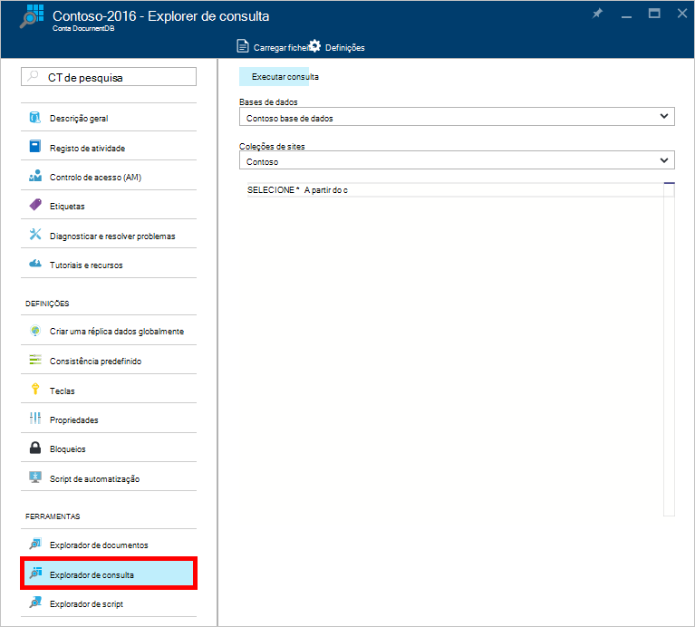
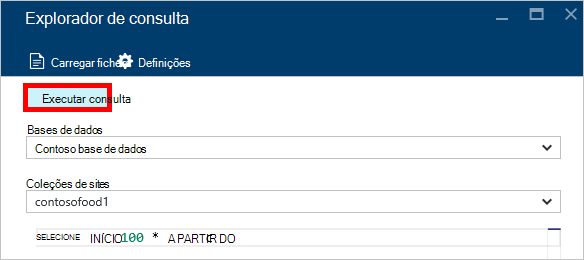
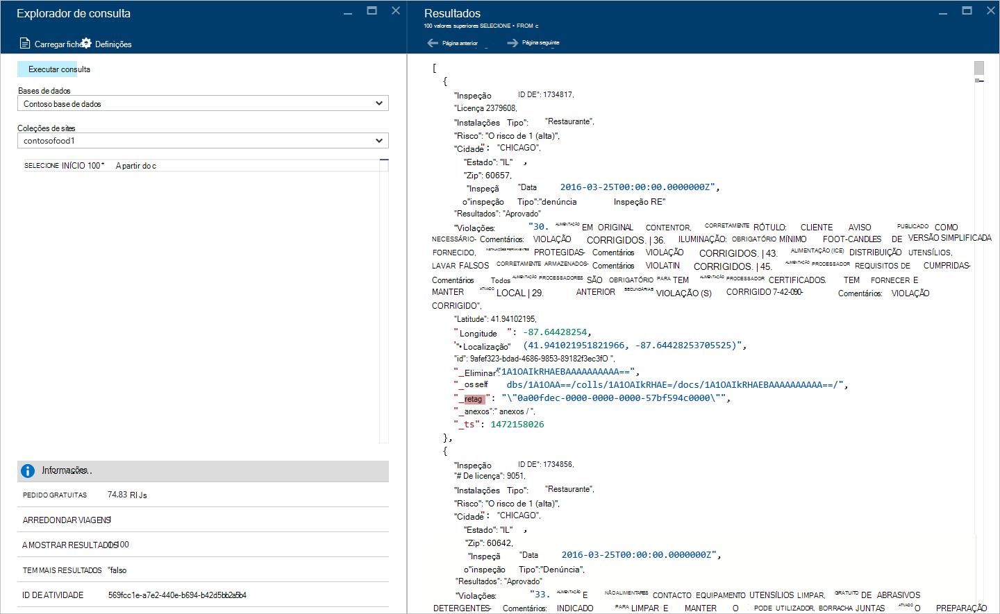
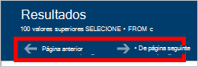
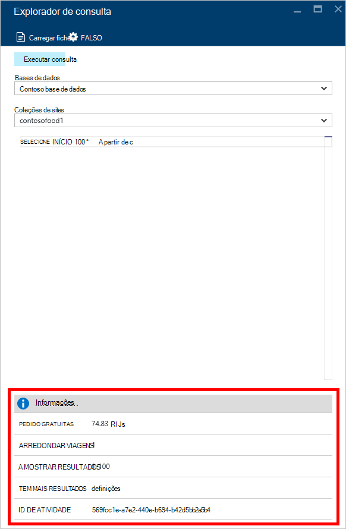
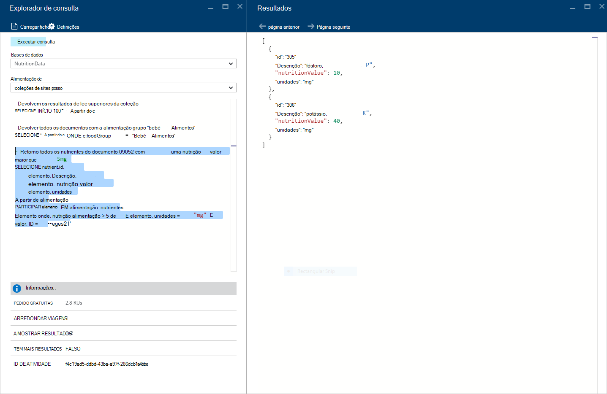
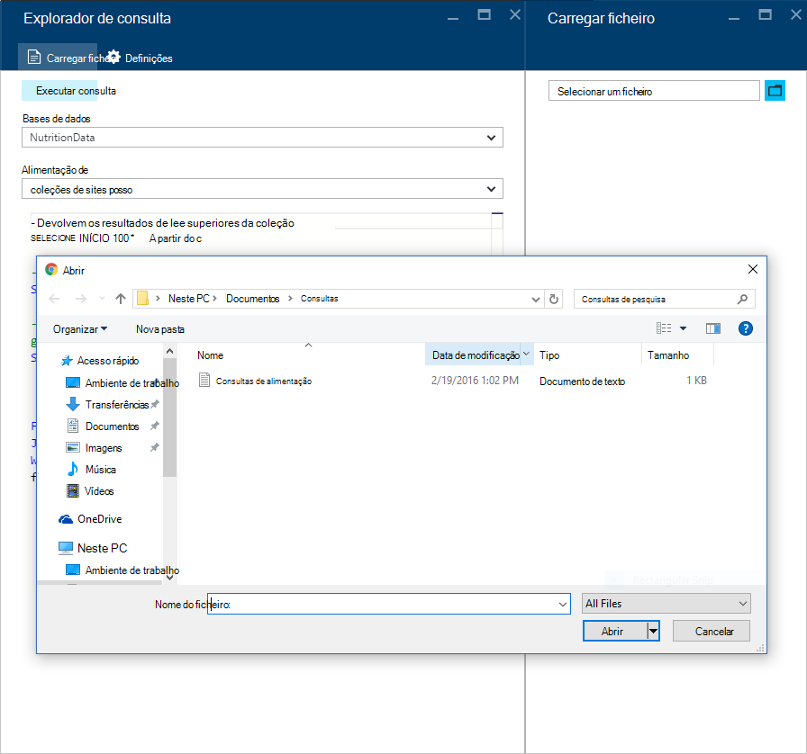
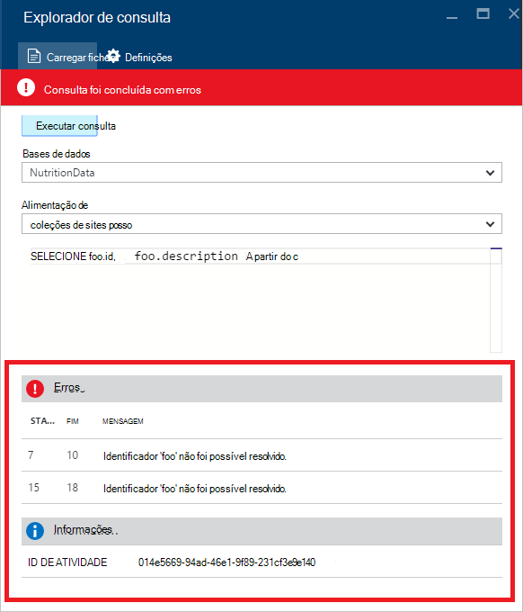

<properties
    pageTitle="Consulta DocumentDB Explorer: Um SQL editor de consultas | Microsoft Azure"
    description="Saiba mais sobre o Explorador de consulta DocumentDB, um editor de consultas SQL no portal do Azure para escrever consultas SQL e executá-las relativamente a uma coleção de NoSQL DocumentDB."
    keywords="escrever consultas sql, editor de consultas de sql"
    services="documentdb"
    authors="kirillg"
    manager="jhubbard"
    editor="monicar"
    documentationCenter=""/>

<tags
    ms.service="documentdb"
    ms.workload="data-services"
    ms.tgt_pltfrm="na"
    ms.devlang="na"
    ms.topic="article"
    ms.date="08/30/2016"
    ms.author="kirillg"/>

# Escrever, editar e executar consultas SQL para DocumentDB através do Explorador de consulta 

Este artigo fornece uma descrição geral do Explorador de consulta do [Microsoft Azure DocumentDB](https://azure.microsoft.com/services/documentdb/) , uma ferramenta de portal Azure que permite-lhe escrever, editar e executar consultas SQL contra uma [coleção de DocumentDB](documentdb-create-collection.md).

1. No portal do Azure, no Jumpbar, clique em **DocumentDB (NoSQL)**. Se **DocumentDB (NoSQL)** não estiver visível, clique em **Mais serviços** e, em seguida, clique em **DocumentDB (NoSQL)**.

2. No menu do recurso, clique em **Explorador da consulta**. 

    

3. Na pá **Explorer de consulta** , selecione as **bases de dados** e **coleções de sites** a consulta listas pendentes e escreva a consulta para executar. 

    As listas pendentes **bases de dados** e **coleções de sites** são preenchidas consoante o contexto em que que inicia o Explorador de consulta. 

    Uma consulta predefinida de `SELECT TOP 100 * FROM c` é fornecido.  Pode aceitar a consulta predefinida ou construir a sua própria consulta utilizando linguagem de consulta SQL descrita na [consulta SQL fazer batota folha](documentdb-sql-query-cheat-sheet.md) ou o artigo [consulta SQL e sintaxe SQL](documentdb-sql-query.md) .

    Clique em **Executar consulta** para ver os resultados.

    

4. O **resultados** pá apresenta o resultado da consulta. 

    

## Trabalhar com os resultados

Por predefinição, o Explorador de consulta devolve resultados em conjuntos de 100.  Se a sua consulta produz mais de 100 resultados, basta utilize os comandos de **página seguinte** e **página anterior** para navegar pelo conjunto de resultados.

Para consultas bem sucedidas, o painel de **informações** contém métricas tal como o encargo de pedido, o número de viagens de round efectuada a consulta, o conjunto de resultados atualmente a ser apresentados, e se existem mais resultados, em seguida, podem ser acedidos através do comando **página seguinte** , como mencionado anteriormente.

## Utilizar várias consultas

Se estiver a utilizar várias consultas e pretende alternar rapidamente entre eles, pode introduzir todas as consultas na caixa de texto de consulta de pá **Explorer de consulta** , em seguida, realce aquele que pretende executar e, em seguida, clique em **Executar consulta** para ver os resultados.

## Adicionar consultas de um ficheiro para o editor de consultas SQL

Pode carregar os conteúdos de um ficheiro existente utilizando o comando **Carregar ficheiro** .

## Resolução de problemas

Se for concluída uma consulta com erros, Explorer de consulta apresenta uma lista de erros que possam ajudar com os esforços de resolução de problemas.

## Executar consultas fora do portal de DocumentDB SQL

O Explorador de consulta no portal do Azure é apenas uma forma de executar consultas SQL contra DocumentDB. Também pode executar consultas SQL com a [REST API](https://msdn.microsoft.com/library/azure/dn781481.aspx) ou o [cliente SDK](documentdb-sdk-dotnet.md). Para mais informações sobre como utilizar estes ou outros métodos, consulte o artigo [SQL de execução de consultas](documentdb-sql-query.md#executing-sql-queries)

## Próximos passos

Para saber mais sobre a gramática DocumentDB SQL suportada no Explorador de consulta, consulte o artigo [consulta SQL e sintaxe SQL](documentdb-sql-query.md) ou imprimir a [consulta SQL fazer batota folha](documentdb-sql-query-cheat-sheet.md).
Também podem beneficiar experiências com a [Consulta parques](https://www.documentdb.com/sql/demo) onde pode testar o saída consultas online utilizando um conjunto de dados de exemplo.
