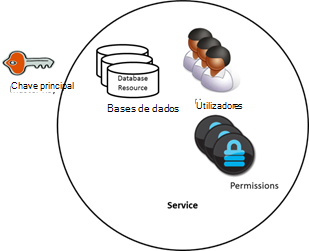
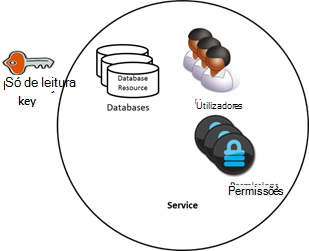
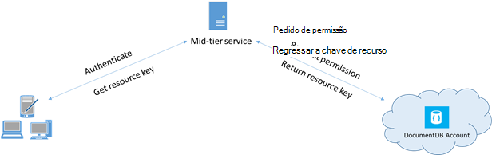

<properties 
    pageTitle="Aprenda a proteger o acesso a dados no DocumentDB | Microsoft Azure" 
    description="Saiba mais sobre os conceitos de controlo de acesso no DocumentDB, incluindo o modelo global de teclas, teclas só de leitura, os utilizadores e permissões." 
    services="documentdb" 
    authors="kiratp" 
    manager="jhubbard" 
    editor="monicar" 
    documentationCenter=""/>

<tags 
    ms.service="documentdb" 
    ms.workload="data-services" 
    ms.tgt_pltfrm="na" 
    ms.devlang="na" 
    ms.topic="article" 
    ms.date="09/19/2016" 
    ms.author="kipandya"/>

# Proteger o acesso aos dados DocumentDB

Este artigo fornece uma descrição geral de proteger o acesso a dados armazenados no [Microsoft Azure DocumentDB](https://azure.microsoft.com/services/documentdb/).

Depois de ler esta descrição geral, poderá atender as seguintes questões:  

-   O que são chaves do modelo global de DocumentDB?
-   O que são chaves de DocumentDB só de leitura?
-   O que são tokens de recurso DocumentDB?
-   Como posso utilizar DocumentDB utilizadores e permissões para proteger o acesso a dados de DocumentDB?

## DocumentDB conceitos do controlo de acesso

DocumentDB Fornece conceitos primeira classe para poder controlar o acesso ao DocumentDB recursos.  Para efeitos deste tópico, DocumentDB recursos estão agrupados em duas categorias:

- Recursos administrativos
    - Conta
    - Base de dados
    - Utilizador
    - Permissão
- Recursos de aplicação
    - Coleções de sites
    - Oferta
    - Documento
    - Anexo
    - Procedimento armazenado
    - Accionador
    - Função definida pelo utilizador

No contexto destas duas categorias, DocumentDB suporta três tipos de pessoas de controlo de acesso: conta de administrador, o administrador só de leitura e o utilizador de base de dados.  Os direitos para cada persona de controlo de acesso são:
 
- Administrador de conta: acesso a todos os recursos (administrativos e da aplicação) dentro de uma determinada conta de DocumentDB total.
- Administrador só de leitura: acesso só de leitura para todos os recursos (administrativos e da aplicação dentro de uma determinada conta de DocumentDB. 
- Utilizador de base de dados: DocumentDB o recurso de utilizador associado um conjunto específico de DocumentDB recursos de base de dados (por exemplo, coleções de sites, documentos, scripts).  Pode haver um ou mais utilizador recursos associados a uma determinada base de dados e cada recurso de utilizador podem ter um ou mais permissões associadas com o mesmo.

Com as categorias acima referidas e recursos deve ter em conta, o modelo de controlo de acesso DocumentDB define três tipos de construções do access:

- Modelo global de teclas: durante a criação de uma conta de DocumentDB, são criadas duas chaves do modelo global (principais e secundárias).  Estas teclas ativar total acesso administrativo para todos os recursos dentro da conta DocumentDB.

- Teclas só de leitura: durante a criação de uma conta de DocumentDB, são criadas duas chaves só de leitura (principais e secundárias).  Estas teclas activar o acesso só de leitura para todos os recursos dentro da conta DocumentDB.

- Tokens de recurso: token de um recurso está associado a um recurso de permissão DocumentDB e para capturar a relação entre o utilizador de uma base de dados e a permissão que o utilizador tem para um recurso de aplicação DocumentDB específico (por exemplo, coleção, documento).

## Trabalhar com chaves de DocumentDB mestras e só de leitura

Como mencionado anteriormente, o chaves de modelo global de DocumentDB fornecem total acesso administrativo para todos os recursos dentro de uma conta de DocumentDB, enquanto teclas só de leitura permitem o acesso de leitura para todos os recursos dentro da conta.  O fragmento de código seguinte ilustra como utilizar um ponto final de conta DocumentDB e uma chave de modelo global para criar uma instância de um DocumentClient e criar uma nova base de dados. 

    //Read the DocumentDB endpointUrl and authorization keys from config.
    //These values are available from the Azure Classic Portal on the DocumentDB Account Blade under "Keys".
    //NB > Keep these values in a safe and secure location. Together they provide Administrative access to your DocDB account.
    
    private static readonly string endpointUrl = ConfigurationManager.AppSettings["EndPointUrl"];
    private static readonly SecureString authorizationKey = ToSecureString(ConfigurationManager.AppSettings["AuthorizationKey"]);
        
    client = new DocumentClient(new Uri(endpointUrl), authorizationKey);
    
    // Create Database
    Database database = await client.CreateDatabaseAsync(
        new Database
        {
            Id = databaseName
        });

## Descrição geral de tokens de recurso DocumentDB

Pode utilizar um token de recursos (criando DocumentDB utilizadores e permissões) quando pretende fornecer acesso aos recursos na sua conta DocumentDB para um cliente que não pode ser considerado fidedigno com a chave de modelo global. As teclas de modelo global de DocumentDB incluir tanto a tecla principal e secundária, cada um dos quais concede acesso administrativo a sua conta e todos os recursos no mesmo. Expor qualquer uma das suas chaves do modelo global de abre a sua conta para a possibilidade de utilização maliciosa ou negligência. 

Da mesma forma, DocumentDB só de leitura teclas fornecem acesso de leitura para todos os recursos - exceto os recursos de permissão, claro - dentro de uma conta de DocumentDB e não podem ser utilizadas para fornecer mais granular acesso aos recursos DocumentDB específicos.

Tokens de recurso DocumentDB fornecem uma alternativa segura que permite que os clientes ler, escrever e eliminar recursos na sua conta de DocumentDB de acordo com as permissões-lhe atribuídas e, sem necessidade de um modelo global ou de uma chave só de leitura.

Eis um padrão de estrutura típica através das quais o tokens de recurso podem ser pedidas, geradas e entregues aos clientes:

1. Um serviço de camada meados está configurado para servir de uma aplicação móvel para partilhar fotografias do utilizador.
2. O serviço de camada meados possui a chave de modelo global da conta DocumentDB.
3. A aplicação de fotografia está instalada em dispositivos móveis do utilizador final. 
4. No início de sessão, a aplicação de fotografia estabelece a identidade do utilizador com o serviço de meados camado. Este mecanismo de estabelecimento identidade é puramente até a aplicação.
5. Assim que a identidade for estabelecida, o serviço de camada meados pedidos de permissões com base na identidade.
6. O serviço de camada meados envia um token de recurso novamente para a aplicação de telefone.
7. A aplicação de telefone pode continuar a utilizar o token de recursos para aceder diretamente ao DocumentDB recursos com as permissões definidas pelo token de recursos e para o intervalo de permitidos pelo token de recursos. 
8. Quando o token de recurso expira, os pedidos subsequentes irão receber uma exceção 401 não autorizado.  Neste momento, a aplicação de telefone estabelece voltar a identidade e os pedidos de um novo token de recursos.

## Trabalhar com DocumentDB utilizadores e permissões
Um recurso do utilizador DocumentDB está associado uma base de dados DocumentDB.  Cada base de dados pode conter zero ou mais utilizadores DocumentDB.  O fragmento de código seguinte mostra como criar um recurso do utilizador DocumentDB.

    //Create a user.
    User docUser = new User
    {
        Id = "mobileuser"
    };

    docUser = await client.CreateUserAsync(UriFactory.CreateDatabaseUri("db"), docUser);

> [AZURE.NOTE] Cada utilizador DocumentDB tem uma propriedade de PermissionsLink que pode ser utilizada para obter a lista de permissões associadas com o utilizador.

Um recurso de permissão DocumentDB está associado um utilizador DocumentDB.  Cada utilizador pode conter zero ou mais permissões DocumentDB.  Um recurso de permissão fornece acesso a um token de segurança que o utilizador tem de quando tentar aceder a um recurso de aplicação específica.
Existem dois níveis de acesso disponíveis que podem ser fornecidos por um recurso de permissão:

- Tudo: O utilizador tem permissão total do recurso
- Leitura: O utilizador só pode ler os conteúdos do recurso, mas não é possível executar escrita, atualizar ou eliminar operações do recurso.

> [AZURE.NOTE] Para poder executar DocumentDB o utilizador tem de ter a permissão de todos os na coleção de na qual o procedimento armazenado será executado de procedimentos armazenados.

O fragmento de código seguinte mostra como criar um recurso de permissão, o token de recursos do recurso permissão de leitura e associar as permissões de utilizador criadas acima.

    // Create a permission.
    Permission docPermission = new Permission
    {
        PermissionMode = PermissionMode.Read,
        ResourceLink = documentCollection.SelfLink,
        Id = "readperm"
    };
            
  docPermission = aguardar cliente. CreatePermissionAsync (UriFactory.CreateUserUri ("db", "utilizador"), docPermission); Console.WriteLine (docPermission.Id + "tem um token de:" + docPermission.Token);
  
Se tiver especificado uma chave de partição para a sua coleção de, em seguida, a permissão para coleção, recursos de documento e anexo também tem de incluir ResourcePartitionKey para além de ResourceLink.

Para obter facilmente todas as permissões recursos associados a um utilizador específico, DocumentDB torna disponível uma permissão feed para cada objeto do utilizador.  O fragmento de código seguinte mostra como obter a permissão associada ao utilizador criado acima, construir uma lista de permissões e criar uma instância de um novo DocumentClient em nome de utilizador.

    //Read a permission feed.
    FeedResponse<Permission> permFeed = await client.ReadPermissionFeedAsync(
      UriFactory.CreateUserUri("db", "myUser"));

    List<Permission> permList = new List<Permission>();
      
    foreach (Permission perm in permFeed)
    {
        permList.Add(perm);
    }
            
    DocumentClient userClient = new DocumentClient(new Uri(endpointUrl), permList);

> [AZURE.TIP] Tokens de recursos ter timespan válido predefinido de 1 hora.  Duração do token, no entanto, pode ser explicitamente especificada, até um máximo de 5 horas.

## Próximos passos

- Para saber mais sobre DocumentDB, clique [aqui](http://azure.com/docdb).
- Para saber mais sobre a gestão de teclas principais e só de leitura, clique [aqui](documentdb-manage-account.md).
- Para saber como construir tokens de autorização de DocumentDB, clique em [aqui](https://msdn.microsoft.com/library/azure/dn783368.aspx)
 
