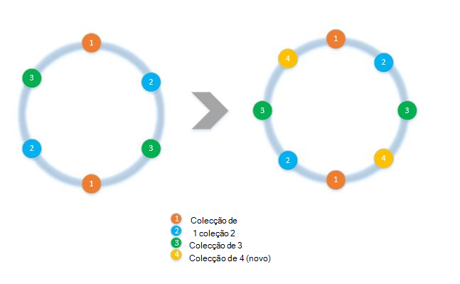
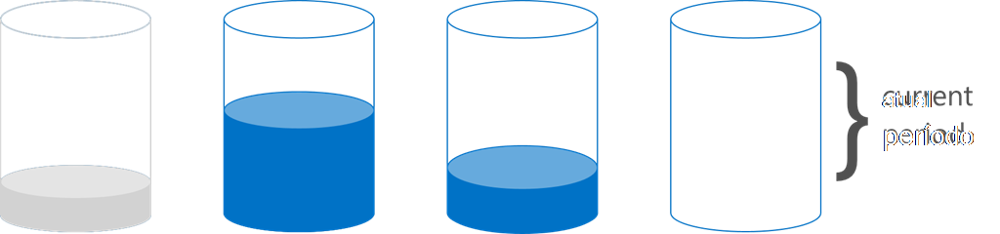

<properties 
    pageTitle="Como implementar o cliente lado partições dos SDK | Microsoft Azure" 
    description="Saiba como utilizar o SDK DocumentDB Azure para pedidos de dados e encaminhar partição (shard) em várias coleções" 
    services="documentdb" 
    authors="arramac" 
    manager="jhubbard" 
    editor="cgronlun" 
    documentationCenter=""/>

<tags 
    ms.service="documentdb" 
    ms.workload="data-services" 
    ms.tgt_pltfrm="na" 
    ms.devlang="na" 
    ms.topic="article" 
    ms.date="10/27/2016" 
    ms.author="arramac"/>

# <a name="how-to-partition-data-using-client-side-support-in-documentdb"></a>Como a dados de partição utilizando o suporte do lado do cliente no DocumentDB

Azure DocumentDB suporta [automática a partições de coleções de](documentdb-partition-data.md). No entanto, existem casos de utilização onde é vantajoso tenham fino controlo detalhado sobre a partições comportamento. Para reduzir o código de placa caldeira necessário para criar a partições tarefas, adicionámos funcionalidade no .NET, Node.js e Java SDK, que facilita a criação de aplicações dimensionadas saída em várias coleções.

Neste artigo, iremos irá veja as classes e interfaces em .NET SDK e como utilizá-los para desenvolver aplicações com partições. Outros SDK como Java, Node.js e Python suporte semelhantes métodos e interfaces para a partições do lado do cliente.

## <a name="client-side-partitioning-with-the-documentdb-sdk"></a>Criação de partições lado do cliente com o SDK DocumentDB

Antes de podemos procurar forma mais aprofundada de criação de partições, vamos recap alguns conceitos básicos de DocumentDB que se relacionam com a partições. Todas as contas do Azure DocumentDB da base de dados é composta por um conjunto de bases de dados, cada uma contendo várias colecções, cada uma das quais pode conter procedimentos armazenados, accionadores, UDFs, documentos e anexos relacionados. Coleções de sites podem ser partição única ou com partições eles próprios e ter as seguintes propriedades:

- Coleções oferecem isolamento de desempenho. Por conseguinte, não existe uma prestação de desempenho em documentos semelhantes dentro da mesma colecção de agrupamento. Por exemplo, para os dados da série de tempo, poderá pretender colocar os dados para o último mês, o que é frequentemente consultado, dentro de uma coleção de débito aprovisionada mais elevado que os dados mais antigos são colocados dentro da coleção de baixo débito aprovisionada.
- Transações ÁCIDAS, ou seja, procedimentos armazenados e accionadores não é possível do intervalo de uma coleção de. Transações estão limitadas ao dentro de um valor de chave única partição numa coleção.
- Coleções de sites não impor um esquema, para que podem ser utilizadas para documentos JSON do mesmo tipo ou tipos diferentes.

Começando versão [1.5.x dos SDK do Azure DocumentDB](documentdb-sdk-dotnet.md), pode executar operações de documento diretamente relativamente a uma base de dados. O [DocumentClient](https://msdn.microsoft.com/library/azure/microsoft.azure.documents.client.documentclient.aspx) utiliza internamente a PartitionResolver especificada para a base de dados para encaminhar os pedidos para a coleção de adequado.

>[AZURE.NOTE] A [partições do lado do servidor](documentdb-partition-data.md) introduzida numa 1.6.0+ REST API 2015-12-16 e SDK deprecates a abordagem de solucionador partição do lado do cliente para os casos de utilização simples. No entanto partições do lado do cliente são mais flexível e permite-lhe controlar isolamento de desempenho ao longo de chaves de partição, controlar o grau de paralelismo durante a leitura resultados a partir de múltiplas partições e utilizar a partições abordagens vs. hash intervalo/espacial.

Por exemplo, no .NET, cada classe PartitionResolver é uma implementação betão uma [IPartitionResolver](https://msdn.microsoft.com/library/azure/microsoft.azure.documents.client.ipartitionresolver.aspx) da interface de que tem três métodos - [GetPartitionKey](https://msdn.microsoft.com/library/azure/microsoft.azure.documents.client.ipartitionresolver.getpartitionkey.aspx), [ResolveForCreate](https://msdn.microsoft.com/library/azure/microsoft.azure.documents.client.ipartitionresolver.resolveforcreate.aspx) e [ResolveForRead](https://msdn.microsoft.com/library/azure/microsoft.azure.documents.client.ipartitionresolver.resolveforread.aspx). Consultas LINQ e os ReadFeed iteradores utilizam o método de ResolveForRead internamente para iteramos sobre todas as colecções que correspondem à chave partição para o pedido. Crie do mesmo modo, o método de ResolveForCreate para encaminhar cria para a direita partição de utilização de operações. Não existem alterações necessárias para o substituir, eliminar e ler uma vez que utilizam documentos, que já contêm a referência para a coleção de correspondente.

Os SDK também inclui duas classes que suportam a duas canónicos técnicas partições, o hashing e intervalo de pesquisas, através de um [HashPartitionResolver](https://msdn.microsoft.com/library/azure/microsoft.azure.documents.partitioning.hashpartitionresolver.aspx) e um [RangePartitionResolver](https://msdn.microsoft.com/library/azure/mt126047.aspx). Pode utilizar estas classes facilmente adicionar lógica de criação de partições para a sua aplicação.  

## <a name="add-partitioning-logic-and-register-the-partitionresolver"></a>Adicionar lógica de criação de partições e registar o PartitionResolver 

Eis um fragmento que mostra como criar um [HashPartitionResolver](https://msdn.microsoft.com/library/azure/microsoft.azure.documents.partitioning.hashpartitionresolver.aspx) e registar DocumentClient para uma base de dados.

```cs
// Create some collections to partition data.
DocumentCollection collection1 = await client.CreateDocumentCollectionAsync(...);
DocumentCollection collection2 = await client.CreateDocumentCollectionAsync(...);

// Initialize a HashPartitionResolver using the "UserId" property and the two collection self-links.
HashPartitionResolver hashResolver = new HashPartitionResolver(
    u => ((UserProfile)u).UserId, 
    new string[] { collection1.SelfLink, collection2.SelfLink });

// Register the PartitionResolver with the database.
this.client.PartitionResolvers[database.SelfLink] = hashResolver;

```

## <a name="create-documents-in-a-partition"></a>Criar documentos numa partição  

Assim que a PartitionResolver está registado, pode efetuar cria e consultas diretamente contra a base de dados, conforme apresentado abaixo. Neste exemplo, o SDK utiliza o PartitionResolver para extrair o ID de utilizador, hash-lo e, em seguida, utilize esse valor para encaminhar a operação de criação para a coleção de correta.

```cs
Document johnDocument = await this.client.CreateDocumentAsync(
    database.SelfLink, new UserProfile("J1", "@John", Region.UnitedStatesEast));
Document ryanDocument = await this.client.CreateDocumentAsync(
    database.SelfLink, new UserProfile("U4", "@Ryan", Region.AsiaPacific, UserStatus.AppearAway));
```

## <a name="create-queries-against-partitions"></a>Criar consultas contra a partições  

Pode consultar utilizando o método de [CreateDocumentQuery](https://msdn.microsoft.com/library/azure/microsoft.azure.documents.linq.documentqueryable.createdocumentquery.aspx) por passagem na base de dados e uma chave de partição. A consulta devolve num único conjunto de resultados sobre todas as colecções de dentro da base de dados para mapear para a chave de partição.  

```cs
// Query for John's document by ID - uses PartitionResolver to restrict the query to the partitions 
// containing @John. Again the query uses the database self link, and relies on the hash resolver 
// to route the appropriate collection.
var query = this.client.CreateDocumentQuery<UserProfile>(
    database.SelfLink, null, partitionResolver.GetPartitionKey(johnProfile))
    .Where(u => u.UserName == "@John");
johnProfile = query.AsEnumerable().FirstOrDefault();
```

## <a name="create-queries-against-all-collections-in-the-database"></a>Criar consultas contra todas as colecções na base de dados 

Também pode consultar todas as colecções dentro da base de dados e enumerar os resultados tal como mostrar abaixo, ignorando o argumento de chave partição.

```cs
// Query for all "Available" users. Here since there is no partition key, the query is serially executed 
// across each partition/collection and returns a single result-set. 
query = this.client.CreateDocumentQuery<UserProfile>(database.SelfLink)
    .Where(u => u.Status == UserStatus.Available);
foreach (UserProfile activeUser in query)
{
    Console.WriteLine(activeUser);
}
```

## <a name="hash-partition-resolver"></a>Hash partição solucionador
Com a partições hash, partições são atribuídas com base em valores de uma função hash, permitindo-lhe distribuir uniformemente os pedidos e dados ao longo de um número de partições. Esta abordagem é geralmente utilizada para a partições dados produzidos ou consumidas a partir de um grande número de clientes distintos e são útil para armazenar os perfis de utilizador, itens de catálogo e dados de telemetria IoT ("Internet das coisas"). A partições hash também são utilizado pelo suporte de criação de partições lado do servidor do DocumentDB numa coleção.

**Hash divisão:**


Um simple hash esquema de partição em coleções de *N* seria levar qualquer documento, calcular *hash(d) mod N* para determinar qual coleção tenha colocado na. Mas um problema com esta técnica simple é que não funciona bem quando adicionar novas colecções ou remover coleções de sites, como, por isso, é necessário quase todos os dados para obter reshuffled. [Hashing consistentes] (http://citeseerx.ist.psu.edu/viewdoc/summary?doi=10.1.1.23.3738) é um algoritmo famoso que resolve isto através da implementação de um esquema hashing que minimiza a quantidade de movimento dados necessário durante a adição ou remoção de coleções de sites.

A classe de [HashPartitionResolver](https://msdn.microsoft.com/library/azure/microsoft.azure.documents.partitioning.hashpartitionresolver.aspx) implementa lógica para criar um toque hash consistentes sobre a função hash especificada na interface de [IHashGenerator](https://msdn.microsoft.com/library/azure/microsoft.azure.documents.partitioning.ihashgenerator.aspx) . Por predefinição, o HashPartitionResolver utiliza uma função de hash MD5, mas pode trocar este problema com a sua própria implementação hashing. O HashPartitionResolver internamente cria 16 hashes ou "nós virtuais" dentro de tocar hash para cada coleção para alcançar uma distribuição dos documentos mais uniforme entre as coleções de ficheiros, mas pode variar este número para comércio desativar distorção de dados com a quantidade de cálculo de lado do cliente.

**O hashing consistente com HashPartitionResolver:**


## <a name="range-partition-resolver"></a>Resolução de partição de intervalo

Criar partições intervalo, partições foi atribuídas dependendo se a chave de partição é dentro de um determinado intervalo. Isto é geralmente utilizado para criar a partições com as propriedades do carimbo de data / hora (por exemplo, eventTime entre 1 de Abr de 2015 e 14 de Abr de 2015). A classe de [RangePartitionResolver](https://msdn.microsoft.com/library/azure/mt126047.aspx) ajuda-o a manter um mapeamento entre um intervalo\<T\> e coleção de ligação automática. 

[Intervalo\<T\> ](https://msdn.microsoft.com/library/azure/mt126048.aspx) é uma classe simple que faz a gestão dos intervalos de quaisquer tipos que implementam IComparable\<T\> e IEquatable\<T\> como cadeias ou números. Para lê e cria, pode ser efetuada com qualquer intervalo arbitrário e o solucionador identifica todas as colecções de mercado ao identificar os intervalos das partições que se intersetam com o intervalo solicitado. Esta funcionalidade pode ser útil quando executa consultas do intervalo relativamente a dados de série de tempo.

**Intervalo a partições:**  

  

Um caso especial de intervalo partições é quando o intervalo é apenas um descontínuos valor único, por vezes denominado "consulta de criação de partições". É geralmente utilizada para criar a partições por região (por exemplo, a partição para Escandinávia contém Noruega, Dinamarca e Suécia) ou para criar a partições inquilinos em centros de uma aplicação do inquilino com várias.

## <a name="samples"></a>Amostras 

Veja o [projeto DocumentDB partições amostras Github](https://github.com/Azure/azure-documentdb-dotnet/tree/287acafef76ad223577759b0170c8f08adb45755/samples/code-samples/Partitioning) que contém fragmentos de código sobre como utilizar estes PartitionResolvers e expandi-los para implementar o seus próprio resoluções para se ajustar casos de utilização específica, como o seguinte: 

* Como especificar uma expressão lambda arbitrário para GetPartitionKey e utilizá-lo a implementar a partições de chaves compostas ou a partições diferentes tipos de objetos de forma diferente.
* Como criar uma simples [LookupPartitionResolver](https://github.com/Azure/azure-documentdb-dotnet/blob/287acafef76ad223577759b0170c8f08adb45755/samples/code-samples/Partitioning/Partitioners/LookupPartitionResolver.cs) que utiliza uma tabela de referência manual para executar a partições. Este padrão é geralmente utilizado para criar a partições com base em valores descontínuos como região, o ID do inquilino ou aplicação nome.
* Como criar [ManagedPartitionResolver](https://github.com/Azure/azure-documentdb-dotnet/blob/287acafef76ad223577759b0170c8f08adb45755/samples/code-samples/Partitioning/Partitioners/ManagedHashPartitionResolver.cs) que cria automaticamente baseadas num modelo que define um esquema de nomenclatura, IndexingPolicy e procedimentos armazenados que precisam de estar registado contra novas colecções de coleções de sites.
* Como criar um esquema de menos [SpilloverPartitionResolver](https://github.com/Azure/azure-documentdb-dotnet/blob/287acafef76ad223577759b0170c8f08adb45755/samples/code-samples/Partitioning/Partitioners/SpilloverPartitionResolver.cs) que cria simplesmente novas colecções como as coleções de ficheiros antigas preenchimento para cima.
* Como serializar e serialização estado da sua PartitionResolver como JSON, para que possam partilhar entre processos e em encerramento. Pode manter estes nos ficheiros de configuração, ou até mesmo numa coleção de DocumentDB.
* Uma classe de [DocumentClientHashPartitioningManager](https://github.com/Azure/azure-documentdb-dotnet/blob/287acafef76ad223577759b0170c8f08adb45755/samples/code-samples/Partitioning/Util/DocumentClientHashPartitioningManager.cs) para dinamicamente adicionar e remover a partições a uma base de dados a partições com base no hashing consistentes. Interior utiliza um [TransitionHashPartitionResolver](https://github.com/Azure/azure-documentdb-dotnet/blob/287acafef76ad223577759b0170c8f08adb45755/samples/code-samples/Partitioning/Partitioners/TransitionHashPartitionResolver.cs) para encaminhar lê e escreve durante a migração utilizando um dos modos de quatro - ler a partir de antigo esquema de partições (ReadCurrent), um novo (ReadNext), intercalar resultados de ambos os (ReadBoth) ou não estar disponível durante a migração (nenhum).

Os exemplos são Abrir origem e aconselhamos submeta pedidos de solicitação com contribuições que poderiam beneficiar outros programadores DocumentDB. Consulte as [diretrizes de contribuição](https://github.com/Azure/azure-documentdb-net/blob/master/Contributing.md) para obter orientações sobre como pode contribuir.  

>[AZURE.NOTE] Cria coleções de sites estão taxa-limitado pela DocumentDB, para que alguns dos métodos de exemplo é mostrados aqui poderão demorar alguns minutos a concluir.

##<a name="faq"></a>PERGUNTAS MAIS FREQUENTES
**DocumentDB suporta a partições do lado do servidor?**

Sim, DocumentDB suporta a [partições do lado do servidor](documentdb-partition-data.md). DocumentDB também suporta a partições do lado do cliente através de resoluções partição do lado do cliente para os casos de utilização mais avançadas.

**Quando devo utilizar os lado do servidor vs. a partições do lado do cliente?**
Para a maioria dos casos de utilização, recomendamos a utilização do lado do servidor de criação de partições uma vez que esta trata as tarefas administrativas de encaminhamento pedidos e criação de partições de dados. No entanto, se necessitar de intervalo a partições ou ter um caso de utilização especializadas para isolamento de desempenho entre diferentes valores de teclas partição, em seguida, a partições lado do cliente poderá a melhor abordagem.

**Como adicionar ou remover uma coleção da minha esquema de partições?**

Veja a execução do DocumentClientHashPartitioningManager no projeto amostras para um exemplo de como pode implementar da repartição.

**Como persistirem ou partilhar a minha configuração partições com outros clientes?**

Pode serializar o estado de partitioner como JSON e armazenar ficheiros de configuração, ou mesmo dentro DocumentDB coleções de sites. Veja o método de RunSerializeDeserializeSample no projeto amostras para obter um exemplo.

**Como corrente de várias técnicas partições?**

Pode corrente PartitionResolvers pelas sua próprias IPartitionResolver que utiliza um ou mais resoluções existentes internamente de execução. Veja TransitionHashPartitionResolver no projeto amostras para obter um exemplo.

##<a name="references"></a>Referências
* [Lado do servidor DocumentDB de criação de partições](documentdb-partition-data.md)
* [Níveis de desempenho e coleções de DocumentDB](documentdb-performance-levels.md)
* [Exemplos de código partições no Github](https://github.com/Azure/azure-documentdb-dotnet/tree/287acafef76ad223577759b0170c8f08adb45755/samples/code-samples/Partitioning)
* [Documentação do SDK .NET DocumentDB MSDN](https://msdn.microsoft.com/library/azure/dn948556.aspx)
* [Exemplos de DocumentDB .NET](https://github.com/Azure/azure-documentdb-net)
* [Limites de DocumentDB](documentdb-limits.md)
* [Sugestões de blogue DocumentDB no desempenho](https://azure.microsoft.com/blog/2015/01/20/performance-tips-for-azure-documentdb-part-1-2/)
 
