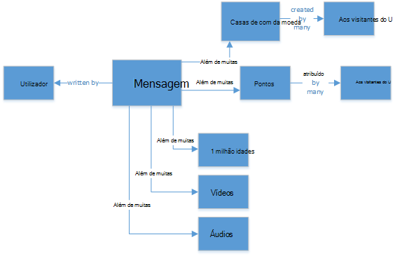
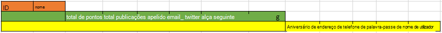
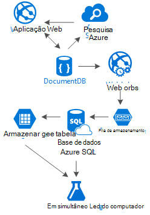

<properties 
    pageTitle="Padrão de estrutura de DocumentDB: aplicações de redes sociais | Microsoft Azure" 
    description="Saiba mais sobre um padrão de estrutura para redes sociais, tirando partido da flexibilidade de armazenamento do DocumentDB e outros serviços Azure." 
    keywords="aplicações de redes sociais"
    services="documentdb" 
    authors="ealsur" 
    manager="jhubbard" 
    editor="" 
    documentationCenter=""/>

<tags 
    ms.service="documentdb" 
    ms.workload="data-services" 
    ms.tgt_pltfrm="na" 
    ms.devlang="na" 
    ms.topic="article" 
    ms.date="09/27/2016" 
    ms.author="mimig"/>

# Aceder a rede social com DocumentDB

Vivem numa sociedade previstos excederem consideravelmente interligados significa que, a determinada altura vida, torna-se parte de uma **rede social**. Utilizamos redes sociais para manter em contacto com amigos, colegas, família ou, por vezes, para partilhar os nossos paixão com pessoas com interesses em comum.

Como engenheiros ou os programadores, podemos poderá ter questionado como estas redes armazenar e interligar os nossos dados, ou poderá ter mesmo foram as tarefas para criar ou Arquitectar uma nova rede social para um mercado nicho específico mitos. Que é quando a pergunta grande surge: como a todos os dados são armazenados?

Vamos supor que estamos a criar uma nova e brilhante rede social, onde os nossos utilizadores podem publicar artigos com relacionados multimédia como imagens, vídeos ou até mesmo música. Os utilizadores podem comentar mensagens e fornecer pontos para classificações. Haverá um feed das mensagens que os utilizadores irão ver e interagir com na página de destino do Web site principal. Não som realmente complexa (na primeira), mas por motivos de simplificar, vamos deixar de existir (Recomendamos poderia do delve para feeds de utilizador personalizada afetados por relações, mas excede o objetivo deste artigo).

Por isso, como podemos armazenar este e onde?

Muitos dos podem ter experiência em bases de dados do SQL ou de ter, pelo menos, noção de [Modelação de dados relacionais](https://en.wikipedia.org/wiki/Relational_model) e poderá ser tentado a começar a desenhar algo parecido com:

 

Uma estrutura de dados perfeitamente normalizado e bonito... que não dimensionar. 

Não recebe o-me mal, quais trabalhei com bases de dados SQL todas as minhas vida, são ótimas, mas como cada plataforma padrão, para o exercício e software, não é perfeito para cada cenário.

Por que motivo não está SQL neste cenário, a melhor escolha? Vamos ver a estrutura de uma única mensagem, se posso pretendia mostrar que publicar um Web site ou aplicação, que tenho de fazer uma consulta com … apenas as associações de tabela 8 (!) para mostrar uma única mensagem, agora, imagem uma sequência de mensagens que dinamicamente carregar e aparecem no ecrã e poderá ver onde vou.

Poderia, claro, utilizamos uma instância do SQL grandes com potência suficiente para resolver milhares de consultas com estes muitas associações para servir o nosso o conteúdo, mas verdadeiramente, porque é que iria podemos quando existe uma solução mais simples?

## Estrada NoSQL

Existem bases de dados do gráfico especial que podem [executar no Azure](http://neo4j.com/developer/guide-cloud-deployment/#_windows_azure) mas não são dispendiosos e requerem IaaS services (infraestrutura-como-a-Service, máquinas virtuais principalmente) e a manutenção. Vou destinam-se para a maioria dos cenários, a ser executada numa base de dados do Azure NoSQL [DocumentDB](https://azure.microsoft.com/services/documentdb/)neste artigo, uma solução de custo inferior que irá funcionar. Utilizar uma abordagem de [NoSQL](https://en.wikipedia.org/wiki/NoSQL) , armazenar os dados no formato JSON e aplicar [denormalization](https://en.wikipedia.org/wiki/Denormalization), pode ser transformado nosso post anteriormente complicada num único [documento](https://en.wikipedia.org/wiki/Document-oriented_database):

    {
        "id":"ew12-res2-234e-544f",
        "title":"post title",
        "date":"2016-01-01",
        "body":"this is an awesome post stored on NoSQL",
        "createdBy":User,
        "images":["http://myfirstimage.png","http://mysecondimage.png"],
        "videos":[
            {"url":"http://myfirstvideo.mp4", "title":"The first video"},
            {"url":"http://mysecondvideo.mp4", "title":"The second video"}
        ],
        "audios":[
            {"url":"http://myfirstaudio.mp3", "title":"The first audio"},
            {"url":"http://mysecondaudio.mp3", "title":"The second audio"}
        ]
    }

E pode ser obtido com uma única consulta e com sem associações. Este é muito mais simples e de fácil e, budget-wise, requer menos recursos para obter um resultado melhor.

Azure DocumentDB assegura que todas as propriedades estão indexadas com a sua [indexação automática](documentdb-indexing.md), que pode até mesmo ser [personalizados](documentdb-indexing-policies.md). A abordagem de esquema de royalties permite-nos armazenar documentos com diferentes e dinâmicas estruturas, talvez amanhã que queremos mensagens para ter uma lista de categorias ou hashtags eles associados, DocumentDB processará novos documentos com os atributos adicionados com nenhum trabalho extra necessário por-nos.

Comentários numa mensagem podem tratados como apenas outras mensagens com uma propriedade de elemento principal (simplifica o nosso mapeamento do objeto). 

    {
        "id":"1234-asd3-54ts-199a",
        "title":"Awesome post!",
        "date":"2016-01-02",
        "createdBy":User2,
        "parent":"ew12-res2-234e-544f"
    }

    {
        "id":"asd2-fee4-23gc-jh67",
        "title":"Ditto!",
        "date":"2016-01-03",
        "createdBy":User3,
        "parent":"ew12-res2-234e-544f"
    }

E todas as interações sociais podem ser armazenadas num objeto separado como contadores:

    {
        "id":"dfe3-thf5-232s-dse4",
        "post":"ew12-res2-234e-544f",
        "comments":2,
        "likes":10,
        "points":200
    }

Criar feeds é apenas uma questão de criação de documentos que podem conter uma lista de ids de mensagem com uma ordem de relevância determinado:

    [
        {"relevance":9, "post":"ew12-res2-234e-544f"},
        {"relevance":8, "post":"fer7-mnb6-fgh9-2344"},
        {"relevance":7, "post":"w34r-qeg6-ref6-8565"}
    ]

Foi temos uma sequência de "mais recente" com mensagens ordenadas por data de criação, uma sequência de "fale" com essas mensagens com gostos mais no últimas 24 horas, podemos mesmo poderia implementar uma sequência personalizada para cada utilizador com base em lógica como seguidores e interesses e ainda seria uma lista de mensagens. É uma questão como criar estas listas, mas o desempenho de leitura permanece ser utilizados sem perturbação. Assim que podemos adquirir uma destas listas, podemos emitir numa única consulta para DocumentDB utilizando o [operador IN](documentdb-sql-query.md#where-clause) para obter páginas dos postos de cada vez.

As sequências de alimentação podem ser construídas utilizando a [Aplicação dos serviços do Azure dos](https://azure.microsoft.com/services/app-service/) processos em segundo plano: [Webjobs](../app-service-web/web-sites-create-web-jobs.md). Quando uma mensagem estiver criada, processamento de fundo pode acionou através da utilização de [Armazenamento do Windows Azure](https://azure.microsoft.com/services/storage/) [filas](../storage/storage-dotnet-how-to-use-queues.md) e Webjobs acionou utilizando o [Azure Webjobs SDK](../app-service-web/websites-dotnet-webjobs-sdk.md), implementar a propagação de mensagem dentro sequências com base na nossa própria lógica personalizada. 

Podem ser processados pontos e gostos através de uma mensagem de uma forma deferida utilizando a mesma técnica para criar um ambiente eventualmente consistente.

Seguidores são mais complexos. DocumentDB tem um limite de tamanho do documento de 512Kb, pelo que poderá pensar sobre o armazenamento seguidores como um documento com esta estrutura:

    {
        "id":"234d-sd23-rrf2-552d",
        "followersOf": "dse4-qwe2-ert4-aad2",
        "followers":[
            "ewr5-232d-tyrg-iuo2",
            "qejh-2345-sdf1-ytg5",
            //...
            "uie0-4tyg-3456-rwjh"
        ]
    }

Isto pode funcionar para um utilizador com alguns milhares seguidores, mas se alguns celebridades associa os nossos classifica, eventualmente, isto irá abordagem visitas o remate de tamanho do documento.

Para resolver este problema, utilizamos uma abordagem mista. Como parte do documento estatísticas de utilizador que podemos armazenar o número de seguidores:

    {
        "id":"234d-sd23-rrf2-552d",
        "user": "dse4-qwe2-ert4-aad2",
        "followers":55230,
        "totalPosts":452,
        "totalPoints":11342
    }

E o gráfico real de seguidores pode ser armazenado em tabelas de armazenamento do Azure utilizando uma [extensão](https://github.com/richorama/AzureStorageExtensions#azuregraphstore) que permite uma simple "B da seguinte forma A" armazenamento e obtenção. Desta forma podemos pode delegar o processo de obtenção da seguidores exata lista (quando precisamos) para tabelas de armazenamento do Azure mas para uma pesquisa de números rápidos, podemos continuar a utilizar DocumentDB.

## A duplicação de dados e padrão do "Escala"

À medida que poderá provavelmente, reparou no documento JSON que referencia uma mensagem, existem várias ocorrências de um utilizador. E iria ter estimado direita, que isto significa que as informações que representa um utilizador, tendo em conta este denormalization, poderão ser apresentadas num local mais do que uma.

Para permitir que as consultas mais rápido, vamos assumir duplicação de dados. O problema com o efeito lado é que se por alguns ação, as alterações de dados de um utilizador, precisamos de localizar todas as atividades ele nunca fez e atualizá-los a todos. Não som muito prático, à direita?

Bases de dados do gráfico resolvê-lo na sua própria forma, vamos para resolvê-lo ao identificar os atributos de chave de um utilizador que mostramos-na nossa aplicação para cada actividade. Se visualmente vamos mostrar uma mensagem na nossa aplicação e mostrar apenas o criador de blocos nome e uma imagem, porque é que armazena todos os dados do utilizador no atributo "createdBy"? Se para cada comentário mostramos apenas a imagem do utilizador, podemos não necessita realmente o resto das suas informações. Que é que algo que posso ligar o "padrão de escala" entra em reproduzir.

Informações do utilizador como exemplo, vamos dar:

    {
        "id":"dse4-qwe2-ert4-aad2",
        "name":"John",
        "surname":"Doe",
        "address":"742 Evergreen Terrace",
        "birthday":"1983-05-07",
        "email":"john@doe.com",
        "twitterHandle":"@john",
        "username":"johndoe",
        "password":"some_encrypted_phrase",
        "totalPoints":100,
        "totalPosts":24
    }
    
Verificando esta informação, podemos pode rapidamente detetar que não seja informações críticas e que não estiver, criando assim "Escala":

O passo menor chama um UserChunk, peça mínima de informações que identifica um utilizador e são utilizada para a duplicação de dados. Reduzindo o tamanho dos dados duplicados para apenas as informações iremos "Mostrar", podemos reduzir a possibilidade de atualizações grandes.

O passo meio chama-se o utilizador, é os dados completos que serão utilizados na maior parte das consultas dependentes do desempenho no DocumentDB, mais acedido e crítica. Inclui a informação representada por um UserChunk.

A maior é o utilizador expandido. Inclui todas as informações de utilizador crítico plus outros dados que não necessitam realmente serem lidos rapidamente ou a utilização da mesma é eventual (como o processo de início de sessão). Estes dados podem ser armazenados fora DocumentDB, na base de dados do SQL Azure ou tabelas de armazenamento do Azure.

Por que motivo seria recebemos dividir o utilizador e até mesmo armazenar estas informações em locais diferentes? Uma vez que o espaço de armazenamento no DocumentDB é [infinito não](documentdb-limits.md) e a partir de um desempenho do ponto de vista maiores dos documentos, o costlier as consultas. Manter os documentos slim, com as informações para fazer todas as suas consultas dependente de desempenho para a sua rede social e armazenar as outras informações adicionais para eventual cenários, como edições de perfil completo, inícios de sessão, mesmo extração de dados para a análise de utilização e iniciativas Big Data corretas. Vamos realmente indiferente se os dados reunir para extração de dados são mais lentos porque está a executar uma base de dados do SQL Azure, podemos ter dizem respeito apesar que nossos utilizadores têm uma experiência alternativa rápida e slim. Um utilizador, armazenado no DocumentDB, teria o seguinte aspeto:

    {
        "id":"dse4-qwe2-ert4-aad2",
        "name":"John",
        "surname":"Doe",
        "username":"johndoe"
        "email":"john@doe.com",
        "twitterHandle":"@john"
    }

E uma mensagem teria o seguinte aspeto:

    {
        "id":"1234-asd3-54ts-199a",
        "title":"Awesome post!",
        "date":"2016-01-02",
        "createdBy":{
            "id":"dse4-qwe2-ert4-aad2",
            "username":"johndoe"
        }
    }

E quando uma edição surja onde é afetado um dos atributos do bloco, é fácil encontrar os documentos afetados utilizando consultas que apontem para os atributos indexados (SELECIONE * FROM publicações p onde p.createdBy.id = = "edited_user_id") e, em seguida, atualizar as secções.

## Caixa de pesquisa

Os utilizadores irão gerar, Felizmente, muitas conteúdo. E podemos deverá conseguir fornecer a capacidade de procurar e localizar conteúdo que poderão não estar diretamente na suas sequências de conteúdo, talvez porque podemos não siga os criadores ou talvez podemos está apenas a tentar encontrar que mensagem antiga fizemos 6 meses atrás.

Felizmente, e porque a usamos Azure DocumentDB, podemos pode facilmente implementar um motor de busca utilizando o [Azure procurar](https://azure.microsoft.com/services/search/) duas de minutos e sem escrever uma única linha de código (que não é óbvio que as, o processo de procura e IU).

Por que motivo é tão fácil?

Pesquisa Azure implementa o que chamam [indexadores](https://msdn.microsoft.com/library/azure/dn946891.aspx), processos em segundo plano que ver no seu repositórios de dados e automagically adicionar, atualizar ou remover os objetos nos índices. Elas suportam uma [base de dados do SQL Azure indexadores](https://blogs.msdn.microsoft.com/kaevans/2015/03/06/indexing-azure-sql-database-with-azure-search/), [indexadores de Blobs do Azure](../search/search-howto-indexing-azure-blob-storage.md) e Felizmente, [Azure DocumentDB indexadores](../documentdb/documentdb-search-indexer.md). A transição de informação a partir do DocumentDB a pesquisa do Azure é simples, como ambas as informações do arquivo no formato JSON, precisamos acabou de [criar o nosso índice](../search/search-create-index-portal.md) e mapa que atributos a partir dos nossos documentos queremos indexado e já está, num assunto de minutos (depende o tamanho dos nossos dados,) todo o nosso conteúdo irá estar disponível para ser procurados, pela melhor solução de pesquisa-como-a-Service no infraestrutura da nuvem. 

Para mais informações sobre pesquisa Azure, pode visitar o [Guia de Hitchhiker a pesquisa](https://blogs.msdn.microsoft.com/mvpawardprogram/2016/02/02/a-hitchhikers-guide-to-search/).

## Os dados de conhecimento subjacente

Após armazenar este conteúdo que cresce e cresce diariamente, podemos poderá encontramos pensar: o que posso fazer com todos os este fluxo de informações a partir dos meus utilizadores?

A resposta é simples: colocá-lo para trabalhar e saiba a partir dos mesmos.

Mas, o aprendeu? Alguns exemplos de fácil incluem uma [análise sentimento](https://en.wikipedia.org/wiki/Sentiment_analysis)recomendações conteúdas com base nas preferências de um utilizador ou até mesmo uma automatizado conteúdo moderador que garante que todo o conteúdo é publicado ao nosso rede social que é seguro para a família.

Agora que posso que ligado, irá provavelmente pensa que precisa de algumas tese na ciência matemática para extrair estes padrões e informações de fora do bases de dados simples e ficheiros, mas seria errado.

[Formação do azure máquina](https://azure.microsoft.com/services/machine-learning/), parte do [Conjunto de aplicações do Cortana informações da empresa](https://www.microsoft.com/en/server-cloud/cortana-analytics-suite/overview.aspx), é a um serviço de nuvem totalmente geridas que permite-lhe criar fluxos de trabalho através dos algoritmos uma interface de arrastar e largar simple, os seus próprios algoritmos na [R](https://en.wikipedia.org/wiki/R_(programming_language)) o código ou utilizar algumas das já incorporadas e pronto a utilizar como APIs: [Análise de texto](https://gallery.cortanaanalytics.com/MachineLearningAPI/Text-Analytics-2), [Moderador conteúdo](https://www.microsoft.com/moderator) ou [recomendações](https://gallery.cortanaanalytics.com/MachineLearningAPI/Recommendations-2).

Para obter qualquer um destes cenários de formação de máquina, que possamos utilizar [Azure dados Lake](https://azure.microsoft.com/services/data-lake-store/) para ingerir esta última as informações de origens diferentes e utilizar [U SQL](https://azure.microsoft.com/documentation/videos/data-lake-u-sql-query-execution/) para processar as informações e gerar um resultado que pode ser processado pela Azure máquina aprendizagem.

Outra opção disponível é utilizar o [Microsoft disfunção Services](https://www.microsoft.com/cognitive-services) para analisar os nossos conteúdo utilizadores; não só pode compreendemos-las melhor (através de analisar que escrevem com [Texto Analytics API](https://www.microsoft.com/cognitive-services/en-us/text-analytics-api)), mas recomendamos também poderia detetar conteúdo indesejado ou maduro e agir em conformidade com a [API de visão do computador](https://www.microsoft.com/cognitive-services/en-us/computer-vision-api). Serviços de disfunção incluem muitas soluções de fora da caixa que não exigir início de qualquer tipo de dados de conhecimento de aprendizagem automática para utilizar.

## Conclusão

Este artigo tenta liberte algumas light para alternativas de criação de redes sociais completamente no Azure com serviços de custo de baixa e fornecer excelentes resultados por encorajar a utilização de uma distribuição de solução e dados de várias camadas armazenamento denominada "Escala".

A verdade é que não haja nenhuma prata marca de lista para este tipo de cenários, é a sinergia criada pela combinação de excelentes serviços que lhe permitem-nos construir experiências excelentes: a velocidade e liberdade do Azure DocumentDB para fornecer uma aplicação de rede social excelente intelligence atrás uma solução de pesquisa primeira classe como pesquisa Azure, a flexibilidade dos serviços de aplicação do Azure ao anfitrião nem mesmo idioma desconhecido aplicações mas processos em segundo plano poderosas o armazenamento do Windows Azure expansíveis e base de dados do SQL Azure para armazenar grandes quantidades de dados e a potência analítica do Azure máquina formação para criar dados de conhecimento e informações da empresa que podem fornecer comentários para os nossos processos e ajuda-nos entregar o conteúdo correto para os utilizadores à direita.

## Próximos passos

Saiba mais sobre Modelação lendo o artigo de [Modelação de dados DocumentDB](documentdb-modeling-data.md) de dados. Se está interessado em outros casos de utilização para DocumentDB, consulte o artigo [casos de utilização de DocumentDB comuns](documentdb-use-cases.md).

Ou obter mais informações sobre DocumentDB seguindo o [Caminho de formação DocumentDB](https://azure.microsoft.com/documentation/learning-paths/documentdb/).
